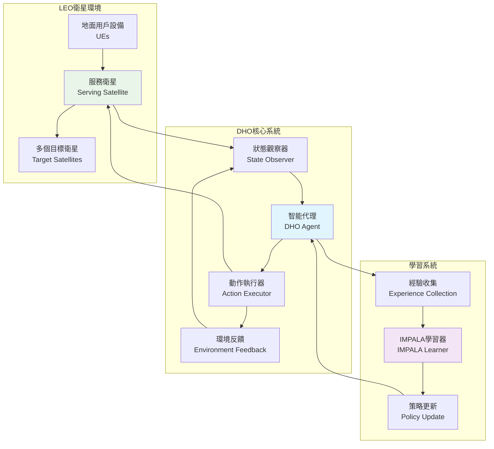
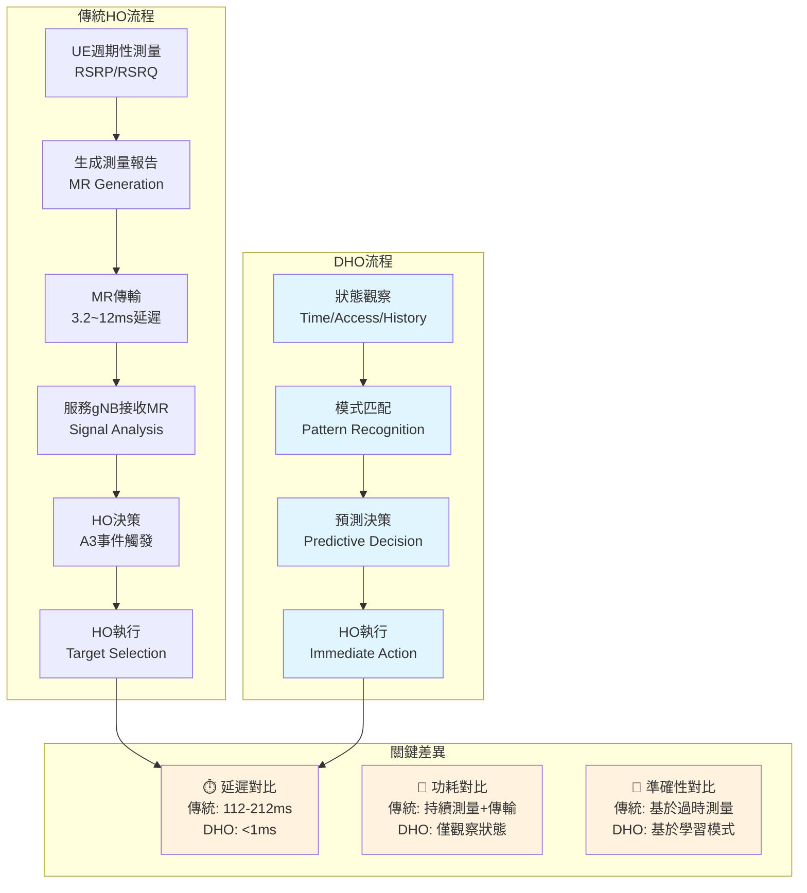
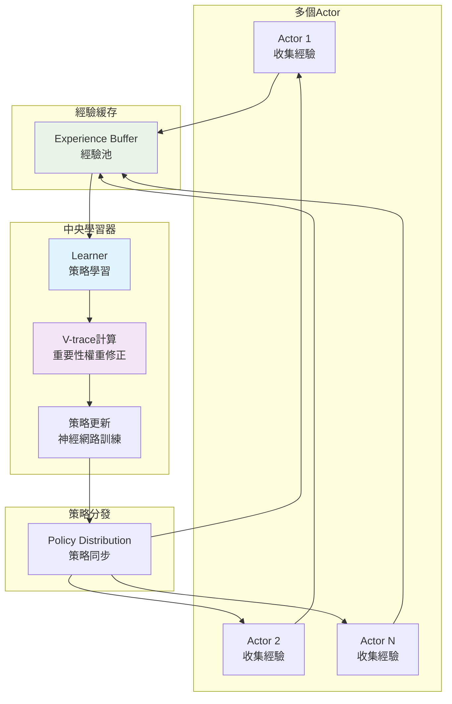
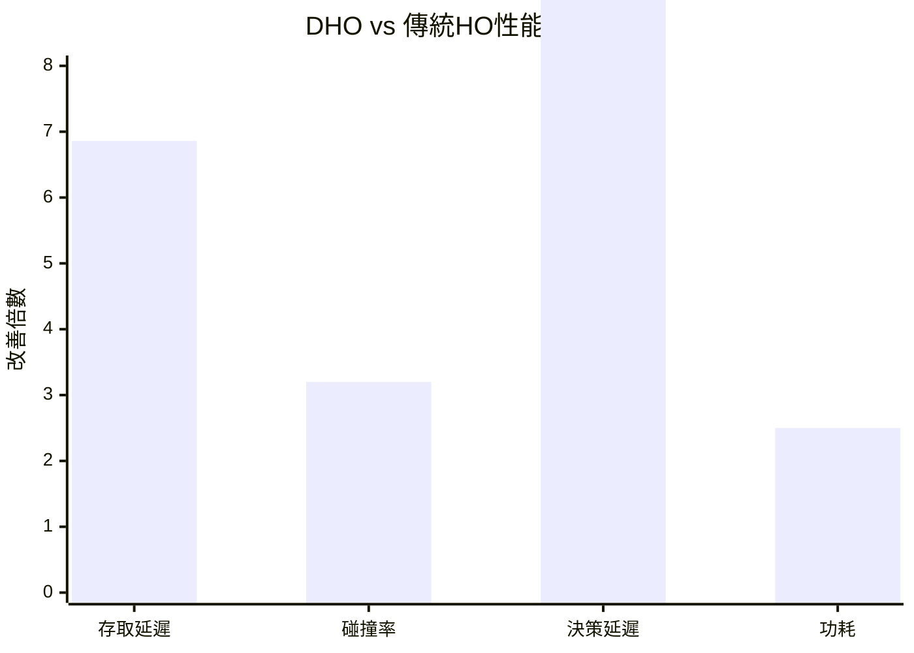
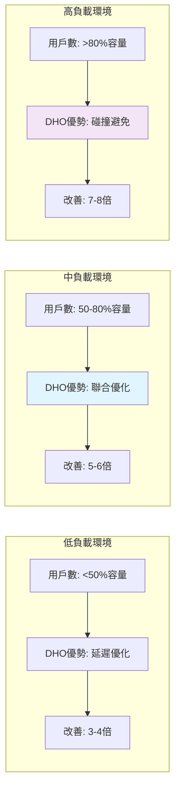
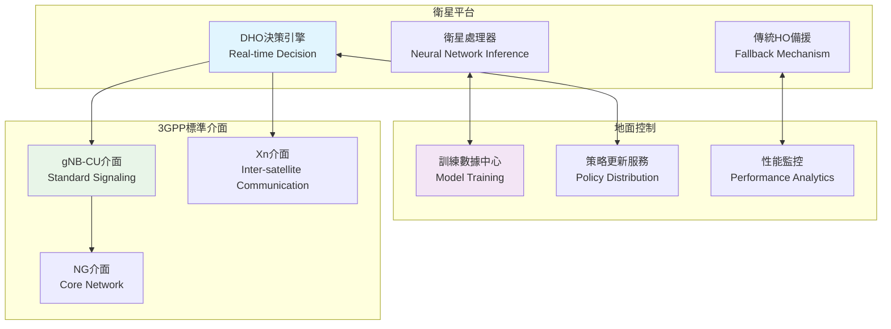
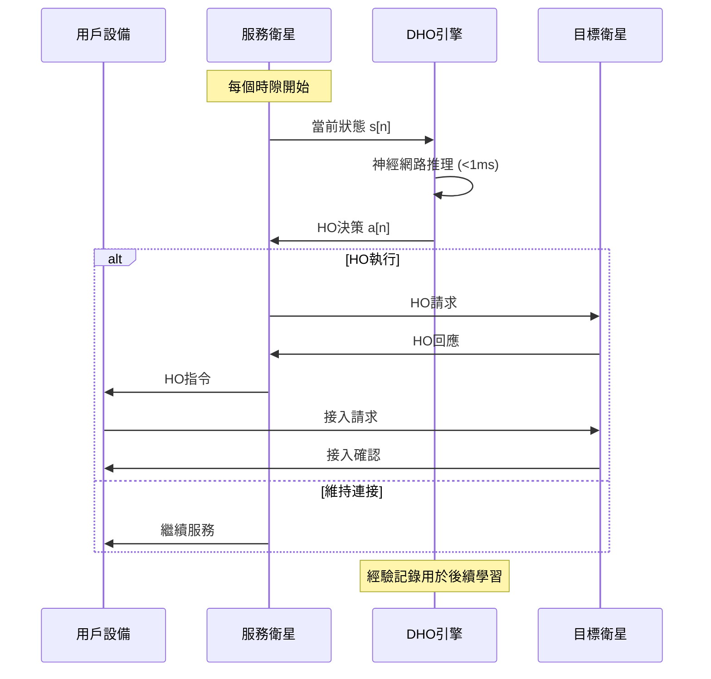
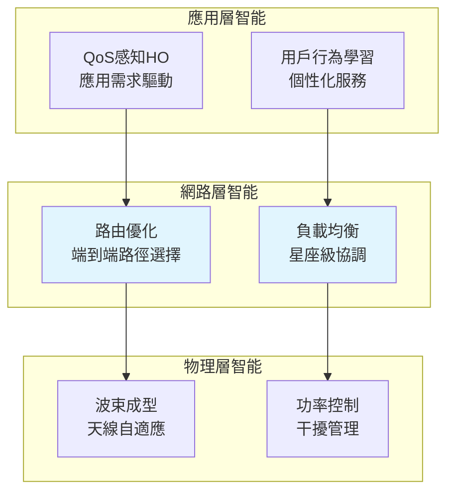
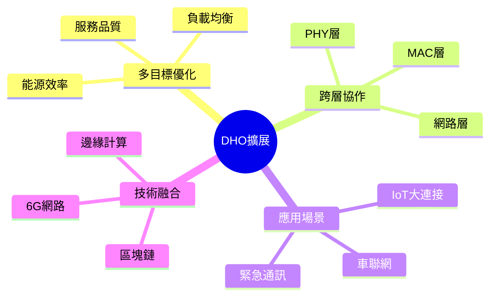

# DHO演算法流程圖表集合

> **用途說明**：本文檔包含完整的DHO演算法視覺化流程圖，協助理解演算法的各個組成部分和執行流程。

## 1. 總體架構流程圖

### 1.1 DHO系統整體架構



### 1.2 傳統HO vs DHO比較流程



## 2. 核心演算法流程圖

### 2.1 DHO決策流程詳解

```mermaid
flowchart TD
    A[開始新時隙 n] --> B[獲取當前狀態<br/>s[n] = {n, aᴴᴼ[n], a[n-1]}]
    B --> C{是否為訓練階段?}
    
    C -->|是| D[隨機探索策略<br/>ε-greedy]
    C -->|否| E[使用學習策略<br/>π(a|s)]
    
    D --> F[選擇動作 a[n]]
    E --> F
    
    F --> G[執行HO決策<br/>多UE聯合優化]
    G --> H[觀察環境反饋<br/>r[n], s[n+1]]
    
    H --> I{是否達到<br/>終止條件?}
    I -->|否| J[存儲經驗<br/>(s,a,r,s')]
    J --> K[更新狀態<br/>n = n+1]
    K --> B
    
    I -->|是| L[回合結束]
    L --> M[策略更新]
    M --> N{是否收斂?}
    N -->|否| A
    N -->|是| O[部署最終策略]
    
    style B fill:#e3f2fd
    style F fill:#f1f8e9
    style G fill:#fce4ec
    style M fill:#f3e5f5
```

### 2.2 狀態編碼與動作選擇詳解

```mermaid
graph LR
    subgraph "狀態空間 S"
        S1[時間索引 n<br/>軌道位置指示器] 
        S2[存取狀態向量<br/>aᴴᴼ[n] ∈ {0,1}ᴶ]
        S3[歷史動作<br/>a[n-1]]
    end
    
    subgraph "狀態處理"
        P1[狀態編碼<br/>State Encoding]
        P2[特徵提取<br/>Feature Extraction] 
        P3[模式識別<br/>Pattern Recognition]
    end
    
    subgraph "動作空間 A"
        A1[不進行HO<br/>a₀ = 1]
        A2[選擇目標1<br/>a₁ = 1] 
        A3[選擇目標2<br/>a₂ = 1]
        A4[選擇目標K<br/>aₖ = 1]
    end
    
    subgraph "約束條件"
        C1[One-hot約束<br/>Σaₖ = 1]
        C2[多UE協調<br/>負載均衡]
    end
    
    S1 --> P1
    S2 --> P1  
    S3 --> P1
    P1 --> P2
    P2 --> P3
    P3 --> A1
    P3 --> A2
    P3 --> A3
    P3 --> A4
    
    A1 --> C1
    A2 --> C1
    A3 --> C1
    A4 --> C1
    C1 --> C2
    
    style P2 fill:#e8eaf6
    style C1 fill:#fff8e1
```

## 3. IMPALA學習機制圖

### 3.1 Actor-Learner架構



### 3.2 V-trace機制詳解

```mermaid
flowchart TD
    A[接收經驗批次<br/>{s,a,r,s'}] --> B[計算策略概率<br/>π(a|s) vs μ(a|s)]
    
    B --> C[計算重要性權重<br/>ρ = min(ρ̄, π/μ)<br/>c = min(c̄, π/μ)]
    
    C --> D[V-trace目標計算<br/>v_s = V(s) + Σγⁱ∏cⱼδᵢ]
    
    D --> E[TD誤差計算<br/>δ = ρ(r + γV(s') - V(s))]
    
    E --> F[損失函數<br/>L = L_policy + L_value]
    
    F --> G[梯度反向傳播<br/>更新神經網路參數]
    
    G --> H[策略改進<br/>π_new ← π_old + α∇L]
    
    H --> I{收斂檢查}
    I -->|未收斂| A
    I -->|已收斂| J[部署最終策略]
    
    style C fill:#fff3e0
    style D fill:#e8f5e8
    style F fill:#fce4ec
```

## 4. 學習過程階段圖

### 4.1 三階段學習過程

```mermaid
gantt
    title DHO學習過程時間軸
    dateFormat X
    axisFormat %s

    section 隨機探索期
    隨機動作選擇    :active, exploration, 0, 30
    經驗收集        :active, collection1, 0, 30
    
    section 模式識別期  
    模式學習        :learning, 30, 60
    策略改善        :improvement, 35, 60
    經驗累積        :collection2, 30, 60
    
    section 策略成熟期
    穩定決策        :stable, 60, 90
    持續優化        :optimize, 65, 90
    性能監控        :monitor, 60, 90
```



### 4.2 收斂過程可視化

```mermaid
xychart-beta
    title "DHO學習收斂曲線"
    x-axis [0, 100, 200, 300, 400, 500, 600, 700, 800, 900, 1000]
    y-axis "獎勵值" -100 --> 0
    line [−95, −85, −75, −65, −60, −50, −45, −35, −30, −25, −20]
```

## 5. 系統性能比較圖

### 5.1 關鍵指標對比



### 5.2 網路負載影響分析



## 6. 實際部署架構圖

### 6.1 系統整合架構



### 6.2 即時決策流水線



## 7. 未來擴展架構圖

### 7.1 多層協作架構



### 7.2 跨域協作學習



---

## 使用說明

### 圖表解讀指南

1. **流程圖**：展示演算法的時序執行邏輯
2. **架構圖**：說明系統組件間的關係和數據流
3. **對比圖**：突出DHO相對傳統方法的優勢
4. **時序圖**：描述即時決策的精確時序要求

### 技術細節索引

- **狀態編碼**：參見圖2.2
- **學習機制**：參見圖3.1-3.2  
- **性能優勢**：參見圖5.1-5.2
- **部署架構**：參見圖6.1-6.2

---

*本圖表集合提供DHO演算法的完整視覺化說明，配合技術文檔使用可獲得最佳理解效果。*
