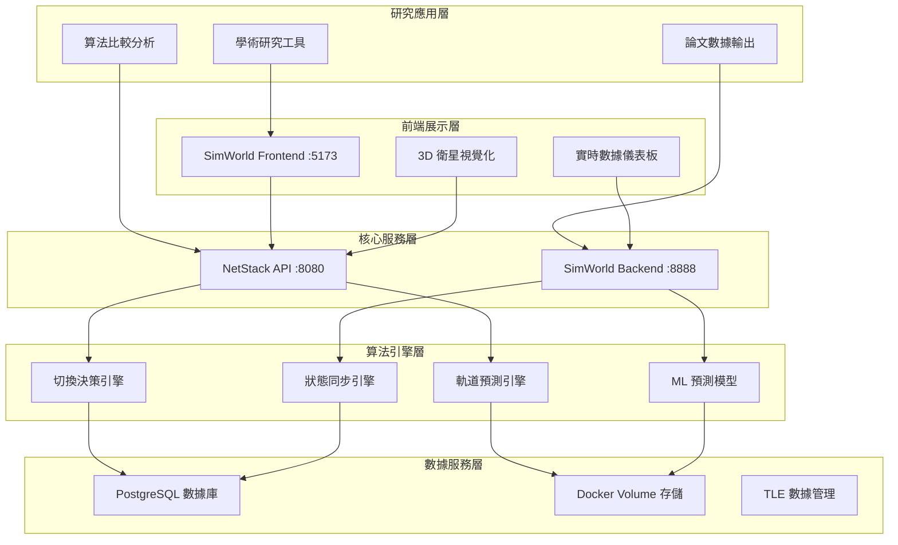

# 🏗️ 系統架構概覽

**版本**: 4.0.0  
**建立日期**: 2025-08-04  
**更新日期**: 2025-08-06  
**適用於**: LEO 衛星切換研究系統

## 📋 概述

本文檔提供 LEO 衛星切換研究系統的**高層架構設計**和組件分工概覽。

**📋 相關文檔**：
- **技術實現細節**：參考 [技術實現指南](./technical_guide.md)
- **標準規範**：參考 [標準與實現指南](./standards_implementation.md)
- **API 介面**：參考 [API 接口使用指南](./api_reference.md)

## 🎯 系統架構層次



## 🔧 核心組件職責

### NetStack (5G 核心網路) - :8080
**主要職責**: LEO 衛星切換算法研究和 3GPP NTN 協議實現

**核心功能模組**:
- **API Gateway**: 統一 API 入口和路由管理
- **算法引擎集群**: 切換決策、軌道預測、ML 模型、狀態同步
- **3GPP NTN 協議**: 信令系統、時間同步、頻率補償
- **數據持久化**: PostgreSQL 實驗數據和 RL 訓練記錄

### SimWorld (3D 仿真引擎) - :8888  
**主要職責**: 衛星軌道計算、數據預處理和 3D 視覺化

**核心功能模組**:
- **軌道計算引擎**: SGP4 精確計算和本地數據服務
- **數據預處理系統**: 時間序列生成和格式標準化  
- **3D 視覺化前端**: Three.js 軌道展示和實時監控
- **統一 API 服務**: 跨系統數據交換接口

## 🌐 服務交互模式

### 研究工作流程
```
學術研究需求 → 算法配置 → 實驗執行 → 數據分析 → 結果輸出
     ↓              ↓           ↓          ↓          ↓
  NetStack API → 算法引擎 → SimWorld → 可視化 → 論文數據
```

### 數據流向架構
```
真實 TLE 數據 → SGP4 計算 → 衛星篩選 → 時間序列 → API 服務 → 研究應用
      ↓             ↓         ↓          ↓         ↓          ↓
   CelesTrak → 完整物理模型 → 地理篩選 → 預計算 → 統一格式 → 學術分析
```

### 跨服務通信
- **NetStack ↔ SimWorld**: RESTful API 調用，JSON 數據交換
- **前端 ↔ 後端**: HTTP/WebSocket 雙向通信
- **算法引擎 ↔ 數據庫**: 直接數據庫連接，高性能查詢
- **外部系統整合**: 標準 REST API 接口

## 💾 數據架構設計

### 存儲分層策略
```
┌─────────────────────────────────────────────────────────┐
│                    應用數據層                              │
│  ┌─────────────────┐  ┌─────────────────────────────┐    │
│  │  研究實驗數據    │  │      論文輸出數據            │    │
│  │  (PostgreSQL)   │  │      (JSON/CSV)           │    │
│  └─────────────────┘  └─────────────────────────────┘    │
├─────────────────────────────────────────────────────────┤
│                    核心數據層                              │
│  ┌─────────────────┐  ┌─────────────────────────────┐    │
│  │  預計算軌道數據  │  │      配置和元數據            │    │
│  │  (Docker Volume)│  │      (YAML/JSON)          │    │
│  └─────────────────┘  └─────────────────────────────┘    │
├─────────────────────────────────────────────────────────┤
│                    原始數據層                              │
│  ┌─────────────────┐  ┌─────────────────────────────┐    │
│  │    TLE 數據     │  │      歷史軌道記錄            │    │
│  │  (文件系統)      │  │      (時間序列)             │    │
│  └─────────────────┘  └─────────────────────────────┘    │
└─────────────────────────────────────────────────────────┘
```

### 數據一致性保證
- **事務性操作**: PostgreSQL ACID 特性
- **版本控制**: 數據變更追蹤和回滾機制
- **備份策略**: 自動化數據備份和災難恢復
- **同步機制**: 跨服務數據一致性保證

## ⚡ 性能架構設計

### 橫向擴展能力
```
負載均衡器
     │
  ┌──┴──┐
  │     │
NetStack SimWorld
實例群組 實例群組
  │     │
  └──┬──┘
     │
共享數據層
```

### 縱向優化策略
- **計算優化**: 算法並行化和向量化計算
- **記憶體管理**: 智能緩存和數據預載入
- **I/O 優化**: 非同步處理和批量操作
- **網路優化**: 連接池和請求合併

## 🔒 安全架構考量

### 系統安全層次
```
┌─────────────────────────────────────────────────┐
│                應用安全層                          │
│  API 認證 │ 授權控制 │ 輸入驗證 │ 輸出過濾        │
├─────────────────────────────────────────────────┤
│                網路安全層                          │
│  HTTPS/TLS │ 防火牆 │ DDoS 防護 │ 入侵檢測       │
├─────────────────────────────────────────────────┤
│                數據安全層                          │
│  加密存儲 │ 存取控制 │ 審計日誌 │ 數據去敏        │
├─────────────────────────────────────────────────┤
│                基礎設施安全層                       │
│  容器安全 │ 主機加固 │ 網路隔離 │ 監控告警        │
└─────────────────────────────────────────────────┘
```

### 研究數據保護
- **數據匿名化**: 敏感研究數據去識別化處理
- **存取日誌**: 完整的數據存取審計追蹤
- **權限分級**: 基於角色的數據存取控制
- **合規保證**: 符合學術研究數據保護標準

## 📈 監控與可觀測性

### 監控層次架構
```
┌─────────────────────────────────────────────────┐
│                業務監控層                          │
│  研究指標 │ 算法效能 │ 實驗進度 │ 論文數據        │
├─────────────────────────────────────────────────┤
│                應用監控層                          │
│  API 延遲 │ 錯誤率  │ 吞吐量  │ 可用性         │
├─────────────────────────────────────────────────┤
│                基礎設施監控層                       │
│  CPU 使用 │ 記憶體  │ 磁碟 I/O │ 網路流量       │
├─────────────────────────────────────────────────┤
│                日誌聚合層                          │
│  應用日誌 │ 系統日誌 │ 安全日誌 │ 審計日誌        │
└─────────────────────────────────────────────────┘
```

### 關鍵性能指標 (KPI)
- **系統可用性**: 目標 99.9% 正常運行時間
- **API 響應時間**: 衛星查詢 < 50ms，切換決策 < 100ms
- **數據處理延遲**: SGP4 計算 < 15ms，預測模型 < 50ms
- **算法準確率**: 位置預測 > 94%，切換成功率 > 99%

## 🚀 部署與運維架構

### 容器化部署策略
```
Docker Compose 編排
├── NetStack 服務群組
│   ├── netstack-api (核心 API)
│   ├── netstack-postgres (數據庫)
│   └── netstack-redis (緩存)
├── SimWorld 服務群組  
│   ├── simworld-backend (後端服務)
│   └── simworld-frontend (前端應用)
└── 共享資源
    ├── Docker Volume (數據存儲)
    └── Docker Network (內部通信)
```

### 自動化運維
- **健康檢查**: 自動化服務健康狀態監控
- **自動重啟**: 服務異常時的自動恢復機制  
- **滾動更新**: 零停機時間的版本升級
- **配置管理**: 集中化配置和動態更新

## 📊 架構決策記錄

### 關鍵設計選擇
1. **微服務架構**: 選擇 NetStack + SimWorld 分離設計，提升開發和部署靈活性
2. **容器化部署**: 採用 Docker Compose，簡化部署和環境一致性
3. **REST API**: 標準化 API 設計，提升系統互操作性
4. **PostgreSQL + Volume**: 混合存儲策略，平衡性能和靈活性

### 技術選型理由
- **Python**: 豐富的科學計算生態系統，適合研究環境
- **FastAPI**: 高性能 API 框架，自動文檔生成
- **Three.js**: 強大的 3D 視覺化能力，適合衛星軌道展示
- **PostgreSQL**: 穩定的關係型數據庫，支援複雜查詢

## ⚠️ 架構限制與考量

### 當前限制
- **單節點部署**: 當前版本限制在單機部署
- **手動擴展**: 需要手動調整容器資源配置
- **數據同步**: 跨服務數據一致性依賴應用層實現

### 未來改進方向
- **微服務編排**: 採用 Kubernetes 進行容器編排
- **服務網格**: 引入 Istio 提升服務間通信管理
- **分散式數據**: 採用分散式數據庫提升擴展性

---

**本架構文檔提供系統的整體設計概覽，具體實現細節請參考相應的技術文檔。**