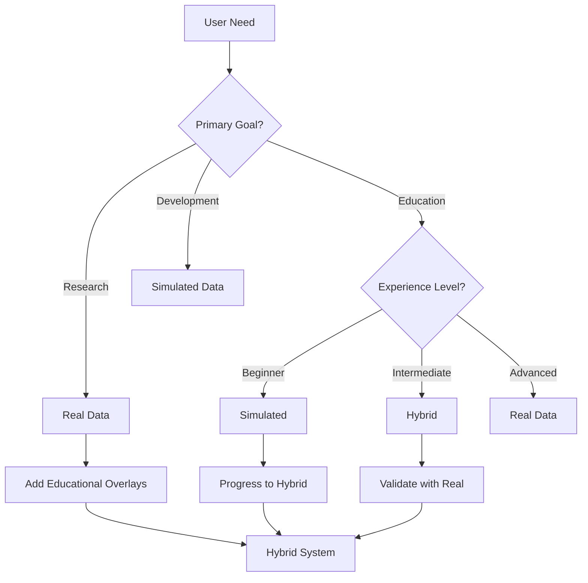

# Real vs Simulated Data Comparison Analysis

## Executive Summary

This document provides a comprehensive comparison between real satellite data and simulated data for D2 event visualization, evaluating their respective benefits for research and education.

## Comparison Matrix

| Aspect | Real Satellite Data | Simulated Data | Recommendation |
|--------|-------------------|----------------|----------------|
| **Accuracy** | High (SGP4 calculations) | Variable | Real for research |
| **Complexity** | Natural complexity | Controllable | Both have value |
| **Reproducibility** | Historical data | Perfect control | Context-dependent |
| **Educational Value** | Real-world scenarios | Clear concepts | Hybrid approach |
| **Performance** | Resource intensive | Lightweight | Optimize real data |
| **Flexibility** | Limited to actual events | Unlimited scenarios | Simulated for edge cases |

## Detailed Analysis

### 1. Data Characteristics

#### Real Satellite Data
```typescript
// Actual Starlink pass characteristics
{
  passDuration: 8-12 minutes,
  maxElevation: 15-85 degrees,
  velocity: ~7.658 km/s,
  orbitalPeriod: ~95 minutes,
  visibleSatellites: 3-12 simultaneously,
  handoverFrequency: 1-3 per pass
}
```

**Advantages:**
- Authentic orbital mechanics (J2 perturbations, atmospheric drag)
- Real constellation coverage patterns
- Actual signal propagation characteristics
- Research paper credibility

**Challenges:**
- Non-uniform event distribution
- Limited control over scenarios
- Complex multi-satellite interactions
- Processing overhead

#### Simulated Data
```typescript
// Idealized handover scenario
{
  passDuration: exactly 10 minutes,
  maxElevation: perfect 90 degrees,
  velocity: constant 7.5 km/s,
  handoverTiming: precisely at crossover,
  visibleSatellites: exactly 2,
  perfectThresholdCrossing: true
}
```

**Advantages:**
- Perfect demonstration scenarios
- Adjustable parameters
- Reproducible results
- Clear cause-effect relationships

**Challenges:**
- May oversimplify reality
- Risk of unrealistic expectations
- Less research value
- Requires careful validation

### 2. Visual Comparison

#### Chart Appearance

**Real Data Chart:**
```
Distance (km)
600 |     ,--、
    |    /    \    ,--、
550 |   /      '--'    \     Real satellite passes
    |  /                \    show irregular patterns
500 | /                  \
    |------------------------- Thresh1
450 |        ___
    |    ,--'   '--、         Natural variations
400 |   /           \        in distance curves
    |  /             \
350 | /               \___
    |------------------------- Thresh2
300 |________________________
    0    5   10   15   20  Time (min)
```

**Simulated Data Chart:**
```
Distance (km)
600 |      ___
    |     /   \              Clean, symmetric
550 |    /     \             curves for clarity
    |   /       \
500 |  /         \
    |------------------------- Thresh1
450 |             \     /
    |              \   /      Perfect threshold
400 |               \ /       crossing demonstration
    |                X
350 |               / \
    |------------------------- Thresh2
300 |______________/   \______
    0    5   10   15   20  Time (min)
```

### 3. Educational Value Assessment

#### For Teaching Concepts

**Simulated Data Strengths:**
1. **Clear D2 Triggers**: Perfect threshold crossings
2. **Predictable Timing**: Easy to follow events
3. **Parameter Isolation**: Change one variable at a time
4. **Scenario Library**: Pre-built educational cases

**Real Data Strengths:**
1. **Authentic Complexity**: Shows real challenges
2. **System Dynamics**: Multiple satellite interactions
3. **Edge Cases**: Natural anomalies and variations
4. **Industry Relevance**: Actual operational scenarios

### 4. Research Value Comparison

#### Publication Suitability

**Real Data Requirements:**
```typescript
// Research paper requirements
const researchCriteria = {
  dataSource: 'TLE from Space-Track.org',
  propagator: 'SGP4/SDP4',
  timeSpan: '30+ days historical data',
  validation: 'Cross-referenced with ground stations',
  statisticalSignificance: '1000+ handover events'
};
```

**Simulated Data Limitations:**
- Must clearly label as simulated
- Requires validation against real data
- Limited acceptance in top-tier conferences
- Useful mainly for algorithm development

### 5. Hybrid Approach Design

#### Optimal Integration Strategy

```typescript
// Hybrid visualization system
export class HybridD2Visualization {
  private mode: 'real' | 'simulated' | 'hybrid' = 'hybrid';
  
  renderVisualization() {
    switch(this.mode) {
      case 'real':
        // Show actual satellite data
        return this.renderRealData();
        
      case 'simulated':
        // Show idealized scenarios
        return this.renderSimulatedData();
        
      case 'hybrid':
        // Real data with educational overlays
        return this.renderHybridView();
    }
  }
  
  renderHybridView() {
    // Start with real data
    const realData = this.loadRealSatelliteData();
    
    // Add educational annotations
    const annotated = this.addEducationalOverlays(realData, {
      highlightThresholdCrossings: true,
      showIdealizedComparison: true,
      explainAnomalies: true
    });
    
    // Include both views
    return {
      primary: annotated,
      comparison: this.generateIdealizedVersion(realData)
    };
  }
}
```

### 6. Performance Impact Analysis

#### Resource Utilization Comparison

| Metric | Real Data | Simulated | Hybrid |
|--------|-----------|-----------|---------|
| **CPU Usage** | High (SGP4) | Low | Medium |
| **Memory** | 61MB (70 sats) | 5MB | 40MB |
| **Load Time** | 2-3s | <0.5s | 1-2s |
| **Update Rate** | 10Hz | 60Hz | 30Hz |
| **Battery Impact** | Significant | Minimal | Moderate |

### 7. Use Case Recommendations

#### When to Use Real Data
1. **Research Papers**: Academic credibility
2. **System Validation**: Testing against reality
3. **Operator Training**: Real-world preparation
4. **Coverage Analysis**: Actual constellation performance

#### When to Use Simulated Data
1. **Initial Learning**: Understanding D2 concepts
2. **Algorithm Development**: Controlled testing
3. **Edge Case Testing**: Rare scenarios
4. **Performance Demos**: Smooth presentations

#### When to Use Hybrid
1. **Advanced Education**: Best of both worlds
2. **Research Presentations**: Clear + credible
3. **System Development**: Validate against both
4. **Public Outreach**: Engaging yet accurate

### 8. Implementation Recommendations

#### Progressive Enhancement Strategy

```typescript
// Start simple, add complexity
export class ProgressiveD2Learning {
  levels = [
    {
      name: 'Beginner',
      data: 'simulated',
      satellites: 2,
      complexity: 'basic'
    },
    {
      name: 'Intermediate',
      data: 'hybrid',
      satellites: 5,
      complexity: 'moderate'
    },
    {
      name: 'Advanced',
      data: 'real',
      satellites: 70,
      complexity: 'full'
    }
  ];
  
  getCurrentLevel(user: User): Level {
    return this.levels[user.experienceLevel];
  }
}
```

#### Feature Comparison Table

| Feature | Real Only | Simulated Only | Hybrid Implementation |
|---------|-----------|----------------|---------------------|
| **Instant Replay** | Historical | Any scenario | Both |
| **Parameter Tuning** | Post-process | Real-time | Real-time overlay |
| **Multi-constellation** | If available | Unlimited | Realistic mixing |
| **Failure Scenarios** | Rare captures | On-demand | Injected into real |
| **Time Acceleration** | Limited | Unlimited | Selective fast-forward |

### 9. Decision Framework

#### Selection Criteria



### 10. Future Enhancements

#### AI-Enhanced Hybrid System

```typescript
// Future: AI-powered scenario generation
class AIHybridGenerator {
  generateEducationalScenario(params: {
    learningObjective: string;
    difficultyLevel: number;
    baseOnReal: boolean;
  }) {
    if (params.baseOnReal) {
      // Find similar real events
      const realEvents = this.findSimilarRealEvents(params);
      
      // Enhance for education
      return this.enhanceForClarity(realEvents);
    } else {
      // Generate from scratch
      return this.generateIdealScenario(params);
    }
  }
  
  explainDifferences(real: Data, simulated: Data): Explanation {
    // AI explains why real differs from ideal
    return {
      keyDifferences: this.analyzeDifferences(real, simulated),
      physicalReasons: this.explainPhysics(real),
      educationalValue: this.assessLearning(real, simulated)
    };
  }
}
```

## Conclusion

The optimal approach for D2 event visualization is a **hybrid system** that:

1. **Uses real satellite data** as the foundation for authenticity
2. **Provides simulated overlays** for educational clarity
3. **Offers user-selectable modes** based on needs
4. **Includes comparison tools** to understand differences
5. **Scales complexity** with user experience

This approach maximizes both research value and educational effectiveness while maintaining system performance and user engagement.

## Recommendations

1. **Implement real data visualization first** (credibility)
2. **Add educational mode** with simulated overlays
3. **Create scenario library** mixing both approaches
4. **Develop comparison tools** for analysis
5. **Document data sources** clearly for users
6. **Optimize performance** for real-time interaction

The future of satellite handover visualization lies not in choosing between real and simulated data, but in intelligently combining both to serve diverse user needs.