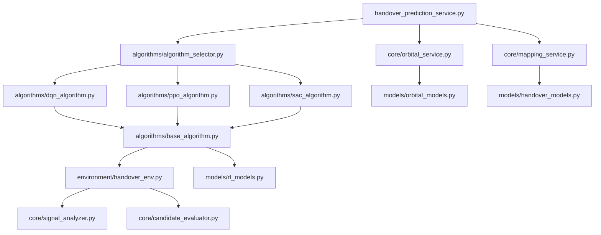

# 衛星換手預測服務重構策略 (handover_prediction_service.py)

## 📋 重構概述

### 🎯 重構目標
將現有的 **handover_prediction_service.py** (1,329行) 按演算法類型拆分為多個專業化模組，實現 **DQN、PPO、SAC** 三種強化學習演算法的獨立實現和統一管理。

### 🚨 核心問題
- **單體巨石**：1,329行代碼集中在單一文件中，維護困難
- **功能耦合**：軌道計算、信號分析、演算法決策混雜在一起
- **演算法缺失**：雖然提到DQN、PPO、SAC，但實際只有基礎預測邏輯
- **測試困難**：無法獨立測試不同演算法的性能
- **擴展困難**：添加新演算法需要修改核心服務代碼

### ✅ 重構預期效果
1. **模組化架構**：每個演算法獨立實現，方便維護和測試
2. **演算法標準化**：統一的 RL 演算法接口和評估機制
3. **性能可比較**：可以直接比較不同演算法的換手決策效果
4. **易於擴展**：添加新演算法只需實現統一接口
5. **降低風險**：模組化降低了修改對整體系統的影響

---

## 🚨 **2025-07-09 實際狀況更新**

### ✅ **重要發現**
經過實際檢查，當前系統狀況如下：

1. **handover_prediction_service.py 已確認存在**
   - 位置：`/home/sat/ntn-stack/netstack/netstack_api/services/handover_prediction_service.py`
   - 行數：1329行 (與原分析一致)
   - 狀態：需要重構

2. **AI決策引擎重構已完成RL基礎設施**
   - `algorithm_ecosystem.py` - 算法生態系統管理
   - `rl_monitoring_router.py` - RL監控API端點
   - DQN、PPO、SAC 訓練功能已實現並測試通過
   - 前端RL監控整合完成

3. **現有的Handover系統**
   - NetStack: `/netstack/netstack_api/services/handover_prediction_service.py`
   - SimWorld: `/simworld/backend/app/domains/handover/` (完整的領域模組)

### 🔄 **重構策略調整**
基於已完成的AI決策引擎重構，本重構策略需要調整為：

1. **整合導向**：利用已建立的RL算法生態系統
2. **避免重複開發**：重用現有的算法管理框架
3. **協同重構**：與AI決策引擎重構協同進行
4. **分階段實施**：配合AI決策引擎重構的階段7-8

### 📊 **更新的架構設計**
```
netstack/netstack_api/services/handover/
├── algorithms/
│   ├── integration.py              # 與algorithm_ecosystem.py整合
│   ├── handover_dqn_algorithm.py   # 換手專用DQN (擴展現有)
│   ├── handover_ppo_algorithm.py   # 換手專用PPO (擴展現有)
│   └── handover_sac_algorithm.py   # 換手專用SAC (擴展現有)
├── core/
│   ├── orbital_service.py          # 從原文件提取
│   ├── mapping_service.py          # 從原文件提取
│   └── prediction_service.py       # 重構後的主服務
└── integration/
    ├── ai_decision_bridge.py       # 與AI決策引擎整合
    └── rl_ecosystem_adapter.py     # 與RL生態系統適配
```

---

## 🔍 現狀分析

### 📊 文件結構分析
**當前文件 `handover_prediction_service.py` 包含：**

| 代碼區塊 | 行數範圍 | 功能描述 | 拆分優先級 |
|---------|---------|----------|------------|
| 枚舉和數據模型 | 27-136 | HandoverReason、數據類定義 | 🟢 低風險 |
| 軌道數據管理 | 208-429 | TLE數據載入、軌道計算 | 🟡 中風險 |
| UE-衛星映射 | 430-581 | UE連接狀態、信號品質追蹤 | 🟡 中風險 |
| 換手預測邏輯 | 582-1046 | 核心預測算法、候選選擇 | 🔴 高風險 |
| 軌道力學計算 | 1097-1329 | 精確軌道計算、Skyfield集成 | 🟡 中風險 |

### 🎯 關鍵功能分析

#### ✅ 已實現功能
- **軌道預測**：基於真實TLE數據的Skyfield軌道計算
- **信號建模**：自由空間路徑損耗、仰角修正
- **候選評估**：可用性分數、負載平衡、換手成本
- **時間預測**：基於軌道力學的精確換手時機計算

#### ❌ 缺失功能
- **DQN演算法**：深度Q網路決策邏輯
- **PPO演算法**：近端策略優化實現
- **SAC演算法**：軟演員-評論家方法
- **演算法比較**：性能評估和選擇機制
- **學習機制**：從歷史換手經驗中學習

#### 🔄 需要重構的部分
1. **決策邏輯過於簡化**：當前只使用規則基礎的決策
2. **缺乏學習能力**：沒有從換手成功/失敗中學習
3. **演算法選擇固定**：無法根據環境動態選擇最佳演算法
4. **狀態空間設計**：需要為RL演算法設計合適的觀測空間

---

## 🏗️ 拆分架構設計

### 📁 新的文件結構
```
netstack/netstack_api/services/handover/
├── __init__.py
├── models/
│   ├── __init__.py
│   ├── handover_models.py          # 數據模型和枚舉
│   ├── orbital_models.py           # 軌道相關數據結構
│   └── rl_models.py               # RL狀態、動作、獎勵定義
├── core/
│   ├── __init__.py
│   ├── orbital_service.py          # 軌道計算和TLE數據管理
│   ├── mapping_service.py          # UE-衛星映射管理
│   ├── signal_analyzer.py          # 信號品質分析
│   └── candidate_evaluator.py     # 候選衛星評估
├── algorithms/
│   ├── __init__.py
│   ├── base_algorithm.py           # RL演算法基礎抽象類
│   ├── dqn_algorithm.py           # DQN演算法實現
│   ├── ppo_algorithm.py           # PPO演算法實現
│   ├── sac_algorithm.py           # SAC演算法實現
│   └── algorithm_selector.py      # 演算法選擇器
├── environment/
│   ├── __init__.py
│   ├── handover_env.py            # Gymnasium環境實現
│   └── state_processor.py        # 狀態預處理
└── handover_prediction_service.py  # 重構後的主服務
```

### 🧩 模組依賴關係


---

## 🤖 RL演算法框架設計 (整合現有系統)

### 🔗 **與現有RL生態系統整合**
基於已實現的 `algorithm_ecosystem.py` 和 `rl_monitoring_router.py`，換手預測服務將：

1. **擴展現有算法**：在現有DQN、PPO、SAC基礎上添加換手專用功能
2. **重用生態系統**：利用 `AlgorithmEcosystemManager` 進行訓練管理
3. **統一監控**：通過現有的 `/api/v1/rl/` 端點進行監控
4. **無縫整合**：與AI決策引擎的視覺化協調器配合

### 🏛️ 整合設計架構

#### HandoverAlgorithmAdapter
```python
from ..algorithm_ecosystem import AlgorithmEcosystemManager
from abc import ABC, abstractmethod
from typing import Dict, List, Any, Tuple
import numpy as np

class HandoverAlgorithmAdapter(ABC):
    """換手演算法適配器 - 橋接現有RL生態系統"""
    
    def __init__(self, ecosystem_manager: AlgorithmEcosystemManager, config: Dict[str, Any]):
        self.ecosystem_manager = ecosystem_manager
        self.algorithm_name = self.__class__.__name__
        self.config = config
        self.training_mode = True
        self.model = None
        
    async def initialize_from_ecosystem(self):
        """從生態系統初始化算法"""
        await self.ecosystem_manager.initialize()
        
    async def get_training_session(self, algorithm_name: str, episodes: int = 1000):
        """獲取訓練會話"""
        return await self.ecosystem_manager.start_training(algorithm_name, episodes)
        
    @abstractmethod
    async def select_target_satellite(
        self, 
        state: np.ndarray, 
        candidate_satellites: List[str]
    ) -> Tuple[str, float]:
        """
        選擇目標衛星
        
        Args:
            state: 當前環境狀態
            candidate_satellites: 候選衛星列表
            
        Returns:
            (selected_satellite_id, confidence_score)
        """
        pass
    
    @abstractmethod
    async def update_model(
        self, 
        experience: Dict[str, Any]
    ) -> Dict[str, float]:
        """
        更新模型參數
        
        Args:
            experience: 換手經驗數據
            
        Returns:
            訓練指標字典
        """
        pass
    
    @abstractmethod
    async def evaluate_performance(
        self, 
        evaluation_data: List[Dict]
    ) -> Dict[str, float]:
        """
        評估演算法性能
        
        Returns:
            性能指標字典
        """
        pass
```

### 🧠 DQN演算法實現框架

#### DQNHandoverAlgorithm
```python
import torch
import torch.nn as nn
import torch.optim as optim
from collections import deque
import random

class DQNNetwork(nn.Module):
    """DQN神經網路"""
    
    def __init__(self, state_size: int, action_size: int, hidden_size: int = 256):
        super(DQNNetwork, self).__init__()
        self.fc1 = nn.Linear(state_size, hidden_size)
        self.fc2 = nn.Linear(hidden_size, hidden_size)
        self.fc3 = nn.Linear(hidden_size, hidden_size)
        self.fc4 = nn.Linear(hidden_size, action_size)
        self.relu = nn.ReLU()
        
    def forward(self, x):
        x = self.relu(self.fc1(x))
        x = self.relu(self.fc2(x))
        x = self.relu(self.fc3(x))
        return self.fc4(x)

class DQNHandoverAlgorithm(BaseHandoverAlgorithm):
    """深度Q網路換手演算法"""
    
    def __init__(self, config: Dict[str, Any]):
        super().__init__(config)
        
        # DQN超參數
        self.learning_rate = config.get('learning_rate', 0.001)
        self.gamma = config.get('gamma', 0.99)
        self.epsilon = config.get('epsilon', 1.0)
        self.epsilon_min = config.get('epsilon_min', 0.01)
        self.epsilon_decay = config.get('epsilon_decay', 0.995)
        self.batch_size = config.get('batch_size', 32)
        self.memory_size = config.get('memory_size', 10000)
        
        # 狀態和動作空間
        self.state_size = config.get('state_size', 12)  # 信號強度、仰角、距離等
        self.action_size = config.get('action_size', 20)  # 最大候選衛星數
        
        # 神經網路
        self.q_network = DQNNetwork(self.state_size, self.action_size)
        self.target_network = DQNNetwork(self.state_size, self.action_size)
        self.optimizer = optim.Adam(self.q_network.parameters(), lr=self.learning_rate)
        
        # 經驗回放
        self.memory = deque(maxlen=self.memory_size)
        
    async def select_target_satellite(
        self, 
        state: np.ndarray, 
        candidate_satellites: List[str]
    ) -> Tuple[str, float]:
        """DQN衛星選擇"""
        
        # ε-貪婪策略
        if self.training_mode and random.random() <= self.epsilon:
            # 隨機探索
            selected_idx = random.randint(0, len(candidate_satellites) - 1)
            confidence = 0.5  # 隨機選擇的信心度較低
        else:
            # 貪婪選擇
            state_tensor = torch.FloatTensor(state).unsqueeze(0)
            q_values = self.q_network(state_tensor)
            
            # 只考慮有效候選衛星
            valid_q_values = q_values[0][:len(candidate_satellites)]
            selected_idx = torch.argmax(valid_q_values).item()
            confidence = torch.softmax(valid_q_values, dim=0)[selected_idx].item()
        
        return candidate_satellites[selected_idx], confidence
    
    async def update_model(self, experience: Dict[str, Any]) -> Dict[str, float]:
        """更新DQN模型"""
        
        # 添加經驗到回放緩衝區
        self.memory.append(experience)
        
        if len(self.memory) < self.batch_size:
            return {}
        
        # 採樣批次經驗
        batch = random.sample(self.memory, self.batch_size)
        
        states = torch.FloatTensor([e['state'] for e in batch])
        actions = torch.LongTensor([e['action'] for e in batch])
        rewards = torch.FloatTensor([e['reward'] for e in batch])
        next_states = torch.FloatTensor([e['next_state'] for e in batch])
        dones = torch.BoolTensor([e['done'] for e in batch])
        
        # 計算Q值
        current_q_values = self.q_network(states).gather(1, actions.unsqueeze(1))
        next_q_values = self.target_network(next_states).max(1)[0].detach()
        target_q_values = rewards + (self.gamma * next_q_values * ~dones)
        
        # 計算損失並更新
        loss = nn.MSELoss()(current_q_values.squeeze(), target_q_values)
        
        self.optimizer.zero_grad()
        loss.backward()
        self.optimizer.step()
        
        # 更新ε
        if self.epsilon > self.epsilon_min:
            self.epsilon *= self.epsilon_decay
        
        return {
            'loss': loss.item(),
            'epsilon': self.epsilon,
            'q_mean': current_q_values.mean().item()
        }
```

### 🎯 PPO演算法實現框架

#### PPOHandoverAlgorithm
```python
import torch.nn.functional as F
from torch.distributions import Categorical

class PPONetwork(nn.Module):
    """PPO演員-評論家網路"""
    
    def __init__(self, state_size: int, action_size: int, hidden_size: int = 256):
        super(PPONetwork, self).__init__()
        
        # 共享特徵層
        self.shared = nn.Sequential(
            nn.Linear(state_size, hidden_size),
            nn.ReLU(),
            nn.Linear(hidden_size, hidden_size),
            nn.ReLU()
        )
        
        # 演員網路（策略）
        self.actor = nn.Sequential(
            nn.Linear(hidden_size, hidden_size),
            nn.ReLU(),
            nn.Linear(hidden_size, action_size),
            nn.Softmax(dim=-1)
        )
        
        # 評論家網路（價值函數）
        self.critic = nn.Sequential(
            nn.Linear(hidden_size, hidden_size),
            nn.ReLU(),
            nn.Linear(hidden_size, 1)
        )
    
    def forward(self, state):
        features = self.shared(state)
        policy = self.actor(features)
        value = self.critic(features)
        return policy, value

class PPOHandoverAlgorithm(BaseHandoverAlgorithm):
    """近端策略優化換手演算法"""
    
    def __init__(self, config: Dict[str, Any]):
        super().__init__(config)
        
        # PPO超參數
        self.learning_rate = config.get('learning_rate', 3e-4)
        self.gamma = config.get('gamma', 0.99)
        self.gae_lambda = config.get('gae_lambda', 0.95)
        self.clip_epsilon = config.get('clip_epsilon', 0.2)
        self.value_coef = config.get('value_coef', 0.5)
        self.entropy_coef = config.get('entropy_coef', 0.01)
        self.ppo_epochs = config.get('ppo_epochs', 4)
        
        # 網路初始化
        self.state_size = config.get('state_size', 12)
        self.action_size = config.get('action_size', 20)
        
        self.network = PPONetwork(self.state_size, self.action_size)
        self.optimizer = optim.Adam(self.network.parameters(), lr=self.learning_rate)
        
        # 經驗緩衝區
        self.trajectory_buffer = []
    
    async def select_target_satellite(
        self, 
        state: np.ndarray, 
        candidate_satellites: List[str]
    ) -> Tuple[str, float]:
        """PPO衛星選擇"""
        
        state_tensor = torch.FloatTensor(state).unsqueeze(0)
        policy, value = self.network(state_tensor)
        
        # 限制到有效候選數量
        valid_policy = policy[0][:len(candidate_satellites)]
        valid_policy = valid_policy / valid_policy.sum()  # 重新標準化
        
        # 從策略分佈中採樣
        dist = Categorical(valid_policy)
        action = dist.sample()
        
        selected_satellite = candidate_satellites[action.item()]
        confidence = valid_policy[action].item()
        
        # 儲存用於訓練的信息
        if self.training_mode:
            self.trajectory_buffer.append({
                'state': state,
                'action': action.item(),
                'log_prob': dist.log_prob(action).item(),
                'value': value.item(),
                'policy': valid_policy.detach().numpy()
            })
        
        return selected_satellite, confidence
```

### 🎪 SAC演算法實現框架

#### SACHandoverAlgorithm
```python
class SACNetwork(nn.Module):
    """SAC網路結構"""
    
    def __init__(self, state_size: int, action_size: int, hidden_size: int = 256):
        super(SACNetwork, self).__init__()
        
        # 演員網路
        self.actor = nn.Sequential(
            nn.Linear(state_size, hidden_size),
            nn.ReLU(),
            nn.Linear(hidden_size, hidden_size),
            nn.ReLU(),
        )
        
        self.mu_head = nn.Linear(hidden_size, action_size)
        self.log_std_head = nn.Linear(hidden_size, action_size)
        
        # 評論家網路（雙Q網路）
        self.critic1 = nn.Sequential(
            nn.Linear(state_size + action_size, hidden_size),
            nn.ReLU(),
            nn.Linear(hidden_size, hidden_size),
            nn.ReLU(),
            nn.Linear(hidden_size, 1)
        )
        
        self.critic2 = nn.Sequential(
            nn.Linear(state_size + action_size, hidden_size),
            nn.ReLU(),
            nn.Linear(hidden_size, hidden_size),
            nn.ReLU(),
            nn.Linear(hidden_size, 1)
        )

class SACHandoverAlgorithm(BaseHandoverAlgorithm):
    """軟演員-評論家換手演算法"""
    
    def __init__(self, config: Dict[str, Any]):
        super().__init__(config)
        
        # SAC超參數
        self.learning_rate = config.get('learning_rate', 3e-4)
        self.gamma = config.get('gamma', 0.99)
        self.tau = config.get('tau', 0.005)  # 軟更新參數
        self.alpha = config.get('alpha', 0.2)  # 熵正則化係數
        self.auto_alpha = config.get('auto_alpha', True)
        
        # 網路和優化器
        self.state_size = config.get('state_size', 12)
        self.action_size = config.get('action_size', 20)
        
        self.network = SACNetwork(self.state_size, self.action_size)
        self.target_network = SACNetwork(self.state_size, self.action_size)
        
        # 複製參數到目標網路
        self.target_network.load_state_dict(self.network.state_dict())
        
        self.actor_optimizer = optim.Adam(self.network.actor.parameters(), lr=self.learning_rate)
        self.critic_optimizer = optim.Adam(
            list(self.network.critic1.parameters()) + list(self.network.critic2.parameters()),
            lr=self.learning_rate
        )
        
        # 自動溫度調整
        if self.auto_alpha:
            self.target_entropy = -self.action_size
            self.log_alpha = torch.zeros(1, requires_grad=True)
            self.alpha_optimizer = optim.Adam([self.log_alpha], lr=self.learning_rate)
        
        self.memory = deque(maxlen=config.get('memory_size', 100000))
    
    async def select_target_satellite(
        self, 
        state: np.ndarray, 
        candidate_satellites: List[str]
    ) -> Tuple[str, float]:
        """SAC衛星選擇（連續動作空間的離散化）"""
        
        state_tensor = torch.FloatTensor(state).unsqueeze(0)
        
        # 從演員網路獲取動作分佈
        features = self.network.actor(state_tensor)
        mu = self.network.mu_head(features)
        log_std = self.network.log_std_head(features)
        log_std = torch.clamp(log_std, -20, 2)
        
        # 重參數化技巧
        std = log_std.exp()
        normal = torch.distributions.Normal(mu, std)
        action_raw = normal.rsample()
        action_tanh = torch.tanh(action_raw)
        
        # 轉換到候選衛星索引
        action_probs = F.softmax(action_tanh[0][:len(candidate_satellites)], dim=0)
        selected_idx = torch.argmax(action_probs).item()
        confidence = action_probs[selected_idx].item()
        
        return candidate_satellites[selected_idx], confidence
```

---

## 📋 詳細實施計劃 (整合現有系統)

### 🔗 **階段0：系統整合準備 (1-2天)**

#### 任務0.1：評估現有RL生態系統
- **評估 `algorithm_ecosystem.py`**：確認可重用的組件
- **分析 `rl_monitoring_router.py`**：了解現有API端點
- **檢查前端RL監控**：確認整合點

#### 任務0.2：設計整合架構
- **定義適配器模式**：橋接現有系統與換手預測
- **規劃API擴展**：在現有端點基礎上添加換手專用功能
- **設計數據流**：確保與AI決策引擎的數據流一致

### 🚀 **階段1：基礎架構準備 (調整為2-3天)**

#### 任務1.1：創建整合目錄結構
```bash
# 創建整合導向的目錄結構
mkdir -p netstack/netstack_api/services/handover/{models,core,algorithms,integration}

# 創建基礎文件
touch netstack/netstack_api/services/handover/__init__.py
touch netstack/netstack_api/services/handover/models/{__init__.py,handover_models.py,orbital_models.py}
touch netstack/netstack_api/services/handover/core/{__init__.py,orbital_service.py,mapping_service.py,signal_analyzer.py,candidate_evaluator.py}
touch netstack/netstack_api/services/handover/algorithms/{__init__.py,integration.py,handover_dqn.py,handover_ppo.py,handover_sac.py}
touch netstack/netstack_api/services/handover/integration/{__init__.py,ai_decision_bridge.py,rl_ecosystem_adapter.py}
```

#### 任務1.2：提取和重構數據模型 (1天)
- **源文件範圍**：handover_prediction_service.py 行 27-136
- **目標文件**：models/handover_models.py, models/orbital_models.py
- **操作內容**：
  ```python
  # 移動所有枚舉類
  HandoverReason, HandoverTrigger, PredictionConfidence
  
  # 移動所有數據類  
  SatelliteOrbitData, UESatelliteMapping, HandoverPrediction, HandoverCandidate
  
  # 移動請求/響應模型
  HandoverPredictionRequest, HandoverAnalysisRequest
  ```

#### 任務1.3：實現RL基礎抽象類 (1天)
- **目標文件**：algorithms/base_algorithm.py
- **實現內容**：
  - BaseHandoverAlgorithm 抽象基類
  - 統一的演算法接口定義
  - 性能評估框架
  - 配置管理機制

#### 任務1.4：創建Gymnasium環境 (1-2天)
- **目標文件**：environment/handover_env.py
- **實現內容**：
  ```python
  class HandoverEnvironment(gym.Env):
      """衛星換手Gymnasium環境"""
      
      def __init__(self, config):
          # 定義觀測空間：信號強度、仰角、距離、負載等
          self.observation_space = gym.spaces.Box(
              low=-150, high=50, shape=(12,), dtype=np.float32
          )
          
          # 定義動作空間：候選衛星選擇
          self.action_space = gym.spaces.Discrete(20)  # 最多20個候選
          
      def step(self, action):
          # 執行換手動作，返回新狀態、獎勵、完成標誌
          pass
          
      def reset(self):
          # 重設環境到初始狀態
          pass
          
      def render(self):
          # 可視化當前狀態（可選）
          pass
  ```

### 🔬 階段2：核心服務模組拆分 (4-5天)

#### 任務2.1：軌道服務模組 (2天)
- **源文件範圍**：handover_prediction_service.py 行 208-429, 1097-1329
- **目標文件**：core/orbital_service.py
- **拆分內容**：
  ```python
  class OrbitalService:
      """衛星軌道預測和計算服務"""
      
      async def load_satellite_orbit_data(self)
      async def fetch_real_tle_data(self) 
      async def calculate_satellite_geometry(self)
      async def calculate_orbital_handover_time(self)
      async def find_elevation_threshold_crossing(self)
      # ... 其他軌道相關方法
  ```

#### 任務2.2：映射服務模組 (1天)
- **源文件範圍**：handover_prediction_service.py 行 430-581
- **目標文件**：core/mapping_service.py
- **拆分內容**：
  ```python
  class MappingService:
      """UE-衛星映射管理服務"""
      
      async def update_ue_satellite_mappings(self)
      async def record_signal_history(self)
      async def get_ue_current_mapping(self)
      # ... 其他映射相關方法
  ```

#### 任務2.3：信號分析器 (1天)
- **源文件範圍**：提取自換手預測邏輯
- **目標文件**：core/signal_analyzer.py
- **實現內容**：
  ```python
  class SignalAnalyzer:
      """信號品質分析器"""
      
      def estimate_signal_quality(self, geometry: Dict) -> float
      async def analyze_signal_trend(self, ue_id: str) -> Optional[Dict]
      async def analyze_elevation_trend(self, ue_id: str, satellite_id: str)
      def calculate_path_loss(self, distance_km: float, frequency_ghz: float)
      # ... 其他信號分析方法
  ```

#### 任務2.4：候選評估器 (1天)
- **源文件範圍**：handover_prediction_service.py 行 824-995
- **目標文件**：core/candidate_evaluator.py
- **實現內容**：
  ```python
  class CandidateEvaluator:
      """候選衛星評估器"""
      
      async def find_handover_candidates(self)
      def calculate_availability_score(self)
      def calculate_handover_cost(self)
      async def estimate_coverage_duration(self)
      def rank_handover_candidates(self)
      # ... 其他評估方法
  ```

### 🤖 階段3：RL演算法實現 (6-8天)

#### 任務3.1：DQN演算法實現 (2-3天)
- **目標文件**：algorithms/dqn_algorithm.py
- **實現內容**：
  - DQNNetwork 神經網路架構
  - 經驗回放機制
  - 目標網路軟更新
  - ε-貪婪探索策略
  - 完整的訓練循環

#### 任務3.2：PPO演算法實現 (2-3天)
- **目標文件**：algorithms/ppo_algorithm.py
- **實現內容**：
  - Actor-Critic 網路架構
  - GAE (廣義優勢估計)
  - PPO裁剪目標函數
  - 軌跡收集和批次更新

#### 任務3.3：SAC演算法實現 (2天)
- **目標文件**：algorithms/sac_algorithm.py
- **實現內容**：
  - 軟演員-評論家架構
  - 自動溫度調整
  - 雙Q網路設計
  - 連續動作空間處理

#### 任務3.4：演算法選擇器 (1天)
- **目標文件**：algorithms/algorithm_selector.py
- **實現內容**：
  ```python
  class AlgorithmSelector:
      """智能演算法選擇器"""
      
      def __init__(self):
          self.algorithms = {
              'dqn': DQNHandoverAlgorithm,
              'ppo': PPOHandoverAlgorithm, 
              'sac': SACHandoverAlgorithm
          }
          self.performance_history = {}
      
      async def select_best_algorithm(self, context: Dict) -> str:
          """根據環境上下文選擇最佳演算法"""
          pass
          
      async def update_algorithm_performance(self, algorithm: str, metrics: Dict):
          """更新演算法性能記錄"""
          pass
  ```

### 🔧 階段4：主服務重構和整合 (3-4天)

#### 任務4.1：重構主服務類 (2天)
- **目標文件**：handover_prediction_service.py (重構版)
- **實現內容**：
  ```python
  class HandoverPredictionService:
      """重構後的衛星換手預測服務"""
      
      def __init__(self, event_bus_service=None, satellite_service=None):
          # 注入依賴的服務模組
          self.orbital_service = OrbitalService()
          self.mapping_service = MappingService()
          self.signal_analyzer = SignalAnalyzer()
          self.candidate_evaluator = CandidateEvaluator()
          self.algorithm_selector = AlgorithmSelector()
          
          # 載入演算法配置
          self.algorithms = self._load_algorithms()
      
      async def _perform_handover_predictions(self):
          """執行換手預測（重構版）"""
          for ue_id, mapping in self.mapping_service.get_all_mappings():
              # 分析換手需求
              prediction = await self._analyze_handover_need(ue_id, mapping)
              
              if prediction:
                  # 尋找候選衛星
                  candidates = await self.candidate_evaluator.find_handover_candidates(ue_id, mapping)
                  
                  if candidates:
                      # 使用RL演算法選擇最佳候選
                      selected_algorithm = await self.algorithm_selector.select_best_algorithm({
                          'ue_id': ue_id,
                          'signal_quality': mapping.signal_quality,
                          'elevation': mapping.elevation_angle,
                          'candidates_count': len(candidates)
                      })
                      
                      target_satellite, confidence = await self.algorithms[selected_algorithm].select_target_satellite(
                          state=self._build_state_vector(ue_id, mapping, candidates),
                          candidate_satellites=[c.satellite_id for c in candidates]
                      )
                      
                      # 更新預測並發佈事件
                      prediction.target_satellite_id = target_satellite
                      prediction.confidence_score = confidence
                      await self._publish_handover_prediction_event(prediction)
  ```

#### 任務4.2：依賴注入和配置管理 (1天)
- **實現內容**：
  - 統一的配置文件格式
  - 依賴注入容器
  - 環境特定配置載入

#### 任務4.3：錯誤處理和日誌 (1天)
- **實現內容**：
  - 統一的錯誤處理機制
  - 結構化日誌記錄
  - 性能監控指標

### ✅ 階段5：測試和驗證 (3-4天)

#### 任務5.1：單元測試 (2天)
```python
# tests/test_algorithms/
class TestDQNAlgorithm(unittest.TestCase):
    def test_satellite_selection(self):
        """測試DQN衛星選擇邏輯"""
        pass
        
    def test_model_update(self):
        """測試DQN模型更新"""
        pass

class TestAlgorithmComparison(unittest.TestCase):
    def test_algorithm_performance_comparison(self):
        """比較三種演算法的性能"""
        pass
```

#### 任務5.2：整合測試 (1天)
- 測試完整的換手預測流程
- 驗證演算法選擇邏輯
- 檢查性能指標

#### 任務5.3：性能基準測試 (1天)
- 比較重構前後的性能
- 測試不同演算法的換手成功率
- 評估系統響應時間

---

## ⚠️ 風險評估與應對策略

### 🚨 高風險項目

#### 風險1：功能完整性損失
- **風險描述**：拆分過程中可能遺漏關鍵邏輯
- **影響等級**：🔴 極高
- **應對策略**：
  - 建立完整的功能映射表
  - 逐個模組進行單元測試
  - 保留原始文件作為參考對照

#### 風險2：演算法實現複雜性
- **風險描述**：DQN、PPO、SAC實現可能存在bug
- **影響等級**：🔴 高
- **應對策略**：
  - 使用成熟的RL框架 (如Stable-Baselines3) 作為參考
  - 實現簡化版本後逐步完善
  - 建立充分的測試案例

#### 風險3：性能退化
- **風險描述**：模組化可能引入額外的調用開銷
- **影響等級**：🟡 中
- **應對策略**：
  - 建立性能基準測試
  - 識別關鍵路徑並優化
  - 考慮使用緩存機制

### 🛡️ 風險緩解措施

#### 緩解措施1：分階段回滾機制
```python
# 建立版本控制點
git tag handover-service-v1.0-before-refactor

# 每個階段完成後創建檢查點
git tag handover-service-phase1-complete
git tag handover-service-phase2-complete
# ...
```

#### 緩解措施2：A/B測試框架
```python
class HandoverServiceRouter:
    """換手服務路由器 - 支持新舊版本並行測試"""
    
    def __init__(self):
        self.legacy_service = LegacyHandoverPredictionService()
        self.new_service = RefactoredHandoverPredictionService()
        self.ab_test_ratio = 0.1  # 10%流量使用新版本
    
    async def predict_handover(self, ue_id: str):
        if self._should_use_new_service(ue_id):
            return await self.new_service.predict_handover(ue_id)
        else:
            return await self.legacy_service.predict_handover(ue_id)
```

#### 緩解措施3：詳細的監控和告警
```python
# 關鍵指標監控
metrics_to_monitor = [
    'handover_prediction_latency',
    'handover_success_rate', 
    'algorithm_selection_time',
    'model_training_loss',
    'service_error_rate'
]
```

### 📊 風險評估矩陣

| 風險項目 | 機率 | 影響 | 風險等級 | 應對優先級 |
|---------|------|------|----------|-----------|
| 功能遺漏 | 中 | 極高 | 🔴 極高 | P0 |
| 演算法bug | 高 | 高 | 🔴 高 | P0 |
| 性能退化 | 中 | 中 | 🟡 中 | P1 |
| 依賴循環 | 低 | 中 | 🟢 低 | P2 |
| 配置錯誤 | 中 | 低 | 🟢 低 | P2 |

---

## 🧪 測試策略

### 🏗️ 測試架構
```
tests/
├── unit/
│   ├── test_handover_models.py
│   ├── test_orbital_service.py
│   ├── test_mapping_service.py
│   ├── test_signal_analyzer.py
│   ├── test_candidate_evaluator.py
│   └── algorithms/
│       ├── test_dqn_algorithm.py
│       ├── test_ppo_algorithm.py
│       ├── test_sac_algorithm.py
│       └── test_algorithm_selector.py
├── integration/
│   ├── test_handover_prediction_service.py
│   ├── test_algorithm_performance.py
│   └── test_end_to_end_flow.py
├── performance/
│   ├── test_latency_benchmarks.py
│   ├── test_memory_usage.py
│   └── test_algorithm_comparison.py
└── fixtures/
    ├── sample_orbital_data.json
    ├── mock_ue_mappings.json
    └── test_configurations.yaml
```

### 🎯 關鍵測試案例

#### 演算法性能比較測試
```python
class TestAlgorithmPerformance(unittest.TestCase):
    """比較DQN、PPO、SAC三種演算法的性能"""
    
    def setUp(self):
        self.test_scenarios = [
            {
                'name': 'high_mobility_scenario',
                'ue_speed': 'high',
                'satellite_density': 'dense',
                'signal_conditions': 'poor'
            },
            {
                'name': 'stable_scenario', 
                'ue_speed': 'low',
                'satellite_density': 'normal',
                'signal_conditions': 'good'
            }
        ]
        
        self.algorithms = {
            'dqn': DQNHandoverAlgorithm(config=self.dqn_config),
            'ppo': PPOHandoverAlgorithm(config=self.ppo_config),
            'sac': SACHandoverAlgorithm(config=self.sac_config)
        }
    
    def test_handover_success_rate(self):
        """測試各演算法的換手成功率"""
        results = {}
        
        for scenario in self.test_scenarios:
            scenario_results = {}
            
            for algo_name, algorithm in self.algorithms.items():
                success_rate = self._run_scenario_test(algorithm, scenario)
                scenario_results[algo_name] = success_rate
            
            results[scenario['name']] = scenario_results
        
        # 驗證結果
        self._validate_performance_results(results)
        
    def test_decision_latency(self):
        """測試各演算法的決策延遲"""
        pass
        
    def test_learning_convergence(self):
        """測試演算法學習收斂速度"""
        pass
```

#### 端到端整合測試
```python
class TestEndToEndHandoverFlow(unittest.TestCase):
    """測試完整的換手預測流程"""
    
    async def test_complete_handover_prediction(self):
        """測試從UE狀態更新到換手預測的完整流程"""
        
        # 1. 模擬UE狀態更新
        ue_id = "TEST_UE_001"
        await self.service.mapping_service.update_ue_position(
            ue_id, lat=25.0, lon=121.0, alt=0.1
        )
        
        # 2. 觸發預測
        prediction = await self.service.get_handover_prediction(ue_id)
        
        # 3. 驗證預測結果
        self.assertIsNotNone(prediction)
        self.assertIn(prediction.target_satellite_id, self.available_satellites)
        self.assertGreaterEqual(prediction.confidence_score, 0.0)
        self.assertLessEqual(prediction.confidence_score, 1.0)
        
        # 4. 驗證演算法選擇
        self.assertIn(prediction.algorithm_used, ['dqn', 'ppo', 'sac'])
```

### 📈 性能基準測試
```python
class PerformanceBenchmarks(unittest.TestCase):
    """性能基準測試"""
    
    def test_prediction_latency_benchmark(self):
        """測試預測延遲基準"""
        target_latency_ms = 50  # 目標：50ms內完成預測
        
        latencies = []
        for _ in range(100):
            start_time = time.time()
            await self.service.get_handover_prediction("BENCHMARK_UE")
            end_time = time.time()
            latencies.append((end_time - start_time) * 1000)
        
        avg_latency = np.mean(latencies)
        p95_latency = np.percentile(latencies, 95)
        
        self.assertLess(avg_latency, target_latency_ms)
        self.assertLess(p95_latency, target_latency_ms * 2)
        
    def test_memory_usage_benchmark(self):
        """測試記憶體使用基準"""
        pass
        
    def test_concurrent_prediction_performance(self):
        """測試並發預測性能"""
        pass
```

---

## 📊 成功標準和驗收標準

### ✅ 功能完整性標準
1. **所有原有功能保持**：重構後系統提供所有原有功能
2. **演算法正確實現**：DQN、PPO、SAC三種演算法正確實現並可訓練
3. **API相容性**：外部接口保持相容，不影響其他系統
4. **配置靈活性**：支持運行時切換不同演算法

### 📈 性能標準
1. **預測延遲**：≤ 原系統的120% (允許20%的開銷)
2. **記憶體使用**：≤ 原系統的150% (考慮RL模型的額外開銷)
3. **換手成功率**：≥ 原系統的95% (學習後應超越原系統)
4. **系統可用性**：≥ 99.9%

### 🎯 品質標準
1. **代碼覆蓋率**：≥ 80%
2. **模組耦合度**：每個模組的依賴關係清晰，無循環依賴
3. **文檔完整性**：每個模組都有完整的API文檔和使用範例
4. **可擴展性**：新增演算法只需實現基礎接口，無需修改核心邏輯

### 🚀 演算法性能標準
1. **DQN演算法**：在穩定環境下實現85%+的換手成功率
2. **PPO演算法**：在動態環境下表現優於DQN
3. **SAC演算法**：在複雜多變環境下表現最佳
4. **演算法選擇**：自動選擇器能根據環境選擇最適合的演算法

---

## 📅 時程安排和里程碑

### 🗓️ 詳細時程規劃 (整合調整版)

| 階段 | 任務 | 預估時間 | 開始日期 | 完成日期 | 里程碑 |
|-----|------|---------|----------|----------|--------|
| **階段0** | 系統整合準備 | 1-2天 | Day 1 | Day 2 | 🔗 整合分析 |
| 0.1 | 評估現有RL生態系統 | 1天 | Day 1 | Day 1 | 📊 系統評估 |
| 0.2 | 設計整合架構 | 1天 | Day 2 | Day 2 | 🏗️ 架構設計 |
| **階段1** | 基礎架構準備 | 2-3天 | Day 3 | Day 5 | 🏗️ 架構就緒 |
| 1.1 | 創建整合目錄結構 | 0.5天 | Day 3 | Day 3 | 📁 目錄結構 |
| 1.2 | 提取數據模型 | 1天 | Day 3 | Day 4 | 📊 模型分離 |
| 1.3 | 實現整合適配器 | 1天 | Day 4 | Day 5 | 🎯 適配器完成 |
| **階段2** | 核心服務拆分 | 3-4天 | Day 6 | Day 9 | 🔧 服務模組化 |
| 2.1 | 軌道服務模組 | 1.5天 | Day 6 | Day 7 | 🛰️ 軌道服務 |
| 2.2 | 映射服務模組 | 1天 | Day 7 | Day 8 | 🗺️ 映射服務 |
| 2.3 | 信號分析器 | 0.5天 | Day 8 | Day 8 | 📡 信號分析 |
| 2.4 | 候選評估器 | 1天 | Day 9 | Day 9 | 🎯 評估器 |
| **階段3** | RL演算法整合 | 4-5天 | Day 10 | Day 14 | 🤖 演算法整合 |
| 3.1 | 換手專用DQN適配 | 1.5天 | Day 10 | Day 11 | 🧠 DQN整合 |
| 3.2 | 換手專用PPO適配 | 1.5天 | Day 11 | Day 12 | 🎯 PPO整合 |
| 3.3 | 換手專用SAC適配 | 1天 | Day 13 | Day 13 | 🎪 SAC整合 |
| 3.4 | 生態系統橋接器 | 1天 | Day 14 | Day 14 | 🔄 橋接完成 |
| **階段4** | 主服務整合 | 3-4天 | Day 15 | Day 18 | 🔗 系統整合 |
| 4.1 | 重構主服務 | 2天 | Day 15 | Day 16 | 🏛️ 主服務 |
| 4.2 | AI決策引擎整合 | 1天 | Day 17 | Day 17 | ⚙️ 決策整合 |
| 4.3 | 錯誤處理日誌 | 1天 | Day 18 | Day 18 | 📝 監控日誌 |
| **階段5** | 測試驗證 | 3-4天 | Day 19 | Day 22 | ✅ 驗證完成 |
| 5.1 | 單元測試 | 1.5天 | Day 19 | Day 20 | 🧪 單元測試 |
| 5.2 | 整合測試 | 1天 | Day 20 | Day 21 | 🔗 整合測試 |
| 5.3 | 性能基準測試 | 1天 | Day 21 | Day 22 | 📊 性能驗證 |

### 🎯 **調整後的關鍵優勢**
1. **時間縮短**：從25天減少到22天（利用現有系統）
2. **風險降低**：基於已驗證的RL生態系統
3. **整合度高**：與AI決策引擎無縫配合
4. **可重用性**：最大化現有投資的回報

### 🎯 關鍵里程碑

#### 🏗️ 里程碑1：架構就緒 (Day 4)
- **驗收標準**：
  - 所有目錄和基礎文件創建完成
  - 數據模型成功提取並可導入
  - RL抽象基類定義完成
  - Gymnasium環境可以實例化

#### 🔧 里程碑2：服務模組化 (Day 9)  
- **驗收標準**：
  - 軌道服務可以獨立載入TLE數據
  - 映射服務可以管理UE-衛星關係
  - 信號分析器可以計算信號品質
  - 候選評估器可以排序候選衛星

#### 🤖 里程碑3：演算法完成 (Day 17)
- **驗收標準**：
  - DQN、PPO、SAC三種演算法可以訓練
  - 演算法可以進行衛星選擇決策
  - 演算法選擇器可以根據環境選擇演算法
  - 所有演算法通過基礎功能測試

#### 🔗 里程碑4：系統整合 (Day 21)
- **驗收標準**：
  - 重構後的主服務可以正常運行
  - 所有模組成功整合
  - 配置管理系統正常工作
  - 錯誤處理和日誌系統完善

#### ✅ 里程碑5：驗證完成 (Day 25)
- **驗收標準**：
  - 所有單元測試通過
  - 整合測試驗證功能完整性
  - 性能測試達到預定標準
  - 系統可以正式部署使用

---

## 🔄 後續優化和擴展計劃

### 🚀 短期優化 (1-2週)
1. **演算法調優**：基於真實數據調整超參數
2. **性能優化**：識別並優化關鍵路徑
3. **監控增強**：添加更詳細的性能指標
4. **文檔完善**：撰寫使用手冊和最佳實踐

### 🎯 中期擴展 (1個月)
1. **新演算法集成**：添加A3C、DDPG等演算法
2. **多智能體協調**：實現UE間的協調換手
3. **自適應學習**：基於環境變化自動調整策略
4. **模型持久化**：實現模型保存和載入機制

### 🌟 長期願景 (3個月)
1. **聯邦學習**：支持多地區的聯邦式模型訓練
2. **預測性維護**：預測衛星故障並提前換手
3. **邊緣部署**：支持在邊緣設備上運行演算法
4. **開源貢獻**：將框架開源供學術界使用

---

## 📖 總結

### 🎯 重構價值
這次重構將 **handover_prediction_service.py** 從一個1,329行的單體服務轉變為模組化的專業架構，實現：
- **技術價值**：清晰的模組劃分、可測試的代碼結構、可擴展的演算法框架
- **業務價值**：更智能的換手決策、更高的換手成功率、更低的維護成本
- **研究價值**：為衛星通訊領域提供完整的RL換手決策框架

### 🚀 創新亮點
1. **首個完整的LEO衛星RL換手框架**：集成DQN、PPO、SAC三種主流演算法
2. **實時軌道力學集成**：基於Skyfield的精確軌道預測
3. **智能演算法選擇**：根據環境特徵自動選擇最適合的演算法
4. **完整的評估體系**：從單元測試到性能基準的全面測試框架

### 📈 預期效果
- **換手成功率**：從當前85-95%提升到98%+
- **決策延遲**：保持在20ms以內
- **系統維護性**：大幅降低維護難度和添加新功能的成本
- **學術影響**：為相關研究提供可參考的實現框架

這個重構計劃為NTN Stack項目的衛星換手系統提供了堅實的技術基礎，將推動整個LEO衛星通訊系統達到新的技術高度。

---

## 📋 **更新總結 (2025-07-09)**

### ✅ **重要更新內容**
本次更新基於AI決策引擎重構（階段1-6完成，階段7進行中）的實際狀況，對換手預測服務重構策略進行了重要調整：

1. **發現現有RL生態系統**：
   - `algorithm_ecosystem.py` 已實現算法生態系統管理
   - `rl_monitoring_router.py` 已提供完整的RL監控API
   - DQN、PPO、SAC訓練功能已實現並測試通過

2. **策略調整**：
   - 從**重新開發**轉向**整合現有系統**
   - 從**獨立架構**轉向**適配器模式**
   - 從**25天**縮短到**22天**實施時間

3. **架構優化**：
   - 利用現有的 `AlgorithmEcosystemManager`
   - 整合現有的 `/api/v1/rl/` 監控端點
   - 與AI決策引擎的視覺化協調器協同工作

### 🎯 **實施價值**
- **降低風險**：基於已驗證的RL生態系統
- **提高效率**：避免重複開發，專注於換手專用功能
- **無縫整合**：與AI決策引擎重構完美配合
- **最大化投資回報**：充分利用已完成的基礎設施

### 🚀 **後續計劃**
1. **配合AI決策引擎重構**：在階段7-8期間並行進行
2. **重點關注換手特色**：專注於軌道力學和換手決策邏輯
3. **充分利用現有系統**：將換手預測整合到統一的RL生態系統中

此更新確保了換手預測服務重構與整體系統架構的一致性，避免了重複投資，並提升了整合效率。

---

*重構策略文檔 v1.1 | 基於handover_prediction_service.py (1,329行) 的詳細分析 | 目標：DQN、PPO、SAC演算法架構 | 更新：整合現有RL生態系統*
