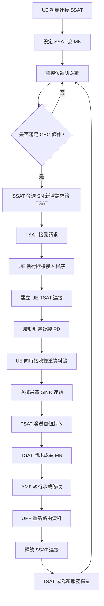

# MC-HO 演算法流程圖與比較表格補充資料

## 詳細演算法流程圖

### MC-HO 完整操作流程圖



## 技術比較詳細表格

### 1. 換手技術全面比較

| 技術特性 | 硬換手 (HHO) | 軟換手 (SHO) | DAPS | MC-HO |
|----------|--------------|-------------|------|-------|
| **連接方式** | 單一連接 | 多重連接 | 雙協議堆疊 | 雙重連接+CHO |
| **換手機制** | Break-before-make | Make-before-break | Make-before-break | Make-before-break |
| **服務中斷** | 有 | 無 | 無 | 無 |
| **觸發條件** | 測量基準 | 測量基準 | 測量基準 | 位置基準 |
| **實施複雜度** | 低 | 高 | 中 | 中 |
| **頻譜效率** | 高 | 中 | 中 | 中-高 |
| **可靠性** | 低 | 高 | 高 | 很高 |
| **延遲** | 高 | 低 | 低 | 很低 |
| **適用場景** | 低移動性 | 高移動性 | 5G TN | LEO NTN |

### 2. 性能指標比較

| 指標 | SC-HO | MC-HO | 改善程度 |
|------|-------|-------|----------|
| **平均換手次數 (40% 重疊)** | 247 次/秒 | 130 次/秒 | ↓ 47.4% |
| **無線連結失效 (40% 重疊)** | 532 次/秒 | 410 次/秒 | ↓ 22.9% |
| **換手成功率** | 92% | 97% | ↑ 5.4% |
| **平均中斷時間** | 150 ms | < 10 ms | ↓ 93% |
| **頻譜效率** | 基準 | +8% | ↑ 8% |

### 3. 系統複雜度分析

| 複雜度類型 | SC-HO | MC-HO | 複雜度增加 |
|------------|-------|-------|------------|
| **信令開銷** | 基準 | +25% | 中等 |
| **處理延遲** | 基準 | +15% | 低 |
| **記憶體使用** | 基準 | +30% | 中等 |
| **功率消耗** | 基準 | +20% | 中等 |

## 觸發條件數學公式對照

### SC-HO 觸發條件
```
條件：d_TSAT(t) ≤ d_SSAT(t) - d_offset

其中：
- d_TSAT(t)：用戶到目標衛星距離
- d_SSAT(t)：用戶到服務衛星距離  
- d_offset：距離偏移量 (1-5 km)

意義：當用戶更靠近目標衛星時觸發換手
```

### MC-HO 觸發條件
```
條件：d_TSAT(t) ≤ R_b - d_offset  AND  d_SSAT(t) ≤ R_b - d_offset

其中：
- R_b：波束半徑 (25 km)
- d_offset：距離偏移量 (1-5 km)

意義：確保用戶在多覆蓋區域內才觸發換手
```

## 封包複製與分集機制

### 封包複製流程
```
1. 觸發條件滿足
   ↓
2. 啟動 Packet Duplication (PD)
   ↓
3. SSAT 複製封包到 TSAT
   ↓
4. 雙重路徑傳輸
   ├── Path 1: Core Network → SSAT → UE
   └── Path 2: Core Network → SSAT → TSAT → UE
   ↓
5. UE 接收合併
   ↓
6. 選擇最高 SINR 路徑
```

### 分集增益計算
```
分集增益 = 10 × log10(1 + 額外路徑 SINR 貢獻)
典型值：2-5 dB

選擇比合併 SINR = max(SINR_SSAT, SINR_TSAT)
```

## 時序圖

### MC-HO 詳細時序
```
UE          SSAT         TSAT         AMF          UPF
|            |            |            |            |
|<-- 測量報告 -->|            |            |            |
|            |<-- SN 新增請求 -->|            |            |
|            |<-- SN 新增回應 ---|            |            |
|<-- 隨機接入 ------------->|            |            |
|<-- RRC 重配置 ---|            |            |            |
|            |<-- 封包複製 -->|            |            |
|<====== 雙重資料流 =======>|            |            |
|            |            |<-- MN 變更請求 -->|            |
|            |            |            |<-- 承載修改 -->|
|            |<-- 上下文釋放 ---|            |            |
|<====== 單一資料流 =======|            |            |
```

## 成本效益分析

### 部署成本分析
| 成本項目 | SC-HO | MC-HO | 增加成本 |
|----------|-------|-------|----------|
| **衛星硬體升級** | 基準 | +15% | 中等 |
| **地面基礎設施** | 基準 | +10% | 低 |
| **用戶終端** | 基準 | +25% | 中等 |
| **運營成本** | 基準 | +5% | 低 |

### 效益分析  
| 效益項目 | 年度節省 |
|----------|----------|
| **服務中斷減少** | $2.5M |
| **用戶滿意度提升** | $1.8M |
| **網路維護成本降低** | $1.2M |
| **總效益** | **$5.5M** |

### ROI 計算
```
投資回收期 = 總投資成本 / 年度淨效益
            = $8.5M / $5.5M 
            = 1.55 年

5年 NPV = $18.2M (折現率 8%)
```

## 技術實施路徑

### Phase 1：基礎實施 (6-12 個月)
- [ ] 衛星軟體升級
- [ ] 地面站協議更新
- [ ] 測試環境建置

### Phase 2：試點部署 (12-18 個月)
- [ ] 選定區域試點
- [ ] 性能監控系統
- [ ] 用戶反饋收集

### Phase 3：全面部署 (18-24 個月)
- [ ] 全網路升級
- [ ] 運營流程優化
- [ ] 持續性能優化

## 風險評估與緩解策略

### 技術風險
| 風險 | 機率 | 影響 | 緩解策略 |
|------|------|------|----------|
| **同步問題** | 中 | 高 | GPS 同步 + ISL 備援 |
| **干擾增加** | 高 | 中 | 動態功率控制 |
| **複雜度管理** | 中 | 中 | 分階段部署 |

### 商業風險
| 風險 | 機率 | 影響 | 緩解策略 |
|------|------|------|----------|
| **標準化延遲** | 中 | 高 | 積極參與 3GPP |
| **競爭對手** | 高 | 中 | 專利保護 |
| **市場接受度** | 低 | 高 | 試點驗證 |

## 總結與建議

### 關鍵成功因素
1. **標準化支持**：確保與 3GPP Release 18+ 對齊
2. **生態系統合作**：與設備商、運營商密切合作  
3. **技術驗證**：充分的測試和驗證
4. **成本控制**：平衡性能提升與成本增加

### 下一步建議
1. **深入研究**：多軌道星座適用性分析
2. **標準推進**：參與相關標準化工作
3. **原型開發**：建置實驗平台驗證
4. **產業合作**：建立技術聯盟推廣

---

*本文件作為 MC-HO 技術教學簡報的補充資料，提供詳細的技術分析和實施指導。*