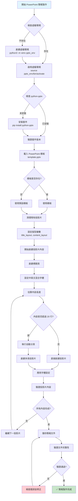
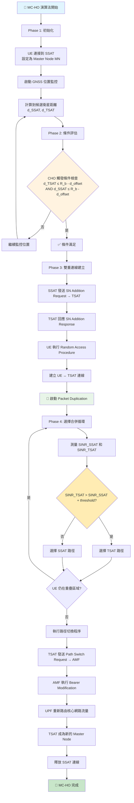
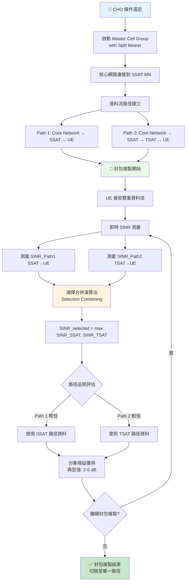
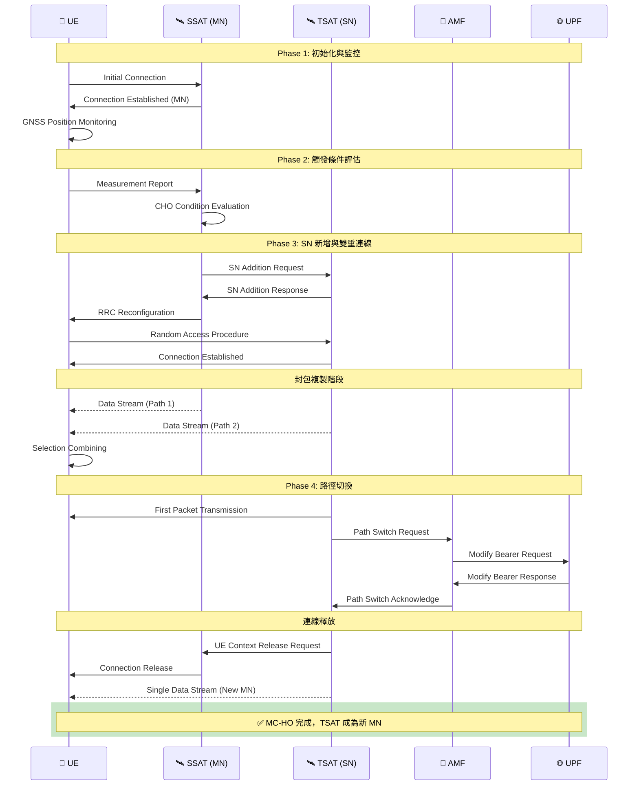
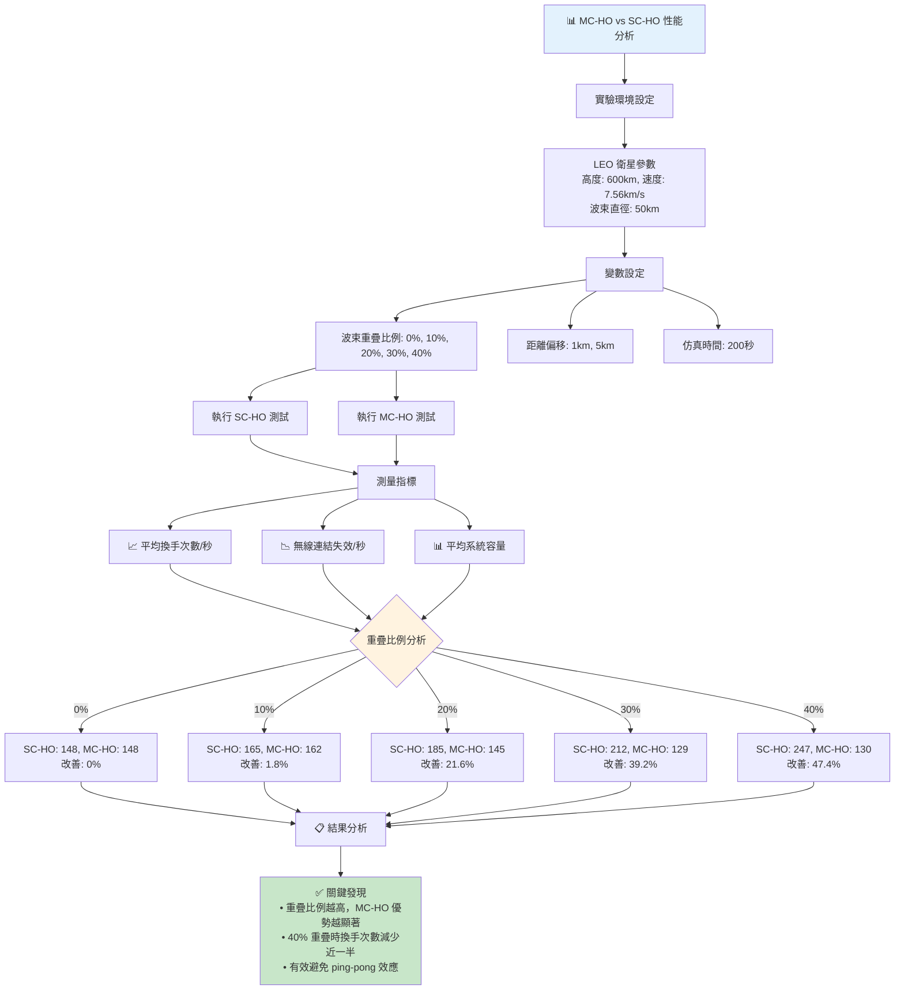

# PowerPoint 簡報製作流程圖 (Mermaid)
## 完整技術流程與 MC-HO 演算法視覺化

---

## 🔧 PowerPoint 簡報製作完整流程

### 1. 主流程圖


### 2. 中英文字體設定詳細流程
```mermaid
graph TD
    A[接收文字內容 text_frame] --> B[遍歷每個段落 paragraph]
    B --> C[取得段落文字 text]
    C --> D{文字是否為空?}
    D -->|是| E[跳過此段落]
    D -->|否| F[清除現有格式 paragraph.clear()]
    
    F --> G[初始化字符索引 i = 0]
    G --> H{i < 文字長度?}
    H -->|否| I[完成此段落處理]
    H -->|是| J[取得當前字符 char = text[i]]
    
    J --> K{使用正規表達式<br/>判斷字符類型}
    K -->|英文字符<br/>[a-zA-Z0-9\s\-_.,()[\]/+=<>&%]| L[收集連續英文字符]
    K -->|中文字符<br/>其他所有字符| M[收集連續中文字符]
    
    L --> N[創建 run 物件<br/>run = paragraph.add_run()]
    M --> N
    N --> O[設定文字內容 run.text]
    O --> P{字符類型?}
    P -->|英文| Q[設定英文字體<br/>Times New Roman]
    P -->|中文| R[設定中文字體<br/>標楷體]
    
    Q --> S[設定字體大小<br/>run.font.size = Pt(font_size)]
    R --> S
    S --> T[更新字符索引 i]
    T --> H
    
    I --> U{還有更多段落?}
    U -->|是| B
    U -->|否| V[✅ 字體設定完成]
    
    style A fill:#e3f2fd
    style V fill:#c8e6c9
    style K fill:#fff3e0
```

### 3. 投影片高度控制與分頁流程
```mermaid
graph TD
    A[接收投影片內容 content_text] --> B[分割內容為行陣列<br/>lines = content_text.split('\n')]
    B --> C[初始化計數器<br/>total_lines = 0]
    
    C --> D[遍歷每一行 line in lines]
    D --> E{行內容是否為空?}
    E -->|是| F[空行計數 +1<br/>total_lines += 1]
    E -->|否| G[計算字符數<br/>char_count = len(line)]
    
    G --> H[估算換行數<br/>estimated_lines = max(1, (char_count + 79) // 80)]
    H --> I[累加行數<br/>total_lines += estimated_lines]
    
    F --> J{還有更多行?}
    I --> J
    J -->|是| D
    J -->|否| K[完成行數統計]
    
    K --> L{總行數 > MAX_LINES (20)?}
    L -->|否| M[✅ 單頁顯示<br/>return [content_text]]
    L -->|是| N[執行分頁演算法]
    
    N --> O[初始化分頁變數<br/>parts = [], current_part = [], current_lines = 0]
    O --> P[重新遍歷每一行]
    P --> Q[計算行的佔用空間]
    Q --> R{current_lines + line_count > MAX_LINES?}
    R -->|是且 current_part 不為空| S[完成當前頁面<br/>parts.append(current_part)]
    R -->|否| T[添加到當前頁面<br/>current_part.append(line)]
    
    S --> U[開始新頁面<br/>current_part = [line]<br/>current_lines = line_count]
    T --> V[累加行數<br/>current_lines += line_count]
    U --> W{還有更多行?}
    V --> W
    W -->|是| P
    W -->|否| X[處理最後一頁<br/>if current_part: parts.append(current_part)]
    
    X --> Y[✅ 分頁完成<br/>return parts]
    
    style A fill:#e8f5e8
    style M fill:#c8e6c9
    style Y fill:#c8e6c9
    style R fill:#fff3e0
```

---

## 🛰️ MC-HO 演算法詳細流程圖

### 1. MC-HO 主要演算法流程


### 2. 封包複製機制詳細流程


### 3. 系統架構與訊息流程圖


### 4. 性能比較分析流程圖


---

## 🔗 如何使用這些 Mermaid 流程圖

### 1. 在 GitHub/GitLab 中顯示
直接將 mermaid 程式碼貼入 `.md` 檔案中，平台會自動渲染。

### 2. 在線上編輯器
- **Mermaid Live Editor**: https://mermaid.live/
- **Draw.io**: 支援 Mermaid 匯入
- **Notion**: 支援 Mermaid 語法

### 3. VS Code 擴充功能
安裝 "Mermaid Preview" 擴充功能，可即時預覽流程圖。

### 4. 匯出為圖片
```bash
# 使用 mermaid-cli
npm install -g @mermaid-js/mermaid-cli
mmdc -i flowchart.md -o flowchart.png
```

### 5. 嵌入 PowerPoint
將 Mermaid 渲染為 PNG 圖片後，可直接插入到 PowerPoint 簡報中。

---

*這些流程圖提供了完整的視覺化呈現，可用於技術文檔、簡報製作或系統設計討論。所有圖表都基於實際的 MC-HO 演算法實作與 PowerPoint 製作流程。*