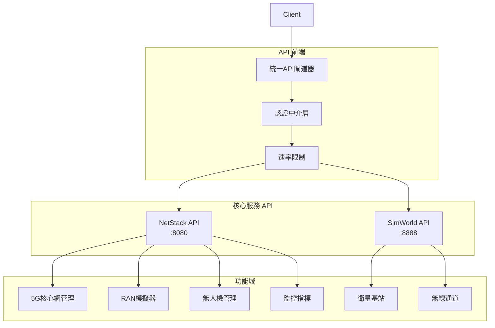

# NTN Stack API 參考文檔

## 📖 文檔資訊
- **版本**: v1.0.0
- **最後更新**: 2024-12-19
- **適用對象**: 開發人員、系統整合人員、第三方開發者
- **API版本**: v1

## 🎯 概述

NTN Stack 提供完整的RESTful API接口，支援5G核心網管理、衛星基站控制、UAV管理和無線通道模擬等功能。API採用OpenAPI 3.0規範，提供統一的認證機制和錯誤處理。

### 🏗️ API 架構



## 🌐 服務端點總覽

### 主要服務

| 服務 | 基礎URL | 文檔 | 狀態 |
|------|--------|------|------|
| **統一API** | `http://localhost:8080/api/v1` | [OpenAPI](http://localhost:8080/docs) | 🟢 |
| **NetStack** | `http://localhost:8080` | NetStack API | 🟢 |
| **SimWorld** | `http://localhost:8888` | SimWorld API | 🟢 |
| **監控系統** | `http://localhost:9090` | Metrics API | 🟢 |

### 快速訪問

```bash
# 服務發現 - 獲取所有可用API
curl http://localhost:8080/api/v1/system/discovery

# 健康檢查 - 檢查系統狀態
curl http://localhost:8080/health

# API文檔 - 互動式文檔
open http://localhost:8080/docs
```

## 📚 API 分類

### 🔧 核心管理 API

#### NetStack 核心網 API
- **5G核心網管理**: AMF、SMF、UPF、UDM控制
- **用戶設備管理**: UE註冊、會話管理、切片切換
- **網路切片**: eMBB、uRLLC、mMTC切片配置
- **RAN模擬器**: UERANSIM配置和控制

#### SimWorld 模擬 API  
- **衛星基站管理**: 衛星軌道計算、位置預測
- **無線通道模擬**: Sionna RT模擬引擎
- **環境建模**: 3D場景和傳播模型

### 🚁 載具管理 API

#### UAV 管理 API
- **無人機控制**: 航跡規劃、任務執行
- **遙測數據**: 位置、狀態、連線品質
- **Mesh網路**: UAV間直接通信

#### 載具整合 API
- **地面載具**: 車載基站、移動平台
- **多載具協同**: 統一控制和協調

### 📡 通信管理 API

#### 網路切片 API
- **切片配置**: SST/SD參數設定
- **QoS管理**: 服務品質保證
- **動態切換**: 即時切片選擇

#### 連線品質 API
- **信號監控**: RSRP、SINR、延遲
- **干擾檢測**: 自動干擾識別和緩解
- **效能優化**: 自動調節和最佳化

### 📊 監控與分析 API

#### 系統監控 API
- **Prometheus指標**: 標準化監控指標
- **健康檢查**: 組件狀態監控
- **效能分析**: 系統效能評估

#### 事件與告警 API
- **事件流**: 即時事件推送
- **告警管理**: 自訂告警規則
- **通知機制**: 多種通知方式

## 🔐 認證與授權

### API金鑰認證

```bash
# 在請求標頭中包含API金鑰
curl -H "X-API-Key: your-api-key" \
     http://localhost:8080/api/v1/system/info
```

### JWT Bearer Token

```bash
# 獲取訪問令牌
TOKEN=$(curl -X POST http://localhost:8080/auth/token \
  -H "Content-Type: application/json" \
  -d '{"username":"admin","password":"secret"}' | jq -r .access_token)

# 使用Bearer Token訪問API
curl -H "Authorization: Bearer $TOKEN" \
     http://localhost:8080/api/v1/ue
```

### 角色權限

| 角色 | 權限範圍 | API訪問等級 |
|------|---------|-------------|
| **管理員** | 完整系統控制 | 讀寫所有API |
| **操作員** | 日常操作管理 | 監控和基本控制 |
| **觀察者** | 僅監控查看 | 僅讀取API |
| **服務帳戶** | 自動化整合 | 特定服務API |

## 📋 通用請求格式

### 標準HTTP標頭

```http
Content-Type: application/json
Accept: application/json
Authorization: Bearer <token>
X-API-Key: <api-key>
X-Request-ID: <unique-id>
```

### 請求參數規範

```json
{
  "timestamp": "2024-12-19T10:30:00Z",
  "request_id": "req-12345",
  "data": {
    // 具體請求數據
  },
  "metadata": {
    "source": "dashboard",
    "user_id": "user-123"
  }
}
```

### 標準回應格式

```json
{
  "success": true,
  "data": {
    // 回應數據
  },
  "message": "操作成功",
  "timestamp": "2024-12-19T10:30:00Z",
  "request_id": "req-12345"
}
```

## ⚠️ 錯誤處理

### HTTP狀態碼

| 狀態碼 | 含義 | 處理建議 |
|--------|------|----------|
| `200` | 成功 | 正常處理 |
| `201` | 已創建 | 資源創建成功 |
| `400` | 錯誤請求 | 檢查請求參數 |
| `401` | 未授權 | 檢查認證資訊 |
| `403` | 禁止訪問 | 檢查權限設定 |
| `404` | 未找到 | 檢查資源路徑 |
| `422` | 參數錯誤 | 檢查數據格式 |
| `429` | 請求過多 | 實施速率限制 |
| `500` | 伺服器錯誤 | 聯繫技術支援 |

### 錯誤回應格式

```json
{
  "success": false,
  "error": {
    "code": "INVALID_PARAMETER",
    "message": "無效的UE ID格式",
    "details": {
      "field": "ue_id",
      "expected": "10位數字",
      "received": "abc123"
    }
  },
  "timestamp": "2024-12-19T10:30:00Z",
  "request_id": "req-12345"
}
```

## 🚀 快速開始範例

### 基本系統查詢

```python
import requests

# 基礎設定
BASE_URL = "http://localhost:8080/api/v1"
API_KEY = "your-api-key"
headers = {"X-API-Key": API_KEY}

# 獲取系統狀態
response = requests.get(f"{BASE_URL}/system/status", headers=headers)
print(f"系統狀態: {response.json()}")

# 列出所有UE
ue_list = requests.get(f"{BASE_URL}/ue", headers=headers)
print(f"用戶設備: {ue_list.json()}")
```

### UAV操作範例

```python
# 創建新UAV
uav_data = {
    "uav_id": "UAV-001",
    "initial_position": {"lat": 25.0, "lon": 121.0, "alt": 100},
    "mission_type": "surveillance"
}
response = requests.post(f"{BASE_URL}/uav", json=uav_data, headers=headers)

# 啟動UAV任務
mission = requests.post(
    f"{BASE_URL}/uav/UAV-001/mission/start", 
    headers=headers
)
```

### 網路切片切換

```python
# UE切片切換
slice_switch = {
    "ue_id": "123456789012345",
    "target_slice": {
        "sst": 2,
        "sd": "0x222222"
    },
    "reason": "emergency_communication"
}
response = requests.post(
    f"{BASE_URL}/ue/123456789012345/slice-switch", 
    json=slice_switch, 
    headers=headers
)
```

## 📊 API使用監控

### 速率限制

| API類別 | 限制 | 時間窗口 |
|---------|------|----------|
| **認證** | 10次/分鐘 | 每IP |
| **查詢操作** | 100次/分鐘 | 每API金鑰 |
| **控制操作** | 50次/分鐘 | 每API金鑰 |
| **檔案上傳** | 5次/分鐘 | 每API金鑰 |

### 使用統計

```bash
# 查看API使用統計
curl http://localhost:8080/api/v1/system/usage-stats \
  -H "Authorization: Bearer $TOKEN"
```

## 🔄 WebSocket 即時API

### 連線建立

```javascript
const ws = new WebSocket('ws://localhost:8080/api/v1/ws/status');

ws.onmessage = function(event) {
    const update = JSON.parse(event.data);
    console.log('即時更新:', update);
};
```

### 訂閱事件

```json
{
  "action": "subscribe",
  "topics": [
    "uav.telemetry",
    "network.status", 
    "system.alerts"
  ]
}
```

## 🧪 測試與驗證

### API測試工具

```bash
# 使用提供的測試腳本
python tests/api_integration_test.py

# 使用Postman集合
# 導入 docs/postman/NTN-Stack-APIs.json
```

### 模擬數據產生

```bash
# 啟動數據模擬器
python tools/api_simulator.py --endpoints all --duration 3600
```

## 📞 API支援

### 技術支援
- **API文檔**: http://localhost:8080/docs
- **互動測試**: http://localhost:8080/redoc  