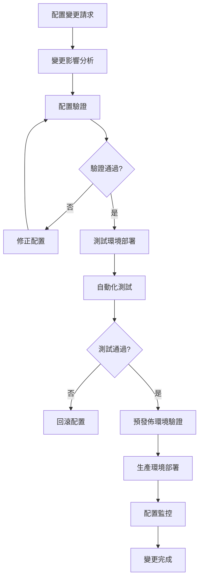

# 配置管理標準化指南

**版本**: 2.0.0  
**建立日期**: 2025-08-03  
**適用範圍**: LEO 衛星換手系統全部組件  
**負責團隊**: DevOps + 系統架構師  

## 🎯 概述

本指南定義了 LEO 衛星換手系統的配置管理標準，確保多環境部署的一致性、可追蹤性和安全性。基於 Phase 1 建立的統一配置系統，提供完整的配置生命週期管理方案。

## 🏗️ 配置架構

### 核心配置層級

```
配置管理層級架構：
├── 全域配置 (Global Config)
│   ├── 系統級配置 (System Level)
│   ├── 服務級配置 (Service Level)  
│   └── 組件級配置 (Component Level)
├── 環境配置 (Environment Config)
│   ├── 開發環境 (Development)
│   ├── 測試環境 (Testing)
│   ├── 預發佈環境 (Staging)
│   └── 生產環境 (Production)
└── 運行時配置 (Runtime Config)
    ├── 動態參數調整
    ├── 負載均衡配置
    └── 緊急熔斷配置
```

### 統一配置系統整合

```python
# Phase 1 實施的統一配置系統架構
netstack/
├── config/
│   ├── satellite_config.py          # 核心衛星配置類別
│   ├── environment_config.py        # 環境特定配置
│   ├── security_config.py          # 安全相關配置
│   └── validation_config.py        # 配置驗證規則
├── config_management/
│   ├── config_loader.py            # 配置載入器
│   ├── config_validator.py         # 配置驗證器
│   ├── config_migrator.py          # 配置遷移工具
│   └── config_monitor.py           # 配置變更監控
└── environments/
    ├── development.yml              # 開發環境配置
    ├── testing.yml                 # 測試環境配置
    ├── staging.yml                 # 預發佈配置
    └── production.yml               # 生產環境配置
```

## 🔧 配置組件詳解

### 1. 核心衛星配置 (satellite_config.py)

```python
@dataclass
class SatelliteConfig:
    """統一衛星配置類別 - Phase 1 實施完成"""
    
    # === SIB19 3GPP NTN 標準合規配置 ===
    MAX_CANDIDATE_SATELLITES: int = 8
    
    # === 分階段處理配置 ===
    PREPROCESS_SATELLITES: Dict[str, int] = field(default_factory=lambda: {
        "starlink": 40,    # 智能篩選後處理數量
        "oneweb": 30,      # OneWeb 極地軌道優化
        "kuiper": 35,      # Amazon Kuiper 預留
        "all": 50          # 混合星座上限
    })
    
    BATCH_COMPUTE_MAX_SATELLITES: int = 50
    ALGORITHM_TEST_MAX_SATELLITES: int = 10
    
    # === ITU-R P.618 合規仰角門檻 ===
    elevation_thresholds: ElevationThresholds = field(
        default_factory=lambda: ElevationThresholds(
            trigger_threshold_deg=15.0,     # 預備觸發門檻
            execution_threshold_deg=10.0,   # 執行門檻 
            critical_threshold_deg=5.0      # 臨界門檻
        )
    )
    
    # === 智能篩選配置 ===
    intelligent_selection: IntelligentSelectionConfig = field(
        default_factory=lambda: IntelligentSelectionConfig(
            enabled=True,
            geographic_filter_enabled=True,
            target_location={"lat": 24.9441667, "lon": 121.3713889}
        )
    )
    
    # === SGP4 計算精度配置 ===
    computation_precision: ComputationPrecision = field(
        default_factory=lambda: ComputationPrecision(
            sgp4_enabled=True,
            fallback_enabled=True,
            precision_level="high",
            validation_enabled=True
        )
    )
```

### 2. 環境特定配置 (environment_config.py)

```python
@dataclass  
class EnvironmentConfig:
    """環境特定配置管理"""
    
    environment: str                    # development/testing/staging/production
    debug_enabled: bool                 # 除錯模式
    logging_level: str                  # 日誌級別
    performance_monitoring: bool        # 性能監控
    security_level: str                # 安全級別
    
    # 數據庫配置
    database_config: DatabaseConfig
    
    # API 配置
    api_config: APIConfig
    
    # 容器配置
    container_config: ContainerConfig
    
    def validate_environment(self) -> bool:
        """驗證環境配置的一致性"""
        if self.environment == "production":
            assert not self.debug_enabled, "生產環境不能啟用除錯模式"
            assert self.security_level == "high", "生產環境必須使用高安全級別"
        
        return True
```

### 3. 配置驗證器 (config_validator.py)

```python
class ConfigurationValidator:
    """配置驗證器 - 確保所有配置符合標準"""
    
    def __init__(self):
        self.validation_rules = self._load_validation_rules()
        self.compliance_checkers = {
            'sib19': self._check_sib19_compliance,
            'itu_r': self._check_itu_r_compliance,
            'security': self._check_security_compliance
        }
    
    def validate_full_configuration(self, config: SatelliteConfig) -> ValidationResult:
        """完整配置驗證"""
        results = ValidationResult()
        
        # SIB19 3GPP NTN 標準合規檢查
        sib19_result = self._check_sib19_compliance(config)
        results.add_check("SIB19_COMPLIANCE", sib19_result)
        
        # ITU-R P.618 仰角門檻合規檢查
        itu_result = self._check_itu_r_compliance(config.elevation_thresholds)
        results.add_check("ITU_R_COMPLIANCE", itu_result)
        
        # 衛星數量邏輯檢查
        count_result = self._validate_satellite_counts(config)
        results.add_check("SATELLITE_COUNTS", count_result)
        
        # 智能篩選配置檢查
        filter_result = self._validate_intelligent_selection(config.intelligent_selection)
        results.add_check("INTELLIGENT_SELECTION", filter_result)
        
        return results
    
    def _check_sib19_compliance(self, config: SatelliteConfig) -> bool:
        """檢查 SIB19 3GPP NTN 標準合規性"""
        # 候選衛星數量不得超過 8 顆
        if config.MAX_CANDIDATE_SATELLITES > 8:
            raise SIB19ComplianceError("候選衛星數量超過 SIB19 規範")
        
        # 仰角門檻必須在合理範圍內
        thresholds = config.elevation_thresholds
        if not (0 <= thresholds.critical_threshold_deg <= 90):
            raise SIB19ComplianceError("仰角門檻超出合理範圍")
        
        return True
    
    def _check_itu_r_compliance(self, thresholds: ElevationThresholds) -> bool:
        """檢查 ITU-R P.618 建議書合規性"""
        # 確保分層門檻邏輯正確
        if not (thresholds.critical_threshold_deg < 
                thresholds.execution_threshold_deg < 
                thresholds.trigger_threshold_deg):
            raise ITURComplianceError("仰角門檻順序不符合 ITU-R P.618 建議")
        
        # 檢查最低仰角要求 (一般不低於 5 度)
        if thresholds.critical_threshold_deg < 5.0:
            logger.warning("臨界仰角低於 ITU-R P.618 建議值 (5度)")
        
        return True
```

## 🔄 配置生命週期管理

### 配置變更流程



### 配置版本控制

```bash
# Git-based 配置版本控制結構
config-repository/
├── environments/
│   ├── development/
│   │   ├── satellite_config.yml
│   │   ├── environment_config.yml
│   │   └── security_config.yml
│   ├── testing/
│   ├── staging/
│   └── production/
├── migrations/
│   ├── v1.0_to_v1.1_migration.py
│   ├── v1.1_to_v2.0_migration.py
│   └── migration_utils.py
├── validation/
│   ├── config_schemas.json
│   ├── compliance_rules.yml
│   └── validation_tests.py
└── deployment/
    ├── deploy_config.sh
    ├── rollback_config.sh
    └── config_diff.py
```

### 配置遷移工具

```python
class ConfigurationMigrator:
    """配置遷移工具 - 支援配置版本升級"""
    
    def __init__(self):
        self.migration_registry = self._load_migrations()
        self.backup_manager = ConfigBackupManager()
    
    def migrate_configuration(self, from_version: str, to_version: str) -> bool:
        """執行配置遷移"""
        try:
            # 創建配置備份
            backup_id = self.backup_manager.create_backup(from_version)
            
            # 獲取遷移步驟
            migration_steps = self._get_migration_path(from_version, to_version)
            
            # 逐步執行遷移
            for step in migration_steps:
                logger.info(f"執行遷移步驟: {step}")
                success = self._execute_migration_step(step)
                if not success:
                    # 遷移失敗，回滾
                    self.backup_manager.restore_backup(backup_id)
                    return False
            
            # 驗證遷移後的配置
            if self._validate_migrated_config(to_version):
                logger.info(f"配置遷移成功: {from_version} -> {to_version}")
                return True
            else:
                # 驗證失敗，回滾
                self.backup_manager.restore_backup(backup_id)
                return False
                
        except Exception as e:
            logger.error(f"配置遷移失敗: {e}")
            return False
```

## 🔒 安全配置管理

### 敏感配置處理

```python
class SecureConfigManager:
    """安全配置管理器"""
    
    def __init__(self):
        self.encryption_key = self._load_encryption_key()
        self.sensitive_fields = [
            'database_password',
            'api_keys',
            'tls_certificates',
            'satellite_access_tokens'
        ]
    
    def encrypt_sensitive_config(self, config: dict) -> dict:
        """加密敏感配置字段"""
        encrypted_config = config.copy()
        
        for field in self.sensitive_fields:
            if field in config:
                encrypted_value = self._encrypt_value(config[field])
                encrypted_config[field] = encrypted_value
        
        return encrypted_config
    
    def decrypt_config_for_runtime(self, encrypted_config: dict) -> dict:
        """為運行時解密配置"""
        decrypted_config = encrypted_config.copy()
        
        for field in self.sensitive_fields:
            if field in encrypted_config:
                decrypted_value = self._decrypt_value(encrypted_config[field])
                decrypted_config[field] = decrypted_value
        
        return decrypted_config
```

### 配置存取控制

```yaml
# 配置存取控制規則 (access_control.yml)
access_control:
  roles:
    admin:
      permissions:
        - read_all_config
        - write_all_config
        - deploy_production
        - manage_security_config
    
    developer:
      permissions:
        - read_dev_config
        - write_dev_config
        - read_test_config
        - write_test_config
    
    operator:
      permissions:
        - read_production_config
        - deploy_staging
        - monitor_config_changes
    
    viewer:
      permissions:
        - read_non_sensitive_config

  sensitive_fields:
    - database_credentials
    - api_keys
    - tls_certificates
    - satellite_tokens
```

## 📊 配置監控與告警

### 配置變更監控

```python
class ConfigurationMonitor:
    """配置變更監控系統"""
    
    def __init__(self):
        self.alert_manager = AlertManager()
        self.audit_logger = AuditLogger()
        self.health_checker = ConfigHealthChecker()
    
    def monitor_configuration_changes(self):
        """監控配置變更"""
        while True:
            try:
                # 檢查配置文件變更
                changes = self._detect_config_changes()
                
                if changes:
                    # 記錄變更
                    self.audit_logger.log_changes(changes)
                    
                    # 驗證變更後的配置
                    validation_result = self._validate_changed_config(changes)
                    
                    if not validation_result.is_valid:
                        # 配置驗證失敗，發送告警
                        self.alert_manager.send_alert(
                            level="CRITICAL",
                            message=f"配置驗證失敗: {validation_result.errors}",
                            config_changes=changes
                        )
                
                # 檢查配置健康狀態
                health_status = self.health_checker.check_config_health()
                if not health_status.is_healthy:
                    self.alert_manager.send_alert(
                        level="WARNING", 
                        message=f"配置健康檢查異常: {health_status.issues}"
                    )
                
                time.sleep(30)  # 30秒檢查間隔
                
            except Exception as e:
                logger.error(f"配置監控異常: {e}")
                time.sleep(60)  # 異常時延長檢查間隔
```

### 配置健康檢查

```python
class ConfigHealthChecker:
    """配置健康檢查器"""
    
    def check_config_health(self) -> HealthStatus:
        """執行配置健康檢查"""
        health_status = HealthStatus()
        
        # 檢查配置文件完整性
        integrity_check = self._check_config_file_integrity()
        health_status.add_check("config_integrity", integrity_check)
        
        # 檢查配置值合理性
        value_check = self._check_config_value_sanity()
        health_status.add_check("config_values", value_check)
        
        # 檢查環境間配置一致性
        consistency_check = self._check_cross_env_consistency()
        health_status.add_check("config_consistency", consistency_check)
        
        # 檢查配置安全性
        security_check = self._check_config_security()
        health_status.add_check("config_security", security_check)
        
        return health_status
```

## 🚀 部署與運營

### 自動化配置部署

```bash
#!/bin/bash
# deploy_config.sh - 自動化配置部署腳本

set -e

ENVIRONMENT=$1
CONFIG_VERSION=$2

if [[ -z "$ENVIRONMENT" || -z "$CONFIG_VERSION" ]]; then
    echo "使用方法: $0 <environment> <config_version>"
    exit 1
fi

echo "🚀 開始部署配置 $CONFIG_VERSION 到 $ENVIRONMENT 環境"

# 1. 驗證配置版本
echo "📋 驗證配置版本..."
python -m config_management.config_validator --version $CONFIG_VERSION --env $ENVIRONMENT

# 2. 創建配置備份
echo "💾 創建配置備份..."
BACKUP_ID=$(python -m config_management.backup_manager create --env $ENVIRONMENT)
echo "備份 ID: $BACKUP_ID"

# 3. 部署新配置
echo "📦 部署新配置..."
python -m config_management.config_deployer deploy \
    --version $CONFIG_VERSION \
    --env $ENVIRONMENT \
    --backup-id $BACKUP_ID

# 4. 重啟相關服務
echo "🔄 重啟服務..."
if [[ "$ENVIRONMENT" == "production" ]]; then
    # 生產環境滾動重啟
    make production-rolling-restart
else
    # 非生產環境直接重啟
    make $ENVIRONMENT-restart
fi

# 5. 健康檢查
echo "🏥 執行健康檢查..."
python -m config_management.health_checker --env $ENVIRONMENT --timeout 300

echo "✅ 配置部署完成"
```

### 配置回滾機制

```python
class ConfigurationRollback:
    """配置回滾管理"""
    
    def __init__(self):
        self.backup_manager = ConfigBackupManager()
        self.deployment_tracker = DeploymentTracker()
    
    def rollback_to_previous_version(self, environment: str) -> bool:
        """回滾到前一個版本"""
        try:
            # 獲取當前部署記錄
            current_deployment = self.deployment_tracker.get_current_deployment(environment)
            
            # 獲取前一個版本
            previous_deployment = self.deployment_tracker.get_previous_deployment(
                environment, current_deployment.id
            )
            
            if not previous_deployment:
                logger.error("找不到可回滾的前一個版本")
                return False
            
            # 執行回滾
            logger.info(f"回滾 {environment} 配置: {current_deployment.version} -> {previous_deployment.version}")
            
            success = self._execute_rollback(environment, previous_deployment)
            
            if success:
                # 更新部署記錄
                self.deployment_tracker.record_rollback(
                    environment, current_deployment, previous_deployment
                )
                logger.info("配置回滾成功")
            
            return success
            
        except Exception as e:
            logger.error(f"配置回滾失敗: {e}")
            return False
```

## 📋 最佳實踐

### 配置管理原則

1. **單一真實來源 (Single Source of Truth)**
   - 所有配置統一存儲在版本控制系統中
   - 避免配置分散在多個位置
   - 使用統一的配置格式和結構

2. **環境隔離 (Environment Isolation)**
   - 不同環境使用獨立的配置分支
   - 敏感配置加密存儲
   - 配置變更需要經過審批流程

3. **自動化驗證 (Automated Validation)**
   - 配置變更前自動驗證合規性
   - 部署前執行完整性檢查
   - 運行時持續監控配置健康狀態

4. **可追蹤性 (Traceability)**
   - 記錄所有配置變更歷史
   - 支援配置變更的影響分析
   - 提供配置回滾能力

### 操作規範

```yaml
# 配置變更操作規範
configuration_change_process:
  
  development:
    - 開發者可直接修改配置
    - 自動驗證配置格式
    - 變更即時生效
  
  testing:
    - 需要 code review 通過
    - 自動化測試驗證
    - 支援快速回滾
  
  staging:
    - 需要技術 lead 審批
    - 完整的整合測試
    - 性能影響評估
  
  production:
    - 需要 manager 級別審批
    - 强制配置變更窗口
    - 詳細的回滾計畫
    - 24小時監控期
```

## 🔍 故障排除

### 常見配置問題

1. **配置驗證失敗**
   ```bash
   # 檢查配置格式
   python -m config_management.config_validator validate --config satellite_config.py
   
   # 檢查合規性
   python -m config_management.compliance_checker check --standard sib19
   ```

2. **跨容器配置存取失敗**
   ```python
   # 檢查配置載入狀態
   from config_management.config_loader import get_config_status
   status = get_config_status()
   print(f"配置可用性: {status.config_available}")
   print(f"錯誤信息: {status.error_message}")
   ```

3. **配置同步問題**
   ```bash
   # 強制同步配置
   python -m config_management.sync_manager force_sync --env production
   
   # 檢查配置一致性
   python -m config_management.consistency_checker check_all_envs
   ```

---

## 📞 支援與聯絡

**配置管理團隊**:
- **技術負責人**: DevOps Lead
- **緊急聯絡**: config-emergency@company.com
- **文檔更新**: 每月第一週週三
- **例行檢查**: 每週五 16:00

**相關文檔**:
- [技術規範](./tech.md)
- [故障排除指南](./troubleshooting-guide.md)  
- [開發者上手指南](./developer-onboarding.md)
- [衛星數據架構](./satellite_data_architecture.md)
