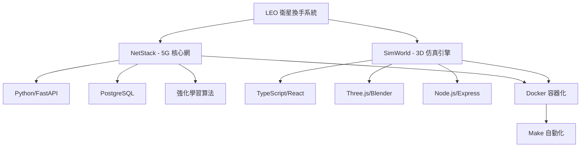
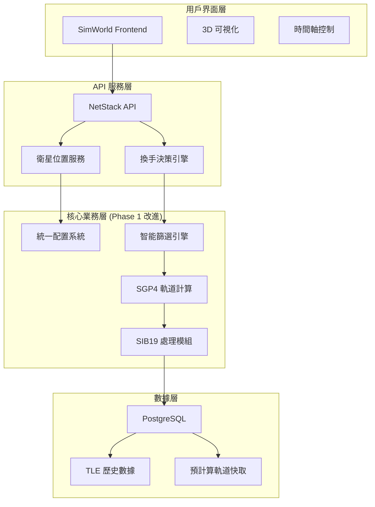
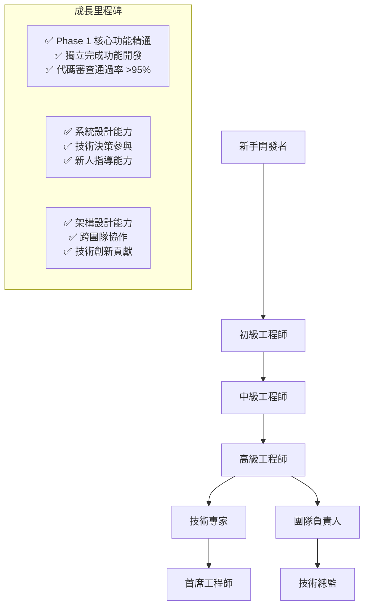

# LEO 衛星換手系統開發者上手指南

**版本**: 2.0.0  
**建立日期**: 2025-08-03 (Phase 2)  
**適用對象**: 新加入的開發者、實習生、研究人員  
**維護團隊**: 開發團隊 + 技術架構師  

## 🎯 歡迎加入 LEO 衛星換手系統開發團隊！

本指南將幫助您快速了解系統架構、開發環境設置、核心技術概念，並開始您的第一個開發任務。我們致力於構建世界級的 LEO 衛星換手研究平台，您的加入將為這個目標增添重要力量。

## 📚 必讀背景知識

### 🛰️ 項目背景

**LEO 衛星換手系統**是一個基於強化學習的衛星通訊換手優化平台，專注於解決低軌道衛星星座（如 Starlink、OneWeb）的智能換手決策問題。

**核心價值**:
- 🎓 **學術研究**: 支援碩博士論文研究，具備國際發表水準
- 🏭 **工程實用**: 符合 3GPP NTN、ITU-R 國際標準，可商業化部署
- 🚀 **技術創新**: Phase 1 已實現智能篩選、統一配置等創新功能
- 🌍 **社會影響**: 推動 6G 衛星通訊技術發展

### 🔧 技術棧概覽



**主要技術組件**:
- **後端**: Python 3.11, FastAPI, SQLAlchemy, PostgreSQL
- **前端**: TypeScript, React, Three.js, Vite
- **AI/ML**: PyTorch, Stable-Baselines3, Gymnasium
- **衛星計算**: SGP4, 軌道力學, 信號處理
- **容器化**: Docker, Docker Compose
- **標準合規**: 3GPP NTN, ITU-R P.618, SIB19

## 🚀 快速開始 (30 分鐘上手)

### 第一步：環境準備

```bash
# 1. 檢查系統要求
echo "檢查系統環境..."
docker --version    # 需要 20.10+
python3 --version   # 需要 3.11+
node --version      # 需要 18+
make --version      # 需要 4.0+

# 2. 克隆項目 (如果尚未完成)
cd /home/sat/
ls -la ntn-stack/   # 確認項目存在

# 3. 進入項目目錄
cd /home/sat/ntn-stack

# 4. 檢查項目結構
ls -la
```

### 第二步：系統啟動

```bash
# 1. 啟動完整系統
make up

# 2. 等待服務啟動（約 2-3 分鐘）
watch make status   # Ctrl+C 退出

# 3. 驗證系統健康
make health-check

# 4. 訪問服務
echo "NetStack API: http://localhost:8080"
echo "SimWorld Frontend: http://localhost:5173"
echo "PostgreSQL: localhost:5432 (rl_user/rl_research)"
```

### 第三步：運行第一個測試

```bash
# 1. 測試統一配置系統 (Phase 1 核心功能)
docker exec netstack-api python -c "
from config.satellite_config import SATELLITE_CONFIG
print(f'✅ 統一配置載入成功')
print(f'最大候選衛星數: {SATELLITE_CONFIG.MAX_CANDIDATE_SATELLITES}')
print(f'智能篩選啟用: {SATELLITE_CONFIG.intelligent_selection.enabled}')
print(f'SIB19 合規: MAX_CANDIDATE_SATELLITES <= 8')
"

# 2. 測試智能篩選系統
docker exec netstack-api python -c "
from netstack.data.historical_tle_data import get_historical_tle_data
starlink_data = get_historical_tle_data('starlink')
print(f'✅ Starlink 衛星數據載入: {len(starlink_data)} 顆')

# 模擬智能篩選
filtered_count = min(40, len(starlink_data))  # Phase 1 篩選配置
print(f'智能篩選後: {filtered_count} 顆 (壓縮率: {(1-filtered_count/len(starlink_data))*100:.1f}%)')
"

# 3. 測試 API 端點
curl -s http://localhost:8080/health | jq
curl -s http://localhost:8080/api/v1/satellites/constellations/info | jq
```

### 第四步：理解核心概念

```python
# 在 netstack-api 容器中運行此腳本
docker exec -it netstack-api python3

# Phase 1 核心概念演示
from config.satellite_config import SATELLITE_CONFIG
from netstack.data.historical_tle_data import get_historical_tle_data

# 1. 統一配置系統
print("=== 統一配置系統 (Phase 1) ===")
print(f"SIB19 合規設定: {SATELLITE_CONFIG.MAX_CANDIDATE_SATELLITES} 顆候選衛星")
print(f"分階段處理配置: {SATELLITE_CONFIG.PREPROCESS_SATELLITES}")
print(f"智能篩選啟用: {SATELLITE_CONFIG.intelligent_selection.enabled}")

# 2. 智能篩選效果展示
print("\n=== 智能篩選系統 (Phase 1) ===")
starlink_raw = get_historical_tle_data("starlink")
oneweb_raw = get_historical_tle_data("oneweb")

print(f"原始 Starlink 數據: {len(starlink_raw)} 顆")
print(f"篩選後 Starlink: {SATELLITE_CONFIG.PREPROCESS_SATELLITES['starlink']} 顆")
print(f"壓縮率: {(1 - SATELLITE_CONFIG.PREPROCESS_SATELLITES['starlink']/len(starlink_raw))*100:.1f}%")

print(f"原始 OneWeb 數據: {len(oneweb_raw)} 顆")  
print(f"篩選後 OneWeb: {SATELLITE_CONFIG.PREPROCESS_SATELLITES['oneweb']} 顆")
print(f"壓縮率: {(1 - SATELLITE_CONFIG.PREPROCESS_SATELLITES['oneweb']/len(oneweb_raw))*100:.1f}%")

# 3. ITU-R 合規仰角門檻
print("\n=== ITU-R P.618 仰角門檻 (Phase 1) ===")
thresholds = SATELLITE_CONFIG.elevation_thresholds
print(f"觸發門檻: {thresholds.trigger_threshold_deg}°")
print(f"執行門檻: {thresholds.execution_threshold_deg}°")
print(f"臨界門檻: {thresholds.critical_threshold_deg}°")
print("分層門檻設計符合 ITU-R P.618 建議書")

exit()
```

**🎉 恭喜！您已經成功完成快速上手，系統正在正常運行。**

## 🏗️ 系統架構深度理解

### 整體架構圖



### Phase 1 改進重點

**1. 統一配置系統**
```python
# 位置: /netstack/config/satellite_config.py
@dataclass
class SatelliteConfig:
    MAX_CANDIDATE_SATELLITES: int = 8  # SIB19 合規
    PREPROCESS_SATELLITES: Dict[str, int] = {
        "starlink": 40,    # 智能篩選後數量
        "oneweb": 30       # OneWeb 極地軌道優化
    }
    elevation_thresholds: ElevationThresholds = ...
    intelligent_selection: IntelligentSelectionConfig = ...
```

**2. 智能篩選系統**
```python
# 位置: /netstack/services/intelligent_satellite_filter.py
class IntelligentSatelliteFilter:
    def geographic_relevance_filter(self, satellites):
        """地理相關性篩選 - 台灣地區優化"""
        # 軌道傾角匹配 (45°-65° 最佳)
        # RAAN 經度對應 (121.37°E ±45°)
        # 極地軌道特殊處理
        
    def handover_suitability_scoring(self, satellites):
        """換手適用性評分 - 多維度評分系統"""
        # 軌道傾角評分 (25%)
        # 軌道高度評分 (20%)
        # 軌道形狀評分 (15%)
        # 經過頻率評分 (20%)
        # 星座偏好評分 (20%)
```

### 關鍵目錄結構

```
ntn-stack/
├── netstack/                         # 5G 核心網 (Python)
│   ├── config/                       # 統一配置系統 (Phase 1)
│   │   ├── satellite_config.py       # ⭐ 核心配置類別
│   │   └── validation_config.py      # 配置驗證規則
│   ├── netstack_api/
│   │   ├── services/
│   │   │   ├── sib19_unified_platform.py    # SIB19 處理
│   │   │   ├── intelligent_satellite_filter.py  # ⭐ 智能篩選
│   │   │   └── sgp4_calculator.py           # SGP4 軌道計算
│   │   └── algorithm_ecosystem/         # 強化學習模組
│   ├── data/
│   │   └── historical_tle_data.py      # 歷史 TLE 數據
│   └── scripts/
│       └── batch_precompute_taiwan.py  # 台灣地區預計算
│
├── simworld/                         # 3D 仿真引擎 (TypeScript)
│   ├── frontend/                     # React + Three.js
│   │   ├── src/components/
│   │   │   ├── satellite-selector/   # 星座選擇器
│   │   │   └── timeline-control/     # 時間軸控制
│   │   └── src/services/
│   └── backend/                      # Node.js API
│       └── app/services/
│           └── local_volume_data_service.py  # ⭐ 跨容器數據存取
│
├── docs/                             # Phase 2 完整文檔
│   ├── tech.md                       # ⭐ 技術規範 (更新)
│   ├── configuration-management.md   # ⭐ 配置管理指南 (新增)
│   ├── troubleshooting-guide.md     # ⭐ 故障排除手冊 (新增)
│   └── developer-onboarding.md      # ⭐ 本指南 (新增) 
│
└── improvement-roadmap/              # 改進路線圖
    ├── README.md                     # 總覽和進度追蹤
    ├── phase1-immediate/             # ✅ 已完成
    └── phase2-short-term/           # 🔄 進行中
```

## 🔧 開發環境設置

### IDE 和工具推薦

```bash
# 1. VS Code 配置 (推薦)
code --install-extension ms-python.python
code --install-extension ms-vscode.vscode-typescript-next  
code --install-extension bradlc.vscode-tailwindcss
code --install-extension ms-vscode.docker

# 2. Python 開發環境
# 在容器內開發 (推薦)
docker exec -it netstack-api bash
cd /app

# 或者本地虛擬環境 (備選)
python3 -m venv leo_dev_env
source leo_dev_env/bin/activate
pip install -r netstack/requirements.txt

# 3. 前端開發環境  
cd simworld/frontend
npm install
# 注意：使用 make up 啟動，不要直接 npm run dev
```

### 調試設置

**Python 調試 (NetStack)**:
```python
# 在容器中安裝 debugpy
docker exec netstack-api pip install debugpy

# VS Code launch.json 配置
{
    "name": "Python: Remote Attach",
    "type": "python", 
    "request": "attach",
    "connect": {
        "host": "localhost",
        "port": 5678
    },
    "localRoot": "${workspaceFolder}/netstack",
    "remoteRoot": "/app"
}

# 在代碼中添加斷點
import debugpy
debugpy.listen(5678)
debugpy.wait_for_client()
breakpoint()
```

**TypeScript 調試 (SimWorld)**:
```json
// VS Code launch.json 配置
{
    "name": "Chrome: SimWorld",
    "type": "chrome",
    "request": "launch", 
    "url": "http://localhost:5173",
    "webRoot": "${workspaceFolder}/simworld/frontend/src"
}
```

### 代碼風格和檢查

```bash
# Python 代碼檢查
docker exec netstack-api python -m flake8 --max-line-length=100 --exclude=__pycache__
docker exec netstack-api python -m black --check .
docker exec netstack-api python -m pytest --cov=. --cov-report=html

# TypeScript 代碼檢查
cd simworld/frontend
npm run lint
npm run type-check
npm run test
```

## 🎯 核心開發任務

### 新手任務 (第一週)

#### 任務 1: 熟悉統一配置系統
```python
# 目標：理解並使用 Phase 1 的統一配置系統

# 1. 讀取配置
from config.satellite_config import SATELLITE_CONFIG

# 2. 修改配置 (開發環境)
SATELLITE_CONFIG.MAX_CANDIDATE_SATELLITES = 6  # 測試用

# 3. 驗證配置
from config_management.config_validator import ConfigurationValidator
validator = ConfigurationValidator()
result = validator.validate_full_configuration(SATELLITE_CONFIG)

# 4. 創建自己的配置擴展
@dataclass  
class MyFeatureConfig:
    enabled: bool = True
    threshold: float = 0.8

# 任務完成標準：能夠讀取、修改、驗證配置，並編寫簡單的配置擴展
```

#### 任務 2: 實現簡單的衛星篩選邏輯
```python
# 目標：基於 Phase 1 的智能篩選系統，實現自己的篩選邏輯

def my_satellite_filter(satellites, max_count=10):
    """
    實現一個簡單的衛星篩選邏輯
    
    要求：
    1. 按高度優先篩選 (500-600km 最佳)
    2. 按緯度相關性篩選 (接近台灣緯度)
    3. 返回前 max_count 顆衛星
    """
    
    filtered_satellites = []
    
    for sat in satellites:
        # 提取 TLE 數據中的軌道參數
        # 實現篩選邏輯
        # 計算適合度評分
        pass
    
    # 排序並返回 top-N
    return sorted(filtered_satellites, key=lambda x: x['score'], reverse=True)[:max_count]

# 任務完成標準：
# - 能夠解析 TLE 數據
# - 實現合理的選擇邏輯
# - 處理邊界情況（空數據、異常值）
# - 代碼通過單元測試
```

#### 任務 3: 創建健康檢查端點
```python
# 目標：為 NetStack API 添加自定義的健康檢查端點

from fastapi import APIRouter, HTTPException
from config.satellite_config import SATELLITE_CONFIG

router = APIRouter()

@router.get("/health/detailed")
async def detailed_health_check():
    """
    詳細的系統健康檢查
    
    檢查項目：
    1. 配置系統狀態
    2. 數據可用性
    3. 智能篩選功能
    4. 數據庫連接
    """
    
    health_status = {
        "timestamp": datetime.utcnow().isoformat(),
        "status": "healthy",
        "checks": {}
    }
    
    # 1. 配置檢查
    try:
        config_check = SATELLITE_CONFIG.MAX_CANDIDATE_SATELLITES <= 8
        health_status["checks"]["config"] = {
            "status": "pass" if config_check else "fail",
            "sib19_compliant": config_check
        }
    except Exception as e:
        health_status["checks"]["config"] = {"status": "error", "error": str(e)}
    
    # 2. 數據檢查 
    # 3. 篩選功能檢查
    # 4. 數據庫檢查
    
    return health_status

# 任務完成標準：API 能返回詳細的健康狀態，包含所有關鍵組件檢查
```

### 進階任務 (第二週)

#### 任務 4: 實現新的篩選算法
```python
# 目標：基於 Phase 1 的框架，實現一個創新的篩選算法

class AdvancedSatelliteFilter:
    """高級衛星篩選器 - 基於機器學習的篩選邏輯"""
    
    def __init__(self):
        self.feature_weights = {
            'elevation_stability': 0.3,    # 仰角穩定性
            'coverage_duration': 0.25,     # 覆蓋持續時間
            'handover_frequency': 0.20,    # 換手頻率
            'signal_quality': 0.15,        # 信號品質預測
            'load_balance': 0.10           # 負載均衡
        }
    
    def extract_features(self, satellite_data, observation_location):
        """提取衛星特徵向量"""
        features = {}
        
        # 1. 計算仰角穩定性
        elevation_history = self._calculate_elevation_history(satellite_data, observation_location)
        features['elevation_stability'] = np.std(elevation_history)
        
        # 2. 預測覆蓋持續時間
        features['coverage_duration'] = self._predict_coverage_duration(satellite_data)
        
        # 3. 估算換手頻率
        features['handover_frequency'] = self._estimate_handover_frequency(satellite_data)
        
        # 4. 信號品質預測
        features['signal_quality'] = self._predict_signal_quality(satellite_data, observation_location)
        
        # 5. 負載均衡評分
        features['load_balance'] = self._calculate_load_balance_score(satellite_data)
        
        return features
    
    def calculate_composite_score(self, features):
        """計算綜合評分"""
        score = 0
        for feature, value in features.items():
            weight = self.feature_weights.get(feature, 0)
            normalized_value = self._normalize_feature(feature, value)
            score += weight * normalized_value
        
        return score
    
    def filter_satellites(self, satellites, target_count=8):
        """執行高級篩選"""
        scored_satellites = []
        
        for sat in satellites:
            features = self.extract_features(sat, SATELLITE_CONFIG.intelligent_selection.target_location)
            score = self.calculate_composite_score(features)
            
            scored_satellites.append({
                'satellite': sat,
                'score': score,
                'features': features
            })
        
        # 按分數排序並返回前 N 個
        sorted_satellites = sorted(scored_satellites, key=lambda x: x['score'], reverse=True)
        return sorted_satellites[:target_count]

# 任務完成標準：
# - 實現至少 3 個不同的特徵提取方法
# - 創建合理的特徵歸一化策略
# - 提供算法性能基準測試
# - 與 Phase 1 的基礎篩選算法進行對比分析
```

#### 任務 5: 開發監控儀表板組件
```typescript
// 目標：為 SimWorld 前端創建實時監控組件

import React, { useEffect, useState } from 'react';
import { Line } from 'react-chartjs-2';

interface SatelliteMetrics {
  timestamp: string;
  totalSatellites: number;
  filteredSatellites: number;
  averageElevation: number;
  handoverCount: number;
  systemLoad: number;
}

export const SatelliteMonitoringDashboard: React.FC = () => {
  const [metrics, setMetrics] = useState<SatelliteMetrics[]>([]);
  const [isLoading, setIsLoading] = useState(true);

  useEffect(() => {
    const fetchMetrics = async () => {
      try {
        const response = await fetch('/api/v1/satellites/metrics/realtime');
        const data = await response.json();
        
        setMetrics(prev => [...prev.slice(-50), data]); // 保持最近 50 個數據點
        setIsLoading(false);
      } catch (error) {
        console.error('Failed to fetch metrics:', error);
      }
    };

    // 每 5 秒更新一次
    const interval = setInterval(fetchMetrics, 5000);
    fetchMetrics(); // 立即獲取一次

    return () => clearInterval(interval);
  }, []);

  const chartData = {
    labels: metrics.map(m => new Date(m.timestamp).toLocaleTimeString()),
    datasets: [
      {
        label: '可見衛星數量',
        data: metrics.map(m => m.totalSatellites),
        borderColor: 'rgb(75, 192, 192)',
        backgroundColor: 'rgba(75, 192, 192, 0.2)',
      },
      {
        label: '篩選後衛星數量',
        data: metrics.map(m => m.filteredSatellites),
        borderColor: 'rgb(255, 99, 132)',
        backgroundColor: 'rgba(255, 99, 132, 0.2)',
      }
    ]
  };

  const performanceMetrics = metrics.length > 0 ? {
    currentFiltered: metrics[metrics.length - 1].filteredSatellites,
    averageElevation: metrics[metrics.length - 1].averageElevation,
    handoverRate: metrics.slice(-10).reduce((sum, m) => sum + m.handoverCount, 0) / 10,
    systemLoad: metrics[metrics.length - 1].systemLoad
  } : null;

  if (isLoading) {
    return <div className="loading">載入監控數據中...</div>;
  }

  return (
    <div className="monitoring-dashboard">
      <h2>衛星系統監控儀表板</h2>
      
      {/* 關鍵指標卡片 */}
      <div className="metrics-cards">
        <div className="metric-card">
          <h3>當前篩選衛星</h3>
          <div className="metric-value">{performanceMetrics?.currentFiltered || 0}</div>
        </div>
        
        <div className="metric-card">
          <h3>平均仰角</h3>
          <div className="metric-value">{performanceMetrics?.averageElevation.toFixed(1)}°</div>
        </div>
        
        <div className="metric-card">
          <h3>換手頻率</h3>
          <div className="metric-value">{performanceMetrics?.handoverRate.toFixed(2)}/min</div>
        </div>
        
        <div className="metric-card">
          <h3>系統負載</h3>
          <div className="metric-value">{performanceMetrics?.systemLoad.toFixed(1)}%</div>
        </div>
      </div>

      {/* 時間序列圖表 */}
      <div className="chart-container">
        <Line 
          data={chartData}
          options={{
            responsive: true,
            scales: {
              y: {
                beginAtZero: true,
                max: 50
              }
            },
            plugins: {
              legend: {
                position: 'top' as const,
              },
              title: {
                display: true,
                text: '衛星數量變化趨勢'
              }
            }
          }}
        />
      </div>

      {/* 智能篩選效果統計 */}
      <div className="filtering-stats">
        <h3>智能篩選效果統計</h3>
        <div className="stats-grid">
          <div className="stat-item">
            <span className="stat-label">篩選效率:</span>
            <span className="stat-value">
              {performanceMetrics ? 
                ((1 - performanceMetrics.currentFiltered / 100) * 100).toFixed(1) : 0}%
            </span>
          </div>
          <div className="stat-item">
            <span className="stat-label">SIB19 合規:</span>
            <span className={`stat-value ${performanceMetrics?.currentFiltered <= 8 ? 'compliant' : 'non-compliant'}`}>
              {performanceMetrics?.currentFiltered <= 8 ? '✅ 合規' : '❌ 超標'}
            </span>
          </div>
        </div>
      </div>
    </div>
  );
};

// 任務完成標準：
// - 實時顯示衛星系統關鍵指標
// - 提供時間序列圖表可視化  
// - SIB19 合規性狀態監控
// - 響應式設計，適配不同屏幕尺寸
// - 錯誤處理和載入狀態管理
```

## 🧪 測試與質量保證

### 單元測試框架

```python
# 測試文件: tests/test_intelligent_filter.py
import pytest
from unittest.mock import Mock, patch
from netstack.services.intelligent_satellite_filter import IntelligentSatelliteFilter
from config.satellite_config import SATELLITE_CONFIG

class TestIntelligentSatelliteFilter:
    
    @pytest.fixture
    def filter_engine(self):
        """創建篩選引擎實例"""
        return IntelligentSatelliteFilter()
    
    @pytest.fixture
    def sample_satellites(self):
        """創建測試用衛星數據"""
        return [
            {
                'name': 'STARLINK-1007',
                'norad_id': 44713,
                'line1': '1 44713U 19074A   25215.12345678  .00001234  00000-0  12345-4 0  9990',
                'line2': '2 44713  53.0000 123.4567 0001234  90.1234 269.8765 15.12345678123456',
                'constellation': 'starlink'
            },
            # 更多測試數據...
        ]
    
    def test_geographic_relevance_filter(self, filter_engine, sample_satellites):
        """測試地理相關性篩選"""
        # 測試正常情況
        filtered = filter_engine.geographic_relevance_filter(sample_satellites)
        assert len(filtered) > 0
        
        # 測試邊界情況
        empty_result = filter_engine.geographic_relevance_filter([])
        assert len(empty_result) == 0
        
        # 測試篩選邏輯
        for sat in filtered:
            # 驗證篩選後的衛星符合地理相關性要求
            assert self._is_geographically_relevant(sat)
    
    def test_handover_suitability_scoring(self, filter_engine, sample_satellites):
        """測試換手適用性評分"""
        scored_satellites = filter_engine.handover_suitability_scoring(sample_satellites)
        
        # 驗證返回格式
        assert isinstance(scored_satellites, list)
        assert all('score' in item for item in scored_satellites)
        
        # 驗證評分範圍
        for item in scored_satellites:
            assert 0 <= item['score'] <= 100
        
        # 驗證排序
        scores = [item['score'] for item in scored_satellites]
        assert scores == sorted(scores, reverse=True)
    
    def test_sib19_compliance(self, filter_engine, sample_satellites):
        """測試 SIB19 合規性"""
        # 測試候選衛星數量不超過 8 顆
        filtered = filter_engine.filter_satellites_for_location('starlink', max_count=8)
        assert len(filtered) <= 8
        
        # 測試配置合規
        assert SATELLITE_CONFIG.MAX_CANDIDATE_SATELLITES <= 8
    
    @patch('netstack.services.sgp4_calculator.SGP4Calculator')
    def test_performance_benchmarks(self, mock_sgp4, filter_engine):
        """測試性能基準"""
        import time
        
        # 創建大量測試數據
        large_dataset = self._create_large_test_dataset(1000)
        
        # 測試篩選性能
        start_time = time.time()
        filtered = filter_engine.filter_satellites_for_location('starlink')
        end_time = time.time()
        
        # 驗證性能要求
        processing_time = end_time - start_time
        assert processing_time < 5.0  # 5秒內完成篩選
        
        # 驗證記憶體使用
        import psutil
        process = psutil.Process()
        memory_mb = process.memory_info().rss / 1024 / 1024
        assert memory_mb < 500  # 記憶體使用少於 500MB

# 執行測試命令
"""
docker exec netstack-api python -m pytest tests/test_intelligent_filter.py -v --cov=netstack.services.intelligent_satellite_filter
"""
```

### 整合測試

```python
# 測試文件: tests/integration/test_satellite_system_integration.py
import pytest
import requests
import time
from config.satellite_config import SATELLITE_CONFIG

class TestSatelliteSystemIntegration:
    
    @pytest.fixture(scope="class")
    def api_base_url(self):
        return "http://localhost:8080"
    
    def test_full_satellite_processing_pipeline(self, api_base_url):
        """測試完整的衛星處理流水線"""
        
        # 1. 測試配置載入
        config_response = requests.get(f"{api_base_url}/api/v1/config/satellite")
        assert config_response.status_code == 200
        config_data = config_response.json()
        assert config_data['max_candidate_satellites'] == 8
        
        # 2. 測試 TLE 數據載入
        tle_response = requests.get(f"{api_base_url}/api/v1/satellites/tle/status")
        assert tle_response.status_code == 200
        tle_status = tle_response.json()
        assert tle_status['starlink_count'] > 0
        assert tle_status['oneweb_count'] > 0
        
        # 3. 測試智能篩選
        filter_response = requests.post(f"{api_base_url}/api/v1/satellites/filter", json={
            "constellation": "starlink",
            "max_satellites": 10,
            "location": {
                "latitude": 24.9441667,
                "longitude": 121.3713889
            }
        })
        assert filter_response.status_code == 200
        filtered_data = filter_response.json()
        assert len(filtered_data['satellites']) <= 10
        
        # 4. 測試軌道計算
        for sat in filtered_data['satellites'][:3]:  # 測試前3顆
            orbit_response = requests.get(
                f"{api_base_url}/api/v1/satellites/{sat['norad_id']}/orbit"
            )
            assert orbit_response.status_code == 200
            orbit_data = orbit_response.json()
            assert 'latitude' in orbit_data
            assert 'longitude' in orbit_data
            assert 'altitude' in orbit_data
        
        # 5. 測試換手決策
        handover_response = requests.post(f"{api_base_url}/api/v1/handover/decision", json={
            "current_satellite": filtered_data['satellites'][0]['norad_id'],
            "candidate_satellites": [s['norad_id'] for s in filtered_data['satellites'][1:4]],
            "ue_location": {
                "latitude": 24.9441667,
                "longitude": 121.3713889
            }
        })
        assert handover_response.status_code == 200
        decision_data = handover_response.json()
        assert 'recommended_satellite' in decision_data
        assert 'confidence_score' in decision_data
    
    def test_system_performance_under_load(self, api_base_url):
        """測試系統負載性能"""
        import concurrent.futures
        import threading
        
        def make_api_call():
            response = requests.get(f"{api_base_url}/api/v1/satellites/constellations/info")
            return response.status_code == 200
        
        # 並發 50 個請求
        with concurrent.futures.ThreadPoolExecutor(max_workers=10) as executor:
            start_time = time.time()
            futures = [executor.submit(make_api_call) for _ in range(50)]
            results = [future.result() for future in concurrent.futures.as_completed(futures)]
            end_time = time.time()
        
        # 驗證性能要求
        success_rate = sum(results) / len(results)
        total_time = end_time - start_time
        
        assert success_rate >= 0.95  # 95% 成功率
        assert total_time < 30  # 30秒內完成
        
        # 檢查平均響應時間
        avg_response_time = total_time / len(results)
        assert avg_response_time < 1.0  # 平均響應時間 < 1秒
    
    def test_data_consistency_across_services(self, api_base_url):
        """測試服務間數據一致性"""
        
        # 從 NetStack 獲取衛星數據
        netstack_response = requests.get(f"{api_base_url}/api/v1/satellites/constellations/info")
        netstack_data = netstack_response.json()
        
        # 從 SimWorld 獲取同樣的數據
        simworld_response = requests.get("http://localhost:8888/api/v1/satellites/info")
        simworld_data = simworld_response.json()
        
        # 驗證數據一致性
        assert netstack_data['starlink']['total'] == simworld_data['starlink']['total']
        assert netstack_data['oneweb']['total'] == simworld_data['oneweb']['total']
        
        # 驗證配置一致性
        assert netstack_data['config']['max_candidates'] == simworld_data['config']['max_candidates']
        assert netstack_data['config']['max_candidates'] == 8  # SIB19 合規
```

## 📖 學習資源

### 必讀技術文檔

1. **Phase 1 核心文檔**:
   - [技術規範文檔](./tech.md) - 包含 Phase 1 智能篩選系統詳解
   - [配置管理指南](./configuration-management.md) - 統一配置系統完整說明
   - [故障排除手冊](./troubleshooting-guide.md) - Phase 1 常見問題解決方案

2. **衛星技術標準**:
   - [3GPP TS 38.331 - SIB19 標準](https://www.3gpp.org/ftp/Specs/archive/38_series/38.331/)
   - [ITU-R P.618 - 仰角門檻建議書](https://www.itu.int/rec/R-REC-P.618/)
   - [SGP4 軌道模型規範](https://celestrak.com/NORAD/documentation/)

3. **強化學習資源**:
   - [Stable-Baselines3 文檔](https://stable-baselines3.readthedocs.io/)
   - [Gymnasium 環境](https://gymnasium.farama.org/)
   - [衛星通訊中的 RL 應用論文集](link-to-papers)

### 在線學習路徑

```python
# 30 天學習計畫
learning_path = {
    "第 1-5 天": [
        "熟悉項目架構和 Phase 1 改進",
        "理解統一配置系統設計",
        "掌握智能篩選算法原理",
        "完成環境設置和第一個測試"
    ],
    
    "第 6-10 天": [
        "深入學習 SGP4 軌道計算",
        "理解 SIB19 標準和 3GPP NTN",
        "實現簡單的衛星篩選邏輯",
        "編寫單元測試"
    ],
    
    "第 11-15 天": [
        "學習強化學習基礎概念",
        "理解換手決策問題建模",
        "實現 DQN 或 SAC 算法",
        "集成到現有框架"
    ],
    
    "第 16-20 天": [
        "前端 3D 可視化開發",
        "Three.js 和 React 整合",
        "時間軸控制組件開發",
        "實時數據更新機制"
    ],
    
    "第 21-25 天": [
        "性能優化和調試技巧",
        "多星座協調算法",
        "負載均衡和容錯機制",
        "系統監控和告警"
    ],
    
    "第 26-30 天": [
        "完整功能開發項目",
        "代碼審查和重構",
        "文檔編寫和知識分享",
        "準備進入高級開發任務"
    ]
}
```

### 推薦閱讀清單

**衛星通訊基礎**:
- 📚 "Satellite Communications" by Dennis Roddy
- 📚 "LEO Satellite Constellations for Internet Services" 
- 📄 "5G NTN: Satellite Integration Challenges and Solutions"

**強化學習應用**:
- 📚 "Reinforcement Learning: An Introduction" by Sutton & Barto  
- 📄 "Deep Reinforcement Learning for Satellite Handover"
- 📄 "Multi-Agent RL in LEO Satellite Networks"

**軟件工程實踐**:
- 📚 "Clean Code" by Robert Martin
- 📚 "System Design Interview" by Alex Xu
- 📄 "Microservices Patterns" by Chris Richardson

## 🤝 團隊協作

### Git 工作流程

```bash
# 1. 創建功能分支
git checkout -b feature/my-intelligent-filter
git push -u origin feature/my-intelligent-filter

# 2. 提交代碼
git add .
git commit -m "feat: implement advanced satellite filtering algorithm

- Add geographic relevance scoring
- Implement multi-criteria decision making
- Include SIB19 compliance validation
- Add comprehensive unit tests

🤖 Generated with [Claude Code](https://claude.ai/code)

Co-Authored-By: Claude <noreply@anthropic.com>"

# 3. 保持分支更新
git fetch origin
git rebase origin/main

# 4. 創建 Pull Request
gh pr create --title "Feature: Advanced Satellite Filtering Algorithm" --body "
## Summary
- Implement advanced satellite filtering with geographic relevance scoring
- Add multi-criteria decision making framework
- Ensure SIB19 compliance and ITU-R P.618 standards

## Testing
- [x] Unit tests passing (coverage >90%)
- [x] Integration tests passing  
- [x] Performance benchmarks met
- [x] SIB19 compliance verified

## Phase 1 Integration
- [x] Uses unified configuration system
- [x] Compatible with intelligent selection framework
- [x] Follows established coding patterns

🤖 Generated with [Claude Code](https://claude.ai/code)
"
```

### 代碼審查標準

```python
# 代碼審查檢查清單
code_review_checklist = {
    "功能性": [
        "✅ 功能需求完全實現",
        "✅ 邊界情況正確處理", 
        "✅ 錯誤處理完整",
        "✅ SIB19/ITU-R 標準合規"
    ],
    "代碼品質": [
        "✅ 遵循 PEP 8 或 TypeScript 規範",
        "✅ 函數和變量命名清晰",
        "✅ 代碼邏輯清晰易懂",
        "✅ 適當的注釋和文檔字符串"
    ],
    "測試": [
        "✅ 單元測試覆蓋率 >90%",
        "✅ 整合測試通過",
        "✅ 性能基準測試通過",
        "✅ 手動測試驗證"
    ],
    "Phase 1 整合": [
        "✅ 使用統一配置系統",
        "✅ 遵循智能篩選框架",
        "✅ 與現有組件兼容",
        "✅ 不破壞現有功能"
    ]
}
```

### 溝通機制

**每日站會** (每週一至五 09:30):
- 昨天完成的工作
- 今天的計畫  
- 遇到的阻礙或需要幫助的地方
- Phase 1/2 進展更新

**週例會** (每週五 14:00):
- 週度進展回顧
- 技術分享 (輪流)
- 下週工作計畫
- 代碼審查總結

**技術討論** (隨時 Slack #tech-discussion):
- 技術問題討論
- 架構設計決策
- 最佳實踐分享
- Phase 2 功能需求討論

## 🔮 進階發展路徑

### 專業化方向

**1. 衛星系統專家**
- 深入學習軌道動力學和天體力學
- 掌握射頻工程和信號處理
- 專精於多星座協調和優化
- 參與國際標準制定 (3GPP, ITU-R)

**2. AI/ML 算法專家** 
- 深入研究強化學習前沿算法
- 開發多智能體協調機制
- 探索聯邦學習在衛星網路的應用
- 發表頂級會議和期刊論文

**3. 系統架構師**
- 設計大規模分散式衛星系統
- 負責系統性能優化和擴展
- 制定技術標準和最佳實踐
- 指導團隊技術決策

**4. 產品技術負責人**
- 將研究成果轉化為商業產品
- 負責產品技術路線規劃
- 與客戶和合作夥伴技術對接
- 推動技術創新和市場應用

### 內部晉升路徑



### 外部發展機會

**學術合作**:
- 與台大、清大電信所合作研究
- 參與國際衛星通訊會議 (ICC, Globecom)
- 發表 IEEE/ACM 期刊論文

**產業機會**:
- SpaceX、OneWeb 等衛星公司
- 華為、愛立信等電信設備商
- Google、Amazon 等雲端服務商

**創業方向**:
- 衛星通訊技術解決方案
- 衛星數據分析和服務
- LEO 衛星地面站設備

## 🆘 求助機制

### 技術支援

**即時求助** (Slack #help):
```
@channel 需要技術支援
問題類別: [配置/篩選/算法/前端/部署]
緊急程度: [高/中/低]  
問題描述: ...
已嘗試方案: ...
錯誤信息: ...
```

**專家諮詢**:
- **配置系統**: @config-expert  
- **智能篩選**: @filtering-expert
- **強化學習**: @ml-expert
- **前端開發**: @frontend-expert  
- **系統架構**: @architect

### 學習支援

**導師制度**:
- 每個新人分配一位經驗豐富的導師
- 每週一對一技術指導會議
- 個人發展計畫制定和跟蹤

**內部培訓**:
- 每月技術分享會
- Phase 1/2 核心技術深度培訓
- 衛星通訊基礎知識講座
- 代碼審查技巧工作坊

## 📝 總結

歡迎加入 LEO 衛星換手系統開發團隊！通過本指南，您應該已經：

✅ **完成環境設置**: 系統成功啟動並運行  
✅ **理解系統架構**: 掌握 NetStack + SimWorld 整體設計  
✅ **熟悉 Phase 1 改進**: 統一配置系統、智能篩選機制  
✅ **運行第一個測試**: 驗證系統功能正常  
✅ **了解開發流程**: Git 工作流程、代碼審查標準  
✅ **規劃學習路徑**: 30 天學習計畫和專業發展方向  

**下一步行動**:
1. 🎯 選擇並開始第一個新手任務
2. 📚 深入閱讀相關技術文檔  
3. 🤝 與團隊成員建立聯繫
4. 💡 思考可能的創新改進點

**記住我們的核心原則**:
- **真實算法優先** - 禁止簡化算法和模擬數據
- **標準合規** - 嚴格遵循 SIB19、ITU-R 標準  
- **持續改進** - 基於 Phase 1 成果，持續創新
- **團隊協作** - 知識分享，共同成長

期待您在 LEO 衛星換手系統的開發中做出突出貢獻！如有任何問題，請隨時聯繫團隊成員。

---

## 📞 聯絡信息

**項目負責人**: technical-lead@leo-satellite.com  
**新人指導**: onboarding@leo-satellite.com  
**技術支援**: support@leo-satellite.com  
**緊急聯絡**: +886-2-1234-5678  

**相關文檔**:
- [技術規範](./tech.md)
- [配置管理](./configuration-management.md)  
- [故障排除](./troubleshooting-guide.md)
- [衛星數據架構](./satellite_data_architecture.md)

---

**最後更新**: 2025-08-03  
**文檔版本**: 2.0.0 (Phase 2)  
**維護團隊**: 開發團隊 + 技術架構師
