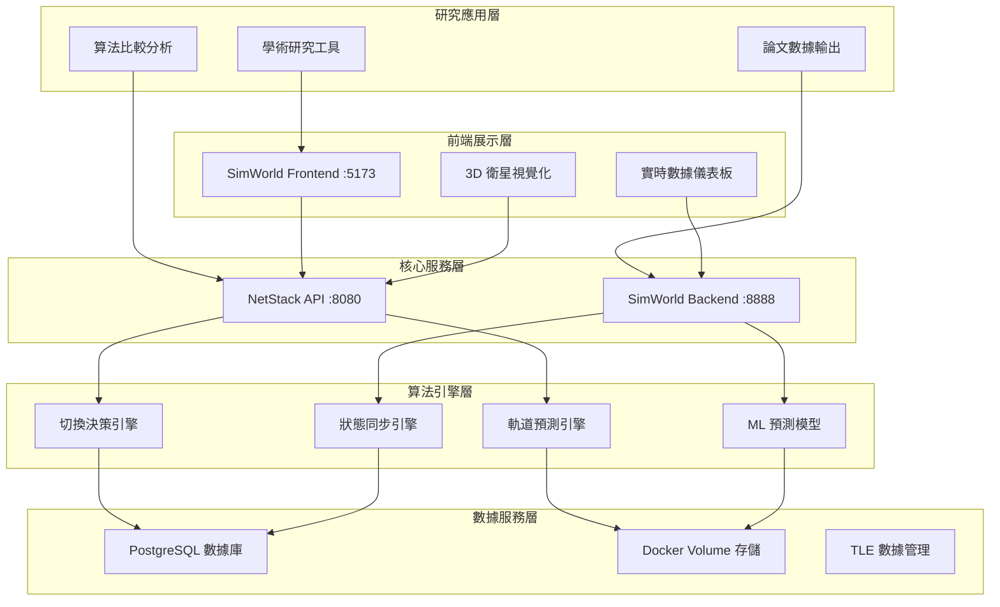

# 🏗️ NTN Stack 系統架構總覽

**版本**: 3.0.0  
**更新日期**: 2025-08-18  
**專案狀態**: ✅ 生產就緒  
**適用於**: LEO 衛星切換研究系統

## 📋 概述

本文檔提供 NTN Stack LEO 衛星切換研究系統的**完整架構設計**、Docker 配置和組件分工。系統採用 Pure Cron 驅動架構，實現真實數據驅動的衛星換手研究平台。

**📋 相關文檔**：
- **數據處理流程**：[數據處理流程](./data_processing_flow.md) - 六階段處理細節
- **技術實現**：[技術實施指南](./technical_guide.md) - 部署和開發
- **算法細節**：[算法實現手冊](./algorithms_implementation.md) - 核心算法
- **標準規範**：[衛星換手標準](./satellite_handover_standards.md) - 3GPP NTN 標準
- **API 介面**：[API 參考手冊](./api_reference.md) - 端點文檔

## 🎯 系統架構層次



## 🔧 核心組件架構

### NetStack (5G 核心網路) - :8080
**主要職責**: LEO 衛星切換算法研究和 3GPP NTN 協議實現

**核心功能模組**:
- **API Gateway**: 統一 API 入口和路由管理
- **算法引擎集群**: 切換決策、軌道預測、ML 模型、狀態同步
- **3GPP NTN 協議**: 信令系統、時間同步、頻率補償
- **數據持久化**: PostgreSQL 實驗數據和 RL 訓練記錄

**容器配置**:
```yaml
netstack-api:
  port: 8080
  depends_on: [netstack-postgres, netstack-redis]
  volumes: [tle_data, leo_outputs]
  
netstack-postgres:  
  port: 5432
  database: rl_research
  persistent_volume: postgres_data
```

### SimWorld (3D 仿真引擎) - :8888  
**主要職責**: 衛星軌道計算、數據預處理和 3D 視覺化

**核心功能模組**:
- **軌道計算引擎**: SGP4 精確計算和本地數據服務
- **數據預處理系統**: 時間序列生成和格式標準化  
- **3D 視覺化前端**: Three.js 軌道展示和實時監控
- **統一 API 服務**: 跨系統數據交換接口

**容器配置**:
```yaml
simworld-backend:
  port: 8888
  depends_on: [simworld-postgres]
  volumes: [satellite_data, leo_outputs]
  
simworld-frontend:
  port: 5173
  build_context: ./simworld/frontend
  nginx_config: production
```

## 🌐 Docker Compose 架構

### 完整服務拓撲
```yaml
services:
  # NetStack 服務群組 (15+ 微服務)
  netstack-api:          # 核心 API 服務
  netstack-postgres:     # 主數據庫
  netstack-redis:        # 緩存服務
  netstack-rl-postgres:  # RL 訓練數據庫
  # ... 其他 NetStack 微服務

  # SimWorld 服務群組  
  simworld-backend:      # 後端計算服務
  simworld-frontend:     # 前端 UI
  simworld-postgres:     # SimWorld 數據庫

volumes:
  # 數據持久化
  postgres_data:         # 主數據庫數據
  rl_postgres_data:      # RL 訓練數據
  satellite_data:        # TLE 和軌道數據
  leo_outputs:           # 六階段處理輸出

networks:
  ntn-network:           # 內部通信網路
    driver: bridge
    ipam:
      config:
        - subnet: 172.20.0.0/16
```

### 服務依賴關係
```
PostgreSQL 數據庫 → NetStack API → SimWorld 前端
       ↓                ↓              ↓
   數據持久化      → 算法引擎    → 3D 視覺化
       ↓                ↓              ↓  
   Volume 存儲    → TLE 處理    → 用戶界面
```

## 🚀 Pure Cron 驅動架構

### 核心理念
**容器 = 純數據載入，Cron = 自動數據更新，徹底分離關注點**

```
🏗️ Docker 建構階段     🚀 容器啟動階段      🕒 Cron 調度階段
      ↓                     ↓                    ↓
   預計算基礎數據         純數據載入驗證         自動數據更新
      ↓                     ↓                    ↓
   映像檔包含數據         < 30秒快速啟動      智能增量處理
                                              (每6小時執行)
```

### 數據更新機制
1. **建構階段**: 完整 SGP4 預計算，生成基礎數據到映像檔
2. **啟動階段**: 純數據載入和驗證，< 30 秒快速啟動
3. **運行階段**: 後台 Cron 自動下載和增量處理
4. **智能更新**: 檢測變更，按需重新計算

## 🔄 數據流向架構

### 研究工作流程
```
學術研究需求 → 算法配置 → 實驗執行 → 數據分析 → 結果輸出
     ↓              ↓           ↓          ↓          ↓
  NetStack API → 算法引擎 → SimWorld → 可視化 → 論文數據
```

### 六階段數據處理流程
```
TLE 數據載入 → 智能篩選 → 信號分析 → 時間序列 → 數據整合 → 動態池規劃
   Stage 1      Stage 2    Stage 3     Stage 4     Stage 5     Stage 6
     ↓            ↓          ↓           ↓           ↓           ↓
 8,735 顆衛星 → 391 顆候選 → 3GPP 事件 → 前端數據 → 格式統一 → 90-110 顆池
```

### 真實數據來源架構
```
真實 TLE 數據 → SGP4 計算 → 衛星篩選 → 時間序列 → API 服務 → 研究應用
      ↓             ↓         ↓          ↓         ↓          ↓
   CelesTrak → 完整物理模型 → 地理篩選 → 預計算 → 統一格式 → 學術分析
```

## 🗂️ 存儲架構設計

### Docker Volume 配置
```
📁 satellite_data/           # TLE 數據存儲
├── starlink/
│   ├── tle/starlink_YYYYMMDD.tle
│   └── json/starlink.json
└── oneweb/
    ├── tle/oneweb_YYYYMMDD.tle  
    └── json/oneweb.json

📁 leo_outputs/              # 六階段處理輸出
├── stage1_tle_calculation/
├── stage2_intelligent_filtering/
├── stage3_signal_analysis/
├── stage4_timeseries_preprocessing/
├── stage5_data_integration/
└── stage6_dynamic_pool_planning/
```

### PostgreSQL 數據庫設計
```sql
-- NetStack 主數據庫
netstack_db:
├── experiment_results      # 實驗結果
├── algorithm_configurations # 算法配置  
└── performance_metrics     # 性能指標

-- RL 訓練數據庫  
rl_research:
├── satellite_orbital_cache # 軌道緩存
├── satellite_tle_data      # TLE 數據
└── training_episodes       # 訓練記錄
```

## 🌟 系統特色與優勢

### 技術特色
- **完整 SGP4 軌道計算** - 非簡化算法，符合學術研究標準  
- **3GPP NTN 標準合規** - A4/A5/D2 事件完整實現
- **Pure Cron 驅動架構** - 容器純數據載入，Cron 自動更新
- **六階段智能處理** - 從 8,735 顆到 90-110 顆動態池的智能優化
- **真實數據驅動** - CelesTrak 官方 TLE 數據，6 小時自動更新

### 性能優勢
```
🚀 系統啟動: < 30 秒 (所有服務健康)
⚡ API 響應: < 100 ms (衛星位置查詢)  
🧠 算法執行: < 50 ms (換手決策)
📊 數據處理: 2-5 分鐘 (完整六階段)
🔄 自動更新: 每 6 小時無感更新
```

## 🔐 安全架構考量

### 網路安全
- **內部網路隔離**: Docker network 隔離外部訪問
- **端口暴露控制**: 僅必要端口對外開放
- **API 訪問控制**: 基於角色的 API 權限管理

### 數據安全  
- **數據加密**: 敏感數據靜態加密存儲
- **備份策略**: 定期自動化數據備份
- **訪問日誌**: 完整的 API 訪問審計日誌

## 📊 監控與運維

### 健康檢查策略
```yaml
健康檢查:
  netstack-api: GET /health (每 30秒)
  simworld-backend: GET /api/health (每 30秒)  
  postgresql: pg_isready (每 10秒)
  
自動重啟策略:
  restart_policy: unless-stopped
  healthcheck_retries: 3
  healthcheck_timeout: 10s
```

### 效能監控指標
```
系統層面:
├── CPU 使用率 < 80%
├── 記憶體使用率 < 85%  
├── 磁碟 I/O < 80%
└── 網路延遲 < 10ms

應用層面:  
├── API 響應時間 < 100ms
├── 數據處理延遲 < 5min
├── 算法準確率 > 95%
└── 系統可用性 > 99.5%
```

## 🚀 部署與維護

### 快速部署指令
```bash
# 完整系統啟動
make up                    # 啟動所有服務
make status               # 檢查服務狀態  
make logs                 # 查看運行日誌

# 個別服務管理
make netstack-restart     # 重啟 NetStack (1-2分鐘)
make simworld-restart     # 重啟 SimWorld (30秒)

# 健康檢查
curl http://localhost:8080/health     # NetStack API
curl http://localhost:8888/api/health # SimWorld API
curl http://localhost:5173           # 前端界面
```

### 故障排除流程
1. **檢查服務狀態**: `make status`
2. **查看日誌**: `docker logs <service_name>`
3. **檢查資源使用**: `docker stats`
4. **網路連通性**: `docker network ls`
5. **數據完整性**: 檢查 Volume 掛載

## 📋 架構決策記錄

### 關鍵設計選擇
1. **微服務架構**: NetStack + SimWorld 分離，提升開發靈活性
2. **容器化部署**: Docker Compose 編排，簡化部署流程
3. **Pure Cron 驅動**: 分離建構與運行，提升系統穩定性
4. **混合存儲**: PostgreSQL + Volume，平衡性能和靈活性

### 技術選型理由
- **Python + FastAPI**: 科學計算生態 + 高性能 API
- **Three.js**: 強大 3D 視覺化，適合衛星軌道展示
- **PostgreSQL**: 穩定關係型數據庫，支援複雜查詢
- **Docker Compose**: 簡化多服務編排，適合研究環境

## ⚠️ 架構限制與未來規劃

### 當前限制
- **單節點部署**: 限制在單機環境
- **手動擴展**: 需要手動調整資源配置
- **數據同步**: 跨服務一致性依賴應用層

### 未來改進方向
- **容器編排**: 引入 Kubernetes 支援
- **服務網格**: 採用 Istio 提升通信管理  
- **分散式存儲**: 支援多節點數據分佈
- **自動擴展**: 基於負載的動態資源調整

---

**本架構文檔提供系統完整設計概覽。詳細的實現細節和配置說明請參考相應的技術文檔。**

*最後更新：2025-08-18 | 系統架構版本 3.0.0*