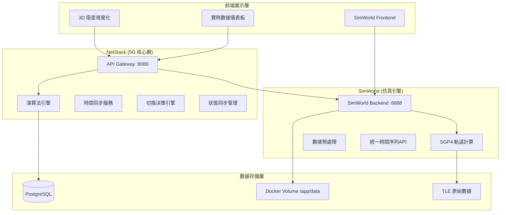
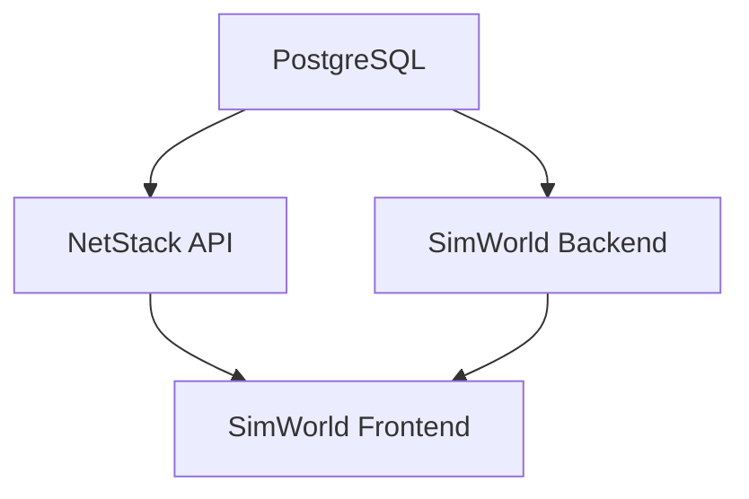

# 🏗️ 系統架構現況

**版本**: 1.0.0  
**建立日期**: 2025-08-04  
**適用於**: LEO 衛星切換研究系統  

## 📋 概述

本文檔說明當前 LEO 衛星切換研究系統的整體架構、各組件職責分工，以及服務間的交互關係。

## 🔧 整體架構圖



## 🎯 組件職責分工

### NetStack (5G 核心網路) - Port 8080
**主要職責**: LEO 衛星切換算法研究和 3GPP NTN 協議實現

#### 核心服務
- **API Gateway** (`/src/api/`)
  - 統一 API 入口點
  - 路由管理和請求分發
  - 認證和授權控制

- **演算法引擎** (`/src/algorithms/`)
  - **切換決策**: 精細化切換決策引擎
  - **軌道預測**: SGP4/SDP4 軌道預測優化
  - **ML 模型**: LSTM、Transformer 預測模型
  - **狀態同步**: 分散式狀態同步保證

- **3GPP NTN 協議** (`/src/protocols/`)
  - **信令系統**: NTN 特定 RRC 程序
  - **時間同步**: 多層級時間同步協議
  - **頻率補償**: 都卜勒頻率補償

#### 容器配置
```yaml
netstack-api:
  image: netstack:latest
  ports: ["8080:8080"]
  depends_on: [netstack-rl-postgres]
  volumes: ["/app/data:/app/data"]
```

### SimWorld (3D 仿真引擎) - Port 8888
**主要職責**: 衛星軌道計算、數據預處理和 3D 視覺化

#### 核心服務
- **軌道計算服務** (`/backend/app/services/`)
  - **SGP4 計算器**: 精確軌道位置計算
  - **本地數據服務**: Docker Volume 數據管理
  - **智能篩選**: 地理相關性和換手適用性篩選

- **數據預處理** (`/backend/`)
  - **120分鐘時間序列**: 預計算軌道數據
  - **統一 API**: 時間序列數據統一接口
  - **格式標準化**: 數據格式一致性保證

- **前端服務** (`/frontend/`)
  - **3D 視覺化**: Three.js 衛星軌道展示
  - **實時儀表板**: 切換事件監控
  - **用戶交互**: 參數調整和場景控制

#### 容器配置
```yaml
simworld_backend:
  image: simworld-backend:latest
  ports: ["8888:8888"]  
  volumes: ["/app/data:/app/data", "/app/tle_data:/app/tle_data"]

simworld_frontend:
  image: simworld-frontend:latest
  ports: ["5173:5173"]
  depends_on: [simworld_backend]
```

## 🗄️ 數據存儲架構

### PostgreSQL (NetStack RL 數據庫)
**用途**: 強化學習訓練數據和實驗結果存儲

```sql
-- 主要數據表
├── satellite_orbital_cache     -- 軌道緩存數據
├── satellite_tle_data         -- TLE 歷史數據  
├── handover_experiment_data   -- 切換實驗記錄
└── rl_training_sessions       -- RL 訓練會話
```

### Docker Volume 數據
**位置**: `/app/data/` (跨容器共享)

```
/app/data/
├── starlink_120min_timeseries.json    # 35MB 預處理數據
├── oneweb_120min_timeseries.json      # 26MB 預處理數據
├── phase0_precomputed_orbits.json     # 統一格式數據
├── layered_phase0/                    # 分層仰角數據
└── .preprocess_status                 # 數據狀態標記
```

### TLE 原始數據
**位置**: `/app/tle_data/` (僅 SimWorld 訪問)

```
/app/tle_data/
├── starlink/
│   ├── tle/starlink.tle     # 7,992 顆衛星
│   └── json/starlink.json
└── oneweb/
    ├── tle/oneweb.tle       # 651 顆衛星  
    └── json/oneweb.json
```

## 🌐 服務交互關係

### API 路由分工
```
前端請求路由:
├── /api/v1/satellites/*          → SimWorld Backend  
├── /api/v1/handover/*            → NetStack API
├── /api/v1/ml/*                  → NetStack API
├── /api/v1/time_sync/*           → NetStack API
└── /api/v1/rl/*                  → NetStack API
```

### 數據流向
1. **TLE 數據更新**: Scripts → TLE 原始數據 → SimWorld 預處理
2. **軌道計算**: SimWorld SGP4 → Docker Volume → NetStack 消費
3. **實驗數據**: NetStack 算法 → PostgreSQL → 結果分析
4. **視覺化數據**: Docker Volume → SimWorld Backend → 前端展示

## 🚀 啟動順序和依賴

### 容器啟動順序


### 健康檢查端點
```bash
# NetStack 健康檢查
curl http://localhost:8080/health

# SimWorld 健康檢查  
curl http://localhost:8888/api/v1/satellites/unified/health

# 數據庫連接檢查
docker exec netstack-rl-postgres pg_isready
```

## ⚙️ 核心配置系統

### 統一配置管理
**位置**: `/netstack/src/core/config/satellite_config.py`

```python
@dataclass
class SatelliteConfig:
    # SIB19 合規配置
    MAX_CANDIDATE_SATELLITES: int = 8
    
    # 預處理優化配置  
    PREPROCESS_SATELLITES: Dict[str, int] = {
        "starlink": 40,
        "oneweb": 30
    }
    
    # 智能篩選配置
    INTELLIGENT_SELECTION: Dict = {
        "enabled": True,
        "target_location": {"lat": 24.9441, "lon": 121.3714}
    }
```

### 環境配置
```bash
# NetStack 環境變數
POSTGRES_HOST=netstack-rl-postgres
POSTGRES_PORT=5432
POSTGRES_DB=rl_research

# SimWorld 環境變數  
DATA_VOLUME_PATH=/app/data
TLE_DATA_PATH=/app/tle_data
SGP4_MODE=production
```

## 📊 性能指標

### 系統資源使用
| 服務 | CPU | 記憶體 | 磁盤 | 網路 |
|------|-----|--------|------|------|
| **NetStack API** | ~15% | ~200MB | 500MB | 低 |
| **SimWorld Backend** | ~20% | ~300MB | 1GB | 中 |
| **SimWorld Frontend** | ~5% | ~100MB | 200MB | 低 |
| **PostgreSQL** | ~10% | ~150MB | 2GB | 低 |

### 響應時間基準
```
API 響應時間目標:
├── 衛星位置查詢: < 50ms
├── 切換決策計算: < 100ms  
├── 軌道預測: < 200ms
└── 數據預處理: < 30秒 (批次)
```

## 🔄 部署和運維

### 快速啟動
```bash
# 完整系統啟動
make up

# 檢查所有服務狀態
make status

# 查看服務日誌
make logs SERVICE=netstack-api
```

### 重啟策略
```bash
# 只重啟 NetStack (演算法更新)
make netstack-restart

# 只重啟 SimWorld (數據更新)  
make simworld-restart

# 完整重啟 (配置更新)
make down && make up
```

### 數據備份
```bash
# 備份實驗數據
docker exec netstack-rl-postgres pg_dump rl_research > backup.sql

# 備份預處理數據
docker cp netstack-api:/app/data ./data_backup
```

## 🛠️ 開發和調試

### 容內開發
```bash
# 進入 NetStack 容器
docker exec -it netstack-api bash

# 進入 SimWorld 容器
docker exec -it simworld_backend bash

# 直接執行 Python 代碼測試
docker exec simworld_backend python -c "
from app.services.sgp4_calculator import SGP4Calculator
calc = SGP4Calculator()
print(calc.test_calculation())
"
```

### 日誌監控
```bash
# 實時監控所有容器日誌
docker-compose logs -f

# 過濾特定服務的錯誤日誌  
docker logs netstack-api 2>&1 | grep ERROR

# 監控 API 請求
tail -f /var/log/netstack/api_access.log
```

## 🔧 擴展和自定義

### 新增算法模組
1. **NetStack 演算法**: `/src/algorithms/[category]/your_algorithm.py`
2. **註冊 API 端點**: `/src/api/v1/your_api.py`  
3. **更新路由配置**: `/src/api/main.py`
4. **添加測試用例**: `/tests/unit/test_your_algorithm.py`

### 新增星座支援
1. **TLE 數據**: 添加到 `/app/tle_data/[constellation]/`
2. **預處理配置**: 更新 `SatelliteConfig`
3. **智能篩選**: 調整篩選參數
4. **API 支援**: 更新統一時間序列 API

## ⚠️ 重要注意事項

1. **容器間通信**: 使用 Docker 內部網路，服務名作為主機名
2. **數據一致性**: Docker Volume 確保數據跨容器同步
3. **配置管理**: 統一配置系統避免參數不一致
4. **資源限制**: 開發環境建議至少 8GB RAM

---

**本文檔記錄了當前系統的完整架構現況，為日後開發和維護提供參考基礎。**