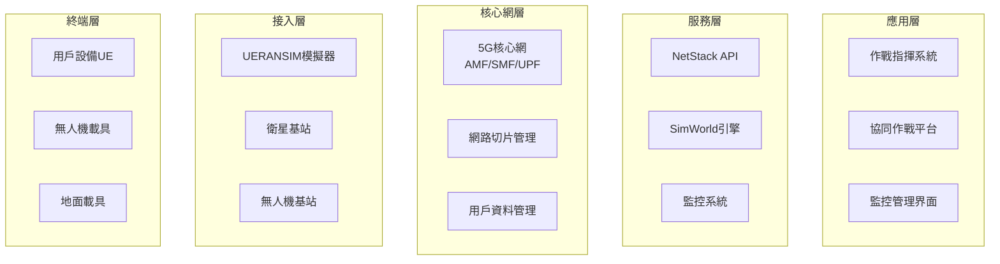

# NTN Stack 基礎培訓課程

## 📖 文檔資訊
- **版本**: v1.0.0
- **最後更新**: 2024-12-19
- **適用對象**: 新進人員、操作員、技術人員
- **課程時長**: 4-6小時 (可分階段完成)
- **認證等級**: 基礎操作員認證

## 🎯 課程目標

完成本課程後，學員將能夠：
- 理解NTN Stack系統架構和核心概念
- 獨立完成系統部署和基本配置
- 執行日常監控和維護任務
- 處理常見故障和問題
- 使用API進行基本操作

## 📚 課程大綱

### 📋 課程結構 (總時長：4-6小時)

| 單元 | 內容 | 時長 | 類型 |
|------|------|------|------|
| **單元1** | 系統概述與架構 | 60分鐘 | 理論 |
| **單元2** | 安裝部署實作 | 90分鐘 | 實作 |
| **單元3** | 基本操作與API | 75分鐘 | 實作 |
| **單元4** | 監控與故障排除 | 60分鐘 | 實作 |
| **單元5** | 實戰演練 | 75分鐘 | 綜合 |

---

## 📖 單元1: 系統概述與架構 (60分鐘)

### 🎯 學習目標
- 了解NTN Stack的設計目標和應用場景
- 掌握5G核心網和非地面網路基本概念
- 理解系統各組件的作用和關係

### 📝 理論內容 (40分鐘)

#### 🌐 NTN Stack 概述

**什麼是NTN Stack？**
- **NTN**: Non-Terrestrial Network (非地面網路)
- **目的**: 為軍事單位提供快速部署的5G通信解決方案
- **特色**: 支援衛星、無人機、地面載具的統一通信

**軍事應用場景**:
1. **營級作戰**: 15-20km範圍內的部隊通信
2. **機動部署**: 15分鐘內建立通信網路
3. **多載具協同**: 統一管理不同類型載具
4. **抗干擾通信**: 頻譜跳躍和動態路由

#### 🏗️ 系統架構層次



#### 🔀 網路切片技術

**三種網路切片**:

| 切片類型 | SST | SD | 應用場景 | 特性 |
|---------|-----|-----|----------|------|
| **eMBB** | 1 | 0x111111 | 高清影像傳輸 | 高頻寬 |
| **uRLLC** | 2 | 0x222222 | 即時控制指令 | 低延遲 |
| **mMTC** | 3 | 0x333333 | 感測器網路 | 大連接 |

### 🧪 實作練習 (20分鐘)

#### 練習1: 系統架構理解
```bash
# 查看系統組件
docker ps --format "table {{.Names}}\t{{.Status}}\t{{.Ports}}"

# 檢查服務狀態
curl http://localhost:8080/api/v1/system/info

# 查看網路切片配置
curl http://localhost:8080/api/v1/slices
```

**問題討論**:
1. 每個容器代表什麼功能？
2. 網路切片如何影響用戶體驗？
3. 為什麼需要非地面網路？

---

## 🚀 單元2: 安裝部署實作 (90分鐘)

### 🎯 學習目標
- 掌握系統部署的完整流程
- 學會驗證部署結果
- 了解常見部署問題和解決方法

### 📋 前置準備 (15分鐘)

#### 環境檢查清單
```bash
# 檢查作業系統
lsb_release -a

# 檢查Docker
docker --version
docker compose version

# 檢查系統資源
free -h
df -h

# 檢查網路權限
sudo ip tuntap add mode tun user $(whoami) name test-tun
sudo ip tuntap del mode tun name test-tun
```

### 🏗️ 部署實作 (60分鐘)

#### 步驟1: 專案下載 (5分鐘)
```bash
# 克隆專案
git clone https://github.com/your-org/ntn-stack.git
cd ntn-stack

# 檢查專案結構
ls -la
```

#### 步驟2: 環境配置 (10分鐘)
```bash
# 複製環境配置檔
cp .env.example .env

# 編輯關鍵配置
nano .env
```

**重要配置項目**:
```bash
# 基本設定
DEPLOYMENT_MODE=training
HOST_IP=192.168.1.100

# 網路設定
NETWORK_INTERFACE=eth0
TUN_INTERFACE=ogstun

# 切片配置
EMBB_SLICE_SST=1
URLLC_SLICE_SST=2
MMTC_SLICE_SST=3
```

#### 步驟3: 核心網部署 (20分鐘)
```bash
# 拉取Docker映像檔
make pull-images

# 啟動核心網組件
make up-core

# 等待服務就緒
make wait-for-core

# 檢查狀態
make status-core
```

**預期輸出**:
```
✅ NRF (Network Repository Function): Running
✅ AMF (Access and Mobility Management): Running
✅ SMF (Session Management Function): Running
✅ UPF (User Plane Function): Running
✅ UDM (Unified Data Management): Running
✅ PCF (Policy Control Function): Running
✅ NSSF (Network Slice Selection): Running
```

#### 步驟4: RAN模擬器部署 (15分鐘)
```bash
# 啟動gNodeB基站
make start-gnb

# 等待基站註冊
sleep 30

# 啟動UE模擬器
make start-ue

# 測試連通性
make test-connectivity
```

#### 步驟5: 監控系統部署 (10分鐘)
```bash
# 啟動監控服務
make start-monitoring

# 導入Grafana儀表板
make import-dashboards

# 驗證監控
curl http://localhost:9090/-/healthy
curl http://localhost:3000/api/health
```

### ✅ 部署驗證 (15分鐘)

#### 完整驗證腳本
```bash
#!/bin/bash
# deployment-verification.sh

echo "🔍 開始部署驗證..."

# 1. 服務健康檢查
echo "檢查服務健康狀態..."
curl -f http://localhost:8080/health || echo "❌ NetStack API 異常"
curl -f http://localhost:8888/ping || echo "❌ SimWorld API 異常"

# 2. 核心網功能檢查
echo "檢查5G核心網功能..."
UE_COUNT=$(curl -s http://localhost:8080/api/v1/ue | jq length)
echo "已註冊UE數量: $UE_COUNT"

# 3. 網路切片檢查
echo "檢查網路切片..."
curl -s http://localhost:8080/api/v1/slices | jq .

# 4. 效能測試
echo "執行基本效能測試..."
make test-performance

echo "✅ 驗證完成"
```

---

## 🔧 單元3: 基本操作與API (75分鐘)

### 🎯 學習目標
- 掌握基本的系統操作
- 學會使用REST API
- 了解網路切片管理

### 📊 系統監控 (25分鐘)

#### Grafana儀表板操作
1. **訪問Grafana**: http://localhost:3000
2. **登入**: admin / admin123
3. **主要儀表板**:
   - 系統概覽
   - 5G核心網狀態
   - 網路切片監控
   - UAV狀態追蹤

#### 關鍵指標解讀
```bash
# 查看系統指標
curl http://localhost:8080/metrics

# 查看UE連接統計
curl http://localhost:8080/api/v1/metrics/ue-stats

# 查看切片使用情況
curl http://localhost:8080/api/v1/metrics/slice-usage
```

### 🔄 API操作實練 (35分鐘)

#### API認證設置
```bash
# 獲取API金鑰
API_KEY="demo-api-key"

# 設置環境變數
export API_KEY="demo-api-key"
export BASE_URL="http://localhost:8080/api/v1"
```

#### 基本API操作
```bash
# 1. 系統狀態查詢
curl -H "X-API-Key: $API_KEY" $BASE_URL/system/status

# 2. 列出所有UE
curl -H "X-API-Key: $API_KEY" $BASE_URL/ue

# 3. 查看特定UE詳情
curl -H "X-API-Key: $API_KEY" $BASE_URL/ue/123456789012345

# 4. 查看網路切片
curl -H "X-API-Key: $API_KEY" $BASE_URL/slices
```

#### 網路切片操作
```bash
# 切換UE到緊急通信切片
curl -X POST -H "X-API-Key: $API_KEY" \
  -H "Content-Type: application/json" \
  $BASE_URL/ue/123456789012345/slice-switch \
  -d '{
    "target_slice": {
      "sst": 2,
      "sd": "0x222222"
    },
    "reason": "emergency_communication"
  }'

# 查看切片切換歷史
curl -H "X-API-Key: $API_KEY" \
  $BASE_URL/ue/123456789012345/slice-history
```

### 🚁 UAV管理操作 (15分鐘)

#### UAV基本操作
```bash
# 創建新UAV
curl -X POST -H "X-API-Key: $API_KEY" \
  -H "Content-Type: application/json" \
  $BASE_URL/uav -d '{
    "uav_id": "UAV-TRAINING-001",
    "initial_position": {"lat": 25.0, "lon": 121.0, "alt": 100},
    "mission_type": "training"
  }'

# 查看UAV狀態
curl -H "X-API-Key: $API_KEY" $BASE_URL/uav/UAV-TRAINING-001

# 啟動UAV任務
curl -X POST -H "X-API-Key: $API_KEY" \
  $BASE_URL/uav/UAV-TRAINING-001/mission/start

# 停止UAV任務
curl -X POST -H "X-API-Key: $API_KEY" \
  $BASE_URL/uav/UAV-TRAINING-001/mission/stop
```

---

## 🔧 單元4: 監控與故障排除 (60分鐘)

### 🎯 學習目標
- 學會系統監控和告警
- 掌握基本故障排除技能
- 了解日誌分析方法

### 📊 監控操作 (25分鐘)

#### 實時監控
```bash
# 監控系統資源
docker stats

# 監控網路流量
sudo iftop -i eth0

# 監控服務日誌
docker logs -f netstack-api
```

#### 告警設置
```bash
# 查看告警規則
curl http://localhost:9090/api/v1/rules

# 測試告警觸發
curl -X POST http://localhost:8080/api/v1/test/trigger-alert

# 查看告警狀態
curl http://localhost:9090/api/v1/alerts
```

### 🚨 故障排除實練 (35分鐘)

#### 常見問題診斷

**問題1: UE無法連接**
```bash
# 診斷步驟
1. 檢查gNodeB狀態
   docker logs ueransim-gnb

2. 檢查AMF日誌
   docker logs open5gs-amf

3. 驗證網路配置
   ip route show

4. 重新註冊UE
   make re-register-ue
```

**問題2: API無回應**
```bash
# 診斷步驟
1. 檢查API服務狀態
   curl http://localhost:8080/health

2. 查看API服務日誌
   docker logs netstack-api

3. 檢查端口占用
   sudo netstat -tlnp | grep 8080

4. 重啟API服務
   docker restart netstack-api
```

**問題3: 效能異常**
```bash
# 診斷步驟
1. 檢查系統負載
   uptime
   free -h

2. 查看容器資源使用
   docker stats --no-stream

3. 分析網路延遲
   make test-latency

4. 優化系統設定
   make optimize-performance
```

---

## 🏆 單元5: 實戰演練 (75分鐘)

### 🎯 學習目標
- 綜合運用所學技能
- 模擬真實運行場景
- 培養問題解決能力

### 🎮 綜合演練場景 (60分鐘)

#### 場景1: 緊急部署任務 (20分鐘)
**任務描述**: 在新環境中快速建立通信網路

**任務步驟**:
1. 在乾淨環境中部署系統
2. 配置三種網路切片
3. 註冊測試UE
4. 驗證通信功能
5. 建立監控告警

**評估標準**:
- 部署時間 < 20分鐘
- 所有服務正常運行
- UE成功註冊並通信
- 監控系統正常工作

#### 場景2: 故障恢復演練 (20分鐘)
**任務描述**: 模擬系統故障並快速恢復

**故障注入**:
```bash
# 模擬網路故障
sudo iptables -I INPUT -p tcp --dport 8080 -j DROP

# 模擬服務故障
docker stop open5gs-amf

# 模擬資源不足
stress --cpu 8 --timeout 300s
```

**恢復任務**:
1. 快速識別故障類型
2. 執行相應恢復程序
3. 驗證系統功能
4. 分析故障原因
5. 制定預防措施

#### 場景3: UAV編隊通信 (20分鐘)
**任務描述**: 管理多架UAV的通信需求

**任務步驟**:
1. 創建3架訓練UAV
2. 分別分配不同網路切片
3. 監控UAV通信品質
4. 模擬任務切換
5. 記錄效能數據

### 📝 學習評估 (15分鐘)

#### 理論測驗 (10題，5分鐘)
1. NTN Stack的三個網路切片分別是什麼？
2. AMF在5G核心網中的作用是？
3. 如何檢查系統健康狀態？
4. 網路切片切換的API端點是？
5. UAV失聯時的第一診斷步驟？
6. Prometheus的預設端口是？
7. 緊急重啟命令是？
8. API認證使用什麼標頭？
9. 系統日誌檔案位置在哪裡？
10. 部署驗證的關鍵指標有哪些？

#### 實作評估 (10分鐘)
1. **基本操作** (3分鐘):
   - 查看系統狀態
   - 列出已註冊UE
   - 檢查網路切片

2. **API使用** (4分鐘):
   - 創建測試UAV
   - 執行切片切換
   - 查看監控指標

3. **故障診斷** (3分鐘):
   - 識別模擬故障
   - 執行恢復步驟
   - 驗證修復結果

## 🏅 認證與後續學習

### 📜 認證要求

**基礎操作員認證**:
- 理論測驗：8/10題正確
- 實作評估：完成所有基本操作
- 綜合演練：成功完成2/3場景

**認證有效期**: 1年
**復訓週期**: 每季度參加4小時更新培訓

### 📚 進階學習路徑

1. **高級操作員課程**:
   - 系統調優與效能分析
   - 高級故障排除技術
   - 自動化運維腳本

2. **專業技術課程**:
   - 5G核心網深度技術
   - 衛星通信原理
   - 網路安全防護

3. **管理員課程**:
   - 系統架構設計
   - 容量規劃與擴展
   - 災難恢復計畫

### 📞 學習支援

**技術支援**:
- 培訓熱線: +886-2-XXXX-XXXX
- 郵件支援: training@ntn-stack.mil
- 線上論壇: https://forum.ntn-stack.mil

**學習資源**:
- 線上文檔: https://docs.ntn-stack.mil
- 影片教學: https://training.ntn-stack.mil
- 實驗環境: https://lab.ntn-stack.mil

---

**維護資訊**:
- 文檔負責人: 培訓總監
- 課程更新: 每季度
- 教材審核: 每半年
- 下次更新: 2025-03-19 