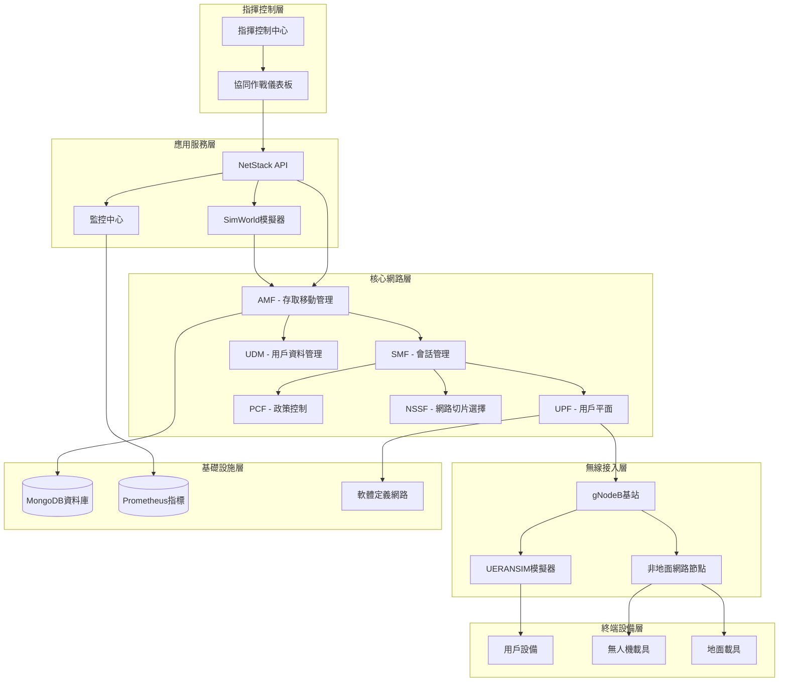
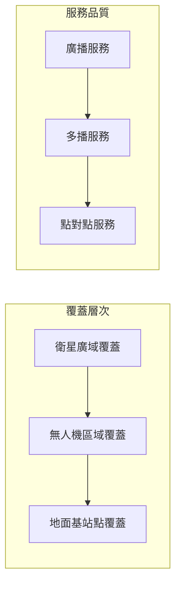
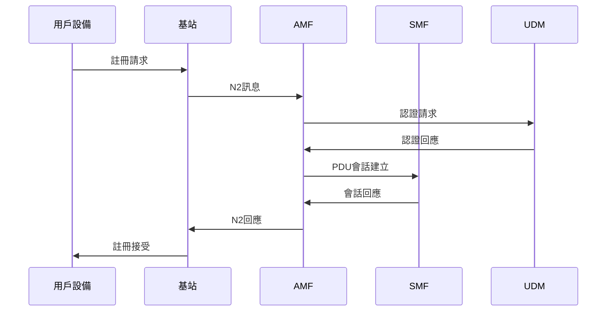
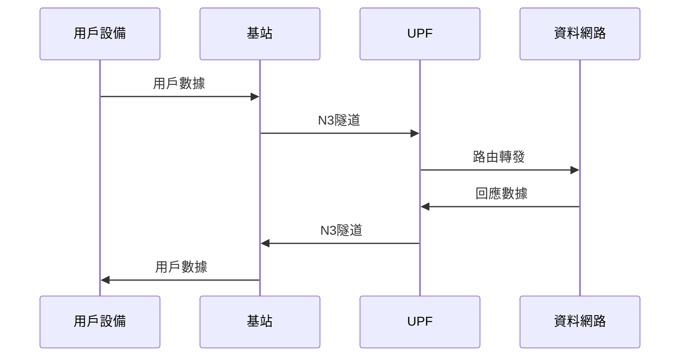

# NTN Stack 系統概覽

## 📖 文檔資訊
- **版本**: v1.0.0
- **最後更新**: 2024-12-19
- **適用對象**: 技術人員、系統管理員、架構師
- **更新歷史**:
  - v1.0.0 (2024-12-19): 初版發布

## 📝 概述

NTN Stack (非地面網路堆疊) 是一個專為軍事通信設計的完整5G核心網與無線接入網解決方案。系統整合了Open5GS核心網、UERANSIM模擬器、智能監控系統和協同控制平台，提供營級作戰範圍內的可靠通信服務。

### 🎯 設計目標

1. **戰術通信保障**: 支援營級作戰單位在各種環境下的通信需求
2. **多載具整合**: 整合無人機、地面載具和衛星通信
3. **快速部署**: 15分鐘內完成系統部署和服務啟動
4. **高可靠性**: 99.9%的系統可用性和自動故障恢復
5. **安全防護**: 軍用級別的安全防護和抗干擾能力

### 🏗️ 核心特色

- **三層網路切片**: eMBB、uRLLC、mMTC 切片支援不同通信需求
- **非地面網路**: 支援衛星、無人機等非地面基站
- **智能協同**: AI驅動的資源調度和負載均衡
- **邊緣計算**: 降低延遲的邊緣處理能力
- **統一監控**: 多維度系統監控和告警機制

## 🏛️ 總體架構

### 系統架構圖



### 核心組件說明

#### 🎖️ 指揮控制層
- **指揮控制中心**: 戰術級別的系統控制和決策支援
- **協同作戰儀表板**: 多人協同的即時狀況監控介面

#### 🚀 應用服務層  
- **SimWorld模擬器**: 戰場環境和通信場景模擬
- **NetStack API**: 系統管理和控制的RESTful介面
- **監控中心**: 統一的系統監控和告警管理

#### 📡 核心網路層 (基於Open5GS)
- **AMF (Access and Mobility Management Function)**: 存取和移動性管理
- **SMF (Session Management Function)**: PDU會話管理
- **UPF (User Plane Function)**: 用戶平面功能，負責數據轉發
- **PCF (Policy Control Function)**: 政策控制和服務品質管理
- **UDM (Unified Data Management)**: 統一用戶資料管理
- **NSSF (Network Slice Selection Function)**: 網路切片選擇功能

#### 📻 無線接入層
- **gNodeB基站**: 5G新無線電基站功能
- **UERANSIM模擬器**: RAN環境模擬和測試工具
- **非地面網路節點**: 支援衛星和無人機基站

#### 📱 終端設備層
- **用戶設備**: 標準5G終端設備
- **無人機載具**: 搭載通信模組的無人機平台
- **地面載具**: 軍用車輛和移動平台

## 🔀 網路切片架構

### 切片配置

| 切片類型 | SST | SD | 用途 | 特性 |
|---------|-----|-----|------|------|
| eMBB | 1 | 0x111111 | 增強型移動寬頻 | 高數據傳輸率 |
| uRLLC | 2 | 0x222222 | 超可靠低延遲通信 | 低延遲 < 1ms |
| mMTC | 3 | 0x333333 | 大規模機器通信 | 高連接密度 |

### 切片應用場景

- **eMBB切片**: 高解析度影像傳輸、戰場資料同步
- **uRLLC切片**: 無人機控制指令、緊急通信
- **mMTC切片**: 感測器網路、物聯網設備

## 🌐 非地面網路 (NTN) 設計

### NTN節點類型

1. **衛星節點**:
   - 低軌道衛星 (LEO): 延遲 20-40ms
   - 中軌道衛星 (MEO): 延遲 80-120ms  
   - 地球同步衛星 (GEO): 延遲 250-280ms

2. **空中節點**:
   - 高空平台 (HAPS): 高度 17-22km
   - 無人機基站: 高度 0.1-20km
   - 系留氣球: 固定位置空中基站

3. **地面節點**:
   - 移動基站: 車載5G基站
   - 便攜基站: 可快速部署的小型基站

### NTN覆蓋策略



## 💾 資料流架構

### 控制平面資料流



### 用戶平面資料流



## 🔐 安全架構

### 多層安全防護

1. **實體層安全**:
   - 硬體安全模組 (HSM)
   - 設備認證和完整性檢查
   - 實體介面保護

2. **網路層安全**:
   - IPSec VPN隧道
   - 網路切片隔離
   - 流量加密和認證

3. **應用層安全**:
   - OAuth 2.0 + OpenID Connect
   - API金鑰管理
   - 角色基礎存取控制 (RBAC)

### 安全通信協定

- **5G-AKA**: 5G認證和金鑰協商
- **SUPI保護**: 用戶永久識別符保護
- **gNB安全**: 基站間安全通信
- **UP安全**: 用戶平面完整性保護

## 📊 效能指標

### 系統效能要求

| 指標類別 | 指標名稱 | 目標值 | 監控方式 |
|---------|---------|--------|----------|
| 延遲 | 端到端延遲 | < 50ms | 即時監控 |
| 頻寬 | 單用戶峰值速率 | 100 Mbps | 流量統計 |
| 容量 | 並發用戶數 | 1000+ | 連接統計 |
| 可靠性 | 系統可用性 | 99.9% | 健康檢查 |
| 移動性 | 切換成功率 | > 95% | 信令統計 |

### 切片效能保證

- **eMBB切片**: 數據傳輸率 > 100 Mbps
- **uRLLC切片**: 延遲 < 1ms, 可靠性 99.999%
- **mMTC切片**: 連接密度 > 10萬/km²

## 🔄 系統整合介面

### 北向介面 (Northbound)
- **REST API**: HTTP/HTTPS RESTful服務
- **GraphQL**: 靈活的資料查詢介面
- **WebSocket**: 即時事件推送

### 南向介面 (Southbound)  
- **N1-N6介面**: 5G核心網標準介面
- **O-RAN介面**: 開放無線接入網介面
- **管理介面**: NETCONF/YANG設備管理

### 東西向介面 (East-West)
- **服務間通信**: gRPC/HTTP/2
- **事件匯流排**: Apache Kafka
- **服務發現**: Consul/etcd

## 🚀 部署架構

### 容器化部署

```yaml
# 部署架構範例
services:
  # 5G核心網組件
  open5gs-nrf:
    image: open5gs/nrf:latest
    container_name: nrf
    
  open5gs-amf:
    image: open5gs/amf:latest
    container_name: amf
    depends_on: [nrf]
    
  # RAN模擬器
  ueransim-gnb:
    image: ueransim/gnb:latest
    container_name: gnb
    
  # 管理API
  netstack-api:
    image: netstack/api:latest
    container_name: netstack-api
    ports: ["8080:8080"]
    
  # 監控系統
  prometheus:
    image: prom/prometheus:latest
    container_name: prometheus
    
  grafana:
    image: grafana/grafana:latest  
    container_name: grafana
```

### 高可用性部署

- **主從部署**: 關鍵組件採用主從架構
- **負載均衡**: 多實例負載分散
- **自動故障轉移**: 自動切換備援節點
- **資料備份**: 定期資料備份和恢復

## 📈 擴展性設計

### 水平擴展
- **微服務架構**: 組件獨立擴展
- **容器編排**: Kubernetes自動伸縮
- **服務網格**: Istio流量管理

### 垂直擴展  
- **資源調節**: CPU/記憶體動態調整
- **效能調校**: 關鍵路徑效能優化
- **快取機制**: Redis/Memcached快取

---

**維護資訊**:
- 文檔負責人: 系統架構師
- 審核週期: 每季度
- 下次更新: 2025-03-19 