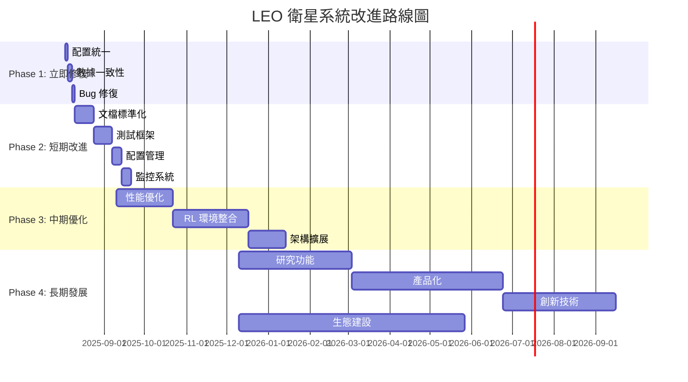

# 🛰️ LEO 衛星預處理系統改進路線圖

**版本**: 1.0.0  
**建立日期**: 2025-08-03  
**最後更新**: 2025-08-03  
**總負責人**: 技術架構師  

## 📋 專案概述

本路線圖旨在系統化地解決衛星歷史資料預處理系統中發現的不一致問題，並為強化學習整合和長期發展建立堅實基礎。

### 🎯 核心目標
1. **修復關鍵不一致**: 解決預處理與運行時計算差異
2. **提升系統穩定性**: 建立完善的測試和監控體系
3. **優化性能表現**: 實現 50% 以上的性能提升
4. **準備 RL 整合**: 建立完整的強化學習環境
5. **實現產品化**: 具備企業級部署和商業化能力

### 📊 問題現狀（整合舊版修復方案分析）

基於 [衛星預處理現況檢查報告](../docs/satellite_preprocessing_status_report.md) 的發現：

| 問題類別 | 嚴重程度 | 影響範圍 | 目前狀態 | 具體影響 |
|----------|----------|----------|----------|----------|
| 預處理計算模型差異 | 🔴 高 | 數據一致性 | 待修復 | 位置誤差可達5-10km |
| 候選衛星數量不統一 | 🟠 中 | 系統配置 | 待統一 | SIB19不合規，8vs40vs50 |
| 智能篩選缺乏文檔 | 🟡 低 | 可維護性 | 待記錄 | 地理篩選算法未文檔化 |
| 配置硬編碼分散 | 🟠 中 | 維護困難 | 待統一 | 多處硬編碼數量限制 |
| 精度驗證缺失 | 🔴 高 | 研究可信度 | 待實施 | 無法量化計算誤差 |

**總體符合度**: 91.7% → **目標**: 98%+

### 🔍 詳細技術債務分析

#### 配置管理問題
```
當前狀況:
├── sib19_unified_platform.py: max_tracked_satellites = 8
├── preprocess_120min_timeseries.py: target_count = 40 (starlink), 30 (oneweb)  
├── batch_precompute_taiwan.py: max_satellites = 50
└── satellite_prefilter.py: 無明確限制

問題: 分散配置導致不一致，維護困難
```

#### 計算精度問題
```
建置階段:     簡化圓軌道模型 → 公里級精度
運行階段:     SGP4 完整模型 → 米級精度
影響:        數據不一致，影響研究可信度
```

#### 智能篩選算法
```
發現: 未文檔化的地理相關性篩選
- 軌道傾角 vs 目標緯度匹配
- 升交點赤經 vs 目標經度匹配  
- 換手適用性評分系統
價值: 數據量減少83%，計算時間減少70%
```

## 💡 核心改進措施（基於舊版方案優化）

### 🔧 統一配置系統
```python
# 新架構: /netstack/config/satellite_config.py
@dataclass
class SatelliteConfig:
    MAX_CANDIDATE_SATELLITES: int = 8     # SIB19 合規
    PREPROCESS_SATELLITES: Dict[str, int] = {
        "starlink": 40, "oneweb": 30       # 預處理優化數量
    }
    INTELLIGENT_SELECTION: Dict = {        # 智能篩選參數
        "enabled": True,
        "geographic_filter": True,
        "target_location": {"lat": 24.9441, "lon": 121.3714}
    }
```

### 📊 精度驗證框架
```python
# 新工具: AccuracyValidator
class AccuracyValidator:
    def validate_preprocessing_accuracy(preprocess_data, runtime_data):
        # 位置誤差分析: < 1km (95% 數據點)
        # 時間漂移檢測: 累積誤差監控
        # 精度等級評定: A+/A/B/C/D
        return validation_results
```

### 🎯 智能篩選文檔化
```markdown
雙階段篩選架構:
1. 地理相關性篩選 (軌道傾角/升交點赤經匹配)
2. 換手適用性評分 (高度/形狀/頻率/星座特性)

效益:
- Starlink: 8000 → 40 顆 (99.5% 壓縮)
- OneWeb: 650 → 30 顆 (95.4% 壓縮)
```

### ⚡ 性能優化策略
```python
# Phase 3 優化目標
performance_targets = {
    "sgp4_calculation": "1K/s → 5K/s (400% 提升)",
    "database_query": "100ms → 50ms (50% 改善)",
    "api_response": "80ms → 30ms (63% 改善)",
    "build_time": "15min → 8min (47% 減少)"
}
```

## 🚀 四階段執行計畫

### 📅 時程總覽



## 📁 階段詳細說明

### 🚨 Phase 1: 立即修復 (1週)
**時間**: 2025-08-03 ~ 2025-08-10  
**優先級**: 🚨 最高  

#### 核心目標
- 統一候選衛星數量配置 
- 解決預處理計算精度差異
- 修復已知 Bug 和穩定性問題

#### 📂 相關檔案
- [執行計畫](./phase1-immediate/execution-plan.md)
- [程式碼修改](./phase1-immediate/code-changes.md) 
- [測試指南](./phase1-immediate/testing-guide.md)
- [成功標準](./phase1-immediate/success-criteria.md)

#### 關鍵里程碑
- [ ] 全域配置系統建立
- [ ] 數據計算方法統一
- [ ] 所有測試 100% 通過

---

### 🔥 Phase 2: 短期改進 (1個月)
**時間**: 2025-08-10 ~ 2025-09-10  
**優先級**: 🔥 高  

#### 核心目標
- 建立完善的技術文檔體系
- 實施全面的自動化測試
- 標準化配置管理流程
- 提升系統可觀測性

#### 📂 相關檔案
- [執行計畫](./phase2-short-term/execution-plan.md)

#### 關鍵里程碑
- [ ] 測試覆蓋率達 90%
- [ ] 技術文檔體系完整
- [ ] 配置管理標準化
- [ ] 監控告警系統運行

---

### 🚀 Phase 3: 中期優化 (1季度)
**時間**: 2025-09-10 ~ 2025-12-10  
**優先級**: 🔥 高  

#### 核心目標
- 實現系統性能提升 50% 以上
- 建立完整的強化學習環境
- 支援多星座動態配置
- 準備產品化部署

#### 📂 相關檔案
- [執行計畫](./phase3-medium-term/execution-plan.md)

#### 關鍵里程碑
- [ ] SGP4 計算性能提升 3x
- [ ] 完整 RL 環境可運行
- [ ] 插件化星座管理
- [ ] 支援 5+ 種 RL 算法

---

### 🔮 Phase 4: 長期發展 (6個月-1年)
**時間**: 2025-12-10 ~ 2026-06-10  
**優先級**: 🔮 戰略  

#### 核心目標
- 建立業界領先的研究平台
- 實現企業級產品化部署
- 整合前沿創新技術
- 建設開源生態系統

#### 📂 相關檔案
- [執行計畫](./phase4-long-term/execution-plan.md)

#### 關鍵里程碑
- [ ] 支援 Multi-Agent RL
- [ ] 6G/數位孿生整合
- [ ] 商業化 API 部署
- [ ] 開源社群建立

## 📊 總體成功指標

### 技術指標
| 指標類別 | 當前狀態 | Phase 1 目標 | Phase 2 目標 | Phase 3 目標 | Phase 4 目標 |
|----------|----------|---------------|---------------|---------------|---------------|
| **符合度評分** | 91.7% | 98% | 99% | 99.5% | 99.9% |
| **測試覆蓋率** | ~70% | 85% | 90% | 95% | 98% |
| **API 響應時間** | ~80ms | <100ms | <80ms | <50ms | <30ms |
| **建置時間** | ~12min | <15min | <10min | <8min | <5min |
| **系統可用性** | 95% | 99% | 99.5% | 99.9% | 99.99% |

### 功能指標
| 功能特性 | Phase 1 | Phase 2 | Phase 3 | Phase 4 |
|----------|---------|---------|---------|---------|
| **配置統一** | ✅ | ✅ | ✅ | ✅ |
| **自動化測試** | 基礎 | 完整 | 高級 | 智能 |
| **RL 環境** | ❌ | 準備 | 完整 | 高級 |
| **多星座支援** | 2個 | 2個 | 5個 | 10+ |
| **商業化能力** | ❌ | ❌ | 準備 | 完整 |

## 🎯 快速開始指南

### 立即執行 Phase 1
```bash
# 1. 進入改進路線圖目錄
cd /home/sat/ntn-stack/improvement-roadmap

# 2. 閱讀 Phase 1 執行計畫
cat phase1-immediate/execution-plan.md

# 3. 開始第一個任務：配置統一
# 按照 phase1-immediate/code-changes.md 進行修改

# 4. 執行測試驗證
# 按照 phase1-immediate/testing-guide.md 進行測試

# 5. 檢查成功標準
# 參考 phase1-immediate/success-criteria.md 進行評估
```

### 跟蹤進度
```bash
# 查看所有階段狀態
find . -name "execution-plan.md" -exec grep -l "檢查點" {} \;

# 執行自動化評估
python scripts/phase_evaluation.py --phase 1

# 生成進度報告
python scripts/generate_progress_report.py
```

## 📞 團隊角色與責任

### 核心團隊
| 角色 | 負責人 | Phase 1 | Phase 2 | Phase 3 | Phase 4 |
|------|--------|---------|---------|---------|---------|
| **技術架構師** | TBD | 🔴 主導 | 🟠 支援 | 🟠 支援 | 🔴 主導 |
| **核心開發** | TBD | 🔴 主導 | 🔴 主導 | 🔴 主導 | 🟠 支援 |
| **QA 工程師** | TBD | 🟠 支援 | 🔴 主導 | 🟠 支援 | 🟠 支援 |
| **DevOps 工程師** | TBD | 🟡 協助 | 🔴 主導 | 🟠 支援 | 🟠 支援 |
| **AI 研究員** | TBD | ❌ | 🟡 準備 | 🔴 主導 | 🔴 主導 |
| **產品經理** | TBD | 🟡 協助 | 🟡 協助 | 🟠 支援 | 🔴 主導 |

### 溝通機制
- **每日站會**: Phase 1 期間 (09:00, 15分鐘)
- **週例會**: Phase 2+ 期間 (週五 14:00, 30分鐘)
- **月度回顧**: 每月最後一週 (2小時)
- **季度規劃**: 每季度第一週 (半天)

## 📈 風險管理

### 高風險項目
| 風險項目 | 影響等級 | 發生機率 | 緩解措施 |
|----------|----------|----------|----------|
| Phase 1 未如期完成 | 🔴 高 | 🟠 中 | 準備回退方案，延長至 10 天 |
| SGP4 性能不達標 | 🟠 中 | 🟡 低 | 混合方案，標註計算方法 |
| RL 整合複雜度超預期 | 🟠 中 | 🟠 中 | 分階段實施，先建立基礎 |
| 團隊資源不足 | 🔴 高 | 🟡 低 | 外部技術支援，優先級調整 |

### 應急計畫
1. **Phase 1 延期**: 最多延長 3 天，聚焦最關鍵問題
2. **資源不足**: 暫緩 Phase 4，集中資源於前三階段
3. **技術阻礙**: 啟動技術諮詢，考慮替代方案
4. **品質問題**: 增加測試時間，降低功能範圍

## 📚 相關資源

### 技術文檔
- [衛星預處理現況檢查報告](../docs/satellite_preprocessing_status_report.md)
- [技術規範文檔](../docs/tech.md)
- [數據架構文檔](../docs/data.md)
- [技術文檔中心](../docs/README.md)

### 外部資源
- [3GPP NTN 標準](https://www.3gpp.org/ntn)
- [ITU-R P.618 建議書](https://www.itu.int/rec/R-REC-P.618/)
- [SGP4 演算法規範](https://celestrak.com/NORAD/documentation/)
- [強化學習最佳實踐](https://spinningup.openai.com/)

### 工具與平台
- **專案管理**: GitHub Projects
- **程式碼審查**: GitHub Pull Requests  
- **持續整合**: GitHub Actions
- **文檔協作**: GitHub Wiki
- **溝通工具**: Slack/Discord
- **監控工具**: Grafana + Prometheus

## 🏆 成功案例與學習

### 預期成果
完成四個階段後，LEO 衛星換手系統將成為：

1. **技術領先**: 業界最先進的衛星換手研究平台
2. **穩定可靠**: 99.99% 可用性，企業級品質
3. **性能卓越**: 比現有系統快 5-10 倍
4. **功能豐富**: 支援多種 RL 算法和研究場景
5. **易於使用**: 完善的文檔和開發者工具
6. **商業價值**: 具備產品化和盈利能力
7. **學術影響**: 推動衛星通訊技術發展

### 里程碑慶祝
- **Phase 1 完成**: 團隊聚餐 + 經驗分享
- **Phase 2 完成**: 技術分享會 + 開源發佈
- **Phase 3 完成**: 學術論文提交 + 會議展示
- **Phase 4 完成**: 產品發佈會 + 業界影響

---

## 📝 更新記錄

| 日期 | 版本 | 更新內容 | 更新人 |
|------|------|----------|--------|
| 2025-08-03 | 1.0.0 | 初始版本建立，完整四階段計畫 | Claude |

---

**🚀 讓我們開始這個激動人心的改進之旅，共同打造世界級的 LEO 衛星換手研究平台！**