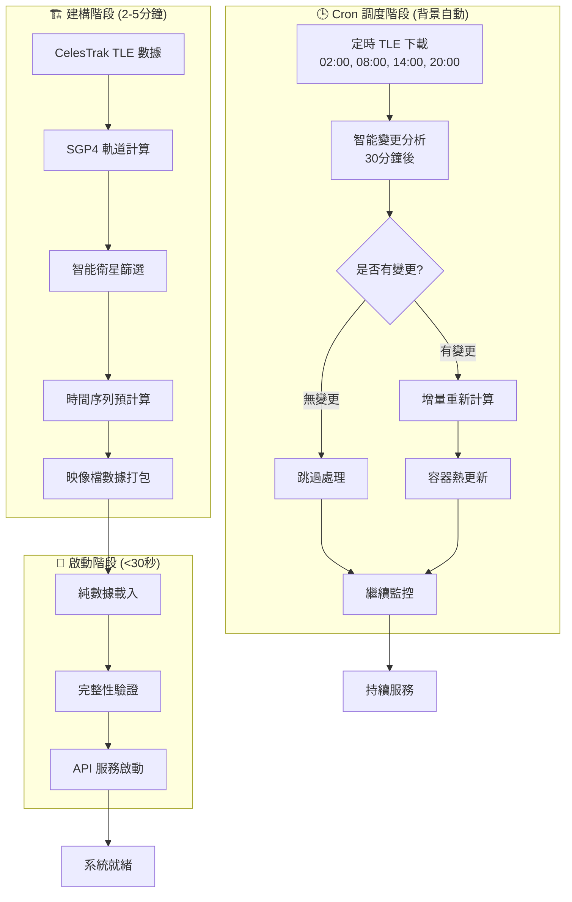
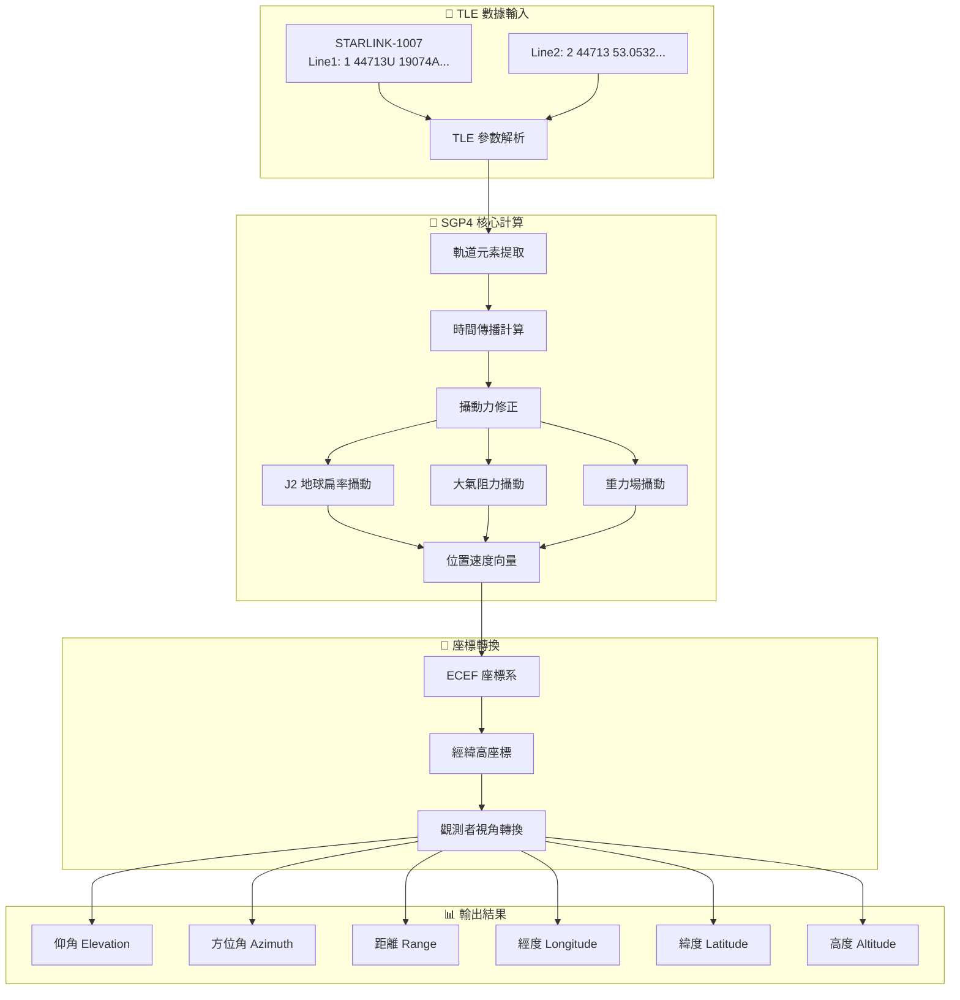
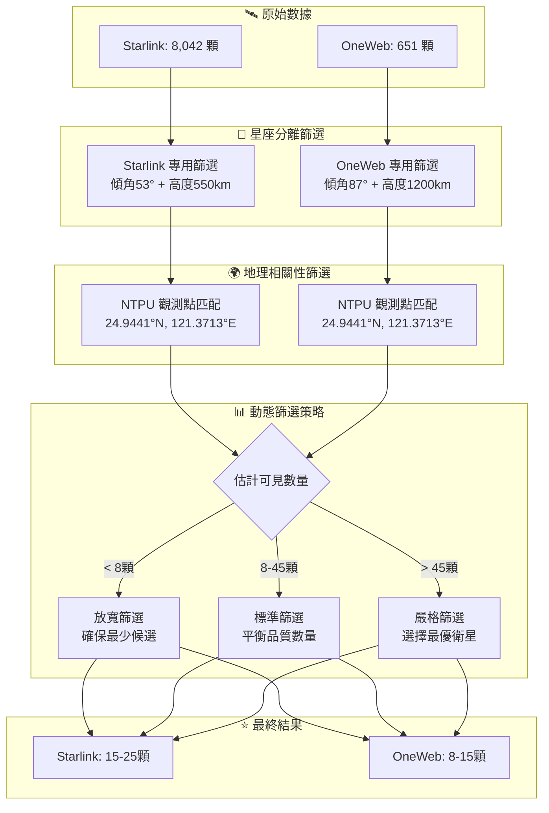
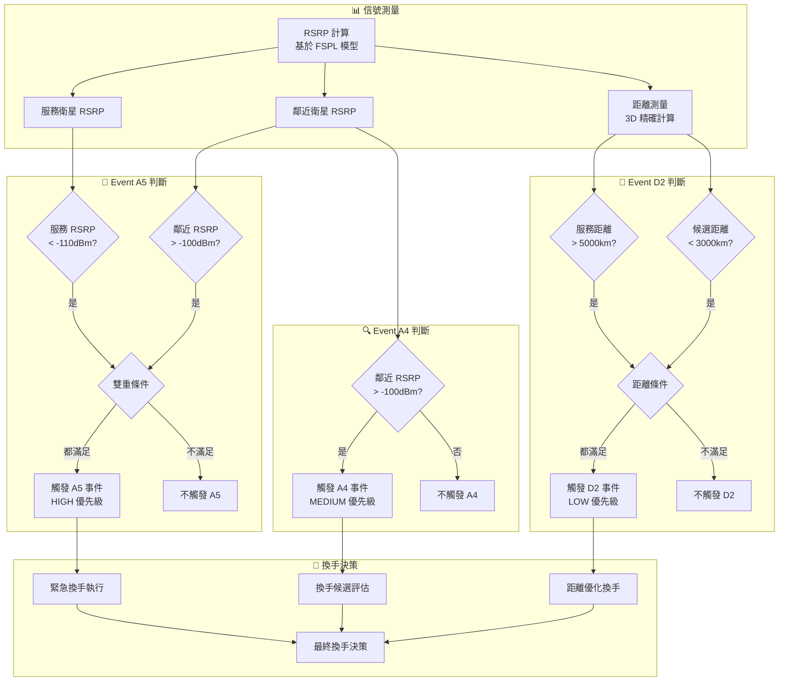
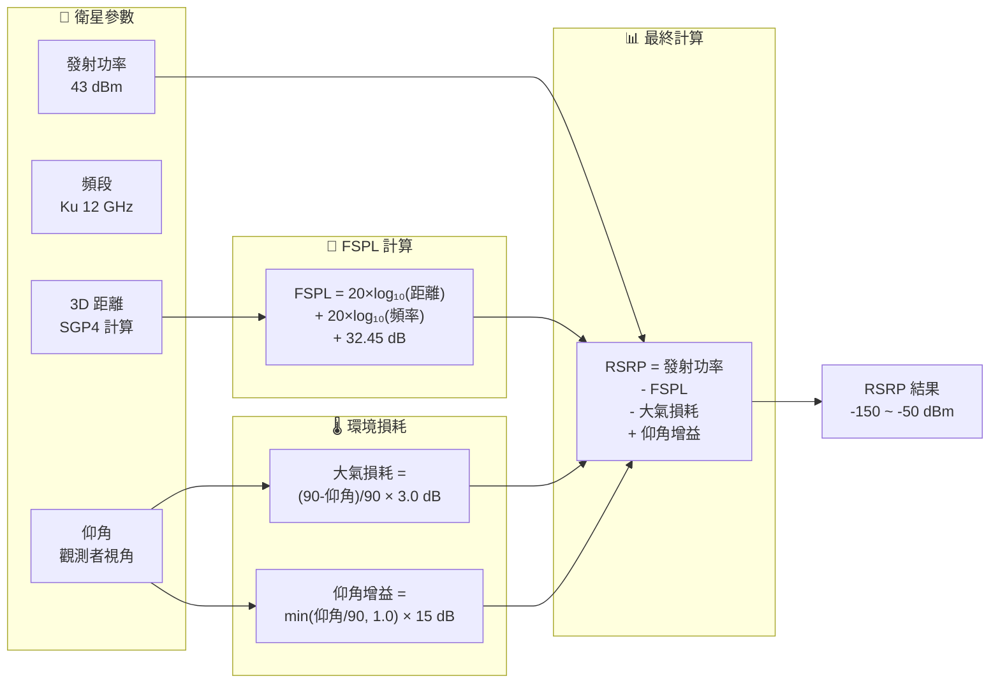
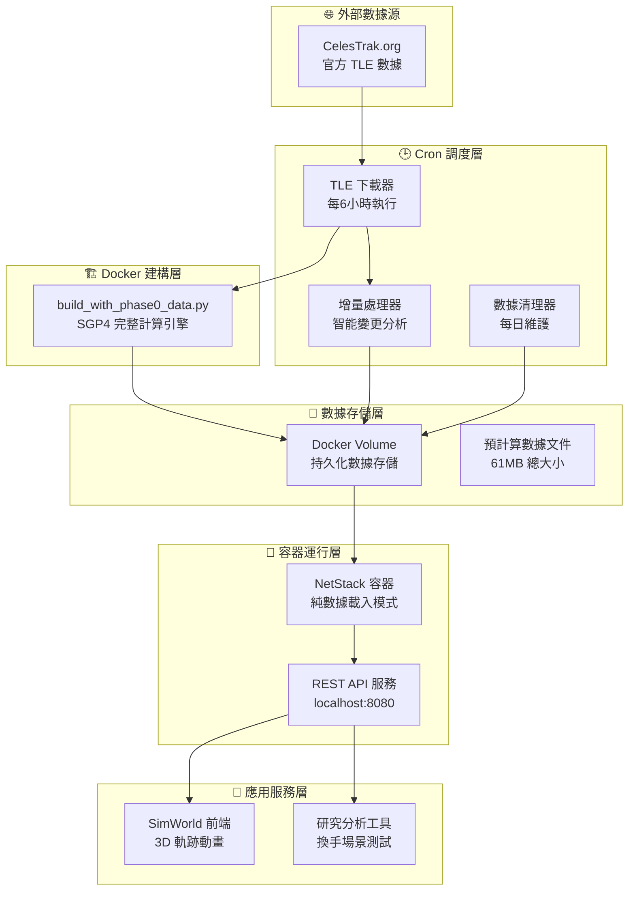
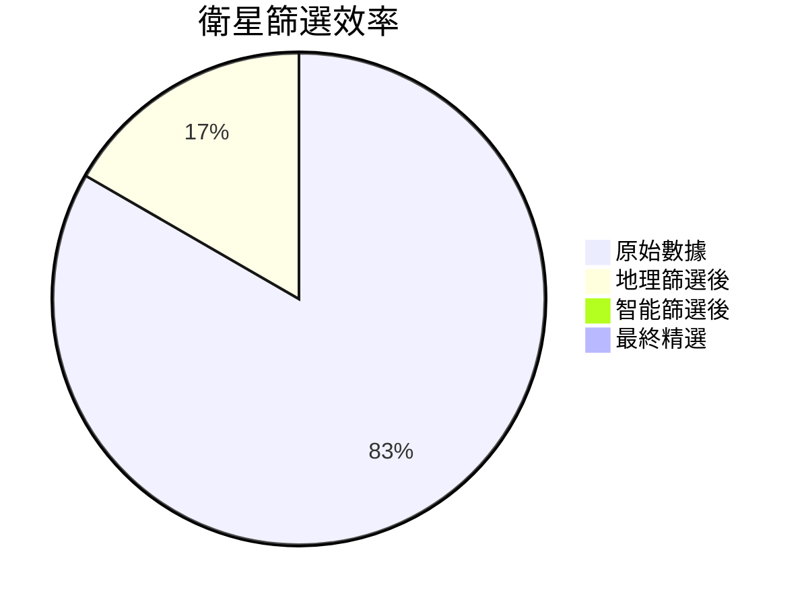
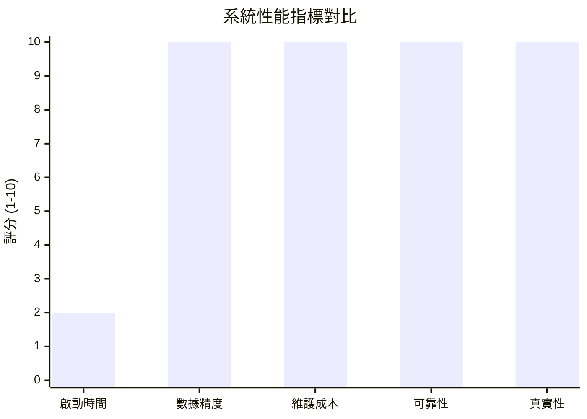

# 衛星數據預處理系統 - Mermaid 流程圖

## 🔄 完整數據處理流程

### 1. Pure Cron 驅動架構總覽



### 2. SGP4 軌道計算引擎詳細流程



### 3. 智能衛星篩選系統流程



### 4. 3GPP 換手事件判斷流程



### 5. RSRP 精確計算流程



### 6. 時間序列預處理流程

```mermaid
gantt
    title 衛星軌跡時間序列預處理 (120分鐘)
    dateFormat X
    axisFormat %H:%M
    
    section 時間軸設定
    起始時間          :0, 30s
    採樣間隔 30秒     :30s, 30s
    總時間點 240個    :60s, 30s
    
    section Starlink 處理
    15顆衛星軌跡計算  :0, 3600s
    仰角方位角轉換    :1800s, 1800s
    可見性判斷        :3000s, 1200s
    
    section OneWeb 處理  
    10顆衛星軌跡計算  :0, 2400s
    仰角方位角轉換    :1200s, 1200s
    可見性判斷        :2000s, 800s
    
    section 數據輸出
    JSON 格式生成     :4200s, 600s
    完整性驗證        :4800s, 300s
    系統就緒          :5100s, 300s
```

### 7. 系統整體架構圖



## 🎯 關鍵技術指標儀表板





## 📊 數據流量統計


