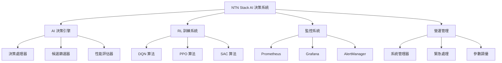

# NTN Stack AI 決策系統營運手冊

## 📋 目錄

1. [系統架構概覽](#系統架構概覽)
2. [日常營運檢查清單](#日常營運檢查清單)
3. [性能調優指南](#性能調優指南)
4. [備份和恢復流程](#備份和恢復流程)
5. [監控儀表板使用](#監控儀表板使用)
6. [緊急處理程序](#緊急處理程序)

---

## 🏗️ 系統架構概覽

### 核心組件



### 服務端口映射

| 服務 | 端口 | 用途 | 健康檢查 |
|------|------|------|----------|
| NetStack API | 8080 | AI 決策核心服務 | `/health` |
| Grafana | 3000 | 監控儀表板 | `/api/health` |
| Prometheus | 9090 | 指標收集 | `/-/healthy` |
| AlertManager | 9093 | 告警管理 | `/-/healthy` |
| Operations Dashboard | 8090 | 營運管理介面 | `/health` |

### 資料流向

```
衛星事件 → AI 決策引擎 → RL 訓練系統 → 決策輸出
    ↓           ↓            ↓           ↓
  監控指標 → Prometheus → Grafana → 告警通知
```

---

## ✅ 日常營運檢查清單

### 每日檢查 (08:00)

- [ ] **系統狀態檢查**
  ```bash
  # 檢查所有服務狀態
  make status
  
  # 檢查健康狀態
  curl http://localhost:8080/health
  curl http://localhost:3000/api/health
  curl http://localhost:9090/-/healthy
  ```

- [ ] **決策引擎性能**
  - 平均決策延遲 < 15ms ✅
  - 決策成功率 > 95% ✅
  - 系統 CPU 使用率 < 80% ✅
  - 記憶體使用率 < 90% ✅

- [ ] **RL 訓練狀態**
  - 檢查訓練進度是否正常
  - 確認模型收斂情況
  - 驗證獎勵函數趨勢

- [ ] **告警檢查**
  ```bash
  # 檢查過去24小時的告警
  curl "http://localhost:9093/api/v1/alerts?filter=alertstate='active'"
  ```

### 每週檢查 (週一 09:00)

- [ ] **性能趨勢分析**
  - 查看 Grafana 週報告
  - 分析決策延遲趨勢
  - 評估 RL 算法表現

- [ ] **資料庫維護**
  ```bash
  # 檢查 Redis 記憶體使用
  redis-cli info memory
  
  # 清理過期數據
  redis-cli eval "return #redis.call('keys', 'temp:*')" 0
  ```

- [ ] **日誌輪轉檢查**
  ```bash
  # 檢查日誌大小
  du -sh /var/log/ntn-stack/
  
  # 確認日誌輪轉正常
  logrotate -d /etc/logrotate.d/ntn-stack
  ```

### 每月檢查 (月初第一個工作日)

- [ ] **系統備份驗證**
- [ ] **災難恢復演練**
- [ ] **安全更新檢查**
- [ ] **性能基準測試**

---

## ⚡ 性能調優指南

### AI 決策引擎調優

#### 1. 決策延遲優化

**目標**: 平均決策延遲 < 15ms

```python
# 參數調優建議
DECISION_ENGINE_CONFIG = {
    "max_concurrent_decisions": 100,
    "decision_timeout_ms": 50,
    "cache_size": 10000,
    "thread_pool_size": 16
}
```

**監控指標**:
- `ntn_decision_latency_avg_seconds`
- `ntn_decisions_per_second`

#### 2. RL 訓練調優

**DQN 算法優化**:
```yaml
dqn_config:
  learning_rate: 0.001
  batch_size: 64
  memory_size: 100000
  target_update_frequency: 1000
  exploration_rate: 0.1
```

**PPO 算法優化**:
```yaml
ppo_config:
  learning_rate: 0.0003
  batch_size: 128
  clip_ratio: 0.2
  value_loss_coefficient: 0.5
  entropy_coefficient: 0.01
```

#### 3. 記憶體使用優化

```bash
# 監控記憶體使用
watch -n 5 'free -h && ps aux --sort=-%mem | head -10'

# Redis 記憶體優化
redis-cli config set maxmemory 2gb
redis-cli config set maxmemory-policy allkeys-lru
```

### 系統資源調優

#### CPU 優化
```bash
# 設定 CPU 親和性
taskset -cp 0-3 $(pidof netstack-api)
taskset -cp 4-7 $(pidof rl-training)
```

#### 網路優化
```bash
# 調整網路緩衝區
echo 'net.core.rmem_max = 67108864' >> /etc/sysctl.conf
echo 'net.core.wmem_max = 67108864' >> /etc/sysctl.conf
sysctl -p
```

---

## 💾 備份和恢復流程

### 自動備份策略

#### 1. RL 模型備份
```bash
#!/bin/bash
# daily_model_backup.sh

BACKUP_DIR="/backup/models/$(date +%Y%m%d)"
mkdir -p $BACKUP_DIR

# 備份 RL 模型
cp -r /data/models/rl_algorithms $BACKUP_DIR/
cp -r /data/models/decision_policies $BACKUP_DIR/

# 壓縮備份
tar -czf $BACKUP_DIR.tar.gz $BACKUP_DIR
rm -rf $BACKUP_DIR

# 保留最近 30 天的備份
find /backup/models -name "*.tar.gz" -mtime +30 -delete
```

#### 2. 配置備份
```bash
#!/bin/bash
# config_backup.sh

BACKUP_DIR="/backup/config/$(date +%Y%m%d_%H%M%S)"
mkdir -p $BACKUP_DIR

# 備份配置文件
cp -r monitoring/prometheus $BACKUP_DIR/
cp -r monitoring/grafana $BACKUP_DIR/
cp -r netstack/config $BACKUP_DIR/

# 備份到遠程存儲
rsync -av $BACKUP_DIR backup-server:/remote/backup/ntn-stack/
```

#### 3. 指標數據備份
```bash
# Prometheus 數據備份
curl -X POST http://localhost:9090/api/v1/admin/tsdb/snapshot
```

### 災難恢復程序

#### 完全系統恢復
```bash
#!/bin/bash
# disaster_recovery.sh

echo "開始災難恢復程序..."

# 1. 停止所有服務
make stop

# 2. 恢復配置
tar -xzf /backup/config/latest.tar.gz -C /

# 3. 恢復 RL 模型
tar -xzf /backup/models/latest.tar.gz -C /data/

# 4. 重建 Docker 容器
make build

# 5. 啟動服務
make up

# 6. 驗證恢復
sleep 30
make health-check

echo "災難恢復完成"
```

---

## 📊 監控儀表板使用

### Grafana 儀表板說明

#### 1. NTN Overview Dashboard
- **用途**: 系統整體狀況一覽
- **URL**: `http://localhost:3000/d/ntn-overview`
- **關鍵指標**:
  - 系統健康分數
  - 決策延遲趨勢
  - RL 訓練進度
  - 服務可用性

#### 2. RL Training Monitor
- **用途**: RL 訓練過程監控
- **URL**: `http://localhost:3000/d/rl-training-monitor`
- **關鍵指標**:
  - 算法收斂曲線
  - 獎勵函數變化
  - 訓練損失
  - 模型性能比較

#### 3. Handover Performance
- **用途**: 衛星換手性能分析
- **URL**: `http://localhost:3000/d/handover-performance`
- **關鍵指標**:
  - 換手成功率
  - 延遲分布
  - 信號質量
  - 地理熱圖

#### 4. System Health
- **用途**: 系統健康狀態監控
- **URL**: `http://localhost:3000/d/system-health`
- **關鍵指標**:
  - CPU/記憶體使用率
  - 服務可用性
  - 資料庫連接
  - 告警事件

### 告警配置和響應

#### 關鍵告警規則

1. **高決策延遲告警**
   ```yaml
   alert: AIDecisionHighLatency
   expr: rate(ntn_decision_latency_avg_seconds[2m]) > 0.020
   severity: critical
   ```
   **響應**: 檢查 CPU 負載，考慮擴展實例

2. **RL 訓練停滯告警**
   ```yaml
   alert: RLTrainingStalled
   expr: increase(rl_training_progress_percent[10m]) == 0
   severity: critical
   ```
   **響應**: 檢查訓練參數，重啟訓練會話

3. **系統資源耗盡告警**
   ```yaml
   alert: HighResourceUsage
   expr: cpu_usage > 80 or memory_usage > 90
   severity: warning
   ```
   **響應**: 清理臨時文件，考慮資源升級

---

## 🚨 緊急處理程序

### 緊急情況分類

#### Level 1 - 服務不可用
**症狀**: API 完全無響應，決策系統停止
**響應時間**: < 5 分鐘

```bash
# 緊急恢復步驟
1. 檢查服務狀態
   systemctl status ntn-stack-*

2. 查看錯誤日誌
   journalctl -u ntn-stack-api -f

3. 嘗試重啟服務
   systemctl restart ntn-stack-api

4. 如果重啟失敗，切換到備用系統
   ./scripts/failover.sh
```

#### Level 2 - 性能嚴重下降
**症狀**: 決策延遲 > 50ms，成功率 < 90%
**響應時間**: < 15 分鐘

```bash
# 性能恢復步驟
1. 檢查系統負載
   top -p $(pidof netstack-api)

2. 清理緩存
   redis-cli flushdb

3. 重啟 RL 訓練
   curl -X POST http://localhost:8090/api/rl/restart

4. 監控恢復情況
   watch 'curl -s http://localhost:8080/metrics | grep decision_latency'
```

#### Level 3 - 訓練異常
**症狀**: RL 訓練發散，模型性能急劇下降
**響應時間**: < 30 分鐘

```bash
# 訓練恢復步驟
1. 停止當前訓練
   curl -X POST http://localhost:8090/api/rl/stop

2. 回滾到穩定模型
   cp /backup/models/stable/* /data/models/current/

3. 重新啟動訓練
   curl -X POST http://localhost:8090/api/rl/start

4. 調整訓練參數
   # 降低學習率，增加探索率
```

### 聯繫資訊

**緊急聯繫人**:
- 系統管理員: admin@ntn-stack.com
- AI 團隊負責人: ai-team@ntn-stack.com
- 基礎設施團隊: infra@ntn-stack.com

**升級流程**:
1. Level 1 → 立即通知所有團隊
2. Level 2 → 通知 AI 團隊和系統管理員
3. Level 3 → 通知 AI 團隊負責人

---

## 📞 技術支援

如需技術支援，請提供以下資訊：
1. 故障時間和持續時間
2. 相關錯誤訊息和日誌
3. 系統狀態截圖
4. 已嘗試的解決步驟

**文檔版本**: v1.0.0  
**最後更新**: 2024年12月  
**負責人**: NTN Stack 運維團隊