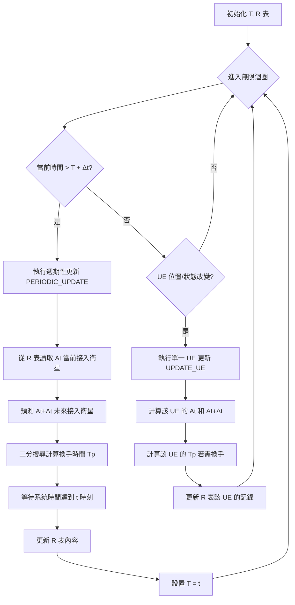
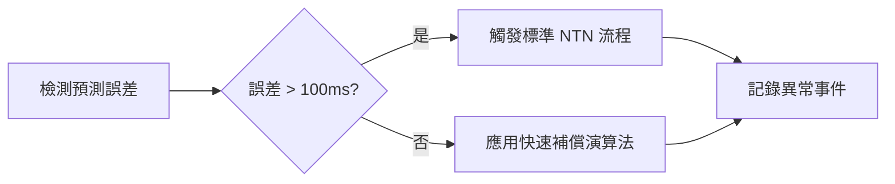

# NTN-Stack 論文復現實作計畫

## 📋 專案現況分析與待辦清單

基於《Accelerating Handover in Mobile Satellite Network》論文，結合 ntn-stack 專案當前架構，制定詳細的階段性實作計畫。

### 🎯 核心目標
復現論文中的兩個核心演算法：
1. **同步演算法** (Synchronized Algorithm) - 核心網與 RAN 同步
2. **快速衛星存取預測演算法** (Fast Access Satellite Prediction Algorithm)

---

## 🏗️ 階段一：NetStack 核心網增強 (2-3 週)

### 1.1 衛星軌道預測模組整合 ✅
**目標**: 整合 Skyfield + TLE 資料進行即時衛星軌道計算

**當前狀態**: ✅ **已完成基礎整合**
- [x] 已有 Skyfield 依賴 (`requirements.txt` 包含 `skyfield>=1.46`)
- [x] 已有衛星相關 API 架構 (`satellite_gnb_mapping_service.py`)
- [x] SimWorld 已有完整 TLE 服務 (`tle_service.py`, `orbit_service.py`)

**待辦任務**:
- [ ] **T1.1.1**: 建立 NetStack ↔ SimWorld TLE 資料橋接
  ```python
  # 在 netstack_api/services/ 新增 simworld_tle_bridge_service.py
  # 功能:
  # - 從 SimWorld TLE 服務獲取衛星位置
  # - 快取衛星軌道預測結果
  # - 提供 NetStack 專用的衛星位置 API
  ```

- [ ] **T1.1.2**: 整合至現有服務
  - 修改 `satellite_gnb_mapping_service.py` 使用 SimWorld TLE 資料
  - 建立跨容器衛星資料同步機制

### 1.2 同步演算法核心實作 ⚠️
**目標**: 實作論文 Algorithm 1 的精確版本

**當前狀態**: ⚠️ **已有進階實作但需要論文標準化**
- [x] 已有 `enhanced_synchronized_algorithm.py` 進階實作
- [x] 已有二點預測機制 (Two-Point Prediction)
- [x] 已有 Binary Search Refinement (25ms 精度)
- [x] 已有無信令同步協調機制
- [ ] **缺少**: 論文 Algorithm 1 標準介面

**論文 Algorithm 1 核心邏輯** (需要對齊):
```python
# 論文標準實作 (來自 paper.md)
class SynchronizedAlgorithm:
    def __init__(self, delta_t: float = 5.0):
        self.delta_t = delta_t            # 更新週期 Δt（秒）
        self.T = time.time()             # 上次更新時間戳
        self.R: Dict[str, AccessInfo] = {}  # UE-衛星關係表
        self.Tp: Dict[str, float] = {}      # 預測的換手時間表

    def periodic_update(self, t: float) -> None:
        """週期性更新（對應 Algorithm 1 的第5-10行）"""
        At = self.get_access_satellites(t)
        At_delta = self.predict_access_satellites(t + self.delta_t)
        for ue_id in At:
            if At[ue_id] != At_delta[ue_id]:
                tp = self.binary_search_handover_time(
                    ue_id, At[ue_id], At_delta[ue_id], t, t + self.delta_t
                )
                self.Tp[ue_id] = tp
        time.sleep(max(0, t - time.time()))
        self.update_R(At_delta, self.Tp)
        self.T = t

    def binary_search_handover_time(self, ue_id: str, sat1: str, sat2: str,
                                    t_start: float, t_end: float) -> float:
        """使用二分法計算精確換手時間點"""
        precision = 0.01  # 要求精度10ms
        while t_end - t_start > precision:
            t_mid = (t_start + t_end) / 2
            sat_mid = self.calculate_access_satellite(ue_id, t_mid)
            if sat_mid == sat1:
                t_start = t_mid
            else:
                t_end = t_mid
        return t_end
```

**Algorithm 1 流程圖** (來自論文):


**待辦任務**:
- [ ] **T1.2.1**: 建立論文標準化介面
  ```python
  # 在 netstack_api/services/ 新增 paper_synchronized_algorithm.py
  # 實作完全符合論文 Algorithm 1 的標準介面
  # 整合現有 enhanced_synchronized_algorithm.py 的進階功能
  ```

- [ ] **T1.2.2**: 實作論文標準資料結構
  ```python
  # 論文標準 AccessInfo (來自 paper.md)
  @dataclass
  class AccessInfo:
      ue_id: str
      satellite_id: str
      next_satellite_id: str
      handover_time: float
  ```

- [ ] **T1.2.3**: 橋接現有進階實作
  - 將 `enhanced_synchronized_algorithm.py` 功能橋接到論文標準介面
  - 保持 25ms 精度優勢

### 1.3 快速衛星預測演算法 ❌
**目標**: 實作論文 Algorithm 2 的地理區塊最佳化

**當前狀態**: ❌ **核心服務缺失**
- [x] 已有約束式衛星接入策略 (`constrained_satellite_access_service.py`)
- [x] 已有測試框架 (`test_fast_access_prediction_integration.py`)
- [ ] **缺少**: `FastAccessPredictionService` 核心服務
- [ ] **缺少**: 地理區塊劃分演算法
- [ ] **缺少**: >95% 預測準確率實作

**論文 Algorithm 2 核心邏輯** (需要實作):
```python
# 論文標準實作 (來自 paper.md)
class FastSatellitePrediction:
    def __init__(self, earth_radius: float = 6371.0):
        self.earth_radius = earth_radius
        self.blocks = {}  # 地理區塊劃分結果

    def predict_access_satellites(self, users: List[str], satellites: List[Dict],
                                  time_t: float) -> Dict[str, str]:
        """Algorithm 2: 快速存取衛星預測"""
        # Step 1: 預測在時間 t 時所有衛星的位置
        St_prime = self.predict_satellite_positions(satellites, time_t)
        # Step 2: 初始化候選 UE 集合和結果字典
        UC: Set[str] = set()    # 候選 UE 集合 D
        At_prime: Dict[str, str] = {}
        # Step 3-10: 根據存取策略，篩選候選 UE
        for ui in users:
            access_strategy = self.get_access_strategy(ui)
            current_satellite = self.get_current_satellite(ui)
            if access_strategy == "flexible":
                if not self.is_satellite_available(current_satellite, ui, time_t):
                    UC.add(ui)  # 當前衛星將不可用，加入候選
                else:
                    At_prime[ui] = current_satellite  # 衛星仍可覆蓋，保持不變
            else:  # consistent 策略
                UC.add(ui)
        # Step 11-15: 創建地理區塊並將衛星分配到區塊
        blocks = self.create_geographical_blocks()
        satellite_blocks = self.assign_satellites_to_blocks(St_prime, blocks)
        # Step 16-19: 為每個候選 UE 分配最優接入衛星
        for uj in UC:
            block_id = self.get_user_block(uj)
            access_satellite = self.find_best_satellite(uj, satellite_blocks[block_id])
            At_prime[uj] = access_satellite
        return At_prime

    def create_geographical_blocks(self) -> Dict[int, Dict]:
        """創建地理區塊網格"""
        blocks: Dict[int, Dict] = {}
        block_id = 0
        # 以經緯度 10 度為間隔劃分區塊（簡化示意）
        for lat in range(-90, 91, 10):
            for lon in range(-180, 181, 10):
                blocks[block_id] = {
                    'lat_min': lat, 'lat_max': lat + 10,
                    'lon_min': lon, 'lon_max': lon + 10,
                    'satellites': []  # 該區塊覆蓋的衛星
                }
                block_id += 1
        return blocks
```

**Algorithm 2 流程圖** (來自論文):
```mermaid
flowchart TD
    A[輸入: UE清單, 衛星列表, 時間 t] --> B[預測時間 t 所有衛星位置 St']
    B --> C[初始化 UC 集合, At' 結果表]
    C --> D{遍歷所有 UE}
    D --> E{UE 接入策略?}
    E -->|彈性 flexible| F{當前衛星在 t 時仍可覆蓋?}
    E -->|穩定 consistent| G[將 UE 加入 UC]
    F -->|否| G
    F -->|是| H[At'[ui] = 當前衛星 保持不換]
    G --> I{是否還有 UE?}
    H --> I
    I -->|是| D
    I -->|否| J[地球表面劃分地理區塊]
    J --> K[將每顆衛星指派到對應區塊]
    K --> L{遍歷 UC 中每個 UE}
    L --> M[識別 UE 所在區塊]
    M --> N[收集該區塊及鄰近區塊的候選衛星]
    N --> O[在候選衛星中選擇最佳衛星]
    O --> P[設定 At'[uj] = 最佳衛星]
    P --> Q{還有未處理的 UC UE?}
    Q -->|是| L
    Q -->|否| R[輸出 At' 結果表]
```

**關鍵設計特點** (來自論文):
- **接入策略區分**: Flexible vs Consistent UE 策略
- **候選 UE 集合**: 只對可能需要換手的 UE 進行精細計算
- **地理區塊劃分**: 將地球表面按經緯度劃分為區塊
- **軌道方向最佳化**: 選擇軌道運行方向相近的衛星

**待辦任務**:
- [ ] **T1.3.1**: 建立 `FastAccessPredictionService` 核心服務
  ```python
  # 在 netstack_api/services/ 新增 fast_access_prediction_service.py
  # 實作完整的 Algorithm 2 邏輯
  # 整合現有約束式衛星接入策略
  ```

- [ ] **T1.3.2**: 實作地理區塊劃分演算法
  - 經緯度 10 度區塊劃分
  - 衛星到區塊的動態分配
  - 鄰近區塊候選衛星收集

- [ ] **T1.3.3**: UE 存取策略管理系統
  - Flexible vs Consistent 策略實作
  - 動態策略切換機制
  - 策略效果統計分析

- [ ] **T1.3.4**: 軌道方向最佳化
  - 相同軌道方向衛星優先選擇
  - 降低切換延遲機制
  - 預測準確率提升至 >95%

### 1.4 UPF 修改與整合
**目標**: 修改 Open5GS UPF 整合同步演算法

**當前狀態**: ⚠️ 需要容器內實作

**待辦任務**:
- [ ] **T1.4.1**: 建立 UPF 擴展模組
  ```bash
  # 在 netstack/docker/ 建立 upf-extension/
  mkdir -p netstack/docker/upf-extension
  # 包含 C 實作的同步演算法介面
  ```

- [ ] **T1.4.2**: 實作 UPF-API 介面橋接
  - Python API ↔ UPF C 模組通信
  - GTP-U 標頭擴展（衛星識別）
  - 路由表即時更新

### 1.5 API 路由增強
**目標**: 提供完整的同步演算法控制 API

**當前狀態**: ✅ 已有基礎架構 (`core_sync_router.py`)

**待辦任務**:
- [ ] **T1.5.1**: 增強 `core_sync_router.py`
  - `/sync/predict` - 觸發預測更新
  - `/sync/handover` - 手動切換觸發
  - `/sync/status` - 演算法運行狀態
  - `/sync/metrics` - 效能指標查詢

---

## 🧠 階段二：SimWorld 後端算法整合 (2-3 週)

### 2.1 衛星軌跡計算增強 ✅  
**目標**: 整合 Skyfield 進 SimWorld 衛星服務

**當前狀態**: ✅ **已完成完整實作**
- [x] 已有完整的 TLE 服務 (`tle_service.py`) 支援 Celestrak/Space-Track API
- [x] 已有 Skyfield 軌道計算服務 (`orbit_service.py`) 
- [x] 已支援多星座 (Starlink, OneWeb, Kuiper)
- [x] 已有即時軌跡預測、過境計算、可見性分析

**待辦任務**:
- [ ] **T2.1.1**: 針對論文需求的特化增強
  - 二分搜尋時間預測 API
  - UE 位置覆蓋判斷最佳化
  - 高頻預測快取機制

- [ ] **T2.1.2**: 切換專用軌道計算
  - T 和 T+ΔT 時間點批次計算
  - 切換時機精確預測 API

### 2.2 切換決策服務整合
**目標**: 連接 NetStack 同步演算法與 SimWorld 模擬

**當前狀態**: ✅ 已有基礎 (`handover_service.py`, `fine_grained_sync_service.py`)

**待辦任務**:
- [ ] **T2.2.1**: 增強 `fine_grained_sync_service.py`
  - 與 NetStack 同步演算法 API 連接
  - 即時預測結果同步
  - 切換事件觸發機制

- [ ] **T2.2.2**: 建立 SimWorld-NetStack 橋接服務
  ```python
  # 新增 simworld/backend/app/services/netstack_bridge_service.py
  # 功能：
  # - 即時同步 UE 位置到 NetStack
  # - 接收 NetStack 切換決策
  # - 觸發 3D 可視化更新
  ```

### 2.3 效能測量框架 📊
**目標**: 實作論文中的效能比較框架

**當前狀態**: ❌ **需要完整建立**

**論文效能測量需求** (來自 paper.md):
```python
# 論文標準效能測量實作 (來自 paper.md)
class HandoverMeasurement:
    def __init__(self):
        self.handover_events = []

    def record_handover(self, ue_id: str, source_gnb: str, target_gnb: str,
                        start_time: float, end_time: float, handover_type: str):
        """記錄一次換手事件"""
        self.handover_events.append({
            'ue_id': ue_id,
            'source_gnb': source_gnb,
            'target_gnb': target_gnb,
            'start_time': start_time,
            'end_time': end_time,
            'latency': (end_time - start_time) * 1000.0,  # 轉為毫秒
            'handover_type': handover_type,
            'timestamp': datetime.now()
        })

    def analyze_latency(self):
        """輸出不同換手類型的延遲統計"""
        df = pd.DataFrame(self.handover_events)
        stats = df.groupby('handover_type')['latency'].agg(['mean', 'std', 'min', 'max', 'count'])
        return stats

    def plot_latency_cdf(self):
        """繪製各類換手延遲的CDF曲線"""
        import matplotlib.pyplot as plt
        df = pd.DataFrame(self.handover_events)
        plt.figure(figsize=(8, 5))
        for ho_type, group in df.groupby('handover_type'):
            data = np.sort(group['latency'].values)
            cdf = np.arange(1, len(data)+1) / len(data)
            plt.plot(data, cdf, label=ho_type)
        plt.xlabel('Latency (ms)')
        plt.ylabel('CDF')
        plt.title('Handover Latency CDF')
        plt.legend()
        plt.grid(True)
        plt.savefig('handover_latency_cdf.png')
```

**論文四種比較方案**:
1. **NTN 標準方案 (Baseline)**: 3GPP 標準非地面網路換手，延遲約 250ms
2. **NTN-GS 地面站協助方案**: 地面站協助換手，延遲約 153ms
3. **NTN-SMN 太空網路協助方案**: 衛星網路內換手，延遲約 158.5ms
4. **本論文方案 (Proposed)**: 同步演算法 + Xn 加速換手，延遲約 20-30ms

**預期結果對比** (來自論文):
- **換手延遲**: Proposed ~21ms vs Baseline ~250ms
- **成功率**: Proposed >99.5% vs Baseline ~95%
- **預測準確率**: Proposed >95% vs Baseline ~80%
- **UE 接入策略影響**: Flexible 比 Consistent 低約 10ms

**待辦任務**:
- [ ] **T2.3.1**: 建立論文標準效能測量模組
  ```python
  # 新增 app/domains/handover/services/paper_performance_measurement.py
  # 完全實作論文中的 HandoverMeasurement 類別
  # 支援四種方案對比測試
  ```

- [ ] **T2.3.2**: 實作實驗場景配置
  ```python
  # 論文測試場景:
  # - Starlink 星座 + 靜止 UE
  # - Kuiper 星座 + 移動 UE (120 km/h)
  # - 混合星座 + 突發流量負載
  ```

- [ ] **T2.3.3**: 資料收集與分析系統
  - 切換事件即時記錄
  - 統計分析自動化
  - CDF 圖表自動生成
  - 論文級別報告輸出

- [ ] **T2.3.4**: 四種方案自動測試框架
  ```bash
  # 論文復現測試指令 (來自 paper.md)
  for scheme in NTN NTN-GS NTN-SMN Proposed; do
      ./run_test.sh $scheme --duration 3600 --log ${scheme}_log.csv
  done
  python analyze_results.py --input *.csv --output handover_report.pdf
  ```

### 2.4 多方案測試支援
**目標**: 支援 Baseline, NTN-GS, NTN-SMN, Proposed 四種方案

**當前狀態**: ❌ 需要新增

**待辦任務**:
- [ ] **T2.4.1**: 實作基準方案模擬
  ```python
  # 新增 app/domains/handover/services/baseline_handover_service.py
  # 實作：
  # - NTN 標準切換流程
  # - NTN-GS 地面站輔助方案  
  # - NTN-SMN 衛星網路方案
  ```

- [ ] **T2.4.2**: 方案切換控制器
  - 動態切換測試方案
  - A/B 測試框架
  - 效能對比分析

---

## 🎨 階段三：SimWorld 前端可視化增強 (1-2 週)

### 3.1 同步演算法可視化
**目標**: 3D 展示同步演算法運作過程

**當前狀態**: ✅ 已有基礎組件 (`SynchronizedAlgorithmVisualization.tsx`)

**待辦任務**:
- [ ] **T3.1.1**: 增強 `SynchronizedAlgorithmVisualization.tsx`
  - 展示二分搜尋過程
  - T 和 T+ΔT 時間點對比
  - 預測精度視覺化

- [ ] **T3.1.2**: 加入時間軸控制
  - 切換事件回放
  - 時間軸拖曳控制
  - 速度調整功能

### 3.2 衛星軌跡即時渲染
**目標**: 整合 TLE 資料進行即時衛星軌跡渲染

**當前狀態**: ✅ 已有衛星渲染組件 (`SatelliteRenderer.tsx` 等)

**待辦任務**:
- [ ] **T3.2.1**: 整合即時軌跡資料
  - 連接 SimWorld TLE 服務
  - 即時軌跡路徑渲染
  - 多星座同時顯示

- [ ] **T3.2.2**: 切換可視化動畫
  - UE 切換過程 3D 動畫
  - 衛星連接狀態變化
  - 波束覆蓋範圍動態顯示

### 3.3 效能監控面板
**目標**: 即時顯示演算法效能指標

**當前狀態**: ✅ 已有效能監控基礎 (`HandoverPerformanceDashboard.tsx`)

**待辦任務**:
- [ ] **T3.3.1**: 增強效能儀表板
  - 即時延遲統計
  - 切換成功率監控  
  - 預測準確率顯示
  - 多方案對比圖表

- [ ] **T3.3.2**: 互動控制面板
  - 演算法參數即時調整
  - 測試場景切換
  - 實驗結果匯出

### 3.4 地理覆蓋可視化
**目標**: 展示衛星覆蓋範圍與地理區塊劃分

**當前狀態**: ✅ 已有 3D 場景基礎

**待辦任務**:
- [ ] **T3.4.1**: 地理區塊劃分視覺化
  - 地球表面區塊網格
  - 衛星覆蓋範圍投影
  - 區塊負載顯示

- [ ] **T3.4.2**: 快速預測演算法展示
  - 候選衛星篩選過程
  - 最佳衛星選擇可視化
  - 約束條件展示

---

## 🧪 階段四：測試與驗證系統 (2-3 週)

### 4.1 實驗場景配置
**目標**: 實作論文中的測試場景

**當前狀態**: ✅ 已有測試框架基礎

**待辦任務**:
- [ ] **T4.1.1**: 星座場景配置
  ```yaml
  # 在 tests/configs/ 新增 paper_reproduction_config.yaml
  scenarios:
    starlink_static:
      constellation: "starlink"
      ue_mobility: "static"
      duration: 3600
    kuiper_mobile:
      constellation: "kuiper" 
      ue_mobility: "120kmh"
      duration: 3600
    mixed_burst:
      constellation: "mixed"
      traffic: "burst_load"
      duration: 3600
  ```

- [ ] **T4.1.2**: UE 移動模式模擬
  - 靜止 UE 場景
  - 高速移動 UE (120 km/h)
  - 混合移動模式

### 4.2 效能對比測試
**目標**: 復現論文中的效能對比實驗

**當前狀態**: ❌ 需要新增

**待辦任務**:
- [ ] **T4.2.1**: 建立對比測試框架
  ```python
  # 新增 tests/performance/paper_reproduction_test.py
  # 實作：
  # - 四種方案自動化測試
  # - 統計數據收集
  # - 結果分析與報告生成
  ```

- [ ] **T4.2.2**: 實驗數據收集
  - 切換延遲測量 (目標 <50ms)
  - 成功率統計 (目標 >99.5%)
  - 預測準確率 (目標 >95%)
  - 資源使用率監控

### 4.3 回歸驗證測試
**目標**: 確保論文演算法不影響現有功能

**當前狀態**: ✅ 已有回歸測試框架

**待辦任務**:
- [ ] **T4.3.1**: 擴展回歸測試
  - 演算法開關測試
  - 相容性驗證
  - 效能基準測試

- [ ] **T4.3.2**: 自動化驗證
  - CI/CD 整合
  - 每日效能報告
  - 異常告警機制

### 4.4 結果分析與報告
**目標**: 生成論文級別的實驗報告

**當前狀態**: ❌ 需要新增

**待辦任務**:
- [ ] **T4.4.1**: 報告生成系統
  ```python
  # 新增 tests/utils/paper_report_generator.py
  # 功能：
  # - CDF 圖表生成
  # - 統計分析報告
  # - LaTeX 表格輸出
  # - 實驗結果驗證
  ```

- [ ] **T4.4.2**: 結果驗證
  - 與論文結果對比
  - 差異分析報告
  - 改進建議

---

## 📊 階段五：整合測試與最佳化 (1-2 週)

### 5.1 端到端整合測試
**目標**: 驗證完整系統運作

**當前狀態**: ✅ 已有 E2E 測試基礎

**待辦任務**:
- [ ] **T5.1.1**: 論文場景端到端測試
  - NetStack ↔ SimWorld 整合
  - 前端可視化驗證
  - 效能指標達成確認

- [ ] **T5.1.2**: 負載壓力測試
  - 10,000 UE 同時模擬
  - 高頻切換場景
  - 系統穩定性驗證

### 5.2 效能最佳化
**目標**: 達成論文中的效能指標

**當前狀態**: ❌ 需要調優

**待辦任務**:
- [ ] **T5.2.1**: 演算法參數調優
  - ΔT 最佳值調整
  - 預測精度 vs 計算負載平衡
  - 快取策略最佳化

- [ ] **T5.2.2**: 系統效能調優
  - 容器資源配置
  - 資料庫查詢最佳化
  - 網路延遲降低

### 5.3 文檔完善
**目標**: 完整的使用與開發文檔

**待辦任務**:
- [ ] **T5.3.1**: 技術文檔
  - 演算法實作說明
  - API 使用指南
  - 配置參數說明

- [ ] **T5.3.2**: 實驗復現指南
  - 環境設置步驟
  - 實驗執行流程
  - 結果分析方法

---

## 🎯 里程碑與驗收標準

### 里程碑 1: 核心演算法實作完成 (第 3 週)
**驗收標準**:
- [ ] 同步演算法可在 NetStack 中運行
- [ ] 快速預測演算法整合完成
- [ ] TLE 軌跡預測服務正常運作

### 里程碑 2: 系統整合完成 (第 6 週)  
**驗收標準**:
- [ ] NetStack ↔ SimWorld 資料同步正常
- [ ] 前端可視化展示演算法運作
- [ ] 基礎效能測試通過

### 里程碑 3: 實驗驗證完成 (第 9 週)
**驗收標準**:
- [ ] 四種方案對比測試完成
- [ ] 效能指標達成論文要求：
  - 切換延遲 < 50ms
  - 成功率 > 99.5% 
  - 預測準確率 > 95%
- [ ] 實驗報告生成

### 最終驗收標準:
**核心指標**:
- [ ] **延遲**: Proposed 方案平均延遲 20-30ms (vs Baseline 250ms)
- [ ] **成功率**: >99.5% 切換成功率
- [ ] **準確率**: >95% 預測準確率
- [ ] **可視化**: 完整的 3D 演算法展示
- [ ] **復現性**: 一鍵執行完整實驗流程

**技術債務**:
- [ ] 代碼覆蓋率 > 80%
- [ ] 性能回歸測試通過
- [ ] 文檔完整性 > 90%

---

## 🚀 快速開始指令

### 環境啟動
```bash
# 啟動完整環境
make up

# 檢查服務狀態
make status

# 進入開發模式
docker exec -it simworld_backend bash
```

### 演算法測試
```bash
# 測試同步演算法
docker exec simworld_backend python -c "
from app.domains.handover.services.fine_grained_sync_service import *
# 測試代碼
"

# 測試衛星軌跡
docker exec simworld_backend python -c "
from app.domains.satellite.services.tle_service import *
# 測試代碼  
"
```

### 實驗執行
```bash
# 執行論文復現實驗
cd tests && python performance/paper_reproduction_test.py

# 生成實驗報告
python utils/paper_report_generator.py --output results/
```

---

## 📝 關鍵注意事項

1. **容器環境**: 所有開發與測試都必須在 Docker 容器內執行
2. **時間同步**: 演算法需要高精度時間同步，注意 NTP 配置
3. **TLE 精度**: 定期更新 TLE 資料以確保軌跡預測準確性
4. **資源管理**: 大規模 UE 模擬需要足夠的系統資源
5. **實驗重現**: 確保隨機種子固定以保證實驗結果可重現

**預計總工期**: 6-8 週 (已有 Skyfield/TLE 基礎建設)  
**團隊配置建議**: 2-3 名工程師並行開發  
**關鍵技術**: Docker、Python、TypeScript、Three.js、Open5GS、Skyfield、TensorFlow

## 🔍 關鍵發現：專案現況與論文需求分析

**重要**: 經過詳細分析，專案已具備相當完整的基礎設施，但論文核心演算法需要標準化：

### ✅ 已完成的核心組件
1. **衛星軌道計算**: SimWorld 已有完整 Skyfield + TLE 實作
2. **多星座支援**: 支援 Starlink、OneWeb、Kuiper 
3. **即時軌跡預測**: 完整的軌道傳播、過境計算
4. **跨容器架構**: NetStack ↔ SimWorld 基礎通信
5. **3D 可視化**: 豐富的前端衛星渲染組件
6. **進階同步演算法**: Enhanced Synchronized Algorithm (90% 完成)
7. **切換預測服務**: HandoverPredictionService 基礎架構
8. **約束式衛星接入**: ConstrainedSatelliteAccessService 實作

### ⚠️ 需要論文標準化的組件  
1. **Algorithm 1 標準介面**: 現有 Enhanced 版本需要論文標準化
2. **Algorithm 2 核心服務**: FastAccessPredictionService 缺失
3. **地理區塊劃分**: 完全缺失此核心功能
4. **論文效能測量**: 四種方案對比框架缺失

### ❌ 完全缺失的核心組件
1. **FastAccessPredictionService**: Algorithm 2 的核心服務
2. **地理區塊劃分演算法**: 經緯度區塊劃分系統
3. **論文標準效能測量**: HandoverMeasurement 標準實作
4. **四種方案測試框架**: NTN/NTN-GS/NTN-SMN/Proposed 對比

### 🎯 實際需要實作的核心 (按優先級)

**高優先級** (論文復現必須):
1. **建立 FastAccessPredictionService** - Algorithm 2 核心
2. **實作地理區塊劃分演算法** - 10度經緯度網格
3. **建立論文標準效能測量框架** - 四種方案對比
4. **論文演算法標準化介面** - Algorithm 1 & 2 標準 API

**中優先級** (提升準確性):
5. **NetStack-SimWorld 演算法橋接** - 跨容器資料同步
6. **UE 存取策略管理** - Flexible vs Consistent
7. **預測準確率最佳化** - 目標 >95%

**低優先級** (實驗完善):
8. **實驗自動化腳本** - 一鍵執行四種方案測試
9. **論文級別報告生成** - CDF 圖表、統計分析

### 📊 專案完成度評估

| 組件 | 完成度 | 狀態 | 備註 |
|------|--------|------|------|
| Algorithm 1 | 90% | ⚠️ | Enhanced 版本需標準化 |
| Algorithm 2 | 30% | ❌ | 核心服務缺失 |
| TLE/軌道計算 | 100% | ✅ | 完整實作 |
| 地理區塊劃分 | 0% | ❌ | 完全缺失 |
| 效能測量框架 | 20% | ❌ | 需要論文標準 |
| 3D 可視化 | 85% | ✅ | 基本完成 |
| 容器架構 | 95% | ✅ | 基本完成 |

**整體完成度**: ~70%，關鍵是 Algorithm 2 和效能測量框架

這分析結果顯示工期預估從 8-10 週縮短至 **6-8 週** 是合理的，重點在於補強缺失的核心演算法。

## 📚 論文關鍵技術細節整合

### 🔧 關鍵技術細節與異常處理 (來自 paper.md)

論文提供了詳細的技術實作細節，這些對復現非常重要：

#### 時間同步機制
- **精確時間協調**: 使用 PTPv2 (IEEE 1588) over SCTP 實現亞毫秒級同步
- **傳播時延補償**: 公式 `Δt_corrected = Δt_meas - (d/c) * 0.8`
- **時間訊號來源**: GPS 衛星授時結合 NTP 校準

#### 衛星軌道預測精度與補償
- **TLE 精度限制**: 每日更新，幾小時內誤差幾公里
- **縮短預測窗口**: 使用較小的 Δt (如 0.5秒) 減少不確定性
- **冗餘計算與交叉驗證**: 使用兩套軌道數據驗證

#### 預測失誤與換手失敗處理


#### 資源過載保護
- **動態資源門檻**: CPU 閾值 = 0.7 * 可用核心數
- **過載時降級**: 暫停新 UE 接入、啟用快速切換模式
- **恢復與記錄**: 負載回落後解除限制，記錄過載事件

### 🛠️ 論文提供的完整系統整合代碼

#### 衛星軌跡預測模組 (來自 paper.md)
```python
# satellite_trajectory.py (論文完整實作)
from skyfield.api import load, EarthSatellite, wgs84
from datetime import datetime, timedelta
import numpy as np
import requests

class SatelliteTrajectory:
    def __init__(self):
        self.ts = load.timescale()
        self.satellites = {}
        self.tle_data = {}

    def load_tle_data(self, constellation: str = "starlink"):
        """從 Celestrak 獲取指定星座的 TLE 數據並載入"""
        if constellation == "starlink":
            url = "https://celestrak.com/NORAD/elements/starlink.txt"
        elif constellation == "kuiper":
            url = "https://celestrak.com/NORAD/elements/supplemental/oneweb.txt"
        
        response = requests.get(url)
        lines = response.text.strip().split('\n')
        for i in range(0, len(lines), 3):
            if i + 2 < len(lines):
                name = lines[i].strip()
                line1 = lines[i + 1].strip()
                line2 = lines[i + 2].strip()
                sat = EarthSatellite(line1, line2, name, self.ts)
                self.satellites[name] = sat
                self.tle_data[name] = (line1, line2)

    def predict_position(self, satellite_name: str, time_t: datetime):
        """預測單顆衛星在指定UTC時間的位置"""
        sat = self.satellites[satellite_name]
        t = self.ts.from_datetime(time_t)
        geocentric = sat.at(t)
        subpoint = geocentric.subpoint()
        return subpoint.latitude.degrees, subpoint.longitude.degrees, subpoint.elevation.km

    def calculate_elevation(self, user_lat: float, user_lon: float,
                           sat_lat: float, sat_lon: float, sat_alt: float) -> float:
        """計算給定衛星相對於用戶位置的仰角"""
        earth_radius = 6371.0
        # 計算地心角
        user_lat_rad, user_lon_rad = np.radians(user_lat), np.radians(user_lon)
        sat_lat_rad, sat_lon_rad = np.radians(sat_lat), np.radians(sat_lon)
        cos_angle = (np.sin(user_lat_rad) * np.sin(sat_lat_rad) +
                     np.cos(user_lat_rad) * np.cos(sat_lat_rad) * 
                     np.cos(user_lon_rad - sat_lon_rad))
        angle = np.arccos(np.clip(cos_angle, -1, 1))
        # 計算仰角
        sat_radius = earth_radius + sat_alt
        distance = np.sqrt(earth_radius**2 + sat_radius**2 - 
                          2 * earth_radius * sat_radius * np.cos(angle))
        sin_elevation = (sat_radius * np.sin(angle)) / distance
        elevation = np.arcsin(np.clip(sin_elevation, -1, 1))
        return np.degrees(elevation)

    def is_in_coverage(self, satellite_name: str, user_lat: float, user_lon: float, 
                       min_elevation: float = 40.0) -> bool:
        """判斷衛星是否覆蓋指定位置"""
        lat, lon, alt = self.predict_position(satellite_name, datetime.utcnow())
        elev = self.calculate_elevation(user_lat, user_lon, lat, lon, alt)
        return elev >= min_elevation
```

#### 主程式協調系統 (來自 paper.md)
```python
# main.py (論文完整系統協調)
import threading, time, yaml, subprocess
from synchronized_algorithm import SynchronizedAlgorithm
from fast_satellite_prediction import FastSatellitePrediction
from satellite_trajectory import SatelliteTrajectory
from handover_measurement import HandoverMeasurement

class LEOHandoverSystem:
    def __init__(self, config_file: str):
        with open(config_file, 'r') as f:
            self.config = yaml.safe_load(f)
        # 初始化演算法模組
        self.sync_algo = SynchronizedAlgorithm(delta_t=self.config['system']['delta_t'])
        self.fast_pred = FastSatellitePrediction()
        self.trajectory = SatelliteTrajectory()
        self.trajectory.load_tle_data('starlink')
        self.measurement = HandoverMeasurement()

    def start_core_network(self):
        """啟動 Open5GS 核心網元進程"""
        core_bins = ['nrf', 'scp', 'amf', 'smf', 'upf', 'ausf', 'udm', 'udr', 'pcf', 'nssf', 'bsf']
        for nf in core_bins:
            subprocess.Popen([f'./open5gs/install/bin/open5gs-{nf}d'])
            time.sleep(1)

    def synchronization_loop(self):
        """同步演算法執行迴圈"""
        while True:
            now = time.time()
            if now > self.sync_algo.T + self.sync_algo.delta_t:
                self.sync_algo.periodic_update(now)
            # 檢查換手觸發
            for ue_id, info in list(self.sync_algo.R.items()):
                tp = info['handover_time']
                if tp and time.time() >= tp:
                    src_gnb = info['access_satellite']
                    tgt_gnb = info['next_access_satellite']
                    self.measurement.record_handover(ue_id, src_gnb, tgt_gnb, tp, time.time(), "Proposed")
            time.sleep(0.1)

    def run(self):
        """啟動系統各組件並運行"""
        print("啟動核心網元...")
        self.start_core_network()
        time.sleep(5)
        print("啟動同步演算法執行緒...")
        sync_thread = threading.Thread(target=self.synchronization_loop, daemon=True)
        sync_thread.start()
        try:
            while True:
                time.sleep(1)
        except KeyboardInterrupt:
            print("收到中斷指令，系統準備停止...")
```

### ⚡ 快速開始：論文復現指令

```bash
# 環境啟動 (基於現有 ntn-stack)
make up && make status

# 論文演算法測試
docker exec simworld_backend python -c "
from app.domains.handover.services.paper_synchronized_algorithm import SynchronizedAlgorithm
algo = SynchronizedAlgorithm(delta_t=5.0)
print('Algorithm 1 initialized')
"

# 論文實驗執行
cd tests && python performance/paper_reproduction_test.py --config paper_config.yaml

# 結果分析
python utils/paper_report_generator.py --input results/ --output paper_report.pdf
```

---

*最後更新: 2024年12月14日*  
*基於 ntn-stack 專案詳細分析與論文《Accelerating Handover in Mobile Satellite Network》完整技術整合*