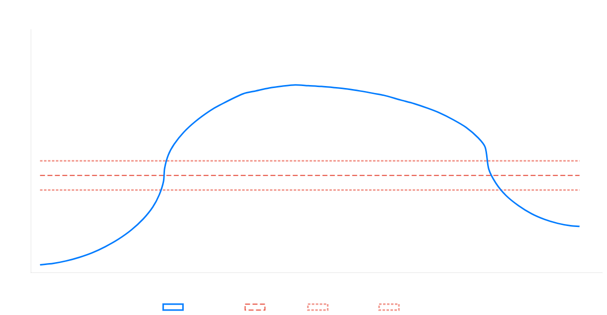
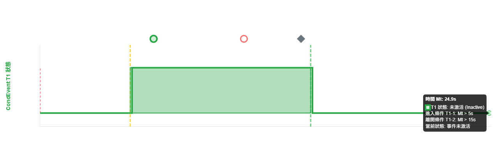

# 5G NR 低軌衛星換手事件簡報

本簡報介紹四個關鍵的 3GPP TS 38.331 測量事件：**A4、D1、D2、T1**，專門針對 5G NR 低軌道衛星（LEO）通訊的換手機制。這些事件協助網路決策何時觸發換手，確保服務連續性。

---

## 事件 A4：鄰區訊號優於門檻

**核心概念：** 當鄰近衛星的訊號品質超過設定門檻時觸發，是最常用的換手觸發條件。

**關鍵條件：**
- **觸發：** `Mn + Ofn + Ocn – Hys > Thresh`
- **取消：** `Mn + Ofn + Ocn + Hys < Thresh`

**圖表說明：**
- **藍色實線**：鄰區 RSRP 隨時間變化
- **橘色虛線**：設定的門檻值 (Thresh)
- **遲滯機制 (Hys)**：防止頻繁觸發的保護區間
- **綠色標記圈**：事件觸發點
- **橘色標記圈**：事件達到最佳條件點

---

## 事件 D1：雙參考點距離事件

**核心概念：** 基於 UE 與兩個固定參考點的距離關係觸發，適用於地理位置敏感的換手場景。

**關鍵條件：**
- **觸發：** `Ml1 – Hys > Thresh1` **且** `Ml2 + Hys < Thresh2`
- **取消：** `Ml1 + Hys < Thresh1` **或** `Ml2 – Hys > Thresh2`

**圖表說明：**
- **綠色線**：UE 與參考點1的距離
- **橘色線**：UE 與參考點2的距離  
- **水平虛線**：距離門檻值
- **綠色陰影區域**：事件觸發的時間窗口（兩條件同時滿足）

---

## 事件 D2：移動參考點距離事件

**核心概念：** 與 D1 類似，但參考點會移動（如衛星軌道），特別適用於 LEO 衛星動態環境。

**關鍵條件：**
- **觸發/取消條件與 D1 相同**，差異在於參考點為**移動的**
- **Ml1**：UE 與服務小區移動參考位置的距離
- **Ml2**：UE 與另一移動參考位置的距離

**圖表說明：**
- **綠色區域**：事件觸發期間（24.9s 持續時間）
- **浮動面板**：顯示當前時間、狀態及參數資訊
- **時間線游標**：互動式時間控制
- 支援衛星星曆計算的動態參考點更新

---

## 條件事件 T1：時間窗口事件

**核心概念：** 純時間驅動的條件事件，在特定時間窗口內激活，用於預測性換手機會。

**關鍵條件：**
- **觸發：** `Mt > Thresh1`  
- **取消：** `Mt > Thresh1 + Duration`

**圖表說明：**
- **X軸**：時間 (ms)
- **Y軸**：事件狀態（0=未激活，1=激活）
- **綠色方塊**：事件激活的時間窗口（5s 至 15s）
- **Duration = 10s**：事件持續時間
- 適用於基於軌道預測的換手時機控制

---

## 應用場景總結

| 事件 | 主要用途 | 觸發依據 | LEO 衛星應用 |
|------|----------|----------|--------------|
| **A4** | 訊號品質換手 | RSRP/RSRQ 門檻 | 衛星訊號強度監控 |
| **D1** | 地理位置換手 | 固定參考點距離 | 地面站覆蓋邊界 |
| **D2** | 動態位置換手 | 移動參考點距離 | 衛星軌道追蹤換手 |
| **T1** | 預測性換手 | 時間窗口 | 軌道預測換手機會 |

這四個事件提供了完整的 5G NR LEO 衛星換手解決方案，從訊號品質、地理位置到時間預測，確保無縫的服務連續性。
