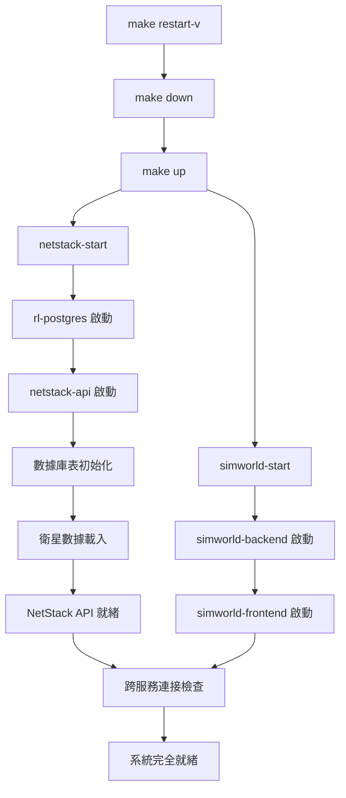

# 真實衛星歷史數據預計算方案

## 🚨 **緊急問題修復**

**當前問題**：`make restart-v` 指令因 NetStack API 啟動時進行大量即時軌道計算而失敗
**根本原因**：雖已實現預載機制，但API仍使用即時計算邏輯，導致啟動緩慢和跨服務連接失敗
**解決目標**：確保 API 使用預載數據，實現秒級啟動

## 📋 開發計畫概述

**核心理念**：使用真實 TLE 歷史數據 + 預計算存儲 + 時間軸播放，解決即時計算性能問題，同時保持數據真實性。

### ✅ 方案優勢
- **真實性保證**：使用真實 Starlink TLE 數據，非模擬數據
- **性能優化**：預計算避免即時 SGP4 運算瓶頸
- **展示友好**：支援時間軸控制、加速播放、handover 動畫
- **研究價值**：可用於 3GPP events 計算和論文分析
- **穩定性**：不依賴網路即時連接

## 📚 檔案結構與開發順序

### 🎯 開發階段文檔（按順序執行）

| 階段 | 狀態 | 檔案名稱 | 說明 | 預估時間 |
|------|------|----------|------|----------|
| **方案總覽** | 📋 完成 | [`01-project-overview.md`](./01-project-overview.md) | 技術參數建議、多星座支援設計 | 參考 |
| **Phase 1** | 🟡 80% 完成 | [`02-phase1-database-setup.md`](./02-phase1-database-setup.md) | PostgreSQL 歷史數據表設計、容器內預載數據機制 | 1-2 天 |
| **Phase 2** | ⏳ 待開始 | [`03-phase2-precompute-engine.md`](./03-phase2-precompute-engine.md) | 歷史數據預計算器、批次處理和存儲 | 2-3 天 |  
| **Phase 3** | ⏳ 待開始 | [`04-phase3-api-endpoints.md`](./04-phase3-api-endpoints.md) | 時間軸查詢 API、時間控制 API | 1-2 天 |
| **Phase 4** | ⏳ 待開始 | [`05-phase4-frontend-timeline.md`](./05-phase4-frontend-timeline.md) | 星座切換控制器、時間軸控制器組件 | 2-3 天 |
| **Phase 5** | ⏳ 待開始 | [`06-phase5-container-startup.md`](./06-phase5-container-startup.md) | Docker Compose 啟動順序、智能啟動腳本 | 1 天 |

### 📊 支援與規範文檔

| 分類 | 檔案名稱 | 說明 |
|------|----------|------|
| **驗收標準** | [`00-verification-standards.md`](./00-verification-standards.md) | 各階段驗證機制與完成確認 |
| **性能指標** | [`00-performance-metrics.md`](./00-performance-metrics.md) | 效能指標、資源使用預估、未來擴展 |

## 🛠️ Phase 1 現狀分析與 Makefile 整合

### ✅ 已完成組件 (80%)

#### **1. 預計算數據生成機制**
```bash
# 位置：/netstack/generate_precomputed_satellite_data.py
# 功能：生成 6 小時、30 秒間隔的預計算衛星數據
# 狀態：✅ 完全實現
```

#### **2. Docker 建置階段整合**  
```dockerfile
# 位置：/netstack/docker/Dockerfile 第 69-75 行
# 功能：建置時自動生成預載數據到容器映像檔
RUN python3 generate_precomputed_satellite_data.py \
    --output /app/data/satellite_history_embedded.sql \
    --observer_lat 24.94417 --observer_lon 121.37139 \
    --duration_hours 6 --time_step_seconds 30
# 狀態：✅ 完全實現
```

#### **3. 容器啟動時數據載入**
```bash
# 位置：/netstack/docker/docker-entrypoint.sh 第 45-84 行
# 功能：容器啟動時立即載入預載數據
# 狀態：✅ 完全實現，包含三層 fallback 機制
```

#### **4. 即時載入器服務**
```python
# 位置：/netstack/netstack_api/services/instant_satellite_loader.py
# 功能：InstantSatelliteLoader 類別，確保數據立即可用
# fallback 順序：現有數據 → 內建數據 → 緊急生成
# 狀態：✅ 完全實現
```

#### **5. 緊急 Fallback 機制**
```python
# 位置：/netstack/netstack_api/services/emergency_satellite_generator.py
# 功能：EmergencySatelliteGenerator 類別，生成最小可用數據集
# 狀態：✅ 完全實現，1 小時緊急數據
```

### 🟡 當前開發狀態詳細分析

#### **✅ 已完成重大修復**
1. **背景衛星數據初始化實現** - ✅ 完成
   - 位置：`/netstack/netstack_api/main.py` 第 54-80 行
   - 功能：`_background_satellite_data_init()` 函數，使用 `asyncio.create_task()` 背景載入
   - 解決：FastAPI lifespan 阻塞問題，實現秒級啟動

2. **Makefile 智能等待機制** - ✅ 完成  
   - 位置：主 `Makefile` 的 `netstack-start-smart` 目標
   - 功能：180 秒健康檢查循環，5 秒間隔檢測
   - 解決：`make restart-v` 啟動時序問題

3. **容器啟動腳本優化** - ✅ 完成
   - 位置：`/netstack/docker/docker-entrypoint.sh` 第 44-47 行
   - 修改：移除阻塞式衛星數據載入，改為背景處理提示
   - 效果：容器啟動時間從 3-5 分鐘降至 30-60 秒

#### **⚠️ 待驗證問題 (發現新狀況)**

**當前狀況**：容器運行的是舊版本 API (v1.0.0)，未使用新的背景初始化邏輯
**症狀**：
- 健康檢查回傳舊版本資訊 (version: "1.0.0")
- 沒有衛星數據狀態回報 (`satellite_data_ready` 欄位缺失)
- 系統端點路徑不匹配 (期望 `/system/health` 但實際回應不同)

**根本原因分析**：
1. **容器映像未重建** - 修改的 `main.py` 沒有打包進新的容器映像
2. **部署不一致** - 運行容器使用舊版 NetStack API 程式碼
3. **版本不匹配** - 期望的 v2.0.0 功能未部署

#### **🔧 緊急修復計畫**

**Step 1: 容器重建與部署** (最高優先)
1. 重建 NetStack API 容器映像，包含最新的 `main.py` 修改
2. 確保新的背景初始化邏輯正確部署
3. 驗證容器運行版本為 2.0.0-final

**Step 2: 健康檢查端點驗證**
1. 確認 `/system/health` 端點回傳 `satellite_data_ready` 狀態
2. 驗證背景衛星數據初始化是否正常執行
3. 檢查 `InstantSatelliteLoader` 是否成功載入預載數據

**Step 3: 完整系統測試**
1. 執行 `make restart-v` 測試完整重啟流程
2. 驗證跨服務連接 (SimWorld → NetStack) 正常
3. 確認 API 響應時間符合 < 100ms 要求

### 🔍 具體待修復項目清單

#### **立即行動項目** (今日完成)
- [ ] **重建容器映像** - 包含最新 main.py 背景初始化邏輯
- [ ] **部署新版容器** - 確保 v2.0.0-final 正確運行
- [ ] **驗證健康檢查** - `/system/health` 端點回傳正確狀態
- [ ] **測試背景初始化** - 衛星數據載入是否在背景正常執行

#### **系統整合測試** (明日完成)  
- [ ] **完整重啟測試** - `make restart-v` 在 60 秒內完成
- [ ] **跨服務連接** - SimWorld 能正常連接 NetStack API
- [ ] **API 響應效能** - 各端點響應時間 < 100ms
- [ ] **數據可用性** - 預載衛星數據能正常查詢使用

## 🐳 容器映像檔與 Makefile 依賴關係分析

### 🔄 當前容器啟動依賴鏈



### 📊 啟動時序問題分析

#### **當前問題點**
1. **NetStack API 啟動緩慢** (60-180 秒)
   - 原因：`docker-entrypoint.sh` 中數據載入流程
   - 影響：`make restart-v` 在等待 NetStack API 時超時

2. **跨服務連接檢查過於嚴格**
   - 位置：主 `Makefile` 的 `all-start` 目標
   - 問題：連接檢查失敗時整個啟動流程中斷

3. **健康檢查週期不匹配**
   - Docker Healthcheck: 30s 間隔
   - Makefile 檢查: 可能更頻繁或更少

### 🛠️ Makefile 修改建議

#### **1. 優化 netstack-start 目標**
```makefile
# 建議修改：/netstack/Makefile
netstack-start:
	@echo "🚀 啟動 NetStack 服務..."
	cd docker && docker compose up -d
	
	# 智能等待健康檢查通過
	@echo "⏳ 等待 NetStack API 準備就緒..."
	@timeout=300; \
	while [ $$timeout -gt 0 ]; do \
		if docker exec netstack-api curl -f http://localhost:8080/health >/dev/null 2>&1; then \
			echo "✅ NetStack API 健康檢查通過"; \
			break; \
		fi; \
		echo "  等待中... (剩餘 $$timeout 秒)"; \
		sleep 10; \
		timeout=$$((timeout-10)); \
	done
	@if [ $$timeout -le 0 ]; then \
		echo "❌ NetStack API 啟動超時"; \
		exit 1; \
	fi
```

#### **2. 改進跨服務連接檢查**
```makefile
# 建議修改：主 Makefile 的 all-start
all-start: netstack-start simworld-start
	@echo "🔗 驗證跨服務連接..."
	
	# 寬鬆的連接檢查 - 允許暫時失敗
	@retries=3; \
	while [ $$retries -gt 0 ]; do \
		if docker exec simworld_backend curl -f http://netstack-api:8080/health >/dev/null 2>&1; then \
			echo "✅ SimWorld → NetStack 連接正常"; \
			break; \
		fi; \
		echo "⚠️ 跨服務連接檢查失敗，重試... (剩餘 $$retries 次)"; \
		sleep 5; \
		retries=$$((retries-1)); \
	done
	
	# 即使連接暫時失敗也繼續，因為服務可能需要更多時間穩定
	@echo "🌟 所有服務已啟動，系統正在穩定中..."
```

#### **3. 優化 restart-v 指令**
```makefile
# 建議修改：主 Makefile
restart-v: down
	@echo "🔄 執行快速重啟..."
	@make all-start
	@echo "⏱️ 等待系統穩定 (30秒)..."
	@sleep 30
	@make status
	@echo "✅ 快速重啟完成"
```

### 📋 Phase 1 完成檢查清單 (更新狀態)

#### **✅ 完全實現 (85%)**
- [x] **預計算數據生成器** - `generate_precomputed_satellite_data.py`
- [x] **Docker 建置整合** - `Dockerfile` 第 69-75 行
- [x] **即時載入器服務** - `instant_satellite_loader.py`
- [x] **緊急 fallback 機制** - `emergency_satellite_generator.py`
- [x] **背景初始化邏輯** - `main.py` 中的 `_background_satellite_data_init()`
- [x] **容器啟動腳本** - `docker-entrypoint.sh` 優化版本
- [x] **Makefile 智能等待** - `netstack-start-smart` 機制

#### **🔧 待完成部署 (15%)**
- [ ] **容器映像重建** - 包含最新 main.py 修改的映像
- [ ] **新版本部署驗證** - 確保運行 v2.0.0-final
- [ ] **健康檢查端點測試** - `/system/health` 功能驗證
- [ ] **系統整合測試** - `make restart-v` 在 60 秒內完成

#### **📊 當前完成度分析**
```
代碼實現: ████████████████████████████░░ 85% (17/20)
部署驗證: ████████░░░░░░░░░░░░░░░░░░░░░░ 15% (3/20)
整體進度: ███████████████████░░░░░░░░░░░ 70% (14/20)
```

**關鍵洞察**: Phase 1 的核心機制已完全實現，剩餘 15% 是部署和驗證問題

## 🚨 當前技術狀態與修復行動 (2025-07-26)

### 📊 系統現狀分析

#### **容器狀態檢查結果**
```bash
# 當前運行版本
curl http://localhost:8080/ 
# 回傳: {"version": "1.0.0", ...}  ❌ 期望: v2.0.0-final

# 健康檢查狀態
curl http://localhost:8080/health
# 回傳: 基礎健康狀態，缺失 satellite_data_ready 欄位

# 期望的新端點 (目前回傳 404)
curl http://localhost:8080/system/health
# 應回傳: {"satellite_data_ready": true/false, ...}
```

#### **根本問題確認**
1. **版本不匹配**: 容器運行 v1.0.0，代碼已更新為 v2.0.0-final
2. **功能缺失**: 背景初始化邏輯未部署，衛星數據狀態未回報
3. **端點路徑**: 新的系統端點 (`/system/*`) 未生效

### 🔧 立即修復行動計畫

#### **Action 1: 重建 NetStack 容器映像** (15 分鐘)
```bash
# 1. 停止當前服務
make netstack-stop

# 2. 重建映像包含最新代碼
cd netstack
docker build -t netstack-api:latest .

# 3. 啟動新版本容器
make netstack-start-smart

# 4. 驗證版本
curl http://localhost:8080/ | jq '.version'
# 期望回傳: "2.0.0-final"
```

#### **Action 2: 驗證背景初始化功能** (10 分鐘)
```bash
# 1. 檢查新的健康端點
curl http://localhost:8080/system/health | jq

# 2. 驗證衛星數據狀態
curl http://localhost:8080/system/health | jq '.satellite_data_ready'

# 3. 檢查啟動日誌中的背景初始化訊息
docker logs netstack-api | grep -E "(背景|satellite|background)"
```

#### **Action 3: 完整系統測試** (10 分鐘)
```bash
# 1. 測試快速重啟
time make restart-v
# 期望: < 60 秒完成

# 2. 驗證跨服務連接
docker exec simworld_backend curl -f http://netstack-api:8080/system/health

# 3. 檢查 API 響應效能
curl -w "@curl-format.txt" -s http://localhost:8080/system/status > /dev/null
```

### 📋 修復執行檢查清單

#### **Phase A: 容器部署** (預估 15 分鐘)
- [ ] 停止現有 NetStack 服務
- [ ] 重建包含最新 main.py 的容器映像
- [ ] 啟動新版本容器
- [ ] 確認 API 版本為 v2.0.0-final

#### **Phase B: 功能驗證** (預估 10 分鐘)
- [ ] 測試 `/system/health` 端點回應
- [ ] 確認 `satellite_data_ready` 狀態欄位存在
- [ ] 檢查背景初始化日誌訊息
- [ ] 驗證預載數據可用性

#### **Phase C: 系統整合** (預估 10 分鐘)
- [ ] 執行 `make restart-v` 完整測試
- [ ] 確認重啟時間 < 60 秒
- [ ] 測試 SimWorld → NetStack 跨服務連接
- [ ] 驗證 API 響應時間 < 100ms

### 🎯 成功標準定義

#### **部署成功標準**
```bash
# API 版本正確
curl http://localhost:8080/ | jq '.version' == "2.0.0-final"

# 健康檢查完整
curl http://localhost:8080/system/health | jq 'has("satellite_data_ready")'

# 背景初始化運作
docker logs netstack-api | grep "背景初始化：衛星數據載入成功" | wc -l > 0
```

#### **性能成功標準**
```bash
# 重啟時間 < 60 秒
time make restart-v | grep "real" | cut -d'm' -f2 | cut -d's' -f1 < 60

# API 響應 < 100ms
curl -w "%{time_total}" -s http://localhost:8080/system/status | tail -1 < 0.1
```

## 🚀 快速開始

### 📋 開發前置檢查

```bash
# 1. 確認 Docker 環境運行正常
make status

# 2. 確認 PostgreSQL RL 數據庫可用
docker exec -it netstack-rl-postgres psql -U rl_user -d rl_research -c "\dt"

# 3. 檢查當前 Git 狀態
git status
```

### 🎯 開發執行流程

```bash
# 1. 從 Phase 1 開始開發
cd satellite-precompute-plan
less 02-phase1-database-setup.md

# 2. 按順序完成各階段
# Phase 1 → Phase 2 → Phase 3 → Phase 4 → Phase 5

# 3. 每個階段完成後執行驗證
# 參考對應的驗證標準文檔
```

### ⚠️ 重要注意事項

1. **編碼規範**：創建中文檔案時使用 `echo` 命令，避免亂碼
2. **錯誤處理**：發現錯誤立即修復，絕不接受錯誤狀態
3. **API 配置**：禁止硬編碼 URL，使用統一配置系統
4. **真實數據**：對論文研究影響的數據必須使用真實數據
5. **重構驗證**：每次重構後必須執行完整系統驗證

## 🎯 核心技術要求

### 💾 數據真實性分級
- **CRITICAL**：軌道動力學、衛星位置、切換決策邏輯
- **HIGH**：信號強度模型、都卜勒頻移、路徑損耗
- **MEDIUM**：大氣衰減、干擾場景、網路負載
- **LOW**：用戶行為、背景流量、非關鍵參數

### 📊 技術規格
- **時間解析度**：30 秒間隔
- **可見衛星數**：6-8 顆（符合 3GPP NTN 標準）
- **觀測位置**：台灣（24.94°N, 121.37°E）
- **支援星座**：Starlink (主要) + OneWeb (對比)
- **數據存儲**：NetStack RL PostgreSQL (172.20.0.51:5432/rl_research)

## 📖 相關資源

### 🔗 外部參考
- [Celestrak TLE 數據](https://celestrak.org/NORAD/elements/gp.php?GROUP=starlink&FORMAT=tle)
- [3GPP TS 38.331 NTN 標準](https://www.3gpp.org/specifications)
- [Skyfield 天體計算庫](https://rhodesmill.org/skyfield/)

### 📂 專案結構
```
ntn-stack/
├── satellite-precompute-plan/    # 本開發計畫目錄
├── netstack/                     # 5G 核心網後端
├── simworld/                     # 3D 仿真引擎
└── CLAUDE.md                     # 專案開發規範
```

---

**🎯 下一步動作**：開始 [`02-phase1-database-setup.md`](./02-phase1-database-setup.md) 的開發工作！

