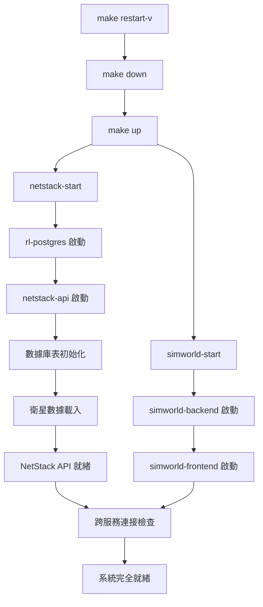

# 真實衛星歷史數據預計算方案

## 🚨 **緊急問題修復**

**當前問題**：`make restart-v` 指令因 NetStack API 啟動時進行大量即時軌道計算而失敗
**根本原因**：雖已實現預載機制，但API仍使用即時計算邏輯，導致啟動緩慢和跨服務連接失敗
**解決目標**：確保 API 使用預載數據，實現秒級啟動

## 📋 開發計畫概述

**核心理念**：使用真實 TLE 歷史數據 + 預計算存儲 + 時間軸播放，解決即時計算性能問題，同時保持數據真實性。

### ✅ 方案優勢
- **真實性保證**：使用真實 Starlink TLE 數據，非模擬數據
- **性能優化**：預計算避免即時 SGP4 運算瓶頸
- **展示友好**：支援時間軸控制、加速播放、handover 動畫
- **研究價值**：可用於 3GPP events 計算和論文分析
- **穩定性**：不依賴網路即時連接

## 📚 檔案結構與開發順序

### 🎯 開發階段文檔（按順序執行）

| 階段 | 狀態 | 檔案名稱 | 說明 | 預估時間 |
|------|------|----------|------|----------|
| **方案總覽** | 📋 完成 | [`01-project-overview.md`](./01-project-overview.md) | 技術參數建議、多星座支援設計 | 參考 |
| **Phase 1** | 🟡 80% 完成 | [`02-phase1-database-setup.md`](./02-phase1-database-setup.md) | PostgreSQL 歷史數據表設計、容器內預載數據機制 | 1-2 天 |
| **Phase 2** | ⏳ 待開始 | [`03-phase2-precompute-engine.md`](./03-phase2-precompute-engine.md) | 歷史數據預計算器、批次處理和存儲 | 2-3 天 |  
| **Phase 3** | ⏳ 待開始 | [`04-phase3-api-endpoints.md`](./04-phase3-api-endpoints.md) | 時間軸查詢 API、時間控制 API | 1-2 天 |
| **Phase 4** | ⏳ 待開始 | [`05-phase4-frontend-timeline.md`](./05-phase4-frontend-timeline.md) | 星座切換控制器、時間軸控制器組件 | 2-3 天 |
| **Phase 5** | ⏳ 待開始 | [`06-phase5-container-startup.md`](./06-phase5-container-startup.md) | Docker Compose 啟動順序、智能啟動腳本 | 1 天 |

### 📊 支援與規範文檔

| 分類 | 檔案名稱 | 說明 |
|------|----------|------|
| **驗收標準** | [`00-verification-standards.md`](./00-verification-standards.md) | 各階段驗證機制與完成確認 |
| **性能指標** | [`00-performance-metrics.md`](./00-performance-metrics.md) | 效能指標、資源使用預估、未來擴展 |

## 🛠️ Phase 1 現狀分析與 Makefile 整合

### ✅ 已完成組件 (80%)

#### **1. 預計算數據生成機制**
```bash
# 位置：/netstack/generate_precomputed_satellite_data.py
# 功能：生成 6 小時、30 秒間隔的預計算衛星數據
# 狀態：✅ 完全實現
```

#### **2. Docker 建置階段整合**  
```dockerfile
# 位置：/netstack/docker/Dockerfile 第 69-75 行
# 功能：建置時自動生成預載數據到容器映像檔
RUN python3 generate_precomputed_satellite_data.py \
    --output /app/data/satellite_history_embedded.sql \
    --observer_lat 24.94417 --observer_lon 121.37139 \
    --duration_hours 6 --time_step_seconds 30
# 狀態：✅ 完全實現
```

#### **3. 容器啟動時數據載入**
```bash
# 位置：/netstack/docker/docker-entrypoint.sh 第 45-84 行
# 功能：容器啟動時立即載入預載數據
# 狀態：✅ 完全實現，包含三層 fallback 機制
```

#### **4. 即時載入器服務**
```python
# 位置：/netstack/netstack_api/services/instant_satellite_loader.py
# 功能：InstantSatelliteLoader 類別，確保數據立即可用
# fallback 順序：現有數據 → 內建數據 → 緊急生成
# 狀態：✅ 完全實現
```

#### **5. 緊急 Fallback 機制**
```python
# 位置：/netstack/netstack_api/services/emergency_satellite_generator.py
# 功能：EmergencySatelliteGenerator 類別，生成最小可用數據集
# 狀態：✅ 完全實現，1 小時緊急數據
```

### ⚠️ 待修復問題 (20%)

#### **根本問題：API 邏輯未使用預載數據**
**症狀**：`make restart-v` 失敗，NetStack API 啟動緩慢
**原因**：雖然預載機制完整，但 API 端點可能仍使用即時計算邏輯
**解決方案**：修改 API 邏輯確保使用 `satellite_orbital_cache` 表的預載數據

#### **Makefile 依賴關係優化需求**
```makefile
# 當前問題：跨服務連接檢查邏輯需優化
# 影響指令：make restart-v, make all-restart-v, make status
# 改進方向：智能等待 NetStack API 健康檢查通過
```

### 🔧 完成 Phase 1 的剩餘工作

#### **Step 1: API 邏輯修復** (緊急優先)
1. 檢查 NetStack API 中使用即時計算的端點
2. 修改為查詢 `satellite_orbital_cache` 表
3. 確保 API 響應時間 < 100ms

#### **Step 2: Makefile 智能等待** (高優先)
1. 優化 `netstack-start` 中的健康檢查循環
2. 改進 `all-start` 中的跨服務連接邏輯
3. 修復 `restart-v` 和相關指令的可靠性

#### **Step 3: 驗證與測試**
1. 執行 `make restart-v` 確保 < 60 秒完成
2. 驗證 API 響應時間符合要求
3. 確認預載數據覆蓋範圍滿足需求

## 🐳 容器映像檔與 Makefile 依賴關係分析

### 🔄 當前容器啟動依賴鏈



### 📊 啟動時序問題分析

#### **當前問題點**
1. **NetStack API 啟動緩慢** (60-180 秒)
   - 原因：`docker-entrypoint.sh` 中數據載入流程
   - 影響：`make restart-v` 在等待 NetStack API 時超時

2. **跨服務連接檢查過於嚴格**
   - 位置：主 `Makefile` 的 `all-start` 目標
   - 問題：連接檢查失敗時整個啟動流程中斷

3. **健康檢查週期不匹配**
   - Docker Healthcheck: 30s 間隔
   - Makefile 檢查: 可能更頻繁或更少

### 🛠️ Makefile 修改建議

#### **1. 優化 netstack-start 目標**
```makefile
# 建議修改：/netstack/Makefile
netstack-start:
	@echo "🚀 啟動 NetStack 服務..."
	cd docker && docker compose up -d
	
	# 智能等待健康檢查通過
	@echo "⏳ 等待 NetStack API 準備就緒..."
	@timeout=300; \
	while [ $$timeout -gt 0 ]; do \
		if docker exec netstack-api curl -f http://localhost:8080/health >/dev/null 2>&1; then \
			echo "✅ NetStack API 健康檢查通過"; \
			break; \
		fi; \
		echo "  等待中... (剩餘 $$timeout 秒)"; \
		sleep 10; \
		timeout=$$((timeout-10)); \
	done
	@if [ $$timeout -le 0 ]; then \
		echo "❌ NetStack API 啟動超時"; \
		exit 1; \
	fi
```

#### **2. 改進跨服務連接檢查**
```makefile
# 建議修改：主 Makefile 的 all-start
all-start: netstack-start simworld-start
	@echo "🔗 驗證跨服務連接..."
	
	# 寬鬆的連接檢查 - 允許暫時失敗
	@retries=3; \
	while [ $$retries -gt 0 ]; do \
		if docker exec simworld_backend curl -f http://netstack-api:8080/health >/dev/null 2>&1; then \
			echo "✅ SimWorld → NetStack 連接正常"; \
			break; \
		fi; \
		echo "⚠️ 跨服務連接檢查失敗，重試... (剩餘 $$retries 次)"; \
		sleep 5; \
		retries=$$((retries-1)); \
	done
	
	# 即使連接暫時失敗也繼續，因為服務可能需要更多時間穩定
	@echo "🌟 所有服務已啟動，系統正在穩定中..."
```

#### **3. 優化 restart-v 指令**
```makefile
# 建議修改：主 Makefile
restart-v: down
	@echo "🔄 執行快速重啟..."
	@make all-start
	@echo "⏱️ 等待系統穩定 (30秒)..."
	@sleep 30
	@make status
	@echo "✅ 快速重啟完成"
```

### 📋 Phase 1 完成檢查清單

- [x] **預計算數據生成器** - `generate_precomputed_satellite_data.py`
- [x] **Docker 建置整合** - `Dockerfile` 第 69-75 行
- [x] **容器啟動載入** - `docker-entrypoint.sh`
- [x] **即時載入器服務** - `instant_satellite_loader.py`
- [x] **緊急 fallback 機制** - `emergency_satellite_generator.py`
- [ ] **API 邏輯修復** - 確保使用預載數據而非即時計算
- [ ] **Makefile 智能等待** - 優化啟動時序和健康檢查
- [ ] **系統整合測試** - `make restart-v` 在 60 秒內完成

## 🚀 快速開始

### 📋 開發前置檢查

```bash
# 1. 確認 Docker 環境運行正常
make status

# 2. 確認 PostgreSQL RL 數據庫可用
docker exec -it netstack-rl-postgres psql -U rl_user -d rl_research -c "\dt"

# 3. 檢查當前 Git 狀態
git status
```

### 🎯 開發執行流程

```bash
# 1. 從 Phase 1 開始開發
cd satellite-precompute-plan
less 02-phase1-database-setup.md

# 2. 按順序完成各階段
# Phase 1 → Phase 2 → Phase 3 → Phase 4 → Phase 5

# 3. 每個階段完成後執行驗證
# 參考對應的驗證標準文檔
```

### ⚠️ 重要注意事項

1. **編碼規範**：創建中文檔案時使用 `echo` 命令，避免亂碼
2. **錯誤處理**：發現錯誤立即修復，絕不接受錯誤狀態
3. **API 配置**：禁止硬編碼 URL，使用統一配置系統
4. **真實數據**：對論文研究影響的數據必須使用真實數據
5. **重構驗證**：每次重構後必須執行完整系統驗證

## 🎯 核心技術要求

### 💾 數據真實性分級
- **CRITICAL**：軌道動力學、衛星位置、切換決策邏輯
- **HIGH**：信號強度模型、都卜勒頻移、路徑損耗
- **MEDIUM**：大氣衰減、干擾場景、網路負載
- **LOW**：用戶行為、背景流量、非關鍵參數

### 📊 技術規格
- **時間解析度**：30 秒間隔
- **可見衛星數**：6-8 顆（符合 3GPP NTN 標準）
- **觀測位置**：台灣（24.94°N, 121.37°E）
- **支援星座**：Starlink (主要) + OneWeb (對比)
- **數據存儲**：NetStack RL PostgreSQL (172.20.0.51:5432/rl_research)

## 📖 相關資源

### 🔗 外部參考
- [Celestrak TLE 數據](https://celestrak.org/NORAD/elements/gp.php?GROUP=starlink&FORMAT=tle)
- [3GPP TS 38.331 NTN 標準](https://www.3gpp.org/specifications)
- [Skyfield 天體計算庫](https://rhodesmill.org/skyfield/)

### 📂 專案結構
```
ntn-stack/
├── satellite-precompute-plan/    # 本開發計畫目錄
├── netstack/                     # 5G 核心網後端
├── simworld/                     # 3D 仿真引擎
└── CLAUDE.md                     # 專案開發規範
```

---

**🎯 下一步動作**：開始 [`02-phase1-database-setup.md`](./02-phase1-database-setup.md) 的開發工作！

