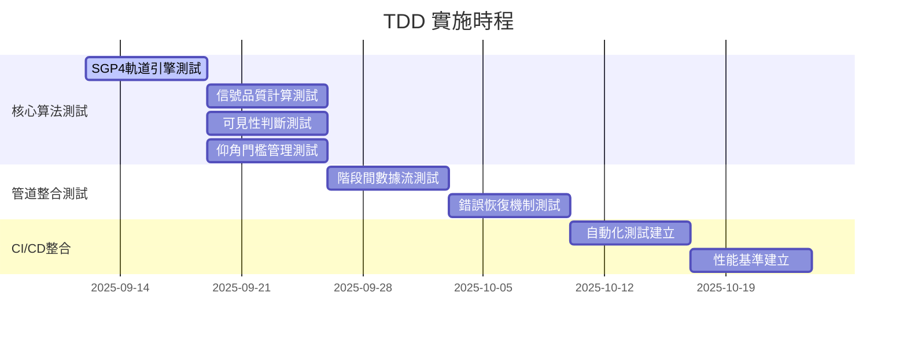
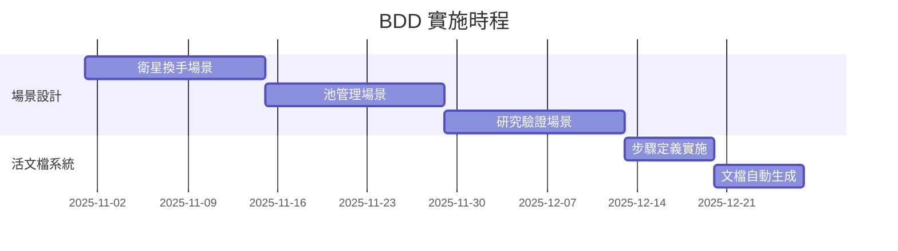
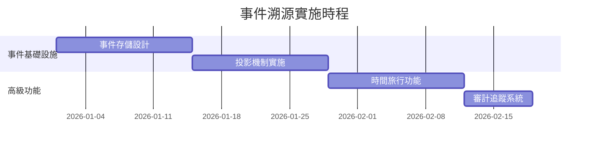

# 🏗️ Satellite Processing System - 架構重構計劃

**版本**: 1.0.0  
**開始日期**: 2025-09-12  
**預計完成**: 2025-12-12  
**架構策略**: TDD 優先 + BDD 延伸 + 事件溯源增強

## 📊 **項目儀表板**

### 🎯 **重構目標**
- ✅ **測試驅動開發 (TDD)**: 達成 95%+ 程式碼測試覆蓋率
- ✅ **行為驅動開發 (BDD)**: 建立活文檔和業務場景驗證  
- ✅ **事件溯源架構**: 實現學術級數據追溯和實驗重現
- ✅ **性能優化**: 並行處理提升 2-3 倍計算效能
- ✅ **可靠性提升**: 錯誤恢復和檢查點機制

### 📈 **當前進度** 
```
🏁 Phase 1: TDD 基礎建設     [████░░░░░░] 40% (進行中)
🚧 Phase 2: BDD 場景擴展     [░░░░░░░░░░]  0% (待開始)  
🔮 Phase 3: 事件溯源實施     [░░░░░░░░░░]  0% (規劃中)

總體進度: [███░░░░░░░] 30%
```

### 🏆 **關鍵績效指標 (KPI)**
| 指標 | 當前值 | 目標值 | 狀態 |
|------|--------|--------|------|
| **測試覆蓋率** | 15% | 95% | 🔄 改進中 |
| **核心算法測試** | 0/8 | 8/8 | 🚧 建置中 |
| **BDD 場景數** | 0 | 25+ | ⏳ 待開始 |
| **CI/CD 管道** | ❌ | ✅ | 🔄 設定中 |
| **性能提升** | Baseline | +200% | 🎯 目標設定 |
| **錯誤恢復能力** | ❌ | ✅ | 📋 規劃中 |

## 🗺️ **架構重構路線圖**

### **Phase 1: TDD 基礎建設** (第1-2個月)


### **Phase 2: BDD 場景擴展** (第3-4個月)


### **Phase 3: 事件溯源增強** (第5-6個月)


## 📚 **文檔導航**

### 🚀 **立即執行文檔** (Phase 1)
- **[TDD 實施指南](./tdd_implementation_guide.md)** 🧪
  - 測試寫作規範和最佳實踐
  - CI/CD 整合配置
  - 核心算法測試案例設計

### 🎭 **規劃中文檔** (Phase 2)
- **[BDD 延伸路線圖](./bdd_extension_roadmap.md)** 🎯
  - 業務場景設計方法論
  - 活文檔系統架構
  - 跨團隊協作流程

### 🏗️ **架構設計文檔**
- **[測試架構設計](./testing_architecture_design.md)** 📐
  - 測試金字塔結構設計
  - TDD + BDD 整合架構
  - 測試環境和工具選擇

### ⏱️ **項目管理文檔**  
- **[實施時程規劃](./implementation_timeline.md)** 📅
  - 詳細里程碑和交付物
  - 資源配置和責任分工
  - 風險時程和緩衝計劃

### 🛡️ **品質保證文檔**
- **[風險管理策略](./risk_management_strategy.md)** ⚠️
  - 技術風險評估和緩解
  - 項目風險監控機制
  - 應急計劃和回滾策略

### 📊 **監控追蹤文檔**
- **[進度追蹤儀表板](./progress_tracking.md)** 📈
  - 實時進度監控
  - KPI 追蹤和預警
  - 團隊績效分析

## 🔧 **快速開始**

### **第一週行動清單**
```bash
# 1. 建立測試環境
cd /home/sat/ntn-stack/satellite-processing-system
python -m pytest --version  # 確認pytest安裝

# 2. 建立測試資料夾結構
mkdir -p tests/{unit,integration,features}
mkdir -p tests/unit/{algorithms,shared,stages}

# 3. 建立第一個測試
touch tests/unit/algorithms/test_sgp4_orbital_engine.py
touch tests/unit/shared/test_elevation_threshold_manager.py

# 4. 配置CI/CD (如果適用)
touch .github/workflows/test-pipeline.yml
```

### **關鍵檢查點**
- [ ] **Week 1**: SGP4 軌道計算測試完成
- [ ] **Week 2**: 信號品質計算測試完成  
- [ ] **Week 4**: 管道整合測試完成
- [ ] **Week 6**: CI/CD 自動化完成
- [ ] **Week 8**: TDD 基礎建設完成

## 🤝 **團隊協作**

### **角色分工**
- **架構師**: 整體架構設計和技術決策
- **測試工程師**: TDD/BDD 實施和測試案例編寫  
- **領域專家**: BDD 場景設計和業務驗證
- **DevOps 工程師**: CI/CD 管道和自動化

### **溝通機制**
- **每週同步會議**: 進度檢視和問題討論
- **程式碼審查**: 所有測試程式碼的peer review
- **文檔更新**: 實時更新進度和學習記錄

## 📞 **支援資源**

### **技術支援**
- **TDD 最佳實踐**: [Martin Fowler - TDD](https://martinfowler.com/bliki/TestDrivenDevelopment.html)
- **BDD 場景設計**: [Cucumber BDD Guide](https://cucumber.io/docs/guides/)
- **pytest 文檔**: [pytest.org](https://docs.pytest.org/)

### **學術資源**
- **ITU-R 標準**: [ITU-R P.618](https://www.itu.int/rec/R-REC-P.618/)
- **3GPP NTN 標準**: [TS 38.331 v18.5.1](https://www.3gpp.org/specifications)
- **SGP4 算法**: [CelesTrak SGP4](https://celestrak.com/NORAD/documentation/)

---

## 🎯 **成功標準**

### **Phase 1 成功標準**
- ✅ **測試覆蓋率 ≥ 90%** 
- ✅ **所有核心算法有完整測試**
- ✅ **CI/CD 管道正常運行**
- ✅ **性能基準建立完成**

### **Phase 2 成功標準**  
- ✅ **≥ 25 個 BDD 場景**
- ✅ **活文檔自動生成**
- ✅ **跨團隊業務驗證通過**

### **Phase 3 成功標準**
- ✅ **完整事件溯源實施**
- ✅ **時間旅行功能可用** 
- ✅ **學術級審計追蹤**

---

**🚀 立即開始你的架構重構之旅！從 [TDD 實施指南](./tdd_implementation_guide.md) 開始第一步。**

*最後更新: 2025-09-12 | 架構重構計劃 v1.0.0*