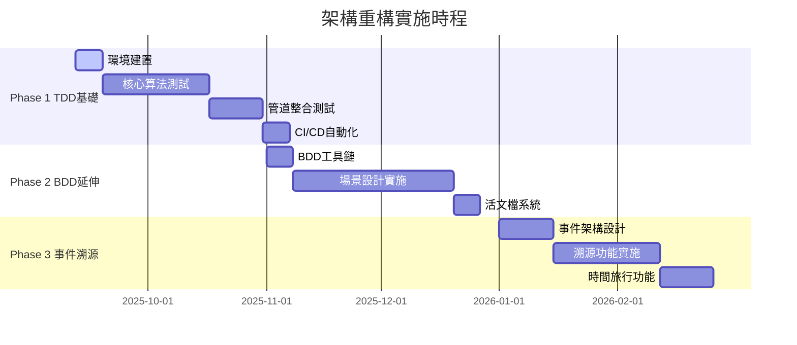

# ⏱️ 實施時程規劃 - Architecture Refactoring

**版本**: 1.0.0  
**項目期間**: 2025-09-12 ~ 2026-03-12 (6個月)  
**總預計工時**: 520 人時  
**關鍵路徑**: TDD → BDD → 事件溯源

## 📅 **總體時程概覽**



## 🎯 **Phase 1: TDD 基礎建設** (8週 - 160工時)

### **Week 1: 環境建置與工具配置** (2025-09-12 ~ 2025-09-19)
**目標**: 建立完整的TDD開發環境  
**工時預估**: 20工時  
**關鍵交付物**: 可執行的測試環境

| 日期 | 任務 | 負責人 | 工時 | 交付物 |
|------|------|--------|------|--------|
| 09-12 | pytest 環境配置 | 開發團隊 | 4h | pytest.ini + requirements |
| 09-13 | 測試資料夾結構建立 | 開發團隊 | 4h | tests/ 目錄架構 |
| 09-14 | 真實測試數據準備 | 數據團隊 | 6h | TLE 測試數據集 |
| 09-15 | CI/CD 基礎配置 | DevOps團隊 | 4h | GitHub Actions 配置 |
| 09-16 | 第一個測試範例 | 技術主管 | 2h | 範例測試文件 |

**檢查點**: ✅ 能夠執行 `pytest tests/` 並看到測試結果

### **Week 2-5: 核心算法測試實施** (2025-09-19 ~ 2025-10-17)
**目標**: 完成所有核心算法的測試實施  
**工時預估**: 80工時  
**關鍵交付物**: 90%+ 核心算法測試覆蓋率

#### **Week 2: SGP4 軌道引擎測試** (2025-09-19 ~ 2025-09-26)
| 任務 | 負責人 | 工時 | 優先級 |
|------|--------|------|--------|
| SGP4 基礎計算精度測試 | 算法工程師 | 8h | 🔴 P0 |
| 時間基準正確性測試 🚨 | 算法工程師 | 6h | 🔴 P0 |
| 批量處理性能測試 | 性能工程師 | 4h | 🟡 P1 |
| 邊界條件錯誤測試 | 測試工程師 | 2h | 🟡 P1 |

**關鍵里程碑**: 🚨 **防止TLE時間基準錯誤再次發生**

#### **Week 3: 信號品質計算測試** (2025-09-26 ~ 2025-10-03)
| 任務 | 負責人 | 工時 | 交付物 |
|------|--------|------|--------|
| RSRP/RSRQ 計算精度 | 信號工程師 | 8h | ITU-R 合規測試 |
| 都卜勒頻移驗證 | 算法工程師 | 6h | 物理公式驗證 |
| 路徑損耗模型測試 | 信號工程師 | 4h | 多頻段測試 |
| 禁止隨機數據檢查 | 測試工程師 | 2h | 合規性檢查 |

#### **Week 4: 可見性與門檻管理測試** (2025-10-03 ~ 2025-10-10)
| 任務 | 負責人 | 工時 | 重點 |
|------|--------|------|------|
| 仰角計算幾何驗證 | 算法工程師 | 6h | 球面三角學 |
| 分層門檻邏輯測試 | 系統工程師 | 8h | 5°/10°/15° 策略 |
| 星座特定配置測試 | 系統工程師 | 4h | Starlink/OneWeb |
| 環境調整係數驗證 | 測試工程師 | 2h | 城市/山區補償 |

#### **Week 5: 共享組件與階段測試** (2025-10-10 ~ 2025-10-17)
| 組件 | 測試重點 | 工時 | 覆蓋率目標 |
|------|----------|------|------------|
| 數據族系管理器 | 時間戳分離邏輯 | 6h | 100% |
| JSON 文件服務 | 文件I/O錯誤處理 | 4h | 95% |
| 管道協調器 | 階段間數據流 | 6h | 95% |
| 信號品質緩存 | 緩存命中邏輯 | 4h | 90% |

### **Week 6-7: 管道整合測試** (2025-10-17 ~ 2025-10-31)
**目標**: 驗證六階段管道的完整性和可靠性  
**工時預估**: 40工時

| 測試範疇 | 具體任務 | 工時 | 成功標準 |
|----------|----------|------|----------|
| **完整數據流** | 端到端管道測試 | 12h | 8,779→150顆處理成功 |
| **錯誤恢復** | 檢查點恢復機制 | 8h | 任意階段失敗可恢復 |
| **性能驗證** | 處理時間基準測試 | 8h | <10秒完整執行 |
| **數據一致性** | 跨階段數據驗證 | 8h | 零數據丟失 |
| **並行處理** | 多衛星並行計算 | 4h | 2-3倍性能提升 |

### **Week 8: CI/CD 自動化** (2025-10-31 ~ 2025-11-07)
**目標**: 建立完整的自動化測試管道  
**工時預估**: 20工時

| 自動化功能 | 實施任務 | 工時 | 觸發條件 |
|------------|----------|------|----------|
| **自動測試** | GitHub Actions 完整配置 | 8h | 每次 Push/PR |
| **覆蓋率報告** | Codecov 整合 | 4h | 測試完成後 |
| **性能回歸** | 基準比較自動化 | 4h | 每日夜間 |
| **品質門檻** | 合併前檢查 | 4h | PR 創建時 |

**Phase 1 交付標準**:
- ✅ 測試覆蓋率 ≥ 90%
- ✅ 所有核心算法有完整測試
- ✅ CI/CD 管道正常運行
- ✅ 性能基準建立完成

## 🎭 **Phase 2: BDD 場景擴展** (8週 - 160工時)

### **Week 9: BDD 工具鏈建立** (2025-11-07 ~ 2025-11-14)
**目標**: 建立 BDD 開發和執行環境  
**工時預估**: 20工時

| 任務 | 技術選型 | 工時 | 交付物 |
|------|----------|------|--------|
| pytest-bdd 配置 | pytest-bdd + Gherkin | 6h | BDD 執行環境 |
| 步驟定義框架 | Python step definitions | 8h | 可重用步驟庫 |
| 報告系統原型 | Allure + HTML | 4h | 測試報告生成 |
| 團隊培訓準備 | 內部培訓材料 | 2h | BDD 培訓文檔 |

### **Week 10-13: 核心場景實施** (2025-11-14 ~ 2025-12-12)
**目標**: 實施核心業務場景，建立 BDD 最佳實踐  
**工時預估**: 80工時

#### **Week 10-11: 衛星換手決策場景** (2025-11-14 ~ 2025-11-28)
| 場景分類 | 具體場景 | 工時 | 業務價值 |
|----------|----------|------|----------|
| **A4 事件處理** | 3GPP 標準換手觸發 | 12h | ⭐⭐⭐ 最高 |
| **多候選選擇** | 智能候選衛星選擇 | 10h | ⭐⭐⭐ 最高 |
| **動態軌道環境** | 2小時軌道周期場景 | 8h | ⭐⭐ 高 |
| **緊急換手** | 信號突然中斷處理 | 6h | ⭐⭐ 高 |
| **性能要求** | <100ms決策延遲 | 4h | ⭐ 中 |

#### **Week 12-13: 動態池管理場景** (2025-11-28 ~ 2025-12-12)
| 場景分類 | 具體場景 | 工時 | 技術重點 |
|----------|----------|------|----------|
| **時空錯置優化** | 8,779→150顆優化 | 10h | 智能篩選算法 |
| **混合星座** | Starlink+OneWeb協同 | 8h | 跨星座優化 |
| **覆蓋率驗證** | 95%+時間覆蓋保證 | 8h | 統計驗證 |
| **自適應調整** | 動態池重新優化 | 6h | 自動化調整 |
| **性能監控** | 實時覆蓋率監控 | 8h | 監控系統 |

### **Week 14-15: 學術研究場景** (2025-12-12 ~ 2025-12-26)
**目標**: 實施學術研究和 DQN 訓練相關場景  
**工時預估**: 40工時

| 研究場景 | 實施內容 | 工時 | 學術價值 |
|----------|----------|------|----------|
| **DQN 訓練數據** | 1000+ 決策樣本生成 | 12h | 機器學習研究 |
| **實驗重現性** | 完整實驗重現驗證 | 10h | 學術嚴謹性 |
| **性能基準** | 與傳統算法比較 | 8h | 效果驗證 |
| **數據品質** | Grade A 標準驗證 | 6h | 學術發表標準 |
| **長期評估** | 7天連續性能測試 | 4h | 穩定性驗證 |

### **Week 16: 活文檔系統** (2025-12-26 ~ 2026-01-02)
**目標**: 建立自動生成的活文檔系統  
**工時預估**: 20工時

| 功能 | 實施內容 | 工時 | 自動化程度 |
|------|----------|------|------------|
| **報告生成** | HTML + PDF 自動生成 | 8h | 100% 自動 |
| **業務語言** | 非技術人員可讀 | 6h | 90% 自動 |
| **實時更新** | 測試結果即時反映 | 4h | 100% 自動 |
| **分享機制** | 團隊協作介面 | 2h | 手動分享 |

**Phase 2 交付標準**:
- ✅ 25+ 個 BDD 場景實施完成
- ✅ 活文檔系統自動生成
- ✅ 跨團隊業務驗證通過
- ✅ 非技術人員 90% 場景可讀

## 🔮 **Phase 3: 事件溯源實施** (8週 - 200工時)

### **Week 17-18: 事件架構設計** (2026-01-02 ~ 2026-01-16)
**目標**: 設計和實施事件溯源基礎架構  
**工時預估**: 50工時

| 架構組件 | 設計內容 | 工時 | 技術選型 |
|----------|----------|------|----------|
| **事件存儲** | 事件數據模型設計 | 12h | JSON + SQLite |
| **事件總線** | 事件發布訂閱機制 | 10h | 內存事件總線 |
| **投影機制** | 讀模型構建邏輯 | 12h | 投影更新引擎 |
| **快照系統** | 狀態快照管理 | 8h | 定期快照策略 |
| **API設計** | 事件查詢接口 | 8h | RESTful API |

### **Week 19-22: 溯源功能實施** (2026-01-16 ~ 2026-02-13)
**目標**: 實施完整的事件溯源功能  
**工時預估**: 100工時

#### **核心事件定義** (Week 19)
| 事件類型 | 事件內容 | 工時 | 包含數據 |
|----------|----------|------|----------|
| **OrbitCalculated** | 軌道計算完成事件 | 6h | TLE數據+計算結果 |
| **VisibilityFiltered** | 可見性篩選事件 | 6h | 篩選條件+結果 |
| **SignalAnalyzed** | 信號分析完成事件 | 6h | RSRP/RSRQ計算 |
| **HandoverDecided** | 換手決策事件 | 6h | 決策過程+結果 |
| **PoolOptimized** | 衛星池優化事件 | 6h | 優化策略+效果 |

#### **事件存儲實施** (Week 20)
| 存儲功能 | 實施內容 | 工時 | 性能要求 |
|----------|----------|------|----------|
| **事件持久化** | 事件序列化存儲 | 10h | 1000 事件/秒 |
| **事件查詢** | 時間範圍查詢 | 8h | <100ms 查詢 |
| **事件回放** | 歷史事件重放 | 8h | 完整狀態重建 |
| **數據壓縮** | 長期存儲優化 | 4h | 50% 空間節省 |

#### **投影系統實施** (Week 21)
| 投影類型 | 實施內容 | 工時 | 更新策略 |
|----------|----------|------|----------|
| **當前狀態投影** | 系統當前狀態視圖 | 10h | 實時更新 |
| **歷史分析投影** | 性能趨勢分析 | 8h | 批量更新 |
| **學術報告投影** | 研究數據視圖 | 8h | 按需生成 |
| **監控儀表板投影** | 運行狀態監控 | 4h | 分鐘級更新 |

#### **整合測試** (Week 22)
| 測試類型 | 測試內容 | 工時 | 驗證標準 |
|----------|----------|------|----------|
| **事件完整性** | 事件鏈完整性驗證 | 8h | 零事件丟失 |
| **狀態一致性** | 投影狀態一致性 | 6h | 100% 狀態匹配 |
| **性能測試** | 大量事件處理 | 6h | 1萬事件/分鐘 |

### **Week 23-24: 時間旅行功能** (2026-02-13 ~ 2026-02-27)
**目標**: 實施學術級的時間旅行和實驗重現功能  
**工時預估**: 50工時

| 功能 | 實施內容 | 工時 | 學術價值 |
|------|----------|------|----------|
| **時間點查詢** | 任意時刻狀態查詢 | 15h | 實驗重現 |
| **狀態重建** | 從事件重建系統狀態 | 15h | 數據溯源 |
| **實驗重放** | 完整實驗過程重放 | 10h | 結果驗證 |
| **比較分析** | 不同時間點比較 | 10h | 變化分析 |

**Phase 3 交付標準**:
- ✅ 完整事件溯源系統運行
- ✅ 時間旅行功能可用
- ✅ 學術級審計追蹤完成
- ✅ 實驗重現性 100% 支持

## 👥 **資源配置與責任分工**

### **核心團隊組成**
| 角色 | 人數 | 主要職責 | 關鍵技能 |
|------|------|----------|----------|
| **技術主管** | 1 | 架構設計、技術決策 | Python, TDD, 系統架構 |
| **算法工程師** | 2 | 核心算法實施和測試 | SGP4, 信號處理, 數學 |
| **測試工程師** | 1 | 測試策略、BDD實施 | pytest, BDD, 自動化 |
| **DevOps工程師** | 1 | CI/CD、部署自動化 | GitHub Actions, Docker |
| **產品經理** | 1 | BDD場景設計、需求管理 | 業務理解, 溝通協調 |

### **工時分配**
```
總工時: 520 人時 (3.25 人月)

Phase 1 (TDD): 160h (30.8%)
├── 環境建置: 20h
├── 核心算法: 80h  
├── 整合測試: 40h
└── CI/CD: 20h

Phase 2 (BDD): 160h (30.8%)
├── 工具鏈: 20h
├── 核心場景: 80h
├── 研究場景: 40h
└── 活文檔: 20h

Phase 3 (事件溯源): 200h (38.4%)
├── 架構設計: 50h
├── 溯源實施: 100h
└── 時間旅行: 50h
```

## 🎯 **關鍵里程碑與檢查點**

### **每週檢查點**
| 週次 | 日期 | 檢查項目 | 成功標準 | 風險評估 |
|------|------|----------|----------|----------|
| Week 1 | 09-19 | 測試環境建置 | pytest 正常執行 | 🟢 低風險 |
| Week 4 | 10-10 | 核心算法測試 50% | SGP4+信號測試完成 | 🟡 中風險 |
| Week 8 | 11-07 | TDD 階段完成 | 90% 覆蓋率達成 | 🟡 中風險 |
| Week 12 | 12-05 | BDD 核心場景 | 15+ 場景實施 | 🟡 中風險 |
| Week 16 | 01-02 | BDD 階段完成 | 25+ 場景 + 活文檔 | 🟢 低風險 |
| Week 20 | 01-30 | 事件存儲完成 | 基礎事件系統運行 | 🔴 高風險 |
| Week 24 | 02-27 | 項目完成 | 所有交付標準達成 | 🟡 中風險 |

### **重要決策點**
1. **Week 4**: 是否繼續當前 TDD 策略，或調整測試範圍
2. **Week 8**: 是否進入 BDD 階段，或加強 TDD 基礎
3. **Week 16**: 是否實施事件溯源，或專注於 TDD+BDD 優化
4. **Week 20**: 是否簡化事件溯源功能，確保項目按時完成

## 📊 **成功標準與驗收條件**

### **Phase 1 驗收標準**
- [ ] 測試覆蓋率達到 90%+
- [ ] 所有核心算法有單元測試
- [ ] CI/CD 管道自動執行
- [ ] 性能基準線建立
- [ ] 學術合規測試 100% 通過

### **Phase 2 驗收標準**  
- [ ] 實施 25+ BDD 場景
- [ ] 活文檔自動生成
- [ ] 非技術人員 90% 場景可讀
- [ ] 跨團隊驗收通過

### **Phase 3 驗收標準**
- [ ] 事件溯源系統運行
- [ ] 時間旅行功能驗證
- [ ] 學術實驗重現性支持
- [ ] 完整審計追蹤

### **整體項目驗收標準**
- [ ] 架構重構目標 100% 達成
- [ ] 團隊採用率 > 80%
- [ ] 系統穩定性無回歸
- [ ] 文檔完整性和實用性驗證

---

**⏱️ 精確的時程規劃是項目成功的關鍵！按此時程執行，確保架構重構的順利完成。**

*最後更新: 2025-09-12 | 實施時程規劃 v1.0.0*