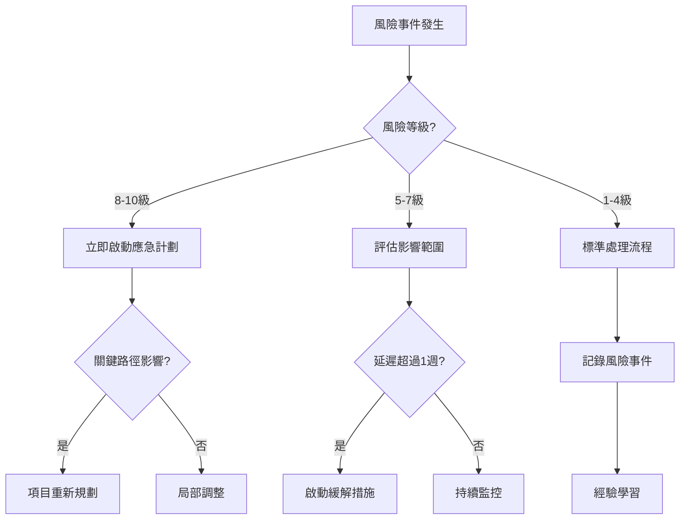

# 🛡️ 風險管理策略 - Architecture Refactoring

**版本**: 1.0.0  
**風險管理框架**: PMBOK + 敏捷風險管理  
**更新頻率**: 雙週評估，月度深度檢討  
**最後評估**: 2025-09-12

## 🎯 **風險管理總體策略**

### **核心原則**
- ✅ **預防優於治療**: 早期識別和預防風險
- ✅ **持續監控**: 實時風險狀態追蹤
- ✅ **快速響應**: 24小時內啟動風險應對措施
- ✅ **學習改進**: 從風險事件中學習和改進

### **風險分類架構**
```
🎯 項目風險
├── 📅 時程風險 (Schedule Risk)
├── 💰 成本風險 (Cost Risk)  
├── 👥 資源風險 (Resource Risk)
└── 🎛️ 範圍風險 (Scope Risk)

⚙️ 技術風險  
├── 🏗️ 架構風險 (Architecture Risk)
├── 🧪 測試風險 (Testing Risk)
├── 📊 數據風險 (Data Risk) 
└── 🔧 工具風險 (Tool Risk)

🌍 外部風險
├── 🔄 依賴風險 (Dependency Risk)  
├── 📋 需求變更風險 (Requirement Risk)
├── 👨‍💼 利害關係人風險 (Stakeholder Risk)
└── 📚 學術標準風險 (Academic Risk)
```

## 📊 **高風險項目識別與評估**

### **🔴 高風險項目 (風險等級 8-10)**

#### **R001: TDD 學習曲線風險** 
**風險描述**: 團隊對 TDD 開發模式不熟悉，可能導致開發效率下降和測試品質不佳

| 風險屬性 | 評估 | 說明 |
|----------|------|------|
| **發生概率** | 70% | 團隊缺乏 TDD 經驗 |
| **影響程度** | 高 | 可能延遲 2-4 週 |
| **風險等級** | 🔴 8/10 | 高風險 |
| **影響範圍** | Phase 1 整體進度 | 連鎖效應 |

**緩解措施**:
- ✅ **預防措施** (實施中):
  - 提供詳細的 TDD 實施指南和範例
  - 安排技術主管進行 TDD 培訓 (4小時)
  - 建立 Pair Programming 機制
  - 設定第一週為適應期，降低產出預期

- 🚨 **應急計劃** (如風險發生):
  - 引入外部 TDD 專家顧問 (1週諮詢)
  - 調整測試範圍，專注於核心算法
  - 延長 Phase 1 時程 2週，壓縮 Phase 3

#### **R002: 真實數據依賴風險**
**風險描述**: 嚴格要求使用真實數據可能導致數據獲取困難和測試環境複雜化

| 風險屬性 | 評估 | 說明 |
|----------|------|------|
| **發生概率** | 40% | 數據來源相對穩定 |
| **影響程度** | 高 | 影響測試實施 |
| **風險等級** | 🔴 8/10 | 高風險 |
| **影響範圍** | 所有測試階段 | 基礎數據依賴 |

**緩解措施**:
- ✅ **預防措施**:
  - 建立多元數據來源 (Space-Track.org + 備份來源)
  - 提前準備靜態測試數據集 (3個月歷史數據)
  - 建立數據品質驗證機制
  - 設計數據源切換機制

- 🚨 **應急計劃**:
  - 使用歷史真實數據作為替代
  - 建立數據模擬器 (基於真實數據模式)
  - 與學術機構合作獲取數據存取權限

#### **R003: 事件溯源複雜性風險** 
**風險描述**: Phase 3 事件溯源架構技術複雜度高，團隊經驗不足

| 風險屬性 | 評估 | 說明 |
|----------|------|------|
| **發生概率** | 60% | 新技術架構 |
| **影響程度** | 極高 | 可能導致階段失敗 |
| **風險等級** | 🔴 9/10 | 極高風險 |
| **影響範圍** | Phase 3 整體 | 最終交付質量 |

**緩解措施**:
- ✅ **預防措施**:
  - Phase 1-2 期間進行事件溯源技術調研
  - 建立簡化版事件溯源原型
  - 安排事件溯源架構培訓
  - 準備技術降級方案 (簡化版實施)

- 🚨 **應急計劃**:
  - 降級為簡單的歷史記錄機制
  - 專注於核心時間旅行功能
  - 延後完整事件溯源至後續版本

### **🟡 中風險項目 (風險等級 5-7)**

#### **R004: CI/CD 整合複雜性**
| 屬性 | 評估 |
|------|------|
| **風險等級** | 🟡 6/10 |
| **影響** | 自動化效率下降 |
| **緩解** | 分階段實施，先手動後自動 |

#### **R005: BDD 跨團隊協作**  
| 屬性 | 評估 |
|------|------|
| **風險等級** | 🟡 6/10 |
| **影響** | 場景品質不佳 |
| **緩解** | 早期利害關係人參與，定期檢討 |

#### **R006: 性能回歸風險**
| 屬性 | 評估 |
|------|------|
| **風險等級** | 🟡 7/10 |
| **影響** | 系統性能下降 |
| **緩解** | 建立性能基準，持續監控 |

### **🟢 低風險項目 (風險等級 1-4)**

#### **R007: 文檔維護負擔** - 🟢 4/10
#### **R008: 工具版本相容性** - 🟢 3/10
#### **R009: 測試數據存儲空間** - 🟢 2/10

## 🎯 **風險監控與預警機制**

### **風險監控儀表板**
```
🔴 高風險項目監控 (每日)
├── R001 TDD學習曲線: [████████░░] 80% 控制中
├── R002 真實數據依賴: [██████░░░░] 60% 控制中  
└── R003 事件溯源複雜: [███░░░░░░░] 30% 需關注

🟡 中風險項目監控 (週度)
├── R004 CI/CD整合: [██████████] 90% 控制中
├── R005 BDD跨團隊: [████████░░] 80% 控制中
└── R006 性能回歸: [██████░░░░] 60% 需關注

🟢 低風險項目監控 (月度)
└── 整體控制良好，持續觀察
```

### **預警觸發條件**

#### **🔴 紅色警報 (立即行動)**
- TDD 實施進度延遲 > 1週
- 核心算法測試失敗率 > 10%
- 真實數據無法獲取 > 3天
- 事件溯源原型開發失敗

#### **🟡 黃色警告 (24小時內響應)**  
- 測試覆蓋率 < 80%
- CI/CD 管道失效 > 1天
- BDD 場景驗收失敗 > 20%
- 團隊成員技術阻礙 > 2天

#### **🟢 綠色提醒 (週度檢討)**
- 進度輕微延遲 < 2天
- 非關鍵功能問題
- 文檔更新延遲
- 工具版本更新需求

### **風險升級機制**
```
🏃‍♂️ 第一級: 項目團隊自行處理 (1-4級風險)
📞 第二級: 技術主管介入 (5-7級風險)  
🚨 第三級: 管理層決策 (8-10級風險)
🆘 第四級: 外部專家支援 (9-10級 + 緊急)
```

## 🛠️ **風險應對策略矩陣**

### **風險應對策略類型**

#### **1. 風險規避 (Risk Avoidance)**
- **R001**: 提供充分培訓，避免 TDD 學習障礙
- **R003**: 技術調研和原型，避免架構選型錯誤

#### **2. 風險緩解 (Risk Mitigation)**  
- **R002**: 多元數據來源，降低數據依賴風險
- **R006**: 性能基準建立，降低回歸風險

#### **3. 風險轉移 (Risk Transfer)**
- **R001**: 外部 TDD 專家諮詢
- **R003**: 事件溯源架構外包評估

#### **4. 風險接受 (Risk Acceptance)**
- **R007**: 接受文檔維護成本
- **R008**: 接受工具升級的週期性成本

### **應急計劃觸發決策樹**



## 📋 **具體風險應對計劃**

### **Phase 1 風險應對**

#### **Week 1-2: 環境建置階段**
| 風險事件 | 應對措施 | 責任人 | 時間限制 |
|----------|----------|--------|----------|
| pytest 配置失敗 | 使用 Docker 容器統一環境 | DevOps | 4小時 |
| 測試數據獲取困難 | 啟用歷史 TLE 數據備份 | 數據工程師 | 1天 |
| 團隊 TDD 適應慢 | 增加 pair programming 時間 | 技術主管 | 立即 |

#### **Week 3-6: 核心測試階段**  
| 風險事件 | 應對措施 | 責任人 | 時間限制 |
|----------|----------|--------|----------|
| SGP4 測試複雜度高 | 分解為子模組測試 | 算法工程師 | 2天 |
| 信號計算標準不明確 | 諮詢 ITU-R 專家 | 技術主管 | 3天 |
| 測試覆蓋率不達標 | 增加邊界條件測試 | 測試工程師 | 1週 |

### **Phase 2 風險應對**

#### **BDD 場景設計階段**
| 風險事件 | 應對措施 | 責任人 | 時間限制 |
|----------|----------|--------|----------|
| 業務場景理解偏差 | 增加領域專家 review | 產品經理 | 2天 |
| Gherkin 語法不熟悉 | 提供培訓和範本 | 測試工程師 | 1天 |
| 步驟定義複用性差 | 重構步驟定義庫 | 開發團隊 | 3天 |

### **Phase 3 風險應對**

#### **事件溯源實施階段**
| 風險事件 | 應對措施 | 責任人 | 時間限制 |
|----------|----------|--------|----------|
| 事件架構設計複雜 | 簡化為基礎版本實施 | 架構師 | 1週 |
| 性能要求無法滿足 | 優化數據結構和查詢 | 性能工程師 | 1週 |
| 時間旅行功能失效 | 降級為快照恢復機制 | 開發團隊 | 3天 |

## 🔄 **持續風險管理流程**

### **日常風險管理活動**

#### **每日 (Daily Risk Check)**
- **Morning Standup**: 5分鐘風險狀態更新
- **實時監控**: 關鍵指標追蹤 (測試通過率、覆蓋率)
- **阻礙移除**: 當日阻礙問題處理

#### **每週 (Weekly Risk Review)**  
- **風險評估會議**: 30分鐘風險狀態檢討
- **新風險識別**: 檢視下週可能風險
- **緩解措施更新**: 調整風險應對策略

#### **雙週 (Bi-weekly Risk Assessment)**
- **深度風險分析**: 1小時全面風險評估
- **風險矩陣更新**: 更新風險等級和影響
- **應急計劃檢討**: 驗證應急計劃有效性

### **風險溝通機制**

#### **內部溝通**
- **技術團隊**: Slack 即時風險通報
- **管理層**: 週報包含風險狀態
- **利害關係人**: 月度風險簡報

#### **外部溝通**
- **學術顧問**: 學術標準風險諮詢
- **技術專家**: 特定技術風險支援
- **供應商**: 工具和平台風險協調

## 📊 **風險管理績效指標**

### **量化指標**

| 指標 | 目標值 | 當前值 | 趨勢 |
|------|--------|--------|------|
| **高風險項目數** | ≤ 2個 | 3個 | 🔄 監控中 |
| **風險事件響應時間** | ≤ 4小時 | - | 🎯 待測試 |
| **風險預測準確率** | ≥ 80% | - | 📊 建立基準 |
| **緩解措施有效性** | ≥ 90% | - | 📈 持續評估 |

### **質化指標**
- ✅ **團隊風險意識**: 所有成員能識別和報告風險
- ✅ **風險文化**: 開放討論風險，不責備文化
- ✅ **預防效果**: 主動預防優於被動應對
- ✅ **學習改進**: 從風險事件中學習和改善流程

## 🎓 **風險學習與改進**

### **風險事件記錄模板**
```markdown
## 風險事件報告 #RXXX-YYYYMMDD

### 基本信息
- **風險ID**: R001
- **發生日期**: 2025-09-XX  
- **發現人**: XXX
- **風險等級**: 🔴 8/10

### 事件描述
- **實際發生情況**: [詳細描述]
- **實際影響範圍**: [影響評估]
- **處理時間**: XX小時

### 應對措施
- **實施的緩解措施**: [具體行動]
- **措施有效性**: [評估結果]
- **額外行動**: [補充措施]

### 經驗學習
- **根本原因分析**: [深入分析]
- **預防改進建議**: [未來預防]
- **流程改進點**: [流程優化]
```

### **月度風險回顧會議**
- **議程**:
  1. 風險事件回顧和分析
  2. 緩解措施效果評估  
  3. 新興風險識別
  4. 風險管理流程改進
  5. 下月風險預測

---

**🛡️ 有效的風險管理是架構重構成功的關鍵保障！持續監控、快速響應、學習改進。**

*最後更新: 2025-09-12 | 風險管理策略 v1.0.0*