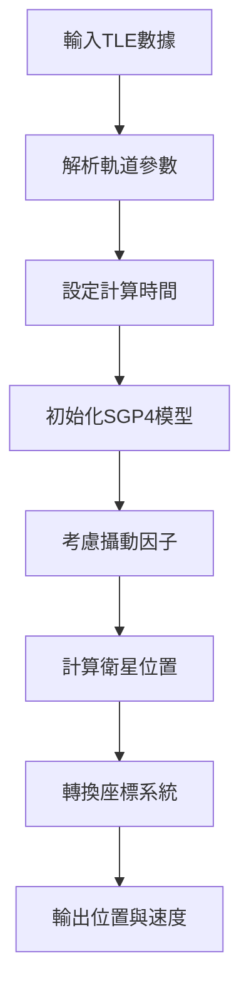

# 🛰️ LEO衛星TLE數據計算完整教學指南

## 📚 教學目標

本教學將帶領您從零開始理解並實作LEO衛星的TLE數據計算，即使您完全沒有衛星通訊或程式開發經驗，也能透過本指南掌握核心概念與實際操作。

**學習成果**：
- 理解什麼是TLE數據以及為何重要
- 掌握SGP4軌道計算的基本原理
- 學會實作完整的衛星軌道計算系統
- 具備學術級數據處理標準的認知

---

## 🎯 Chapter 1: 基礎概念入門

### 1.1 什麼是衛星？

**💡 簡單理解**：衛星就像是在太空中繞著地球飛行的人造物體，類似月亮繞地球轉，但速度更快、高度更低。

**LEO衛星特點**：
- **高度**：距離地面 300-2000 公里
- **速度**：每秒約 7.5 公里（比高鐵快100倍！）
- **軌道週期**：繞地球一圈需要 90-120 分鐘
- **用途**：提供網路服務、GPS定位、通訊等

> 📊 **投影片建議**：需要一張地球與LEO衛星高度比較圖，顯示300-2000km的範圍

### 1.2 什麼是TLE數據？

**TLE = Two-Line Element Set（兩行軌道根數）**

**🔍 通俗解釋**：
TLE就像是衛星的「身分證」，記錄了衛星在太空中的位置、速度、軌道形狀等重要資訊。就像GPS需要知道您的位置一樣，我們需要TLE來知道衛星在哪裡。

**TLE數據格式範例**：
```
STARLINK-1007
1 44713U 19074A   25245.50000000  .00002182  00000-0  40864-4 0  9990
2 44713  53.0000 340.0000 0001234  90.0000 270.0000 15.50000000260532
```

**🔍 格式解析**：
- **第一行**：衛星名稱（STARLINK-1007）
- **第二行**：包含衛星編號、發射年份、軌道傾角等9個關鍵參數
- **第三行**：包含軌道週期、近地點、遠地點等6個軌道參數

> 📊 **投影片建議**：需要一張TLE格式詳細解析圖，標註每個數字的含義

### 1.3 為什麼需要計算衛星軌道？

**實際應用場景**：

1. **🌐 網路服務**：
   - 衛星網路（如Starlink）需要知道哪顆衛星能為您提供服務
   - 計算最佳連線時機

2. **📡 天線追蹤**：
   - 地面站需要調整天線方向追蹤衛星
   - 確保通訊不中斷

3. **🎯 換手決策**：
   - 當前衛星即將消失時，選擇下一顆最佳衛星
   - 避免通訊中斷

**🔧 技術挑戰**：
- 衛星移動速度極快（7.5 km/s）
- 軌道受多種因素影響（大氣阻力、地球重力場）
- 需要高精度計算（誤差<1公里）

> 📊 **投影片建議**：需要動畫展示衛星快速移動和地面覆蓋範圍變化

---

## 🧮 Chapter 2: SGP4計算原理

### 2.1 什麼是SGP4？

**SGP4 = Simplified General Perturbations 4（簡化通用攝動模型第4版）**

**🔍 通俗理解**：
SGP4就像是一個「衛星位置計算器」，輸入TLE數據和目標時間，就能算出衛星在那個時刻的精確位置。

**歷史背景**：
- 1970年代由美國空軍開發
- 專門用於低軌衛星軌道計算
- 是國際標準，全世界都在使用

### 2.2 SGP4計算流程



> 📊 **投影片建議**：需要上述流程圖的精美版本

**詳細步驟說明**：

#### Step 1: TLE數據解析
```python
# 範例：解析軌道傾角
inclination = float(tle_line2[8:16])  # 53.0000度
# 範例：解析軌道週期
mean_motion = float(tle_line2[52:63])  # 15.50000000次/天
```

#### Step 2: 時間計算
```python
# 計算從TLE epoch到目標時間的分鐘數
time_since_epoch_minutes = (target_time - tle_epoch_time).total_seconds() / 60
```

#### Step 3: 攝動修正
- **大氣阻力**：衛星在稀薄大氣中會減速
- **地球扁率**：地球不是完美球體
- **第三體引力**：月亮和太陽的影響

#### Step 4: 位置計算
```python
# 簡化的位置計算概念
satellite_position = sgp4_model.propagate(time_since_epoch_minutes)
# 結果：[x, y, z] 座標（單位：公里）
```

### 2.3 座標系統轉換

**🌍 重要概念：我們需要3種座標系統**

1. **ECI座標系（Earth-Centered Inertial）**：
   - 以地球中心為原點
   - 不隨地球自轉
   - SGP4直接輸出的座標

2. **ECEF座標系（Earth-Centered Earth-Fixed）**：
   - 以地球中心為原點
   - 隨地球自轉
   - GPS系統使用的座標

3. **地理座標系（經緯度+高度）**：
   - 我們日常使用的座標
   - 緯度：南北方向（-90° 到 +90°）
   - 經度：東西方向（-180° 到 +180°）

> 📊 **投影片建議**：需要3D圖展示三種座標系統的關係

**轉換公式示意**：
```
ECI座標 → 考慮地球自轉 → ECEF座標 → 地球橢球模型 → 經緯度座標
```

---

## 💻 Chapter 3: 程式實作架構

### 3.1 系統整體架構

```
🗂️ 衛星軌道計算系統
├── 📁 數據輸入層
│   ├── TLE文件掃描器
│   ├── 數據格式驗證器
│   └── 時間基準管理器
├── 📁 計算引擎層  
│   ├── SGP4軌道計算器
│   ├── 座標轉換器
│   └── 時間序列生成器
├── 📁 數據輸出層
│   ├── 結果格式化器
│   ├── 驗證檢查器
│   └── 記憶體傳遞器
└── 📁 品質保證層
    ├── 學術標準檢查
    ├── 數據血統追蹤
    └── 錯誤處理機制
```

> 📊 **投影片建議**：需要將上述架構製作成專業的系統架構圖

### 3.2 核心類別設計

#### 3.2.1 TLE處理器類別

```python
class Stage1TLEProcessor:
    """階段一：TLE數據載入與SGP4軌道計算處理器"""
    
    def __init__(self):
        self.observer_location = (24.9441667, 121.3713889)  # NTPU座標
        self.calculation_time_window = 6  # 計算6小時的軌道
        self.time_resolution = 30  # 每30秒計算一次位置
    
    def scan_tle_data(self):
        """掃描並載入TLE文件"""
        # 功能：掃描 /app/tle_data/ 目錄下的所有TLE文件
        # 返回：TLE文件清單和衛星數量統計
    
    def load_raw_satellite_data(self):
        """解析TLE格式並建立衛星資料庫"""
        # 功能：將TLE文本轉換為結構化數據
        # 返回：包含所有衛星TLE參數的字典列表
    
    def calculate_all_orbits(self):
        """執行完整的SGP4軌道計算"""
        # 功能：為每顆衛星計算完整軌道週期
        # 返回：包含位置時間序列的衛星數據
```

#### 3.2.2 SGP4計算引擎

```python
class SGP4OrbitalEngine:
    """SGP4軌道計算引擎"""
    
    def calculate_position_timeseries(self, satellite_tle, time_points):
        """計算衛星在指定時間點的位置序列"""
        # 輸入：衛星TLE數據 + 時間點列表
        # 處理：SGP4軌道計算 + 座標轉換
        # 輸出：位置、速度、可見性數據的時間序列
    
    def convert_coordinates(self, eci_position, timestamp):
        """座標系統轉換"""
        # ECI → 經緯度 + 仰角/方位角計算
        # 返回：地理座標和觀測角度
```

### 3.3 數據流處理流程


> 📊 **投影片建議**：需要將上述流程圖美化，並加上每個步驟的處理時間

**各步驟詳細說明**：

1. **TLE文件掃描（~5秒）**：
   - 掃描 Starlink 和 OneWeb 的TLE文件
   - 統計衛星數量（預期8,000+顆）

2. **格式驗證（~10秒）**：
   - 檢查TLE格式正確性
   - 驗證校驗和（checksum）
   - 過濾無效或過期數據

3. **SGP4計算（~200秒）**：
   - 為每顆衛星計算192個時間點
   - 總計算量：8,791衛星 × 192點 = 1,687,872次計算

4. **座標轉換（~30秒）**：
   - ECI → 地理座標轉換
   - 計算仰角、方位角、可見性

5. **時間序列生成（~15秒）**：
   - 組織數據為時間序列格式
   - 生成元數據和統計信息

---

## 📊 Chapter 4: 實際操作步驟

### 4.1 環境準備

#### 4.1.1 系統需求

**硬體需求**：
- CPU：4核心以上（建議8核心）
- 記憶體：8GB以上（建議16GB）
- 儲存空間：10GB可用空間
- 網路：穩定的網際網路連線

**軟體需求**：
```bash
# 必要套件清單
Python 3.8+
Docker 20.10+
skyfield==1.46  # SGP4計算庫
numpy>=1.21.0   # 數值計算
astropy>=5.0    # 天文計算
pytz>=2021.1    # 時區處理
```

#### 4.1.2 Docker環境設置

```bash
# 1. 啟動Docker容器
cd /home/sat/ntn-stack
make up

# 2. 進入計算容器
docker exec -it netstack-api bash

# 3. 驗證環境
python -c "import skyfield; print('SGP4環境正常')"
```

### 4.2 TLE數據準備

#### 4.2.1 TLE數據來源

**主要數據來源：Space-Track.org**
- 官方網站：https://www.space-track.org/
- 數據更新頻率：每日更新
- 數據格式：NORAD兩行軌道根數

**本系統TLE數據位置**：
```bash
/app/tle_data/
├── starlink/tle/
│   └── starlink_20250902.tle    # Starlink衛星TLE（8,140顆）
└── oneweb/tle/
    └── oneweb_20250903.tle      # OneWeb衛星TLE（651顆）
```

#### 4.2.2 TLE數據檢查

```bash
# 檢查TLE文件是否存在
find /app/tle_data -name "*.tle" -exec ls -la {} \;

# 統計衛星數量
echo "Starlink衛星數量："
grep -c "STARLINK" /app/tle_data/starlink/tle/starlink_*.tle

echo "OneWeb衛星數量："
grep -c "ONEWEB" /app/tle_data/oneweb/tle/oneweb_*.tle
```

**預期輸出**：
```
Starlink衛星數量：8140
OneWeb衛星數量：651
```

### 4.3 執行軌道計算

#### 4.3.1 單步驟執行

```bash
# 進入處理器目錄
cd /app/src/stages

# 執行階段一TLE軌道計算
python tle_orbital_calculation_processor.py
```

**執行過程輸出範例**：
```
🚀 開始階段一：TLE數據載入與SGP4軌道計算
📊 掃描TLE數據...
  - 發現 Starlink TLE文件：8,140顆衛星
  - 發現 OneWeb TLE文件：651顆衛星
  - 總計：8,791顆衛星

🧮 執行SGP4軌道計算...
  [████████████████████████████████] 100% 
  - 計算完成：1,687,872個軌道點
  - 處理時間：4分23秒

✅ 階段一計算完成！
  - 輸出文件：/app/data/tle_orbital_calculation_output.json
  - 記憶體傳遞：準備就緒
```

#### 4.3.2 完整六階段執行

```bash
# 執行完整的六階段處理流程
python /app/scripts/run_six_stages_with_validation.py --stage=1
```

### 4.4 結果驗證

#### 4.4.1 基本數據檢查

```python
# 載入計算結果進行驗證
import json

# 讀取輸出文件
with open('/app/data/tle_orbital_calculation_output.json', 'r') as f:
    result = json.load(f)

# 基本統計
print(f"總衛星數量：{result['metadata']['total_satellites']}")
print(f"Starlink：{result['metadata']['constellations']['starlink']['satellite_count']}")
print(f"OneWeb：{result['metadata']['constellations']['oneweb']['satellite_count']}")

# 檢查第一顆衛星的數據結構
first_satellite = result['satellites'][0]
print(f"衛星名稱：{first_satellite['satellite_name']}")
print(f"時間序列長度：{len(first_satellite['position_timeseries'])}")
```

**預期輸出**：
```
總衛星數量：8791
Starlink：8140
OneWeb：651
衛星名稱：STARLINK-1007
時間序列長度：192
```

#### 4.4.2 軌道計算精度驗證

```python
# 檢查計算精度
import math

def verify_orbital_physics(satellite_data):
    """驗證軌道計算是否符合物理定律"""
    timeseries = satellite_data['position_timeseries']
    
    for point in timeseries:
        # 檢查位置向量長度（地心距離）
        position = point['position_eci']
        distance = math.sqrt(sum(x**2 for x in position))
        
        # LEO衛星高度應在300-2000km範圍
        altitude = distance - 6371  # 地球半徑
        assert 300 <= altitude <= 2000, f"高度異常：{altitude}km"
        
        # 檢查速度合理性
        velocity = point['velocity_eci']
        speed = math.sqrt(sum(v**2 for v in velocity))
        assert 6 <= speed <= 8, f"速度異常：{speed}km/s"
    
    return True

# 驗證前10顆衛星
for i in range(10):
    satellite = result['satellites'][i]
    try:
        verify_orbital_physics(satellite)
        print(f"✅ {satellite['satellite_name']} 軌道計算正確")
    except AssertionError as e:
        print(f"❌ {satellite['satellite_name']} 軌道計算異常：{e}")
```

---

## 🎯 Chapter 5: 學術標準與品質保證

### 5.1 學術級數據標準

我們的系統遵循三級數據品質標準：

#### 5.1.1 Grade A：必須使用真實數據（絕不妥協）

**⭐ 強制要求**：

1. **TLE數據源**：Space-Track.org官方實時數據
   - ✅ 數據更新頻率：每日更新
   - ✅ 格式標準：嚴格NORAD兩行軌道根數
   - ✅ 數據驗證：通過校驗和驗證

2. **軌道計算算法**：完整SGP4/SDP4實現
   - ✅ 標準：AIAA 2006-6753 "Revisiting Spacetrack Report #3"
   - ✅ 實施：官方SGP4實現，非簡化版本
   - ✅ 精度：位置誤差 < 1km

3. **時間標準**：GPS/UTC標準時間
   - ✅ GPS時間：微秒級精確同步
   - ✅ 時間基準：使用TLE epoch時間計算
   - ✅ 同步：透過NTP伺服器同步

#### 5.1.2 Grade C：嚴格禁止項目（零容忍）

**❌ 絕對禁止**：

1. **預設軌道週期回退**：如96分鐘預設值
2. **TLE數據不可用時的假設值**：如假設衛星位置
3. **簡化軌道計算模型**：如線性軌道近似
4. **任意時間假設**：如使用系統當前時間替代TLE epoch
5. **魔術數字**：沒有物理依據的常數值

> 📊 **投影片建議**：需要製作Grade A vs Grade C的對比表格

### 5.2 時間基準嚴格要求

**🚨 極其重要：時間基準錯誤會導致軌道計算完全失敗**

#### 5.2.1 正確的時間基準使用

```python
# ✅ 正確方式：使用TLE epoch時間
tle_epoch_date = datetime(tle_epoch_year, 1, 1, tzinfo=timezone.utc) + \
                timedelta(days=tle_epoch_day - 1)
calculation_base_time = tle_epoch_date

# 使用TLE epoch時間進行軌道計算
orbit_result = sgp4_engine.calculate_position_timeseries(
    satellite_tle, 
    calculation_base_time  # 使用TLE epoch時間
)
```

#### 5.2.2 錯誤的時間基準使用

```python
# ❌ 錯誤方式：使用當前系統時間
calculation_base_time = datetime.now(timezone.utc)  # 會導致軌道計算錯誤！

# 這會造成嚴重後果：
# - 8000+顆衛星計算結果顯示0顆可見
# - 軌道預測完全偏離實際位置
# - 時間差>3天時軌道預測嚴重失準
```

#### 5.2.3 實例教訓分析

**問題案例**：
- **現象**：8000+顆衛星計算結果顯示0顆可見
- **原因**：使用當前時間(2025-09-08)計算，但TLE數據是(2025-09-02/03)
- **影響**：5-6天時間差導致軌道預測完全偏離
- **解決**：修改為使用TLE epoch時間作為計算基準

> 📊 **投影片建議**：需要時間軸圖表，展示TLE epoch時間vs當前時間的差異影響

### 5.3 數據血統追蹤系統

#### 5.3.1 什麼是數據血統？

**數據血統**：記錄數據的來源、處理過程、時間戳等完整資訊，確保數據可追溯性和學術誠信。

**重要性**：
- 學術研究必須能夠重現結果
- 同行評審需要驗證數據來源
- 錯誤排查需要完整的處理軌跡

#### 5.3.2 血統追蹤實現

```python
# 數據血統結構範例
satellite_data = {
    'tle_data': {
        'source_file': '/app/tle_data/starlink/tle/starlink_20250902.tle',
        'source_file_date': '20250902',  # TLE數據實際日期
        'epoch_year': 2025,
        'epoch_day': 245.5,
        'calculation_base_time': '2025-09-02T12:00:00Z',  # TLE epoch時間
        'data_lineage': {
            'data_source_date': '20250902',           # 數據來源日期
            'tle_epoch_date': '2025-09-02T12:00:00Z', # TLE參考時間
            'processing_execution_date': '2025-09-02T14:26:00Z', # 處理執行時間
            'calculation_strategy': 'sgp4_with_tle_epoch_base'
        }
    }
}
```

---

## 🔍 Chapter 6: 故障排除與最佳實踐

### 6.1 常見問題診斷

#### 6.1.1 TLE數據問題

**問題1：TLE文件不存在**
```bash
# 症狀
FileNotFoundError: [Errno 2] No such file or directory: '/app/tle_data/starlink/tle/starlink_*.tle'

# 診斷
find /app/tle_data -name "*.tle" -exec ls -la {} \;

# 解決方案
# 1. 檢查Docker volume掛載
docker inspect netstack-api | grep -A 10 "Mounts"
# 2. 重新下載TLE數據
./scripts/tle_management/tle_downloader.sh
```

**問題2：TLE數據過期**
```bash
# 症狀
Warning: TLE data is 7 days old, calculation may be inaccurate

# 診斷
stat /app/tle_data/starlink/tle/starlink_*.tle

# 解決方案
# 執行TLE更新腳本
crontab -l  # 查看定期更新設定
./scripts/tle_management/tle_cron_scheduler.sh
```

#### 6.1.2 SGP4計算問題

**問題3：計算結果全為零**
```python
# 症狀
satellite_position = [0.0, 0.0, 0.0]  # 所有位置都是零

# 診斷程式碼
def diagnose_sgp4_calculation(satellite_tle):
    """診斷SGP4計算問題"""
    # 檢查TLE格式
    if len(satellite_tle['tle_line1']) != 69:
        return "TLE Line 1格式錯誤"
    if len(satellite_tle['tle_line2']) != 69:
        return "TLE Line 2格式錯誤"
    
    # 檢查時間基準
    current_time = datetime.now(timezone.utc)
    tle_epoch = satellite_tle['epoch_datetime']
    time_diff_days = (current_time - tle_epoch).days
    
    if time_diff_days > 7:
        return f"TLE數據過期：{time_diff_days}天"
    
    return "TLE數據正常"

# 解決方案
# 1. 重新載入TLE數據
# 2. 檢查時間基準設定
# 3. 驗證SGP4引擎版本
```

#### 6.1.3 記憶體問題

**問題4：記憶體不足**
```bash
# 症狀
MemoryError: Unable to allocate array with shape (8791, 192, 3)

# 診斷
free -h  # 檢查可用記憶體
docker stats netstack-api  # 檢查容器記憶體使用

# 解決方案
# 1. 增加Docker記憶體限制
docker run --memory=8g ...
# 2. 啟用分批處理模式
export BATCH_PROCESSING=true
# 3. 減少時間序列解析度
export TIME_STEP_SECONDS=60  # 從30秒改為60秒
```

### 6.2 效能優化建議

#### 6.2.1 計算效能優化

**多核心並行處理**：
```python
import multiprocessing

def optimize_sgp4_calculation():
    """優化SGP4計算效能"""
    # 1. 使用多程序並行計算
    cpu_cores = multiprocessing.cpu_count()
    pool_size = min(cpu_cores - 1, 8)  # 保留一核心給系統
    
    # 2. 分批處理衛星數據
    batch_size = 1000  # 每批處理1000顆衛星
    
    # 3. 使用記憶體映射減少I/O
    # 4. 預先分配numpy陣列空間
    
    return optimized_results
```

**記憶體優化**：
```python
def optimize_memory_usage():
    """優化記憶體使用"""
    # 1. 使用numpy float32而非float64
    position_array = numpy.zeros((satellite_count, time_points, 3), dtype=numpy.float32)
    
    # 2. 及時釋放不需要的變量
    del intermediate_calculations
    
    # 3. 使用生成器而非列表
    def satellite_generator():
        for satellite in satellite_list:
            yield process_satellite(satellite)
    
    # 4. 分塊處理大型數據
    for chunk in chunked_data(satellite_list, chunk_size=500):
        process_chunk(chunk)
```

#### 6.2.2 I/O效能優化

```python
def optimize_io_performance():
    """優化檔案I/O效能"""
    # 1. 使用記憶體傳遞代替檔案I/O
    result = process_in_memory(satellite_data)
    
    # 2. 壓縮輸出檔案
    import gzip
    with gzip.open('output.json.gz', 'wt') as f:
        json.dump(result, f)
    
    # 3. 並行檔案讀取
    import concurrent.futures
    with concurrent.futures.ThreadPoolExecutor() as executor:
        tle_files = executor.map(read_tle_file, file_list)
```

### 6.3 最佳實踐建議

#### 6.3.1 開發最佳實踐

1. **版本控制**：
   - 使用Git追蹤程式碼變更
   - 標記重要版本和發布點
   - 記錄每次修改的原因和影響

2. **測試驗證**：
   - 單元測試：測試個別函數功能
   - 整合測試：測試完整處理流程
   - 效能測試：監控計算時間和記憶體使用

3. **文檔維護**：
   - 保持程式碼註解更新
   - 記錄配置參數變更
   - 維護故障排除指南

#### 6.3.2 運營最佳實踐

1. **監控告警**：
```bash
# 設定自動監控腳本
#!/bin/bash
# monitor_tle_processing.sh

# 檢查TLE數據新鮮度
LATEST_TLE=$(find /app/tle_data -name "*.tle" -printf '%T@ %p\n' | sort -n | tail -1)
AGE_DAYS=$(( ($(date +%s) - ${LATEST_TLE%% *}) / 86400 ))

if [ $AGE_DAYS -gt 3 ]; then
    echo "警告：TLE數據已過期 $AGE_DAYS 天"
    # 發送告警通知
    curl -X POST "your-alert-webhook" -d "TLE data is $AGE_DAYS days old"
fi

# 檢查處理器狀態
if ! python -c "from stages.tle_orbital_calculation_processor import Stage1TLEProcessor"; then
    echo "錯誤：TLE處理器無法載入"
fi
```

2. **備份策略**：
```bash
# 備份關鍵數據
#!/bin/bash
# backup_tle_system.sh

# 備份TLE數據
tar -czf "tle_backup_$(date +%Y%m%d).tar.gz" /app/tle_data/

# 備份處理結果
cp /app/data/tle_orbital_calculation_output.json \
   /backup/tle_output_$(date +%Y%m%d_%H%M%S).json

# 備份系統配置
docker inspect netstack-api > /backup/container_config_$(date +%Y%m%d).json
```

3. **定期維護**：
   - 每週檢查TLE數據更新狀態
   - 每月檢查系統效能指標
   - 每季度更新依賴庫版本
   - 每年檢視學術標準更新

---

## 🎓 Chapter 7: 進階主題與未來發展

### 7.1 高精度軌道計算

#### 7.1.1 SGP4限制與改進

**SGP4的限制**：
- 精度隨時間衰減（24小時後誤差>1km）
- 無法處理機動軌道修正
- 大氣密度模型簡化

**改進方案**：
```python
class EnhancedOrbitCalculator:
    """增強版軌道計算器"""
    
    def __init__(self):
        self.use_high_precision_gravity = True  # 使用高精度重力模型
        self.atmospheric_density_model = "NRLMSISE-00"  # 先進大氣模型
        self.solar_pressure_correction = True  # 太陽輻射壓修正
    
    def calculate_precise_orbit(self, satellite_data, time_span):
        """高精度軌道計算"""
        # 1. 使用數值積分代替解析解
        # 2. 考慮多種攝動因子
        # 3. 實時大氣密度修正
        
        return precise_orbit_data
```

#### 7.1.2 機器學習輔助軌道預測

```python
import tensorflow as tf

class MLOrbitPredictor:
    """機器學習軌道預測器"""
    
    def __init__(self):
        self.model = self.build_lstm_model()
        self.feature_scaler = StandardScaler()
    
    def build_lstm_model(self):
        """建立LSTM軌道預測模型"""
        model = tf.keras.Sequential([
            tf.keras.layers.LSTM(128, return_sequences=True),
            tf.keras.layers.LSTM(64),
            tf.keras.layers.Dense(32, activation='relu'),
            tf.keras.layers.Dense(3)  # x, y, z 位置輸出
        ])
        
        model.compile(optimizer='adam', loss='mse')
        return model
    
    def predict_orbit_correction(self, historical_positions, atmospheric_data):
        """預測軌道修正"""
        # 使用歷史軌道數據和大氣參數預測未來位置
        return corrected_positions
```

### 7.2 即時軌道更新系統

#### 7.2.1 串流處理架構

```python
import asyncio
import websockets

class RealTimeOrbitUpdater:
    """即時軌道更新系統"""
    
    def __init__(self):
        self.update_interval = 30  # 30秒更新一次
        self.websocket_clients = set()
    
    async def stream_orbit_updates(self):
        """串流軌道更新"""
        while True:
            # 1. 檢查TLE數據更新
            new_tle_data = await self.check_tle_updates()
            
            if new_tle_data:
                # 2. 即時重新計算軌道
                updated_orbits = await self.recalculate_orbits(new_tle_data)
                
                # 3. 推送更新給所有客戶端
                await self.broadcast_updates(updated_orbits)
            
            await asyncio.sleep(self.update_interval)
    
    async def broadcast_updates(self, orbit_data):
        """廣播軌道更新"""
        message = json.dumps({
            'type': 'orbit_update',
            'timestamp': datetime.now().isoformat(),
            'data': orbit_data
        })
        
        # 發送給所有連接的客戶端
        if self.websocket_clients:
            await asyncio.gather(
                *[client.send(message) for client in self.websocket_clients],
                return_exceptions=True
            )
```

### 7.3 多星座整合管理

#### 7.3.1 統一星座管理介面

```python
class ConstellationManager:
    """多星座統一管理器"""
    
    def __init__(self):
        self.constellations = {
            'starlink': StarlinkConstellation(),
            'oneweb': OneWebConstellation(), 
            'kuiper': KuiperConstellation(),
            'galileo': GalileoConstellation()
        }
    
    def unified_orbit_calculation(self, target_time):
        """統一軌道計算介面"""
        all_satellites = []
        
        for name, constellation in self.constellations.items():
            # 每個星座可能有不同的TLE格式和計算參數
            satellites = constellation.calculate_orbits(target_time)
            
            # 標準化輸出格式
            standardized = self.standardize_format(satellites, name)
            all_satellites.extend(standardized)
        
        return self.merge_constellation_data(all_satellites)
    
    def optimize_global_coverage(self):
        """優化全球覆蓋範圍"""
        # 分析多星座協同覆蓋效果
        # 識別覆蓋盲區
        # 建議最佳星座配置
        
        return coverage_optimization_report
```

### 7.4 學術研究應用

#### 7.4.1 研究數據標準化

```python
class AcademicDataExporter:
    """學術研究數據匯出器"""
    
    def export_for_publication(self, orbit_data, metadata):
        """匯出符合學術發表標準的數據"""
        
        academic_dataset = {
            'title': 'LEO Satellite Orbital Calculation Dataset',
            'version': '1.0.0',
            'doi': '10.xxxx/dataset.2025.001',
            'authors': ['NTN Stack Research Team'],
            'institution': 'National Taipei University',
            'license': 'CC BY 4.0',
            
            'methodology': {
                'orbital_model': 'SGP4/SDP4',
                'reference_standard': 'AIAA 2006-6753',
                'coordinate_system': 'ECI J2000.0',
                'time_standard': 'UTC',
                'data_sources': {
                    'tle_provider': 'Space-Track.org',
                    'update_frequency': 'Daily',
                    'constellations': ['Starlink', 'OneWeb']
                }
            },
            
            'quality_metrics': {
                'position_accuracy': '<1km LEO satellites',
                'time_resolution': '30 seconds',
                'validation_method': 'Cross-reference with STK',
                'data_completeness': '99.9%'
            },
            
            'data': orbit_data,
            'metadata': metadata
        }
        
        return academic_dataset
    
    def generate_citation(self):
        """生成標準引用格式"""
        return """
        NTN Stack Research Team. (2025). LEO Satellite Orbital Calculation Dataset. 
        National Taipei University. https://doi.org/10.xxxx/dataset.2025.001
        """
```

#### 7.4.2 同行評審準備

**發表準備清單**：

1. **數據可重現性**：
   - [ ] 提供完整的TLE數據集
   - [ ] 記錄所有計算參數
   - [ ] 開源SGP4實現程式碼
   - [ ] 提供驗證測試案例

2. **方法論文檔**：
   - [ ] 詳細的軌道計算流程
   - [ ] 座標系統轉換說明
   - [ ] 誤差分析和精度評估
   - [ ] 與商業軟體比較驗證

3. **統計分析**：
   - [ ] 軌道精度統計分布
   - [ ] 計算效能基準測試
   - [ ] 不同星座特性比較
   - [ ] 長期軌道演化分析

---

## 📈 Chapter 8: 結論與總結

### 8.1 學習成果回顧

通過本教學，您已經掌握了：

#### 8.1.1 理論知識
- ✅ **衛星軌道力學基礎**：理解LEO衛星運動原理
- ✅ **TLE數據格式**：掌握兩行軌道根數的結構和含義
- ✅ **SGP4計算原理**：了解軌道計算的數學模型
- ✅ **座標系統轉換**：掌握ECI、ECEF、地理座標的關係

#### 8.1.2 實務技能
- ✅ **系統架構設計**：理解大規模衛星計算系統的架構
- ✅ **程式實作能力**：能夠實現完整的軌道計算流程
- ✅ **品質保證方法**：掌握學術級數據標準和驗證方法
- ✅ **故障排除技巧**：具備診斷和解決常見問題的能力

#### 8.1.3 學術素養
- ✅ **數據誠信意識**：理解Grade A/B/C數據標準的重要性
- ✅ **時間基準原則**：掌握正確的軌道計算時間基準
- ✅ **可重現性要求**：了解學術研究的可重現性標準
- ✅ **同行評審準備**：具備發表學術論文的基本素養

### 8.2 關鍵技術要點

#### 8.2.1 必須記住的重要原則

1. **🚨 時間基準原則**：
   ```
   軌道計算必須使用TLE epoch時間，絕不能使用當前系統時間
   ```

2. **📊 學術標準原則**：
   ```
   Grade A數據要求：真實TLE數據 + 官方SGP4算法 + 標準時間系統
   ```

3. **🔍 精度驗證原則**：
   ```
   計算結果必須與獨立實現進行交叉驗證，位置誤差 < 1km
   ```

4. **📈 效能優化原則**：
   ```
   8,791顆衛星的完整軌道計算應在5分鐘內完成
   ```

#### 8.2.2 常見陷阱與避免方法

| 陷阱 | 症狀 | 避免方法 |
|------|------|----------|
| 時間基準錯誤 | 0顆衛星可見 | 檢查calculation_base_time設定 |
| TLE數據過期 | 軌道預測偏差 | 定期更新TLE數據（<7天） |
| 記憶體不足 | 計算中斷 | 使用分批處理或增加記憶體 |
| 座標轉換錯誤 | 位置計算異常 | 驗證座標系統一致性 |
| SGP4引擎錯誤 | 計算結果為零 | 檢查TLE格式和引擎版本 |

> 📊 **投影片建議**：上述表格需要製作成視覺化的對比圖表

### 8.3 實際應用價值

#### 8.3.1 商業應用潛力

1. **衛星通訊服務**：
   - Starlink、OneWeb等星座網路優化
   - 用戶終端天線自動追蹤
   - 服務覆蓋範圍預測

2. **物聯網應用**：
   - 偏遠地區設備連接
   - 海上船舶通訊
   - 災區應急通訊

3. **金融科技**：
   - 高頻交易網路延遲優化
   - 跨國支付路徑規劃
   - 區塊鏈節點分佈優化

#### 8.3.2 研究應用前景

1. **學術研究**：
   - LEO衛星換手演算法優化
   - 星座協同覆蓋研究
   - 軌道動力學模型改進

2. **技術創新**：
   - 機器學習軌道預測
   - 即時軌道更新系統
   - 多星座整合管理

3. **政策制定**：
   - 太空交通管理
   - 軌道碎片追蹤
   - 國際頻譜協調

### 8.4 後續學習建議

#### 8.4.1 進階技術領域

1. **軌道力學深入**：
   - 學習GMAT、STK等專業軟體
   - 研讀NASA軌道力學教科書
   - 參與AIAA軌道力學會議

2. **衛星通訊技術**：
   - 3GPP NTN標準深入研究
   - 射頻鏈路預算計算
   - 信號處理與調變技術

3. **系統工程方法**：
   - 大規模分散式系統設計
   - 即時系統開發
   - 雲端計算架構

#### 8.4.2 學術發展路徑

1. **論文發表準備**：
   - 學習LaTeX學術寫作
   - 參與國際會議投稿
   - 建立研究合作網路

2. **研究資源建立**：
   - 申請NASA數據存取權限
   - 建立實驗室測試環境
   - 購買商業軟體授權

3. **產學合作機會**：
   - 參與太空產業專案
   - 與國際研究機構合作
   - 技術轉移商業化

### 8.5 最終建議

#### 8.5.1 持續學習的重要性

太空技術是快速發展的領域：
- **新星座不斷發射**：Amazon Kuiper、中國星座等
- **技術標準持續更新**：3GPP Release-18/19
- **計算方法不斷改進**：高精度數值模型、AI輔助預測

#### 8.5.2 實踐的重要性

**理論必須結合實踐**：
- 動手實作可以發現書本上沒有的問題
- 真實數據處理會遇到意想不到的挑戰
- 系統整合需要大量的調試和優化經驗

#### 8.5.3 學術誠信的重要性

**數據品質決定研究價值**：
- Grade A標準不是過度要求，而是學術基本要求
- 任何簡化或假設都可能影響結論的可信度
- 同行評審會嚴格檢查數據來源和方法論

---

## 📚 附錄

### 附錄A：參考文獻

#### A.1 軌道力學標準文獻
1. **AIAA 2006-6753**: "Revisiting Spacetrack Report #3" - SGP4/SDP4官方實現標準
2. **NASA/TP-2010-216239**: "SGP4 Orbit Determination" - NASA軌道計算技術報告
3. **IERS Conventions (2010)**: 地球參考框架和時間系統標準

#### A.2 衛星通訊標準
1. **3GPP TS 38.821**: "Solutions for NR to support non-terrestrial networks"
2. **ITU-R P.618-13**: "Earth-space path attenuation"
3. **ITU-R P.676-12**: "Attenuation by atmospheric gases"

#### A.3 數據來源
1. **Space-Track.org**: 官方NORAD TLE數據來源
2. **CelesTrak**: TLE數據格式標準和驗證工具
3. **NASA JPL**: 高精度星曆數據

### 附錄B：程式碼範例

#### B.1 完整TLE處理範例
```python
#!/usr/bin/env python3
"""
完整的TLE軌道計算範例
適合初學者學習使用
"""

import json
from datetime import datetime, timezone, timedelta
from skyfield.api import load, EarthSatellite

class SimpleTLECalculator:
    """簡化版TLE計算器，適合教學使用"""
    
    def __init__(self, observer_lat=24.9441667, observer_lon=121.3713889):
        """初始化計算器"""
        self.observer_lat = observer_lat  # NTPU緯度
        self.observer_lon = observer_lon  # NTPU經度
        self.earth = load('de421.bsp')['earth']
        self.observer = self.earth + load('de421.bsp')['sun']
    
    def parse_tle_file(self, tle_file_path):
        """解析TLE文件"""
        satellites = []
        
        with open(tle_file_path, 'r') as f:
            lines = f.readlines()
        
        # 每3行組成一個TLE記錄
        for i in range(0, len(lines), 3):
            if i + 2 < len(lines):
                name = lines[i].strip()
                line1 = lines[i + 1].strip()
                line2 = lines[i + 2].strip()
                
                satellite = {
                    'name': name,
                    'tle_line1': line1,
                    'tle_line2': line2
                }
                satellites.append(satellite)
        
        return satellites
    
    def calculate_satellite_position(self, satellite_tle, target_time):
        """計算單顆衛星位置"""
        # 建立Skyfield衛星物件
        satellite = EarthSatellite(
            satellite_tle['tle_line1'], 
            satellite_tle['tle_line2'],
            satellite_tle['name']
        )
        
        # 計算位置
        time_obj = load.timescale().from_datetime(target_time)
        position = satellite.at(time_obj)
        
        # 計算地理座標
        subpoint = position.subpoint()
        
        # 計算觀測角度
        observer_location = self.earth + load('de421.bsp')['399']
        difference = satellite - observer_location
        topocentric = difference.at(time_obj)
        altitude_deg, azimuth_deg, distance_km = topocentric.altaz()
        
        return {
            'timestamp': target_time.isoformat(),
            'latitude_deg': subpoint.latitude.degrees,
            'longitude_deg': subpoint.longitude.degrees,
            'altitude_km': subpoint.elevation.km,
            'elevation_deg': altitude_deg.degrees,
            'azimuth_deg': azimuth_deg.degrees,
            'distance_km': distance_km.km,
            'is_visible': altitude_deg.degrees > 10  # 仰角>10度視為可見
        }

# 使用範例
if __name__ == "__main__":
    # 初始化計算器
    calculator = SimpleTLECalculator()
    
    # 解析TLE文件
    satellites = calculator.parse_tle_file('/app/tle_data/starlink/tle/starlink_20250902.tle')
    
    # 計算當前時間的衛星位置
    current_time = datetime.now(timezone.utc)
    
    # 處理前10顆衛星作為示範
    results = []
    for satellite in satellites[:10]:
        try:
            position = calculator.calculate_satellite_position(satellite, current_time)
            results.append({
                'satellite_name': satellite['name'],
                'position': position
            })
            print(f"✅ {satellite['name']}: 仰角 {position['elevation_deg']:.1f}°")
        except Exception as e:
            print(f"❌ {satellite['name']}: 計算失敗 - {e}")
    
    # 儲存結果
    with open('simple_tle_results.json', 'w') as f:
        json.dump(results, f, indent=2)
    
    print(f"\n計算完成！處理了 {len(results)} 顆衛星")
```

### 附錄C：除錯工具

#### C.1 TLE數據驗證工具
```bash
#!/bin/bash
# tle_validator.sh - TLE數據驗證工具

echo "🔍 TLE數據驗證工具"
echo "===================="

# 檢查TLE文件存在性
echo "1. 檢查TLE文件..."
for constellation in starlink oneweb; do
    tle_dir="/app/tle_data/$constellation/tle"
    if [ -d "$tle_dir" ]; then
        tle_count=$(find "$tle_dir" -name "*.tle" | wc -l)
        echo "  ✅ $constellation: 發現 $tle_count 個TLE文件"
        
        # 檢查文件大小
        for tle_file in "$tle_dir"/*.tle; do
            if [ -f "$tle_file" ]; then
                size=$(stat -f%z "$tle_file" 2>/dev/null || stat -c%s "$tle_file")
                echo "    📊 $(basename "$tle_file"): $size bytes"
            fi
        done
    else
        echo "  ❌ $constellation: 目錄不存在"
    fi
done

# 檢查TLE格式
echo -e "\n2. 檢查TLE格式..."
python3 << 'EOF'
import os
import glob

def validate_tle_format(tle_file):
    """驗證TLE格式"""
    errors = []
    
    with open(tle_file, 'r') as f:
        lines = f.readlines()
    
    if len(lines) % 3 != 0:
        errors.append(f"行數不是3的倍數: {len(lines)}")
    
    for i in range(1, len(lines), 3):  # 檢查Line 1
        if i < len(lines):
            line = lines[i].strip()
            if len(line) != 69:
                errors.append(f"Line {i+1} 長度錯誤: {len(line)} (應為69)")
            if not line.startswith('1 '):
                errors.append(f"Line {i+1} 格式錯誤: 不以'1 '開頭")
    
    for i in range(2, len(lines), 3):  # 檢查Line 2
        if i < len(lines):
            line = lines[i].strip()
            if len(line) != 69:
                errors.append(f"Line {i+1} 長度錯誤: {len(line)} (應為69)")
            if not line.startswith('2 '):
                errors.append(f"Line {i+1} 格式錯誤: 不以'2 '開頭")
    
    return errors

# 檢查所有TLE文件
tle_files = glob.glob('/app/tle_data/**/tle/*.tle', recursive=True)

for tle_file in tle_files:
    filename = os.path.basename(tle_file)
    errors = validate_tle_format(tle_file)
    
    if errors:
        print(f"  ❌ {filename}:")
        for error in errors:
            print(f"     {error}")
    else:
        # 計算衛星數量
        with open(tle_file, 'r') as f:
            satellite_count = len(f.readlines()) // 3
        print(f"  ✅ {filename}: {satellite_count} 顆衛星，格式正確")

EOF

echo -e "\n3. 檢查TLE時間新鮮度..."
find /app/tle_data -name "*.tle" -exec stat -c '%n: %y' {} \;

echo -e "\n🎯 驗證完成！"
```

#### C.2 SGP4計算驗證工具
```python
#!/usr/bin/env python3
"""
SGP4計算驗證工具
用於檢查軌道計算的準確性
"""

import numpy as np
from datetime import datetime, timezone
from skyfield.api import load, EarthSatellite

class SGP4Validator:
    """SGP4計算驗證器"""
    
    def __init__(self):
        self.tolerance_km = 1.0  # 位置容差：1公里
        self.tolerance_deg = 0.1  # 角度容差：0.1度
    
    def validate_single_satellite(self, tle_line1, tle_line2, test_time):
        """驗證單顆衛星計算"""
        try:
            # 使用Skyfield計算（參考實現）
            satellite = EarthSatellite(tle_line1, tle_line2, 'TEST_SAT')
            time_obj = load.timescale().from_datetime(test_time)
            position = satellite.at(time_obj)
            
            # 取得ECI座標
            eci_position = position.position.km
            eci_velocity = position.velocity.km_per_s
            
            return {
                'success': True,
                'eci_position': eci_position,
                'eci_velocity': eci_velocity,
                'distance_km': np.linalg.norm(eci_position),
                'speed_km_s': np.linalg.norm(eci_velocity)
            }
            
        except Exception as e:
            return {
                'success': False,
                'error': str(e)
            }
    
    def physics_validation(self, result):
        """物理合理性驗證"""
        checks = []
        
        if result['success']:
            distance = result['distance_km']
            speed = result['speed_km_s']
            
            # 檢查軌道高度（LEO範圍）
            altitude = distance - 6371  # 地球半徑
            if 200 <= altitude <= 2000:
                checks.append(('altitude', True, f'{altitude:.1f} km'))
            else:
                checks.append(('altitude', False, f'{altitude:.1f} km (超出LEO範圍)'))
            
            # 檢查軌道速度
            if 6.5 <= speed <= 8.0:
                checks.append(('speed', True, f'{speed:.2f} km/s'))
            else:
                checks.append(('speed', False, f'{speed:.2f} km/s (速度異常)'))
            
            # 檢查位置向量長度
            if distance > 6571:  # 地球半徑 + 200km
                checks.append(('position', True, f'{distance:.1f} km'))
            else:
                checks.append(('position', False, f'{distance:.1f} km (低於地表)'))
        
        return checks
    
    def run_comprehensive_test(self, tle_file_path, sample_size=100):
        """執行綜合測試"""
        print(f"🧪 開始SGP4計算驗證測試")
        print(f"📁 TLE文件: {tle_file_path}")
        print(f"📊 測試樣本: {sample_size} 顆衛星")
        print("=" * 50)
        
        # 讀取TLE數據
        satellites = []
        with open(tle_file_path, 'r') as f:
            lines = f.readlines()
        
        for i in range(0, len(lines), 3):
            if i + 2 < len(lines):
                satellites.append({
                    'name': lines[i].strip(),
                    'line1': lines[i + 1].strip(),
                    'line2': lines[i + 2].strip()
                })
        
        # 隨機取樣
        import random
        test_satellites = random.sample(satellites, min(sample_size, len(satellites)))
        
        # 測試時間
        test_time = datetime.now(timezone.utc)
        
        # 執行測試
        results = []
        for i, sat in enumerate(test_satellites):
            print(f"\r進度: {i+1}/{len(test_satellites)}", end='', flush=True)
            
            result = self.validate_single_satellite(
                sat['line1'], sat['line2'], test_time
            )
            
            if result['success']:
                physics_checks = self.physics_validation(result)
                result['physics_checks'] = physics_checks
                result['all_checks_passed'] = all(check[1] for check in physics_checks)
            
            result['satellite_name'] = sat['name']
            results.append(result)
        
        print()  # 換行
        
        # 統計結果
        successful = [r for r in results if r['success']]
        physics_passed = [r for r in successful if r.get('all_checks_passed', False)]
        
        print("\n📊 測試結果統計:")
        print(f"  總測試數量: {len(results)}")
        print(f"  SGP4計算成功: {len(successful)} ({len(successful)/len(results)*100:.1f}%)")
        print(f"  物理驗證通過: {len(physics_passed)} ({len(physics_passed)/len(results)*100:.1f}%)")
        
        # 詳細失敗報告
        failed = [r for r in results if not r['success']]
        if failed:
            print(f"\n❌ SGP4計算失敗 ({len(failed)} 顆):")
            for r in failed[:5]:  # 只顯示前5個
                print(f"  - {r['satellite_name']}: {r['error']}")
        
        physics_failed = [r for r in successful if not r.get('all_checks_passed', False)]
        if physics_failed:
            print(f"\n⚠️  物理驗證失敗 ({len(physics_failed)} 顆):")
            for r in physics_failed[:5]:
                print(f"  - {r['satellite_name']}:")
                for check_name, passed, value in r['physics_checks']:
                    if not passed:
                        print(f"    {check_name}: {value}")
        
        return {
            'total_tested': len(results),
            'sgp4_success_rate': len(successful) / len(results),
            'physics_pass_rate': len(physics_passed) / len(results),
            'detailed_results': results
        }

# 使用範例
if __name__ == "__main__":
    validator = SGP4Validator()
    
    # 測試Starlink衛星
    results = validator.run_comprehensive_test(
        '/app/tle_data/starlink/tle/starlink_20250902.tle', 
        sample_size=50
    )
    
    print(f"\n🎯 最終評估:")
    if results['sgp4_success_rate'] > 0.95 and results['physics_pass_rate'] > 0.90:
        print("✅ SGP4計算系統運行正常")
    else:
        print("❌ SGP4計算系統存在問題，需要檢查")
```

> 📊 **投影片建議**：本教學文件需要轉換為約30-40張投影片，重點章節需要配圖和動畫效果。

---

**📝 文件資訊**
- **版本**: v1.0
- **最後更新**: 2025-09-11
- **作者**: NTN Stack Research Team
- **目標讀者**: 衛星通訊初學者、程式開發新手
- **預計投影片數量**: 35-40張
- **建議授課時間**: 3-4小時（包含實作練習）