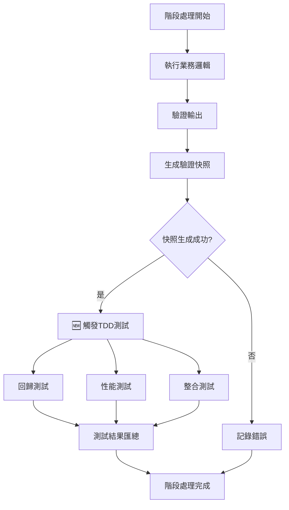

# 🏗️ TDD整合架構總覽

**文件版本**: 1.0.0  
**建立日期**: 2025-09-12  
**負責人**: TDD Integration Team

## 📋 **架構概述**

### 🎯 **核心設計理念**

本架構設計基於**後置鉤子觸發模式**，在每個處理階段完成驗證快照生成後，自動觸發對應的TDD測試。這種設計在保持現有系統穩定性的同時，大幅提升測試自動化程度。

### 🔄 **整體數據流**



## 🏛️ **三層架構設計**

### 🔧 **Layer 1: 處理器增強層**

**職責**: 在現有處理器中增加TDD觸發機制

**核心組件**:
- `EnhancedBaseStageProcessor`: 增強版基礎處理器
- `TDDIntegrationHook`: TDD整合鉤子
- `ConfigurationManager`: 配置管理器

**關鍵特性**:
- 向下相容現有處理器
- 可配置的觸發策略
- 錯誤容忍機制

```python
class EnhancedBaseStageProcessor(BaseStageProcessor):
    def execute(self, input_data):
        # 原有處理流程...
        snapshot_success = self.save_validation_snapshot(results)
        
        # 🆕 TDD整合觸發
        if snapshot_success and self.tdd_enabled:
            self.tdd_hook.trigger_tests(results)
        
        return results
```

### 🧪 **Layer 2: 測試執行層**

**職責**: 管理和執行各種類型的自動化測試

**核心組件**:
- `SnapshotRegressionTester`: 快照回歸測試器
- `PerformanceBenchmarkTester`: 性能基準測試器
- `IntegrationTester`: 整合測試器
- `TestOrchestrator`: 測試協調器

**測試類型矩陣**:

| 測試類型 | 執行時機 | 數據來源 | 驗證內容 |
|---------|---------|----------|----------|
| 回歸測試 | 每次快照生成後 | 當前vs歷史快照 | 驗證項目數量、通過率 |
| 性能測試 | 每次處理完成後 | 處理時間記錄 | 處理速度、資源使用 |
| 整合測試 | 跨階段數據流 | 階段間數據 | 數據完整性、格式一致性 |
| 合規測試 | 關鍵階段後 | 處理結果 | 學術標準Grade A檢查 |

### 📊 **Layer 3: 監控報告層**

**職責**: 收集測試結果並生成監控報告

**核心組件**:
- `TestResultCollector`: 測試結果收集器
- `PerformanceMetricsTracker`: 性能指標追蹤器
- `ReportGenerator`: 報告生成器
- `AlertManager`: 警報管理器

## ⚙️ **配置系統架構**

### 🎛️ **多級配置策略**

```yaml
# 全局配置
global:
  tdd_integration:
    enabled: true
    default_mode: "sync"

# 階段特定配置
stages:
  stage1:
    tdd_tests: ["regression", "performance"]
    failure_tolerance: "warning"
  stage2:
    tdd_tests: ["regression", "integration"]  
    failure_tolerance: "error"

# 環境特定配置  
environments:
  development:
    test_execution: "minimal"
  production:
    test_execution: "comprehensive"
```

### 🔄 **配置優先級**

1. **環境變數** (最高優先級)
2. **階段特定配置**  
3. **全局配置**
4. **預設值** (最低優先級)

## 🚀 **執行模式設計**

### ⚡ **同步執行模式** (推薦用於開發環境)

```python
def execute_sync_tests(self, test_types):
    """同步執行所有測試，等待結果"""
    results = {}
    for test_type in test_types:
        results[test_type] = self.run_test(test_type)
        if not results[test_type].passed:
            self.handle_test_failure(test_type)
    return results
```

**特點**:
- ✅ 立即反饋測試結果
- ✅ 確保測試完成才繼續
- ❌ 增加總處理時間

### 🔄 **異步執行模式** (推薦用於生產環境)

```python
def execute_async_tests(self, test_types):
    """異步執行測試，不等待結果"""
    test_tasks = []
    for test_type in test_types:
        task = self.schedule_background_test(test_type)
        test_tasks.append(task)
    
    # 記錄任務ID供後續查詢
    self.log_test_tasks(test_tasks)
```

**特點**:
- ✅ 不影響主處理流程時間
- ✅ 可並行執行多種測試
- ❌ 測試結果回饋較遲

### 🎯 **智能混合模式** (推薦用於關鍵階段)

```python
def execute_hybrid_tests(self, test_types):
    """關鍵測試同步，非關鍵測試異步"""
    critical_tests = ["regression"]
    non_critical_tests = ["performance", "integration"]
    
    # 同步執行關鍵測試
    for test_type in critical_tests:
        if test_type in test_types:
            self.execute_sync_test(test_type)
    
    # 異步執行非關鍵測試  
    async_tests = [t for t in test_types if t in non_critical_tests]
    if async_tests:
        self.execute_async_tests(async_tests)
```

## 🛡️ **錯誤處理策略**

### 📊 **三級錯誤處理**

| 處理級別 | 錯誤影響 | 處理動作 | 使用場景 |
|---------|---------|----------|----------|
| ERROR | 中斷處理 | 拋出異常、停止執行 | 關鍵驗證失敗 |
| WARNING | 記錄警告 | 日誌記錄、繼續執行 | 性能回歸、非關鍵測試失敗 |
| IGNORE | 靜默忽略 | 僅記錄調試信息 | 開發調試、實驗性功能 |

### 🔄 **測試失敗恢復機制**

```python
class TestFailureRecovery:
    def handle_test_failure(self, test_type, error):
        # 1. 記錄詳細錯誤信息
        self.log_detailed_error(test_type, error)
        
        # 2. 嘗試自動修復
        if self.can_auto_recover(test_type, error):
            return self.attempt_auto_recovery(test_type)
        
        # 3. 降級處理
        return self.apply_graceful_degradation(test_type)
```

## 📈 **性能考慮**

### ⏱️ **執行時間預估**

| 測試類型 | 預估時間 | 影響因素 |
|---------|---------|----------|
| 回歸測試 | 0.1-0.5秒 | 快照大小、比較項目數量 |
| 性能測試 | 0.05-0.2秒 | 歷史數據量 |
| 整合測試 | 0.2-1.0秒 | 跨階段數據量 |
| 合規測試 | 0.1-0.3秒 | 檢查項目複雜度 |

### 🎯 **優化策略**

1. **測試結果緩存**: 避免重複執行相同測試
2. **並行測試執行**: 利用多線程執行獨立測試
3. **漸進式測試**: 依據數據變化程度決定測試深度
4. **智能跳過**: 基於變更分析跳過不相關測試

## 🔍 **監控與觀察性**

### 📊 **關鍵指標收集**

```python
class TDDMetrics:
    def collect_metrics(self):
        return {
            # 執行指標
            "test_execution_count": self.total_tests_run,
            "test_success_rate": self.calculate_success_rate(),
            "average_test_duration": self.calculate_avg_duration(),
            
            # 品質指標  
            "regression_detection_count": self.regressions_detected,
            "performance_alerts": self.performance_alerts_sent,
            
            # 系統指標
            "processing_overhead": self.calculate_overhead(),
            "resource_usage": self.get_resource_usage()
        }
```

### 🚨 **警報系統**

- **實時警報**: 關鍵測試失敗立即通知
- **日報警報**: 每日測試執行摘要
- **趨勢警報**: 性能趨勢異常檢測

## 🎯 **下階段設計重點**

1. **詳細觸發機制設計** → `02_trigger_mechanism.md`
2. **測試框架實施細節** → `03_test_framework.md`  
3. **配置規範定義** → `04_configuration_spec.md`
4. **遷移實施計劃** → `05_migration_plan.md`

---

**📝 此文件為TDD整合架構的總覽，具體實施細節請參考後續設計文檔。**