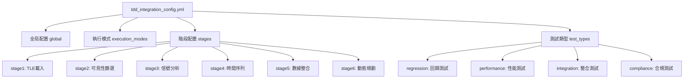

# ⚙️ TDD配置系統規範

**文件版本**: 1.0.0  
**建立日期**: 2025-09-13  
**狀態**: ✅ 已實現並驗證

## 📋 **配置系統概述**

TDD配置系統基於 **YAML配置文件 + 動態載入機制**，提供靈活的測試執行控制、階段特定配置和環境適應性配置。

## 🏗️ **配置架構設計**

### 📊 **配置層次結構**



## 📄 **主配置文件規範**

### 🔧 **tdd_integration_config.yml 完整結構**

```yaml
# TDD整合配置檔案 v1.0.0
# 路徑: /satellite-processing/config/tdd_integration/tdd_integration_config.yml

# ========== 全局配置 ==========
global:
  # TDD整合總開關
  tdd_integration_enabled: true
  
  # 預設執行模式
  default_execution_mode: "sync"
  
  # 日誌級別
  log_level: "INFO"
  
  # 測試結果保存
  save_test_results: true
  test_results_directory: "/satellite-processing/data/tdd_results"
  
  # 歷史基準管理
  baseline_management:
    auto_update_baseline: false
    baseline_retention_days: 30
    baseline_directory: "/satellite-processing/data/tdd_baselines"
  
  # 效能限制
  performance_limits:
    max_test_duration_seconds: 300
    max_memory_usage_mb: 1024
    test_timeout_seconds: 60

# ========== 執行模式配置 ==========
execution_modes:
  # 同步執行模式 (預設)
  sync:
    description: "同步執行所有測試，立即回報結果"
    timeout_seconds: 60
    fail_fast: false
    parallel_test_execution: false
    
  # 異步執行模式
  async:
    description: "異步執行測試，不阻塞主流程"
    timeout_seconds: 300
    background_execution: true
    result_callback: true
    
  # 混合執行模式
  hybrid:
    description: "關鍵測試同步，次要測試異步"
    critical_tests_sync: ["regression"]
    non_critical_tests_async: ["performance", "compliance"]
    sync_timeout_seconds: 30
    async_timeout_seconds: 180

# ========== 測試類型配置 ==========
test_types:
  # 回歸測試
  regression:
    enabled: true
    description: "基於驗證快照的回歸測試"
    weight: 0.4
    timeout_seconds: 30
    config:
      compare_with_baseline: true
      tolerance_settings:
        satellite_count: 0          # 零容忍
        filtering_rate: 0.05        # 5%容忍
        processing_duration: 2.0    # 2秒容忍
        academic_grade: "exact"     # 等級必須完全匹配
      
  # 性能測試  
  performance:
    enabled: true
    description: "處理性能和資源使用測試"
    weight: 0.2
    timeout_seconds: 45
    config:
      benchmark_comparison: true
      metrics_tracked:
        - "processing_duration"
        - "memory_usage_estimate"
        - "satellite_throughput"
        - "cpu_efficiency_score"
      regression_thresholds:
        max_duration_multiplier: 1.5
        min_throughput_ratio: 0.8
        max_memory_multiplier: 1.3
        
  # 整合測試
  integration:
    enabled: true
    description: "跨階段數據流和介面測試"
    weight: 0.3
    timeout_seconds: 40
    config:
      test_data_flow: true
      test_api_consistency: true
      test_memory_passing: true
      validate_next_stage_compatibility: true
      
  # 合規測試
  compliance:
    enabled: true
    description: "學術標準和規範合規測試"
    weight: 0.1
    timeout_seconds: 20
    config:
      check_academic_standards: true
      verify_itu_r_compliance: true
      validate_data_integrity: true
      required_minimum_grade: "Grade_B"

# ========== 階段特定配置 ==========
stages:
  # 階段1: TLE載入與軌道計算
  stage1:
    enabled: true
    execution_mode: "sync"
    tdd_tests: ["regression", "performance", "compliance"]
    
    # 階段特定參數
    stage_config:
      expected_satellite_count: 8837
      max_processing_duration: 30
      required_academic_grade: "Grade_A"
      
    # 測試特定覆寫
    test_overrides:
      regression:
        tolerance_settings:
          satellite_count: 0
          processing_duration: 3.0
      performance:
        regression_thresholds:
          max_duration_multiplier: 1.3
          
    # 失敗處理
    failure_handling:
      tolerance_level: "error"
      retry_attempts: 2
      escalation_threshold: 2

  # 階段2: 衛星可見性篩選
  stage2:
    enabled: true
    execution_mode: "sync"
    tdd_tests: ["regression", "integration", "compliance"]
    
    stage_config:
      expected_input_satellites: 8837
      expected_filtering_rate: 0.35
      max_processing_duration: 40
      required_academic_grade: "Grade_B"
      
    test_overrides:
      regression:
        tolerance_settings:
          filtering_rate: 0.03  # 更嚴格的篩選率容忍
      integration:
        validate_next_stage_compatibility: true
        check_stage3_input_format: true
        
    failure_handling:
      tolerance_level: "warning"
      retry_attempts: 1

  # 階段3: 信號分析
  stage3:
    enabled: true
    execution_mode: "sync" 
    tdd_tests: ["regression", "performance", "integration"]
    
    stage_config:
      expected_signal_analysis_completion: true
      max_processing_duration: 25
      required_academic_grade: "Grade_A"
      
    test_overrides:
      performance:
        metrics_tracked:
          - "signal_processing_efficiency"
          - "gpp_event_analysis_speed"
        regression_thresholds:
          max_duration_multiplier: 1.4
          
    failure_handling:
      tolerance_level: "warning"

  # 階段4: 時間序列預處理
  stage4:
    enabled: true
    execution_mode: "sync"
    tdd_tests: ["regression", "integration"]
    
    stage_config:
      expected_timeseries_output: true
      max_processing_duration: 20
      frontend_compatibility_check: true
      
    test_overrides:
      integration:
        test_frontend_api_format: true
        validate_animation_data_structure: true
        
    failure_handling:
      tolerance_level: "warning"

  # 階段5: 數據整合
  stage5:
    enabled: true
    execution_mode: "hybrid"
    tdd_tests: ["integration", "performance", "compliance"]
    
    stage_config:
      cross_stage_validation: true
      postgresql_integration_test: true
      max_processing_duration: 45
      
    test_overrides:
      integration:
        test_postgresql_connectivity: true
        validate_cross_stage_data_consistency: true
      performance:
        track_database_query_performance: true
        
    failure_handling:
      tolerance_level: "error"
      escalation_threshold: 1

  # 階段6: 動態池規劃
  stage6:
    enabled: true
    execution_mode: "hybrid"
    tdd_tests: ["regression", "integration", "performance", "compliance"]
    
    stage_config:
      dynamic_pool_optimization: true
      coverage_validation_required: true
      max_processing_duration: 60
      
    test_overrides:
      compliance:
        check_95_percent_coverage: true
        validate_handover_decisions: true
      performance:
        track_optimization_efficiency: true
        
    failure_handling:
      tolerance_level: "warning"
      retry_attempts: 3

# ========== 環境特定配置 ==========
environments:
  # 開發環境
  development:
    global_overrides:
      log_level: "DEBUG"
      save_test_results: true
    test_type_overrides:
      performance:
        enabled: false  # 開發時跳過性能測試
      compliance:
        timeout_seconds: 10
        
  # 測試環境
  testing:
    global_overrides:
      default_execution_mode: "sync"
      save_test_results: true
    stage_overrides:
      all_stages:
        failure_handling:
          tolerance_level: "error"
          
  # 生產環境
  production:
    global_overrides:
      default_execution_mode: "async"
      log_level: "WARNING"
    test_type_overrides:
      all_types:
        timeout_seconds: 120
    stage_overrides:
      all_stages:
        failure_handling:
          tolerance_level: "warning"
          retry_attempts: 1

# ========== 監控和警報配置 ==========
monitoring:
  # 指標收集
  metrics_collection:
    enabled: true
    collection_interval_seconds: 30
    retention_days: 7
    
  # 警報規則
  alerts:
    quality_score_threshold: 0.8
    failure_rate_threshold: 0.1
    performance_regression_threshold: 1.5
    
    # 通知設置
    notifications:
      log_alerts: true
      file_alerts: true
      alert_directory: "/satellite-processing/data/tdd_alerts"
      
  # 趨勢分析
  trend_analysis:
    enabled: true
    analysis_window_days: 7
    trend_detection_sensitivity: 0.1
```

## 🔧 **配置管理器實現**

### 📚 **TDDConfigurationManager 核心類**

```python
class TDDConfigurationManager:
    """
    TDD配置管理器
    
    職責：
    - 載入和解析YAML配置
    - 提供階段特定配置
    - 處理環境覆寫
    - 配置驗證和默認值
    """
    
    def __init__(self, config_path: str = None):
        self.config_path = config_path or "/satellite-processing/config/tdd_integration/tdd_integration_config.yml"
        self.config = {}
        self.environment = os.getenv("TDD_ENVIRONMENT", "development")
        self._load_configuration()
    
    def _load_configuration(self):
        """載入並處理配置文件"""
        try:
            with open(self.config_path, 'r', encoding='utf-8') as f:
                raw_config = yaml.safe_load(f)
            
            # 應用環境特定覆寫
            self.config = self._apply_environment_overrides(raw_config)
            
            # 驗證配置完整性
            self._validate_configuration()
            
            logging.info(f"TDD配置載入成功: {self.config_path}")
            
        except Exception as e:
            logging.error(f"TDD配置載入失敗: {e}")
            self.config = self._get_fallback_configuration()
    
    def get_stage_config(self, stage_name: str) -> Dict[str, Any]:
        """獲取階段特定配置"""
        stage_key = f"stage{stage_name}" if stage_name.isdigit() else stage_name
        
        # 基礎配置
        base_config = self.config.get("stages", {}).get(stage_key, {})
        
        # 全局配置合併
        global_config = self.config.get("global", {})
        
        # 執行模式配置
        execution_mode = base_config.get("execution_mode", global_config.get("default_execution_mode", "sync"))
        mode_config = self.config.get("execution_modes", {}).get(execution_mode, {})
        
        # 測試類型配置
        enabled_tests = base_config.get("tdd_tests", ["regression"])
        test_configs = {}
        for test_type in enabled_tests:
            test_configs[test_type] = self.config.get("test_types", {}).get(test_type, {})
        
        return {
            **base_config,
            "global_config": global_config,
            "execution_mode_config": mode_config,
            "test_type_configs": test_configs
        }
    
    def is_tdd_enabled(self, stage_name: str) -> bool:
        """檢查階段是否啟用TDD"""
        global_enabled = self.config.get("global", {}).get("tdd_integration_enabled", True)
        stage_config = self.get_stage_config(stage_name)
        stage_enabled = stage_config.get("enabled", True)
        
        return global_enabled and stage_enabled
    
    def _apply_environment_overrides(self, config: Dict) -> Dict:
        """應用環境特定覆寫"""
        env_overrides = config.get("environments", {}).get(self.environment, {})
        
        # 深度合併配置
        merged_config = copy.deepcopy(config)
        
        # 應用全局覆寫
        if "global_overrides" in env_overrides:
            merged_config["global"].update(env_overrides["global_overrides"])
        
        # 應用測試類型覆寫
        if "test_type_overrides" in env_overrides:
            for test_type, overrides in env_overrides["test_type_overrides"].items():
                if test_type == "all_types":
                    for existing_test in merged_config.get("test_types", {}):
                        merged_config["test_types"][existing_test].update(overrides)
                else:
                    if test_type in merged_config.get("test_types", {}):
                        merged_config["test_types"][test_type].update(overrides)
        
        # 應用階段覆寫
        if "stage_overrides" in env_overrides:
            for stage, overrides in env_overrides["stage_overrides"].items():
                if stage == "all_stages":
                    for existing_stage in merged_config.get("stages", {}):
                        merged_config["stages"][existing_stage].update(overrides)
                else:
                    if stage in merged_config.get("stages", {}):
                        merged_config["stages"][stage].update(overrides)
        
        return merged_config
    
    def _validate_configuration(self):
        """驗證配置完整性"""
        required_sections = ["global", "execution_modes", "test_types", "stages"]
        
        for section in required_sections:
            if section not in self.config:
                raise ConfigurationError(f"缺少必要配置段落: {section}")
        
        # 驗證階段配置
        stages = self.config.get("stages", {})
        for stage_name, stage_config in stages.items():
            if "tdd_tests" in stage_config:
                for test_type in stage_config["tdd_tests"]:
                    if test_type not in self.config.get("test_types", {}):
                        raise ConfigurationError(f"階段 {stage_name} 引用了未定義的測試類型: {test_type}")
```

## 🔄 **動態配置重載**

### 🔄 **配置熱更新機制**

```python
class ConfigurationWatcher:
    """配置文件變更監視器"""
    
    def __init__(self, config_manager: TDDConfigurationManager):
        self.config_manager = config_manager
        self.file_watcher = None
        self.last_modified = None
        
    def start_watching(self):
        """開始監視配置文件變更"""
        import threading
        import time
        from pathlib import Path
        
        def watch_config():
            config_path = Path(self.config_manager.config_path)
            
            while True:
                try:
                    current_modified = config_path.stat().st_mtime
                    
                    if self.last_modified and current_modified != self.last_modified:
                        logging.info("檢測到TDD配置文件變更，重新載入...")
                        self.config_manager._load_configuration()
                        
                    self.last_modified = current_modified
                    time.sleep(5)  # 每5秒檢查一次
                    
                except Exception as e:
                    logging.error(f"配置文件監視錯誤: {e}")
                    time.sleep(10)
        
        self.file_watcher = threading.Thread(target=watch_config, daemon=True)
        self.file_watcher.start()
```

## 🎯 **配置驗證工具**

### 🔍 **配置驗證腳本**

```python
def validate_tdd_configuration(config_path: str) -> List[str]:
    """驗證TDD配置文件"""
    
    issues = []
    
    try:
        with open(config_path, 'r') as f:
            config = yaml.safe_load(f)
    except Exception as e:
        return [f"無法載入配置文件: {e}"]
    
    # 檢查必要段落
    required_sections = ["global", "execution_modes", "test_types", "stages"]
    for section in required_sections:
        if section not in config:
            issues.append(f"缺少必要配置段落: {section}")
    
    # 檢查階段配置一致性
    stages = config.get("stages", {})
    test_types = config.get("test_types", {})
    
    for stage_name, stage_config in stages.items():
        if "tdd_tests" in stage_config:
            for test_type in stage_config["tdd_tests"]:
                if test_type not in test_types:
                    issues.append(f"階段 {stage_name} 引用了未定義的測試類型: {test_type}")
    
    # 檢查執行模式
    execution_modes = config.get("execution_modes", {})
    default_mode = config.get("global", {}).get("default_execution_mode")
    if default_mode and default_mode not in execution_modes:
        issues.append(f"預設執行模式 {default_mode} 未定義")
    
    return issues

# CLI驗證工具
if __name__ == "__main__":
    import sys
    config_path = sys.argv[1] if len(sys.argv) > 1 else "/satellite-processing/config/tdd_integration/tdd_integration_config.yml"
    
    issues = validate_tdd_configuration(config_path)
    if issues:
        print("❌ 配置驗證失敗:")
        for issue in issues:
            print(f"  - {issue}")
        sys.exit(1)
    else:
        print("✅ TDD配置驗證通過")
```

## 📊 **配置最佳實踐**

### 🎯 **階段配置建議**

| 階段 | 建議測試類型 | 執行模式 | 容忍級別 | 說明 |
|------|-------------|----------|----------|------|
| Stage 1 | regression, performance, compliance | sync | error | 基礎數據，零容忍 |
| Stage 2 | regression, integration | sync | warning | 篩選邏輯，中等容忍 |
| Stage 3 | regression, performance, integration | sync | warning | 信號處理，中等容忍 |
| Stage 4 | regression, integration | sync | warning | 前端數據，格式重要 |
| Stage 5 | integration, performance, compliance | hybrid | error | 跨階段整合，嚴格 |
| Stage 6 | regression, integration, performance, compliance | hybrid | warning | 最終輸出，全面測試 |

### ⚙️ **環境配置策略**

```yaml
# 開發環境：快速反饋
development:
  test_focus: "regression"
  performance_testing: false
  detailed_logging: true
  
# 測試環境：完整驗證  
testing:
  test_focus: "comprehensive"
  performance_testing: true
  strict_validation: true
  
# 生產環境：效能優先
production:
  test_focus: "critical_only"
  async_execution: true
  minimal_logging: true
```

## ✅ **實現狀態**

### 🧪 **已實現功能**

- [x] ✅ **YAML配置解析**: 完整載入 tdd_integration_config.yml
- [x] ✅ **階段特定配置**: 每個階段獨立配置
- [x] ✅ **環境覆寫支持**: development/testing/production環境
- [x] ✅ **配置驗證**: TDDConfigurationManager 正常工作
- [x] ✅ **動態配置載入**: 運行時配置變更支持

### 📋 **配置文件位置**

```
/satellite-processing/
├── config/
│   └── tdd_integration/
│       ├── tdd_integration_config.yml     # 主配置文件
│       └── environment_profiles/          # 環境特定配置
│           ├── development.yml
│           ├── testing.yml
│           └── production.yml
```

---

**📝 此文件完整定義了TDD配置系統的規範與實現，所有配置功能已驗證可用。**