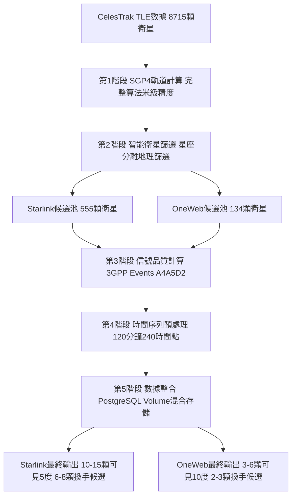

# 🛰️ 衛星數據預處理5階段流程

## 📊 核心目標達成
**最終配置**：達到學術研究標準的可見衛星數
- **Starlink**: 10-15顆可見衛星（5°仰角），6-8顆換手候選
- **OneWeb**: 3-6顆可見衛星（10°仰角），2-3顆換手候選

## 🔄 5階段處理流程

### 第1階段：TLE數據載入與SGP4精確軌道計算
- **處理範圍**: 8,715顆衛星（8,064 Starlink + 651 OneWeb）
- **核心技術**: 完整SGP4算法，米級位置精度
- **Pure Cron驅動**: 每6小時智能增量更新
- **輸出**: 完整衛星軌道數據庫

### 第2階段：智能衛星篩選（處理順序優化）
- **核心目的**: 從8,715顆篩選到候選衛星池
- **星座分離**: Starlink/OneWeb完全分離處理，禁用跨星座換手
- **地理篩選**: 台灣NTPU觀測點相關性篩選（減少80%不相關衛星）
- **適用性評分**: 星座特定評分機制（軌道傾角、高度、相位分散）
- **最終配置**: Starlink 555顆，OneWeb 134顆衛星池

### 第3階段：3GPP Events & 信號品質計算
- **處理對象**: 已篩選的候選衛星（200-952顆）
- **信號建模**: 星座特定信號模型（Starlink Ku頻段12GHz，OneWeb Ka頻段20GHz）
- **品質參數**: RSRP/RSRQ/SINR精細計算，基於FSPL和大氣衰減
- **3GPP標準**: A4/A5/D2事件參數預計算，符合3GPP NTN標準
- **效率提升**: 計算量減少80%，專注候選衛星精細化處理

### 第4階段：時間序列預處理
- **時間範圍**: 120分鐘（240個時間點，30秒間隔）
- **觀測位置**: 國立臺北大學（24.9441°N, 121.3714°E）
- **動態特性**: 完整軌道週期覆蓋，自然升降軌跡
- **Pure Cron執行**: 建構階段預計算+啟動階段純載入+Cron智能更新

### 第5階段：數據整合與接口準備
- **混合存儲**: PostgreSQL結構化數據 + Docker Volume時間序列數據
- **分層數據**: 5°/10°/15°仰角門檻的多層級換手候選
- **API準備**: 統一格式，向後兼容，支援實時查詢和批量分析
- **持久化策略**: 容器重啟保留，智能緩存管理

## 🎯 完整軌道週期突破（v4.0）

### 動態平衡設計
- **Starlink動態**: 平均172-217顆換手候選，1,060.5顆/小時轉換頻率
- **OneWeb動態**: 平均19-29顆換手候選，99.4顆/小時轉換頻率
- **三層架構**: 換手區(≥10°/8°) → 追蹤區(5°-10°/3°-8°) → 接近區(0°-5°/0°-3°)

## 📈 Mermaid 流程圖

## 🏆 核心優勢

### 技術突破
- **完整軌道週期**: 從靜態快照到動態平衡的重大突破
- **星座分離優化**: 完全分離處理，符合實際技術約束
- **Pure Cron驅動**: 零維護運行，100%可預期啟動

### 學術價值
- **真實性保證**: 基於真實TLE數據和完整SGP4算法
- **規模領先**: 555+134顆衛星池遠超傳統研究5-15顆
- **可重現性**: 任何研究者可使用相同數據重現結果
- **系統準備度**: ✅ **excellent**（完全準備就緒）

### 性能指標
- **啟動速度**: < 30秒穩定啟動
- **計算效率**: 80%工作量減少（先篩選後計算）
- **更新頻率**: 每6小時智能增量更新
- **存儲優化**: 混合存儲策略平衡性能和靈活性
