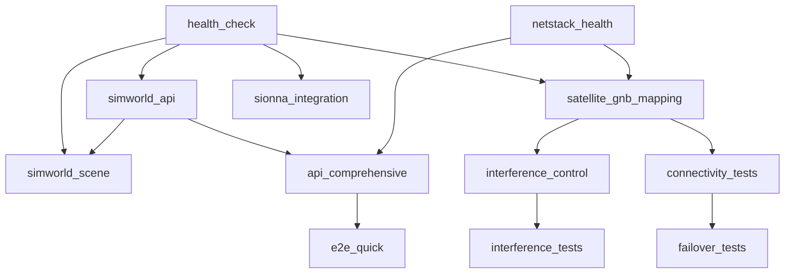

# NTN Stack 優先級測試指南

## 📋 概述

優先級測試系統將測試程式按重要性分為四個等級，確保關鍵功能優先驗證，提升測試效率和系統穩定性。

## 🎯 優先級分級

### 🚨 關鍵測試 (CRITICAL)

**必須 100% 通過才能繼續後續測試**

| 測試項目              | 路徑                                  | 用途                 | 超時 |
| --------------------- | ------------------------------------- | -------------------- | ---- |
| SimWorld 健康檢查     | `unit/simworld/test_health_check.py`  | 系統核心運行狀態檢查 | 10s  |
| NetStack API 健康檢查 | `unit/netstack/test_api_health.py`    | 網路堆疊核心功能檢查 | 15s  |
| SimWorld API 基礎功能 | `unit/simworld/test_api_functions.py` | 基礎 API 介面驗證    | 20s  |

### ⚡ 高優先級測試 (HIGH)

**核心模組功能測試**

| 測試項目          | 路徑                                          | 用途               | 超時 |
| ----------------- | --------------------------------------------- | ------------------ | ---- |
| SimWorld 場景管理 | `unit/simworld/test_scene.py`                 | 場景創建和管理功能 | 25s  |
| 部署模組基礎功能  | `unit/deployment/test_basic_functionality.py` | 部署流程核心功能   | 30s  |

### 🔧 中優先級測試 (MEDIUM)

**系統整合和 API 測試**

| 測試項目          | 路徑                                        | 用途                | 超時 |
| ----------------- | ------------------------------------------- | ------------------- | ---- |
| 衛星-基站映射整合 | `integration/test_satellite_gnb_mapping.py` | 衛星基站映射邏輯    | 45s  |
| 干擾控制整合      | `integration/test_interference_control.py`  | 干擾控制系統整合    | 60s  |
| Sionna 整合       | `integration/test_sionna_integration.py`    | Sionna 通信模擬整合 | 90s  |
| 綜合 API 測試     | `api/api_tests.py`                          | 完整 API 介面測試   | 120s |

### 🔍 低優先級測試 (LOW)

**特定情境和端到端測試**

| 測試項目       | 路徑                                | 用途             | 超時 |
| -------------- | ----------------------------------- | ---------------- | ---- |
| 連接性測試     | `integration/connectivity_tests.py` | 網路連接性驗證   | 180s |
| 干擾測試       | `integration/interference_tests.py` | 干擾場景模擬     | 120s |
| 故障轉移測試   | `integration/failover_tests.py`     | 故障恢復機制驗證 | 300s |
| 端到端快速測試 | `e2e/run_quick_test.py`             | 完整用戶流程驗證 | 600s |

## 🚀 使用方法

### 執行優先級測試

```bash
# 按優先級執行所有測試 (推薦)
make test-priority

# 或使用 Python 腳本
python priority_test_runner.py
```

### 執行特定優先級

```bash
# 只執行關鍵測試
make test-critical
python priority_test_runner.py --priority CRITICAL

# 只執行高優先級測試
make test-high
python priority_test_runner.py --priority HIGH

# 只執行中優先級測試
make test-medium
python priority_test_runner.py --priority MEDIUM

# 只執行低優先級測試
make test-low
python priority_test_runner.py --priority LOW
```

### 強制執行所有測試

```bash
# 即使高優先級失敗也繼續執行
make test-priority-all
python priority_test_runner.py --continue-on-failure
```

## 📊 執行策略

### 默認策略 (停止於失敗)

1. **關鍵測試** → 必須 100% 通過
2. **高優先級測試** → 必須 100% 通過
3. **中優先級測試** → 必須 100% 通過
4. **低優先級測試** → 必須 100% 通過

如果任何級別的測試未能 100% 通過，執行將停止並報告失敗詳情。

### 強制執行策略

即使高優先級測試失敗，仍會繼續執行所有級別的測試，適用於：

-   完整系統評估
-   CI/CD 管道中的全面檢查
-   問題診斷和分析

## 📈 測試依賴關係



## 📋 報告和結果

### 查看測試結果

```bash
# 查看最新的優先級測試報告
make report-priority

# 查看詳細的 JSON 報告
cat reports/priority_test_results.json
```

### 結果文件位置

-   **摘要報告**: `reports/priority_test_results.json`
-   **詳細日誌**: 終端輸出
-   **測試快照**: `temp_result.json` (臨時文件)

### 報告內容

```json
{
  "summary": {
    "start_time": 1704067200.0,
    "end_time": 1704067300.0,
    "total_time": 100.0,
    "total_passed": 8,
    "total_failed": 0,
    "stopped_at": null,
    "priority_results": {
      "CRITICAL": {
        "success": true,
        "failed_tests": []
      }
    }
  },
  "detailed_results": {
    "unit/simworld/test_health_check.py": {
      "priority": "CRITICAL",
      "description": "SimWorld 健康檢查",
      "success": true,
      "details": {...},
      "attempts": 1
    }
  }
}
```

## 🔧 配置和自定義

### 修改測試優先級

編輯 `test_priority_config.py` 中的 `_define_test_priorities()` 方法：

```python
"test_name": TestCase(
    path="path/to/test.py",
    priority=Priority.CRITICAL,  # 設置優先級
    description="測試描述",
    dependencies=["dependency_test"],  # 設置依賴
    timeout=30,  # 設置超時
    retry_count=1  # 設置重試次數
),
```

### 添加新測試

1. 在相應目錄創建測試文件
2. 在 `test_priority_config.py` 中添加配置
3. 設置適當的優先級和依賴關係

## 🛠️ 故障排除

### 常見問題

1. **導入錯誤**

    ```bash
    ModuleNotFoundError: No module named 'test_priority_config'
    ```

    **解決方案**: 確保在 `tests/` 目錄下執行命令

2. **依賴檢查失敗**

    ```bash
    測試 'test_name' 依賴不存在的測試 'dependency_name'
    ```

    **解決方案**: 檢查 `test_priority_config.py` 中的依賴配置

3. **測試超時**

    ```bash
    測試超時 - 30秒
    ```

    **解決方案**: 增加相應測試的 `timeout` 值

4. **JSON 報告缺失**
    ```bash
    pip install pytest-json-report
    ```

### 調試技巧

```bash
# 查看配置驗證結果
python -c "from test_priority_config import TEST_PRIORITY_CONFIG; print(TEST_PRIORITY_CONFIG.validate_dependencies())"

# 查看特定優先級的測試列表
python -c "from test_priority_config import TEST_PRIORITY_CONFIG, Priority; print([t.path for t in TEST_PRIORITY_CONFIG.get_tests_by_priority(Priority.CRITICAL)])"

# 手動執行單個測試
pytest unit/simworld/test_health_check.py -v
```

## 📚 最佳實踐

1. **保持關鍵測試簡潔快速** - 關鍵測試應在 30 秒內完成
2. **明確依賴關係** - 避免循環依賴
3. **定期檢查優先級** - 隨著系統演進調整測試優先級
4. **監控執行時間** - 超時設置要合理
5. **維護測試獨立性** - 每個測試應能獨立執行

## 🚀 持續整合建議

在 CI/CD 管道中的建議使用方式：

```yaml
# GitHub Actions 範例
- name: 執行優先級測試
  run: |
      cd tests
      make test-priority

# 或分階段執行
- name: 關鍵測試
  run: make test-critical
- name: 高優先級測試
  run: make test-high
- name: 中優先級測試
  run: make test-medium
- name: 低優先級測試 (可選)
  run: make test-low
  continue-on-error: true
```

---

**版本**: 1.0.0  
**最後更新**: 2025-01-01
